## TinyLogic UHS Two-Input AND Gate

NC7SZ08

## Description

The  NC7SZ08  is  a  single  two -input  AND  gate  from onsemi 's Ultra -High Speed (UHS) series of TinyLogic. The device is fabricated with advanced CMOS technology to achieve ultra -high speed with high output drive while maintaining low static power dissipation over a broad VCC operating range. The device is specified to operate over the 1.65 V to 5.5 V VCC operating range. The inputs and output are high impedance when VCC is 0 V. Inputs tolerate voltages up to 5.5 V, independent of VCC operating voltage.

## Features

-  Ultra -High Speed: t PD  = 2.7 ns (Typical) into 50 pF at 5 V V CC
-  High Output Drive:  24 mA at 3 V VCC
-  Broad VCC Operating Range: 1.65 V to 5.5 V
-  Matches Performance of LCX Operated at 3.3 V VCC
-  Power Down High Impedance Inputs / Outputs
-  Over -Voltage Tolerance Inputs Facilitate 5 V to 3 V Translation
-  Proprietary Noise / EMI Reduction Circuitry
-  Ultra -Small MicroPak  Packages
-  Space -Saving SOT23 -5, SC -74A and SC -88A Packages
-  These Devices are Pb -Free, Halogen Free/BFR Free and are RoHS Compliant

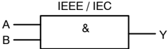

Figure 1. Logic Symbol

GG, 7Z08, Z08 = Specific Device Code

KK = 2

- Digit Lot Run Traceability Code

XY

= 2 - Digit Date Code Format

Z

= Assembly Plant Code

M 

= Date Code

= Pb - Free Package

(Microdot may be in either location)

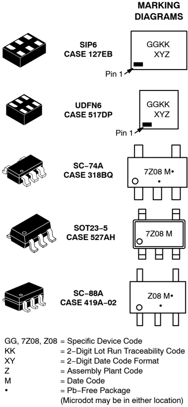

## ORDERING INFORMATION

See detailed ordering, marking and shipping information in the package dimensions section on page 6 of this data sheet.

NOTE: Some of the devices on this data sheet have been DISCONTINUED . Please refer to the table on page 6.

## Pin Configurations

Figure 2. SOT23 -5, SC -88A and SC -74A (Top View)

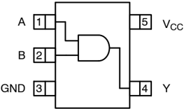

## PIN DEFINITIONS

|   Pin # SOT23 - 5 / SC - 88A / SC74A |   Pin # MicroPak | Name   | Description    |
|--------------------------------------|------------------|--------|----------------|
|                                    1 |                1 | A      | Input          |
|                                    2 |                2 | B      | Input          |
|                                    3 |                3 | GND    | Ground         |
|                                    4 |                4 | Y      | Output         |
|                                    5 |                6 | V CC   | Supply Voltage |
|                                      |                5 | NC     | No Connect     |

## ABSOLUTE MAXIMUM RATINGS

| Symbol        | Parameter                                         | Parameter                                         | Min   | Max   | Unit   |
|---------------|---------------------------------------------------|---------------------------------------------------|-------|-------|--------|
| V CC          | Supply Voltage                                    | Supply Voltage                                    | - 0.5 | 6.5   | V      |
| V IN          | DC Input Voltage                                  | DC Input Voltage                                  | - 0.5 | 6.5   | V      |
| V OUT         | DC Output Voltage                                 | DC Output Voltage                                 | - 0.5 | 6.5   | V      |
| I IK          | DC Input Diode Current                            | V IN < 0 V                                        | -     | - 50  | mA     |
| I OK          | DC Output Diode Current                           | V OUT < 0 V                                       | -     | - 50  | mA     |
| I OUT         | DC Output Current                                 | DC Output Current                                 | -     |  50  | mA     |
| I CC or I GND | DC V CC or Ground Current                         | DC V CC or Ground Current                         | -     |  50  | mA     |
| T STG         | Storage Temperature Range                         | Storage Temperature Range                         | - 65  | +150  |  C    |
| T J           | Junction Temperature Under Bias                   | Junction Temperature Under Bias                   | -     | +150  |  C    |
| T L           | Junction Lead Temperature (Soldering, 10 Seconds) | Junction Lead Temperature (Soldering, 10 Seconds) | -     | +260  |  C    |
| P D           | Power Dissipation in Still Air                    | SC - 74A / SOT23 - 5                              | -     | 390   | mW     |
| P D           | Power Dissipation in Still Air                    | SC - 88A                                          | -     | 332   |        |
| P D           | Power Dissipation in Still Air                    | MicroPak - 6                                      | -     | 812   |        |
| P D           | Power Dissipation in Still Air                    | MicroPak2  - 6                                   | -     | 812   |        |
| ESD           | Human Body Model, JESD22 - A114                   | Human Body Model, JESD22 - A114                   | -     | 4000  | V      |
| ESD           | Charge Device Model, JESD22 - C101                | Charge Device Model, JESD22 - C101                | -     | 2000  |        |

## RECOMMENDED OPERATING CONDITIONS

| Symbol   | Parameter                     | Conditions   |   Min |   Max | Unit   |
|----------|-------------------------------|--------------|-------|-------|--------|
| V CC     | Supply Voltage Operating      |              |  1.65 |  5.50 | V      |
|          | Supply Voltage Data Retention |              |  1.50 |  5.50 |        |

## NC7SZ08

A  1

6  V CC

B  2

5  NC

GND  3

4  Y

Figure 3. MicroPak (Top Through View)

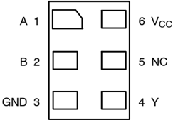

## FUNCTION TABLE (Y = AB)

| Inputs   | Inputs   | Output   |
|----------|----------|----------|
| A        | B        | Y        |
| L        | L        | L        |
| L        | H        | L        |
| H        | L        | L        |
| H        | H        | H        |

H = HIGH Logic Level

L = LOW Logic Level

## RECOMMENDED OPERATING CONDITIONS

| Symbol    | Parameter                 | Conditions                   | Min   | Max   | Unit   |
|-----------|---------------------------|------------------------------|-------|-------|--------|
| V IN      | Input Voltage             |                              | 0     | 5.5   | V      |
| V OUT     | Output Voltage            |                              | 0     | V CC  | V      |
| T A       | Operating Temperature     |                              | - 40  | +85   |  C    |
| t r , t f | Input Rise and Fall Times | V CC at 1.8 V, 2.5 V  0.2 V | 0     | 20    | ns/V   |
| t r , t f | Input Rise and Fall Times | V CC at 3.3 V  0.3 V        | 0     | 10    | ns/V   |
| t r , t f | Input Rise and Fall Times | V CC at 5.0 V  0.5 V        | 0     | 5     | ns/V   |
| q JA      | Thermal Resistance        | SC - 74A / SOT23 - 5         | -     | 320   |  C/W  |
| q JA      | Thermal Resistance        | SC - 88A                     | -     | 377   |  C/W  |
| q JA      | Thermal Resistance        | MicroPak - 6                 | -     | 154   |  C/W  |
| q JA      | Thermal Resistance        | MicroPak2 - 6                | -     | 154   |  C/W  |

Functional operation above the stresses listed in the Recommended Operating Ranges is not implied. Extended exposure to stresses beyond the Recommended Operating Ranges limits may affect device reliability.

1. Unused inputs must be held HIGH or LOW. They may not float.

## NC7SZ08

## DC ELECTICAL CHARACTERISTICS

| Symbo   |                           |              |                                        | T A = +25  C   | T A = +25  C   | T A = +25  C   | T A = - 40 to +85  C   | T A = - 40 to +85  C   |      |
|---------|---------------------------|--------------|----------------------------------------|-----------------|-----------------|-----------------|-------------------------|-------------------------|------|
| l       | Parameter                 | V CC (V)     | Conditions                             | Min             | Typ             | Max             | Min                     | Max                     | Unit |
| V IH    | HIGH Level Input Voltage  | 1.65 to 1.95 |                                        | 0.65 V CC       | -               | -               | 0.65 V CC               | -                       | V    |
| V IH    | HIGH Level Input Voltage  | 2.30 to 5.50 |                                        | 0.70 V CC       | -               | -               | 0.70 V CC               | -                       |      |
| V IL    | LOW Level Input Voltage   | 1.65 to 1.95 |                                        | -               | -               | 0.35 V CC       | -                       | 0.35 V CC               | V    |
| V IL    | LOW Level Input Voltage   | 2.30 to 5.50 |                                        | -               | -               | 0.30 V CC       | -                       | 0.30 V CC               |      |
| V OH    | HIGH Level Output Voltage | 1.65         | V IN = V IH or V IL , I OH = - 100 m A | 1.55            | 1.65            | -               | 1.55                    | -                       | V    |
| V OH    | HIGH Level Output Voltage | 1.80         | V IN = V IH or V IL , I OH = - 100 m A | 1.70            | 1.80            | -               | 1.70                    | -                       |      |
| V OH    | HIGH Level Output Voltage | 2.30         | V IN = V IH or V IL , I OH = - 100 m A | 2.20            | 2.30            | -               | 2.20                    | -                       |      |
| V OH    | HIGH Level Output Voltage | 3.00         | V IN = V IH or V IL , I OH = - 100 m A | 2.90            | 3.00            | -               | 2.90                    | -                       |      |
| V OH    | HIGH Level Output Voltage | 4.50         | V IN = V IH or V IL , I OH = - 100 m A | 4.40            | 4.50            | -               | 4.40                    | -                       |      |
| V OH    | HIGH Level Output Voltage | 1.65         | I OH = - 4 mA                          | 1.29            | 1.52            | -               | 1.29                    | -                       |      |
| V OH    | HIGH Level Output Voltage | 2.30         | I OH = - 8 mA                          | 1.90            | 2.15            | -               | 1.90                    | -                       |      |
| V OH    | HIGH Level Output Voltage | 3.00         | I OH = - 16 mA                         | 2.50            | 2.80            | -               | 2.40                    | -                       |      |
| V OH    | HIGH Level Output Voltage | 3.00         | I OH = - 24 mA                         | 2.40            | 2.68            | -               | 2.30                    | -                       |      |
| V OH    | HIGH Level Output Voltage | 4.50         | I OH = - 32 mA                         | 3.90            | 4.20            | -               | 3.80                    | -                       |      |
| V OL    | LOW Level Output Voltage  | 1.65         | V IN = V IH or V IL , I OL = 100 m A   | -               | 0.00            | 0.10            | -                       | 0.10                    | V    |
| V OL    | LOW Level Output Voltage  | 1.80         | V IN = V IH or V IL , I OL = 100 m A   | -               | 0.00            | 0.10            | -                       | 0.10                    |      |
| V OL    | LOW Level Output Voltage  | 2.30         | V IN = V IH or V IL , I OL = 100 m A   | -               | 0.00            | 0.10            | -                       | 0.10                    |      |
| V OL    | LOW Level Output Voltage  | 3.00         | V IN = V IH or V IL , I OL = 100 m A   | -               | 0.00            | 0.10            | -                       | 0.10                    |      |
| V OL    | LOW Level Output Voltage  | 4.50         | V IN = V IH or V IL , I OL = 100 m A   | -               | 0.00            | 0.10            | -                       | 0.10                    |      |
| V OL    | LOW Level Output Voltage  | 1.65         | I OL = 4 mA                            | -               | 0.80            | 0.24            | -                       | 0.24                    |      |
| V OL    | LOW Level Output Voltage  | 2.30         | I OL = 8 mA                            | -               | 0.10            | 0.30            | -                       | 0.30                    |      |
| V OL    | LOW Level Output Voltage  | 3.00         | I OL = 16 mA                           | -               | 0.15            | 0.40            | -                       | 0.40                    |      |
| V OL    | LOW Level Output Voltage  | 3.00         | I OL = 24 mA                           | -               | 0.22            | 0.55            | -                       | 0.55                    |      |
| V OL    | LOW Level Output Voltage  | 4.50         | I OL = 32 mA                           | -               | 0.22            | 0.55            | -                       | 0.55                    |      |
| I IN    | Input Leakage Current     | 1.65 to 5.50 | V IN = 5.5 V, GND                      | -               | -               |  1             | -                       |  10                    | m A  |
| I OFF   | Power Off Leakage Current | 0            | V IN or V OUT = 5.5 V                  | -               | -               | 1               | -                       | 10                      | m A  |
| I CC    | Quiescent Supply Current  | 1.65 to 5.50 | V IN = 5.5 V, GND                      | -               | -               | 2               | -                       | 20                      | m A  |

## NC7SZ08

## AC ELECTRICAL CHARACTERISTICS

|               |                                                   |             |                          | T A = +25  C   | T A = +25  C   | T A = +25  C   | T A = - 40 to +85  C   | T A = - 40 to +85  C   |      |
|---------------|---------------------------------------------------|-------------|--------------------------|-----------------|-----------------|-----------------|-------------------------|-------------------------|------|
| Symbol        | Parameter                                         | V CC (V)    | Conditions               | Min             | Typ             | Max             | Min                     | Max                     | Unit |
| t PLH , t PHL | Propagation Delay (Figure 4, 5)                   | 1.65        | C L = 15 pF, R L = 1 M W | -               | 6.3             | 12.0            | -                       | 12.7                    | ns   |
| t PLH , t PHL | Propagation Delay (Figure 4, 5)                   | 1.80        | C L = 15 pF, R L = 1 M W | -               | 5.2             | 10.0            | -                       | 10.5                    | ns   |
| t PLH , t PHL | Propagation Delay (Figure 4, 5)                   | 2.50  0.20 | C L = 15 pF, R L = 1 M W | -               | 3.4             | 7.0             | -                       | 7.5                     | ns   |
| t PLH , t PHL | Propagation Delay (Figure 4, 5)                   | 3.30  0.30 | C L = 15 pF, R L = 1 M W | -               | 2.6             | 4.7             | -                       | 5.0                     | ns   |
| t PLH , t PHL | Propagation Delay (Figure 4, 5)                   | 5.00  0.50 | C L = 15 pF, R L = 1 M W | -               | 2.2             | 4.1             | -                       | 4.4                     | ns   |
| t PLH , t PHL | Propagation Delay (Figure 4, 5)                   | 3.30  0.30 | C L = 50 pF, R L = 500 W | -               | 3.3             | 5.2             | -                       | 5.5                     | ns   |
| t PLH , t PHL | Propagation Delay (Figure 4, 5)                   | 5.00  0.50 | C L = 50 pF, R L = 500 W | -               | 2.7             | 4.5             | -                       | 4.8                     | ns   |
| C IN          | Input Capacitance                                 | 0.00        |                          | -               | 4               | -               | -                       | -                       | pF   |
| C PD          | Power Dissipation Capacitance (Note 2) (Figure 6) | 3.30        |                          | -               | 20              | -               | -                       | -                       | pF   |
| C PD          | Power Dissipation Capacitance (Note 2) (Figure 6) | 5.00        |                          | -               | 25              | -               | -                       | -                       | pF   |

2. CPD is defined as the value of the internal equivalent capacitance which is derived from dynamic operating current consumption (I CCD ) at no output loading and operating at 50% duty cycle. C PD  is related to I CCD  dynamic operating current by the expression: I CCD  = (C PD ) (V CC ) (f IN ) + (I CCstatic).

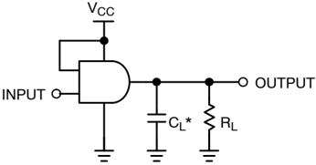

## NOTE:

3. CL includes load and stray capacitance.
4. Input PRR = 10 MHz t w  = 500 ns.

Figure 4. AC Test Circuit

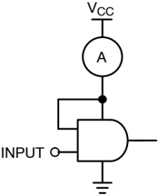

NOTE: 5. Input = AC Waveform; t r  = t f  = 1.8 ns; PRR = 10 MHz; Duty Cycle = 50%.

Figure 6. I CCD  Test Circuit

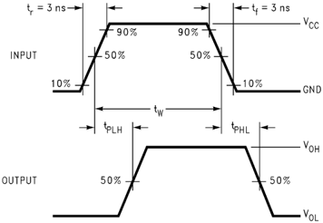

Figure 5. AC Waveforms

## ORDERING INFORMATION

| Part Number   | Top Mark   | Packages         | Shipping †         |
|---------------|------------|------------------|--------------------|
| NC7SZ08M5X    | 7Z08       | SC - 74A         | 3000 / Tape & Reel |
| NC7SZ08P5X    | Z08        | SC - 88A         | 3000 / Tape & Reel |
| NC7SZ08L6X    | GG         | SIP6, MicroPak   | 5000 / Tape & Reel |
| NC7SZ08FHX    | GG         | UDFN6, MicroPak2 | 5000 / Tape & Reel |

## DISCONTINUED (Note 6)

NC7SZ08M5X

-

L22090

NC7SZ08P5X

-

NC7SZ08L6X

F22057

-

L22175

NC7SZ08FHX

-

L22175

7Z08

Z08

GG

GG

SOT23

-

5

SC

-

88A

SIP6, MicroPak

UDFN6, MicroPak2

3000 / Tape &amp; Reel

3000 / Tape &amp; Reel

5000 / Tape &amp; Reel

5000 / Tape &amp; Reel

† For information on tape and reel specifications, including part orientation and tape sizes, please refer to our Tape and Reel Packaging Specifications Brochure, BRD8011/D.

6. DISCONTINUED: These devices are not available. Please contact your onsemi representative for information. The most current information on these devices may be available on www.onsemi.com.

MicroPak and MicroPak2 are trademarks of Semiconductor Components Industries, LLC (SCILLC) or its subsidiaries in the United States and/or other countries.

## NC7SZ08

## SIP6 1.45X1.0

CASE 127EB

ISSUE O

DATE 31 AUG 2016

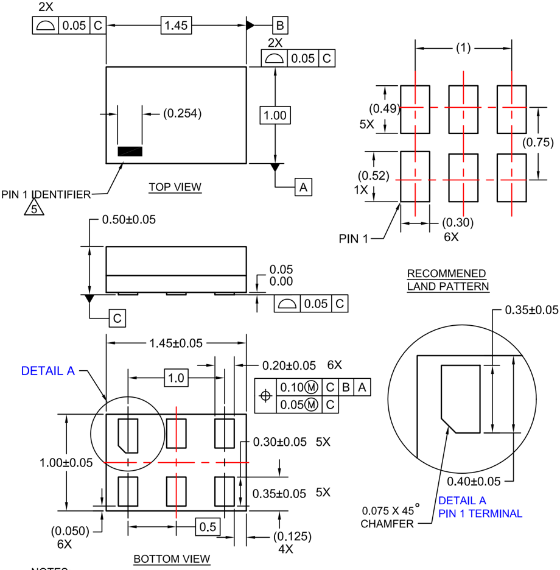

| DOCUMENT NUMBER:   | 98AON13590G   | Electronic versions are uncontrolled except when accessed directly from the Document Repository. Printed versions are uncontrolled except when stamped 'CONTROLLED COPY' in red.   | Electronic versions are uncontrolled except when accessed directly from the Document Repository. Printed versions are uncontrolled except when stamped 'CONTROLLED COPY' in red.   |
|--------------------|---------------|------------------------------------------------------------------------------------------------------------------------------------------------------------------------------------|------------------------------------------------------------------------------------------------------------------------------------------------------------------------------------|
| DESCRIPTION:       | SIP6 1.45X1.0 |                                                                                                                                                                                    | PAGE 1 OF 1                                                                                                                                                                        |

onsemi and                     are trademarks of Semiconductor Components Industries, LLC dba onsemi or its subsidiaries in the United States and/or other countries. onsemi reserves the right to make changes without further notice to any products herein. onsemi makes no warranty, representation or guarantee regarding the suitability of its products for any particular purpose, nor does onsemi assume any liability arising out of the application or use of any product or circuit, and specifically disclaims any and all liability, including without limitation special, consequential or incidental damages. onsemi does not convey any license under its patent rights nor the rights of others.

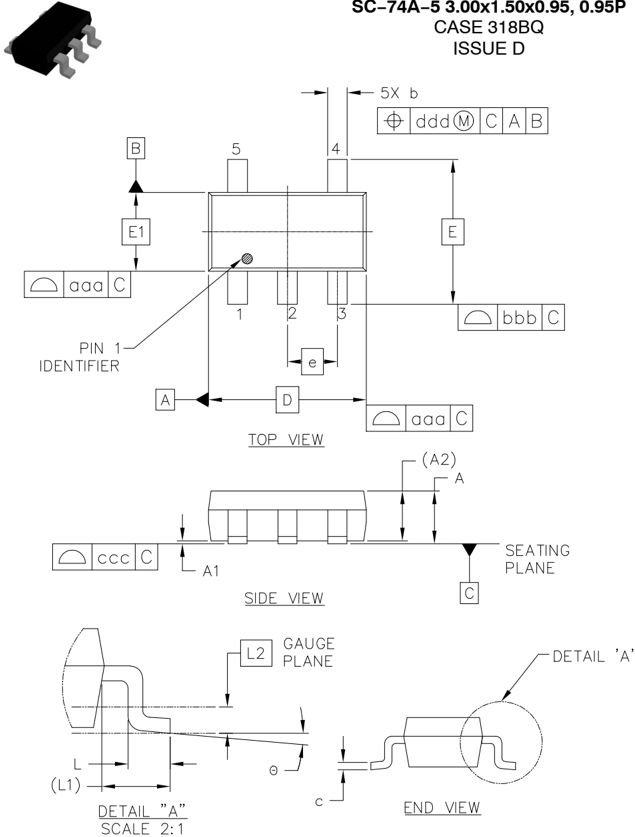

## GENERIC MARKING DIAGRAM*

XXX

G

XXXM

G

M

G

= Specific Device Code

= Date Code

= Pb

-

Free Package

(Note: Microdot may be in either location)

98AON66279G

## DATE 13 APR 2026

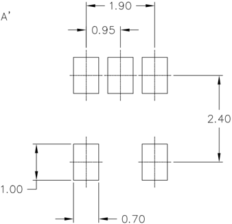

- *This information is generic. Please refer to device data sheet for actual part marking. Pb -Free indicator, 'G' or microdot ' G ', may or may not be present. Some products may not follow the Generic Marking.

Electronic  versions  are  uncontrolled  except  when  accessed directly  from the  Document Repository. Printed  versions are uncontrolled  except when stamped  'CONTROLLED COPY' in red.

SC -74A -5 3.00x1.50x0.95, 0.95P

DOCUMENT NUMBER:

DESCRIPTION:

PAGE 1 OF 1

onsemi and                     are trademarks of Semiconductor Components Industries, LLC dba onsemi or its subsidiaries in the United States and/or other countries. onsemi reserves the right to make changes without further notice to any products herein. onsemi makes no warranty, representation or guarantee regarding the suitability of its products for any particular purpose, nor does onsemi assume any liability arising out of the application or use of any product or circuit, and specifically disclaims any and all liability, including without limitation special, consequential or incidental damages. onsemi does not convey any license under its patent rights nor the rights of others.

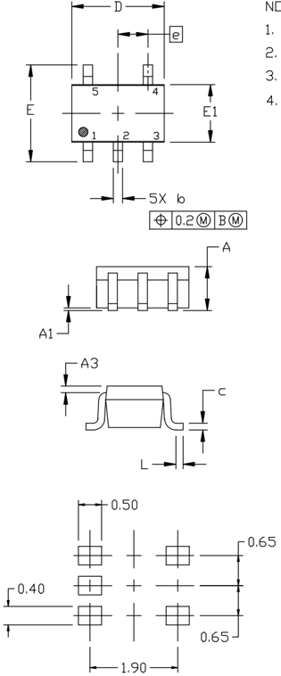

STYLE 1:

STYLE 2:

PIN 1. BASE

2. EMITTER

3. BASE

4. COLLECTOR

5. COLLECTOR

STYLE 6:

PIN 1. EMITTER 2

2. BASE 2

3. EMITTER 1

4. COLLECTOR

5. COLLECTOR 2/BASE 1

PIN 1. ANODE

2. EMITTER

3. BASE

4. COLLECTOR

5. CATHODE

STYLE 7:

PIN 1. BASE

2. EMITTER

3. BASE

4. COLLECTOR

5. COLLECTOR

DATE 11 APR 2023

- *This information is generic. Please refer to device data sheet for actual part marking. Pb -Free indicator, 'G' or microdot ' G ', may or may not be present. Some products may not follow the Generic Marking.

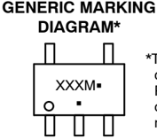

XXX = Specific Device Code

M

= Date Code

- G = Pb -Free Package

(Note: Microdot may be in either location)

STYLE 3:

STYLE 4:

PIN 1. ANODE 1

2. N/C

3. ANODE 2

4. CATHODE 2

5. CATHODE 1

STYLE 8:

PIN 1. CATHODE

2. COLLECTOR

3. N/C

4. BASE

5. EMITTER

PIN 1. SOURCE 1

2. DRAIN 1/2

3. SOURCE 1

4. GATE 1

5. GATE 2

STYLE 9:

PIN 1. ANODE

2. CATHODE

3. ANODE

4. ANODE

5. ANODE

STYLE 5:

PIN 1. CATHODE

2. COMMON ANODE

3. CATHODE 2

4. CATHODE 3

5. CATHODE 4

Note: Please refer to datasheet for style callout. If style type is not called out in the datasheet refer to the device datasheet pinout or pin assignment.

| DOCUMENT NUMBER:   | 98ASB42984B                      | Electronic versions are uncontrolled except when accessed directly from the Document Repository. Printed versions are uncontrolled except when stamped 'CONTROLLED COPY' in red.   | Electronic versions are uncontrolled except when accessed directly from the Document Repository. Printed versions are uncontrolled except when stamped 'CONTROLLED COPY' in red.   |
|--------------------|----------------------------------|------------------------------------------------------------------------------------------------------------------------------------------------------------------------------------|------------------------------------------------------------------------------------------------------------------------------------------------------------------------------------|
| DESCRIPTION:       | SC - 88A (SC - 70 - 5/SOT - 353) | SC - 88A (SC - 70 - 5/SOT - 353)                                                                                                                                                   | PAGE 1 OF 1                                                                                                                                                                        |

onsemi and                     are trademarks of Semiconductor Components Industries, LLC dba onsemi or its subsidiaries in the United States and/or other countries. onsemi reserves the right to make changes without further notice to any products herein. onsemi makes no warranty, representation or guarantee regarding the suitability of its products for any particular purpose, nor does onsemi assume any liability arising out of the application or use of any product or circuit, and specifically disclaims any and all liability, including without limitation special, consequential or incidental damages. onsemi does not convey any license under its patent rights nor the rights of others.

## SC -88A (SC -70 -5/SOT -353)

CASE 419A -02

ISSUE M

## SC -88A (SC -70 5 Lead), 1.25x2

CASE 419AC -01

ISSUE A

SIDE VIEW

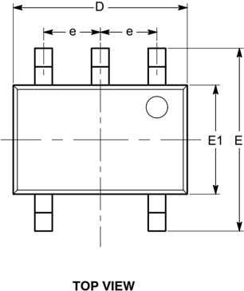

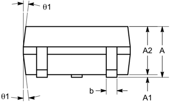

## Notes:

- (1)  All dimensions are in millimeters. Angles in degrees.
- (2)  Complies with JEDEC MO-203.

| DOCUMENT NUMBER:   | 98AON34260E                       | Electronic versions are uncontrolled except when accessed directly from the Document Repository. Printed versions are uncontrolled except when stamped 'CONTROLLED COPY' in red.   | Electronic versions are uncontrolled except when accessed directly from the Document Repository. Printed versions are uncontrolled except when stamped 'CONTROLLED COPY' in red.   |
|--------------------|-----------------------------------|------------------------------------------------------------------------------------------------------------------------------------------------------------------------------------|------------------------------------------------------------------------------------------------------------------------------------------------------------------------------------|
| DESCRIPTION:       | SC - 88A (SC - 70 5 LEAD), 1.25X2 |                                                                                                                                                                                    | PAGE 1 OF 1                                                                                                                                                                        |

onsemi and                     are trademarks of Semiconductor Components Industries, LLC dba onsemi or its subsidiaries in the United States and/or other countries. onsemi reserves the right to make changes without further notice to any products herein. onsemi makes no warranty, representation or guarantee regarding the suitability of its products for any particular purpose, nor does onsemi assume any liability arising out of the application or use of any product or circuit, and specifically disclaims any and all liability, including without limitation special, consequential or incidental damages. onsemi does not convey any license under its patent rights nor the rights of others.

DATE 29 JUN 2010

| SYMBOL   | MIN      | NOM      | MAX      |
|----------|----------|----------|----------|
| A        | 0.80     |          | 1.10     |
| A1       | 0.00     |          | 0.10     |
| A2       | 0.80     |          | 1.00     |
| b        | 0.15     |          | 0.30     |
| c        | 0.10     |          | 0.18     |
| D        | 1.80     | 2.00     | 2.20     |
| E        | 1.80     | 2.10     | 2.40     |
| E1       | 1.15     | 1.25     | 1.35     |
| e        | 0.65 BSC | 0.65 BSC | 0.65 BSC |
| L        | 0.26     | 0.36     | 0.46     |
| L1       | 0.42 REF | 0.42 REF | 0.42 REF |
| L2       | 0.15 BSC | 0.15 BSC | 0.15 BSC |
| θ        | 0º       |          | 8º       |
| θ1       | 4º       |          | 10º      |

END VIEW

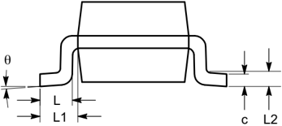

## UDFN6 1.0X1.0, 0.35P

CASE 517DP ISSUE O

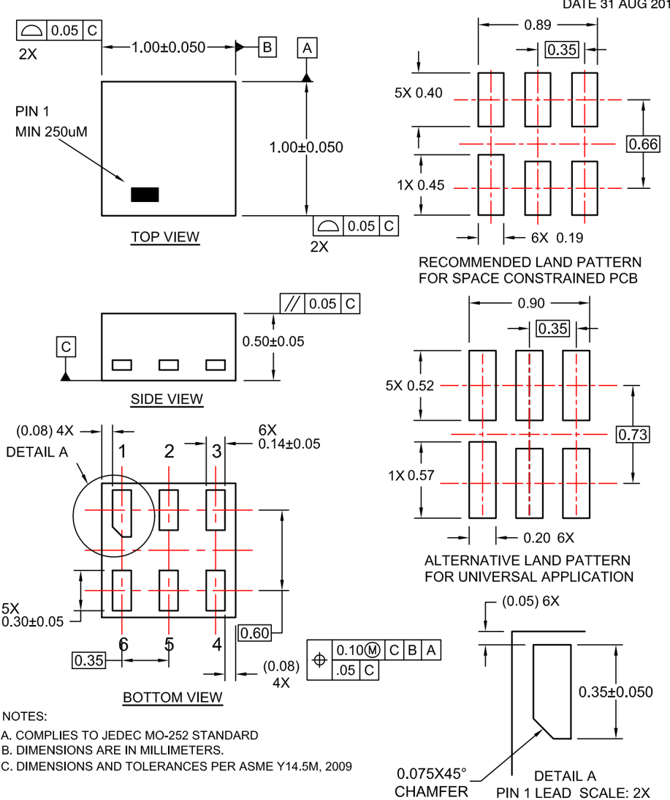

| DOCUMENT NUMBER:   | 98AON13593G          | Electronic versions are uncontrolled except when accessed directly from the Document Repository. Printed versions are uncontrolled except when stamped 'CONTROLLED COPY' in red.   | Electronic versions are uncontrolled except when accessed directly from the Document Repository. Printed versions are uncontrolled except when stamped 'CONTROLLED COPY' in red.   |
|--------------------|----------------------|------------------------------------------------------------------------------------------------------------------------------------------------------------------------------------|------------------------------------------------------------------------------------------------------------------------------------------------------------------------------------|
| DESCRIPTION:       | UDFN6 1.0X1.0, 0.35P |                                                                                                                                                                                    | PAGE 1 OF 1                                                                                                                                                                        |

onsemi and                     are trademarks of Semiconductor Components Industries, LLC dba onsemi or its subsidiaries in the United States and/or other countries. onsemi reserves the right to make changes without further notice to any products herein. onsemi makes no warranty, representation or guarantee regarding the suitability of its products for any particular purpose, nor does onsemi assume any liability arising out of the application or use of any product or circuit, and specifically disclaims any and all liability, including without limitation special, consequential or incidental damages. onsemi does not convey any license under its patent rights nor the rights of others.

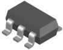

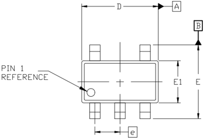

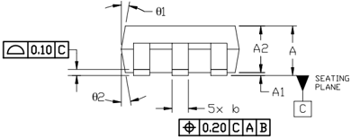

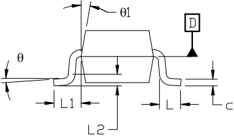

XXX = Specific Device Code M = Date Code

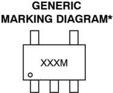

*This information is generic. Please refer to device data sheet for actual part marking. Pb -Free indicator, 'G' or microdot ' G ', may or may not be present. Some products may not follow the Generic Marking.

| DOCUMENT NUMBER:   | 98AON34320E      | Electronic versions are uncontrolled except when accessed directly from the Document Repository. Printed versions are uncontrolled except when stamped 'CONTROLLED COPY' in red.   | Electronic versions are uncontrolled except when accessed directly from the Document Repository. Printed versions are uncontrolled except when stamped 'CONTROLLED COPY' in red.   |
|--------------------|------------------|------------------------------------------------------------------------------------------------------------------------------------------------------------------------------------|------------------------------------------------------------------------------------------------------------------------------------------------------------------------------------|
| DESCRIPTION:       | SOT - 23, 5 LEAD |                                                                                                                                                                                    | PAGE 1 OF 1                                                                                                                                                                        |

onsemi and                     are trademarks of Semiconductor Components Industries, LLC dba onsemi or its subsidiaries in the United States and/or other countries. onsemi reserves the right to make changes without further notice to any products herein. onsemi makes no warranty, representation or guarantee regarding the suitability of its products for any particular purpose, nor does onsemi assume any liability arising out of the application or use of any product or circuit, and specifically disclaims any and all liability, including without limitation special, consequential or incidental damages. onsemi does not convey any license under its patent rights nor the rights of others.

## SOT -23, 5 Lead

CASE 527AH ISSUE A

| q   |
|-----|
| q 1 |
| q 2 |

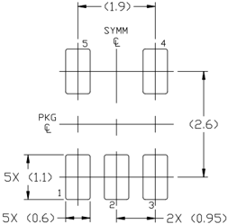

DATE 09 JUN 2021

onsemi , , and other names, marks, and brands are registered and/or common law trademarks of Semiconductor Components Industries, LLC dba ' onsemi ' or its affiliates and/or subsidiaries in the United States and/or other countries. onsemi owns the rights to a number of patents, trademarks, copyrights, trade secrets, and other intellectual property. A listing of onsemi 's product/patent coverage may be accessed at www.onsemi.com/site/pdf/Patent -Marking.pdf. onsemi reserves the right to make changes at any time to any products or information herein, without notice. The information herein is provided 'as -is' and onsemi makes no warranty, representation or guarantee regarding the accuracy of the information, product features, availability, functionality, or suitability of its products for any particular purpose, nor does onsemi assume any liability arising out of the application or use of any product or circuit, and specifically disclaims any and all liability, including without limitation special, consequential or incidental damages. Buyer is responsible for its products and applications using onsemi products, including compliance with all laws, regulations and safety requirements or standards, regardless of any support or applications information provided by onsemi . 'Typical' parameters which may be provided in onsemi data sheets and/or specifications can and do vary in different applications and actual performance may vary over time. All operating parameters, including 'Typicals' must be validated for each customer application by customer's technical experts. onsemi does not convey any license under any of its intellectual property rights nor the rights of others. onsemi products are not designed, intended, or authorized for use as a critical component in life support systems or any FDA Class 3 medical devices or medical devices with a same or similar classification in a foreign jurisdiction or any devices intended for implantation in the human body. Should Buyer purchase or use onsemi products for any such unintended or unauthorized application, Buyer shall indemnify and hold onsemi and its officers, employees, subsidiaries, affiliates, and distributors harmless against all claims, costs, damages, and expenses, and reasonable attorney fees arising out of, directly or indirectly, any claim of personal injury or death associated with such unintended or unauthorized use, even if such claim alleges that onsemi was negligent regarding the design or manufacture of the part. onsemi is an Equal Opportunity/Affirmative Action Employer. This literature is subject to all applicable copyright laws and is not for resale in any manner.

## ADDITIONAL INFORMATION

TECHNICAL PUBLICATIONS :

Technical Library:

www.onsemi.com/design/resources/technical - documentation

onsemi Website:

www.onsemi.com

ONLINE SUPPORT : www.onsemi.com/support

For additional information, please contact your local Sales Representative at www.onsemi.com/support/sales