## STM32F411xC STM32F411xE

Arm ®  Cortex ® -M4 32b MCU+FPU, 125 DMIPS, 512KB Flash, 128KB RAM, USB OTG FS, 11 TIMs, 1 ADC, 13 comm. interfaces

Datasheet -production data

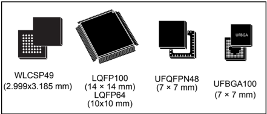

timers (independent and window) and a SysTick timer

- Debug mode
- -Serial wire debug (SWD) &amp; JTAG interfaces
- -Cortex ® -M4 Embedded Trace Macrocell™
- Up to 81 I/O ports with interrupt capability
- -Up to 78 fast I/Os up to 100 MHz
- -Up to 77 5 V-tolerant I/Os
- Up to 13 communication interfaces
- -Up to 3 x I 2 C interfaces (SMBus/PMBus)
- -Up to 3 USARTs (2 x 12.5 Mbit/s, 1 x 6.25 Mbit/s), ISO 7816 interface, LIN, IrDA, modem control)
- -Up to 5 SPI/I2Ss (up to 50 Mbit/s, SPI, or I2S audio protocol), SPI2 and SPI3 with muxed full-duplex I 2 S to achieve audio class accuracy via internal audio PLL or external clock
- -SDIO interface (SD/MMC/eMMC)
- -Advanced connectivity: USB 2.0 full-speed device/host/OTG controller with on-chip PHY
- CRC calculation unit
- 96-bit unique ID
- RTC: subsecond accuracy, hardware calendar
- All packages are ECOPACK2 compliant

Table 1. Device summary

| Reference   | Part number                           |
|-------------|---------------------------------------|
| STM32F411xC | STM32F411CC, STM32F411RC, STM32F411VC |
| STM32F411xE | STM32F411CE, STM32F411RE, STM32F411VE |

## Features

- Includes ST state-of-the-art patented technology
- Dynamic efficiency line with BAM (Batch acquisition mode)
- -1.7 V to 3.6 V power supply
- -- 40°C to 85/105/125 °C temperature range
- 125 DMIPS/1.25 DMIPS/MHz (Dhrystone 2.1), and DSP instructions
- Core: Arm ®  32-bit Cortex ® -M4 CPU with FPU, adaptive real-time accelerator (ART Accelerator) allowing 0-wait state execution from flash memory, frequency up to 100 MHz, memory protection unit,
- Memories
- -Up to 512 Kbytes of flash memory
- -128 Kbytes of SRAM
- Clock, reset, and supply management
- -1.7 V to 3.6 V application supply and I/Os
- -POR, PDR, PVD, and BOR
- -4-to-26 MHz crystal oscillator
- -Internal 16 MHz factory-trimmed RC
- -32 kHz oscillator for RTC with calibration
- -Internal 32 kHz RC with calibration
- Power consumption
- -Run: 100 µA/MHz (peripheral off)
- -Stop (Flash in Stop mode, fast wakeup time): 42 µA typical at 25 °C; 65 µA max at 25 °C
- -Stop (Flash in Deep power down mode, slow wakeup time): down to 9 µA at 25 °C; 28 µA max at 25 °C
- -Standby: 1.8 µA at 25 °C / 1.7 V without RTC; 11 µA at 85 °C at 1.7 V
- -VBAT  supply for RTC: 1 µA at 25 °C
- 1×12-bit, 2.4 MSPS A/D converter: up to 16 channels
- General-purpose DMA: 16-stream DMA controllers with FIFOs and burst support
- Up to 11 timers: up to six 16-bit, two 32-bit timers up to 100 MHz, each with up to four IC/OC/PWM or pulse counter and quadrature (incremental) encoder input, two watchdog

January 2024

DS10314 Rev 8

## Application

- Motor drive and application control
- Medical equipment
- Industrial applications: PLC, inverters, circuit breakers
- Printers, and scanners
- Alarm systems, video intercom, and HVAC
- Home audio appliances
- Mobile phone sensor hub

## Contents

|   1 | Introduction . . . . . . . . . . . . . . . . . . . . . . . . . . . . . . . . . . . . . . .          | Introduction . . . . . . . . . . . . . . . . . . . . . . . . . . . . . . . . . . . . . . .                                 | . 11   |
|-----|-----------------------------------------------------------------------------------------------------|----------------------------------------------------------------------------------------------------------------------------|--------|
|   2 | Description . . . . . . . . . . . . . . . . . . . . . . . . . . . . . . . . . . . . . . . . . . . . | Description . . . . . . . . . . . . . . . . . . . . . . . . . . . . . . . . . . . . . . . . . . . .                        | . 12   |
|     | 2.1                                                                                                 | Compatibility with STM32F4 series . . . . . . . . . . . . . . . . . . .                                                    | . 14   |
|   3 | Functional overview . . . . . . . . . . . . . . . . . . . . . . . . . . . . . . . .                 | Functional overview . . . . . . . . . . . . . . . . . . . . . . . . . . . . . . . .                                        | . 17   |
|     | 3.1                                                                                                 | Arm ® Cortex ® -M4 with FPU core with embedded flash memory and SRAM . . . . . . . . . . . . . . . . . . . . . . . . . . . | . 17   |
|     | 3.2                                                                                                 | Adaptive real-time memory accelerator (ART Accelerator) .                                                                  | . 17   |
|     | 3.3                                                                                                 | Batch acquisition mode (BAM) . . . . . . . . . . . . . . . . . . . . . . .                                                 | . 17   |
|     | 3.4                                                                                                 | Memory protection unit . . . . . . . . . . . . . . . . . . . . . . . . . . . . .                                           | . 18   |
|     | 3.5                                                                                                 | Embedded flash memory . . . . . . . . . . . . . . . . . . . . . . . . . . .                                                | . 18   |
|     | 3.6                                                                                                 | CRC (cyclic redundancy check) calculation unit . . . . . . . . .                                                           | . 18   |
|     | 3.7                                                                                                 | Embedded SRAM . . . . . . . . . . . . . . . . . . . . . . . . . . . . . . . . .                                            | . 18   |
|     | 3.8                                                                                                 | Multi-AHB bus matrix . . . . . . . . . . . . . . . . . . . . . . . . . . . . . .                                           | . 19   |
|     | 3.9                                                                                                 | DMA controller (DMA) . . . . . . . . . . . . . . . . . . . . . . . . . . . . .                                             | . 19   |
|     | 3.10                                                                                                | Nested vectored interrupt controller (NVIC) . . . . . . . . . . . . .                                                      | . 20   |
|     | 3.11                                                                                                | External interrupt/event controller (EXTI) . . . . . . . . . . . . . . .                                                   | . 20   |
|     | 3.12                                                                                                | Clocks and startup . . . . . . . . . . . . . . . . . . . . . . . . . . . . . . . .                                         | . 20   |
|     | 3.13                                                                                                | Boot modes . . . . . . . . . . . . . . . . . . . . . . . . . . . . . . . . . . . . .                                       | . 21   |
|     | 3.14                                                                                                | Power supply schemes . . . . . . . . . . . . . . . . . . . . . . . . . . . .                                               | . 21   |
|     | 3.15                                                                                                | Power supply supervisor . . . . . . . . . . . . . . . . . . . . . . . . . . .                                              | . 22   |
|     |                                                                                                     | 3.15.1 Internal reset ON . . . . . . . . . . . . . . . . . . . . . . . . . . . . . . .                                     | . 22   |
|     |                                                                                                     | 3.15.2 Internal reset OFF . . . . . . . . . . . . . . . . . . . . . . . . . . . . . .                                      | . 22   |
|     | 3.16                                                                                                | Voltage regulator . . . . . . . . . . . . . . . . . . . . . . . . . . . . . . . . .                                        | . 23   |
|     |                                                                                                     | 3.16.1 Regulator ON . . . . . . . . . . . . . . . . . . . . . . . . . . . . . . . . . .                                    | . 23   |
|     |                                                                                                     | . . . . . . . . . . . . . . . . . . . . . . . . . . . . . . . . .                                                          | . 23   |
|     |                                                                                                     | 3.16.2 Regulator OFF 3.16.3 Regulator ON/OFF and internal power supply supervisor                                          | . 26   |
|     | 3.17                                                                                                | Real-time . . . . . . . . . . . .                                                                                          | . 26   |
|     |                                                                                                     | clock (RTC) and backup registers                                                                                           |        |
|     | 3.18                                                                                                | Low-power modes . . . . . . . . . . . . . . . . . . . . . . . . . . . . . . . .                                            | . 27   |
|     | 3.20                                                                                                | Timers and watchdogs . . . . . . . . . . . . . . . . . . . . . . . . . . . . .                                             | . 28   |

6

4

5

6

|                                                                                                        | 3.20.1                                                                                                 | Advanced-control timers (TIM1) . . . . . . . . . . . . . . . . . . . . . . .                           | . 28   |
|--------------------------------------------------------------------------------------------------------|--------------------------------------------------------------------------------------------------------|--------------------------------------------------------------------------------------------------------|--------|
|                                                                                                        | 3.20.2                                                                                                 | General-purpose timers (TIMx) . . . . . . . . . . . . . . . . . . . . . . . .                          | . 29   |
|                                                                                                        | 3.20.3 . . .                                                                                           | Independent watchdog . . . . . . . . . . . . . . . . . . . . . . . . . . .                             | . 29   |
|                                                                                                        | 3.20.4 . . . . . . .                                                                                   | Window watchdog . . . . . . . . . . . . . . . . . . . . . . . . . . .                                  | . 29   |
|                                                                                                        | 3.20.5 . . . . . . . . . . .                                                                           | SysTick timer . . . . . . . . . . . . . . . . . . . . . . . . . . .                                    | . 30   |
| 3.21                                                                                                   | Inter-integrated circuit interface (I2C) . . . . . . . . . . . . . . .                                 | . . . . . . . .                                                                                        | . 30   |
| 3.22                                                                                                   | Universal synchronous/asynchronous receiver transmitters (USART)                                       | Universal synchronous/asynchronous receiver transmitters (USART)                                       | . 30   |
| 3.23                                                                                                   | Serial peripheral interface (SPI) . . . . . . . . . . . . .                                            | . . . . . . . . . . . . . .                                                                            | . 31   |
| 3.24                                                                                                   | Inter-integrated sound (I 2 S) . . . .                                                                 | . . . . . . . . . . . . . . . . . . . . . . . . . .                                                    | . 31   |
| 3.25                                                                                                   | Audio PLL (PLLI2S) . . . . . . . . . .                                                                 | . . . . . . . . . . . . . . . . . . . . . . . . . .                                                    | . 31   |
| 3.26                                                                                                   | Secure digital input/output interface (SDIO) . . . . . . . . . . . . . . . .                           | . .                                                                                                    | . 32   |
| 3.27                                                                                                   | Universal serial bus on-the-go full-speed (OTG_FS) . . . . . . . .                                     | . . .                                                                                                  | . 32   |
| 3.28                                                                                                   | General-purpose input/outputs (GPIOs) . . . . . . . . . . . . . . . .                                  | . . . . .                                                                                              | . 32   |
| 3.29                                                                                                   | Analog-to-digital converter (ADC) . . . . .                                                            | . . . . . . . . . . . . . . . . . . . .                                                                | . 33   |
| 3.30                                                                                                   | Temperature sensor . . . . . . . . . .                                                                 | . . . . . . . . . . . . . . . . . . . . . . . . . .                                                    | . 33   |
| 3.31                                                                                                   | Serial wire JTAG debug port (SWJ-DP) . . . . . .                                                       | . . . . . . . . . . . . . . .                                                                          | . 33   |
| 3.32                                                                                                   | Embedded Trace Macrocell™ . . . . . . . . . . . . . . . . . .                                          | . . . . . . . . . .                                                                                    | . 33   |
| Pinouts and pin description . . . . . . . . . . . . . . . . . . . . . . .                              | Pinouts and pin description . . . . . . . . . . . . . . . . . . . . . . .                              | . . . . . .                                                                                            | . 34   |
| Memory mapping . . . . . . . . . . . . . . . . . . . . . . . . . . . . . . . . . . . . . . .           | Memory mapping . . . . . . . . . . . . . . . . . . . . . . . . . . . . . . . . . . . . . . .           | Memory mapping . . . . . . . . . . . . . . . . . . . . . . . . . . . . . . . . . . . . . . .           | . 54   |
| Electrical characteristics . . . . . . . . . . . . . . . . . . . . . . .                               | Electrical characteristics . . . . . . . . . . . . . . . . . . . . . . .                               | . . . . . . . .                                                                                        | . 58   |
| 6.1                                                                                                    | Parameter conditions . . . . . . . . . . . . . . . . . . . . . . . . . . . . .                         | . . . . . .                                                                                            | . 58   |
|                                                                                                        | . . . . . . . . . .                                                                                    | Typical values . . . . . . . . . . . . . . . . . . . . . . . . . . .                                   | . 58   |
|                                                                                                        | 6.1.2 6.1.3 . . . . . . . . . .                                                                        | Typical curves . . . . . . . . . . . . . . . . . . . . . . . . . . .                                   | . 58   |
|                                                                                                        | 6.1.4 . . . . . . .                                                                                    | Loading capacitor . . . . . . . . . . . . . . . . . . . . . . . . . . .                                | . 58   |
|                                                                                                        | 6.1.5 . . . . . . . .                                                                                  | Pin input voltage . . . . . . . . . . . . . . . . . . . . . . . . . . .                                | . 59   |
|                                                                                                        | 6.1.6 .                                                                                                | Power supply scheme . . . . . . . . . . . . . . . . . . . . . . . . . . .                              | . 60   |
|                                                                                                        |                                                                                                        | . . .                                                                                                  | . 61   |
|                                                                                                        | 6.1.7                                                                                                  | Current consumption measurement . . . . . . . . . . . . . . . . . . . .                                |        |
| 6.2 Absolute maximum ratings . . . . . . . . . .                                                       | 6.2 Absolute maximum ratings . . . . . . . . . .                                                       | . . . . . . . . . . . . . . . . . . . . .                                                              | . 61   |
| 6.3 Operating conditions . . . . . . . . . . . . . . . . . . . . . . . . . . . . . . . . . . . . . . . | 6.3 Operating conditions . . . . . . . . . . . . . . . . . . . . . . . . . . . . . . . . . . . . . . . | 6.3 Operating conditions . . . . . . . . . . . . . . . . . . . . . . . . . . . . . . . . . . . . . . . | . 63   |
|                                                                                                        | 6.3.1                                                                                                  | General operating conditions . . . . . . . . . . . . . . . . . . . . . . . . . .                       | . 63   |
|                                                                                                        | 6.3.2                                                                                                  | VCAP_1/VCAP_2 external capacitors . . . . . . . . . . . . . . . . . . .                                | . 65   |
|                                                                                                        | 6.3.3 Operating conditions at power-up/power-down (regulator                                           | ON)                                                                                                    | . 66   |

|    |                                                                             | 6.3.4                                                                       | Operating conditions at power-up / power-down (regulator OFF) . . . .                             | . 66   |
|----|-----------------------------------------------------------------------------|-----------------------------------------------------------------------------|---------------------------------------------------------------------------------------------------|--------|
|    |                                                                             | 6.3.5                                                                       | Embedded reset and power control block characteristics . . . . . . . . .                          | . . 67 |
|    |                                                                             | 6.3.6                                                                       | Supply current characteristics . . . . . . . . . . . . . . . . . . . . . . . . . . . . . .        | . . 68 |
|    |                                                                             | 6.3.7                                                                       | Wakeup time from low-power modes . . . . . . . . . . . . . . . . . . . . . . . . .                | . . 82 |
|    |                                                                             | 6.3.8                                                                       | External clock source characteristics . . . . . . . . . . . . . . . . . . . . . . . . .           | . . 83 |
|    |                                                                             | 6.3.9                                                                       | Internal clock source characteristics . . . . . . . . . . . . . . . . . . . . . . . . .           | . . 87 |
|    |                                                                             | 6.3.10                                                                      | PLL characteristics . . . . . . . . . . . . . . . . . . . . . . . . . . . . . . . . . . . . . . . | . . 89 |
|    |                                                                             | 6.3.11                                                                      | PLL spread spectrum clock generation (SSCG) characteristics . . . .                               | . . 91 |
|    |                                                                             | 6.3.12                                                                      | Memory characteristics . . . . . . . . . . . . . . . . . . . . . . . . . . . . . . . . . . .      | . . 92 |
|    |                                                                             | 6.3.13                                                                      | EMC characteristics . . . . . . . . . . . . . . . . . . . . . . . . . . . . . . . . . . . . . .   | . . 94 |
|    |                                                                             | 6.3.14                                                                      | Absolute maximum ratings (electrical sensitivity) . . . . . . . . . . . . . . .                   | . . 96 |
|    |                                                                             | 6.3.15                                                                      | I/O current injection characteristics . . . . . . . . . . . . . . . . . . . . . . . . . .         | . . 97 |
|    |                                                                             | 6.3.16                                                                      | I/O port characteristics . . . . . . . . . . . . . . . . . . . . . . . . . . . . . . . . . . . .  | . . 98 |
|    |                                                                             | 6.3.17                                                                      | NRST pin characteristics . . . . . . . . . . . . . . . . . . . . . . . . . . . . . . . . . .      | . 104  |
|    |                                                                             | 6.3.18                                                                      | TIM timer characteristics . . . . . . . . . . . . . . . . . . . . . . . . . . . . . . . . . .     | . 105  |
|    |                                                                             | 6.3.19                                                                      | Communications interfaces . . . . . . . . . . . . . . . . . . . . . . . . . . . . . . . .         | . 105  |
|    |                                                                             | 6.3.20                                                                      | 12-bit ADC characteristics . . . . . . . . . . . . . . . . . . . . . . . . . . . . . . . . .      | . 114  |
|    |                                                                             | 6.3.21                                                                      | Temperature sensor characteristics . . . . . . . . . . . . . . . . . . . . . . . . . .            | . 120  |
|    |                                                                             | 6.3.22                                                                      | V BAT monitoring characteristics . . . . . . . . . . . . . . . . . . . . . . . . . . . . .        | . 121  |
|    |                                                                             | 6.3.23                                                                      | Embedded reference voltage . . . . . . . . . . . . . . . . . . . . . . . . . . . . . . .          | . 121  |
|    |                                                                             | 6.3.24                                                                      | SD/SDIO MMC/eMMC card host interface (SDIO) characteristics . .                                   | . 122  |
|    |                                                                             | 6.3.25                                                                      | RTC characteristics . . . . . . . . . . . . . . . . . . . . . . . . . . . . . . . . . . . . . .   | . 124  |
|  7 | Package information . . . . . . . . . . . . . . . . . . . . . . . . . . . . | Package information . . . . . . . . . . . . . . . . . . . . . . . . . . . . | . . . . . . . . . . .                                                                             | 125    |
|    | 7.1                                                                         | Device marking . . . . . . . .                                              | . . . . . . . . . . . . . . . . . . . . . . . . . . . . . . . . . . . .                           | 125    |
|    | 7.2                                                                         | WLCSP49 package information (A0ZV) . . . . . . . . . . . . . . . . . .      | . . . . . . .                                                                                     | 126    |
|    | 7.3                                                                         | UFQFPN48 package information (A0B9) . . . . . . . . . .                     | . . . . . . . . . . . . . .                                                                       | 129    |
|    | 7.4                                                                         | LQFP64 package information (5W) . .                                         | . . . . . . . . . . . . . . . . . . . . . . . . . .                                               | 131    |
|    | 7.5                                                                         | LQFP100 package information (1L) . . .                                      | . . . . . . . . . . . . . . . . . . . . . . . . .                                                 | 134    |
|    | 7.6                                                                         | UFBGA100 package information (A0C2) . . .                                   | . . . . . . . . . . . . . . . . . . . . .                                                         | 137    |
|    | 7.7                                                                         | Thermal characteristics .                                                   | . . . . . . . . . . . . . . . . . . . . . . . . . . . . . . . . . . . .                           | 140    |
|    |                                                                             | 7.7.1                                                                       | Reference document . . . . . . . . . . . . . . . . . . . . . . . . . . . . . . . . . . . . .      | . 140  |
|  8 | Ordering information . . . . .                                              | Ordering information . . . . .                                              | . . . . . . . . . . . . . . . . . . . . . . . . . . . . . . . . .                                 | 141    |

6

| A.1                                                                                                      | . . . . .                                                                                                | Operating conditions . . . . . . . . . . . . . . . . . . . . . . . . . . . . . . . . . . . 142   |
|----------------------------------------------------------------------------------------------------------|----------------------------------------------------------------------------------------------------------|--------------------------------------------------------------------------------------------------|
| Appendix B                                                                                               | Application block diagrams . .                                                                           | . . . . . . . . . . . . . . . . . . . . . . . . . . . . 143                                      |
| B.1                                                                                                      | USB OTG Full Speed (FS) interface solutions                                                              | . . . . . . . . . . . . . . . . . . . . 143                                                      |
| B.2                                                                                                      | Sensor Hub application example.                                                                          | . . . . . . . . . . . . . . . . . . . . . . . . . . . . . . 145                                  |
| B.3                                                                                                      | Batch Acquisition Mode (BAM) example.                                                                    | . . . . . . . . . . . . . . . . . . . . . . . . 146                                              |
| 9                                                                                                        | Important security notice . . . .                                                                        | . . . . . . . . . . . . . . . . . . . . . . . . . . . . . . . 147                                |
| Revision history . . . . . . . . . . . . . . . . . . . . . . . . . . . . . . . . . . . . . . . . . . . . | Revision history . . . . . . . . . . . . . . . . . . . . . . . . . . . . . . . . . . . . . . . . . . . . | . . . . . . . 148                                                                                |

## List of tables

| Table 1.            | Device summary. . . . . . . . . . . . . . . . . . . . . . . . . . . . . . . . . . . . . . . . . . . . . . . . . . . . .                                                                                                                    | . . 1   |
|---------------------|--------------------------------------------------------------------------------------------------------------------------------------------------------------------------------------------------------------------------------------------|---------|
| Table 2.            | STM32F411xC/xE features and peripheral counts. . . . . . . . . . . . . . . . . . . . . . . . . . .                                                                                                                                         | . 13    |
| Table 3.            | Regulator ON/OFF and internal power supply supervisor availability. . . . . . . . . . . . .                                                                                                                                                | . 26    |
| Table 4.            | Timer feature comparison. . . . . . . . . . . . . . . . . . . . . . . . . . . . . . . . . . . . . . . . . . . . . .                                                                                                                        | . 28    |
| Table 5.            | Comparison of I2C analog and digital filters . . . . . . . . . . . . . . . . . . . . . . . . . . . . . . . .                                                                                                                               | . 30    |
| Table 6.            | USART feature comparison . . . . . . . . . . . . . . . . . . . . . . . . . . . . . . . . . . . . . . . . . . . .                                                                                                                           | . 31    |
| Table 7.            | Legend/abbreviations used in the pinout table . . . . . . . . . . . . . . . . . . . . . . . . . . . . . .                                                                                                                                  | . 39    |
| Table 8.            | STM32F411xC/xE pin definitions . . . . . . . . . . . . . . . . . . . . . . . . . . . . . . . . . . . . . . . .                                                                                                                             | . 39    |
| Table 9. Table 10.  | Alternate function mapping. . . . . . . . . . . . . . . . . . . . . . . . . . . . . . . . . . . . . . . . . . . . . STM32F411xC/xE                                                                                                         | . 48    |
|                     | register boundary addresses . . . . . . . . . . . . . . . . . . . . . . . . . . . . . . . . . . . . . . . . . . .                                                                                                                          | . 54    |
| Table 11.           | Voltage characteristics . . . . . . . . . . . . . . . . . . . . . . . . . . . . . . . . . . . . . . . . . . . . . . . .                                                                                                                    | . 61    |
| Table 12.           | Current characteristics . . . . . . . . . . . . . . . . . . . . . . . . . . . . . . . . . . . . . . . . . . . . . . . .                                                                                                                    | . 62    |
| Table 13.           | Thermal characteristics. . . . . . . . . . . . . . . . . . . . . . . . . . . . . . . . . . . . . . . . . . . . . . . .                                                                                                                     | . 62    |
| Table 14.           | General operating conditions . . . . . . . . . . . . . . . . . . . . . . . . . . . . . . . . . . . . . . . . . . .                                                                                                                         | . 63    |
| Table 15.           | Features depending on the operating power supply range . . . . . . . . . . . . . . . . . . . .                                                                                                                                             | . 64    |
| Table 16.           | VCAP_1/VCAP_2 operating conditions . . . . . . . . . . . . . . . . . . . . . . . . . . . . . . . . . . .                                                                                                                                   | . 66    |
| Table 17.           | Operating conditions at power-up / power-down (regulator ON) . . . . . . . . . . . . . . . .                                                                                                                                               | . 66    |
| Table 18.           | Operating conditions at power-up / power-down (regulator OFF). . . . . . . . . . . . . . . .                                                                                                                                               | . 66    |
| Table 19.           | Embedded reset and power control block characteristics. . . . . . . . . . . . . . . . . . . . . .                                                                                                                                          | . 67    |
| Table 20.           | Typical and maximum current consumption, code with data processing (ART accelerator disabled) running from SRAM - V DD = 1.7 V . . . . . . . . . . . . . . . . . . . . . .                                                                 | . 69    |
| Table 21.           | Typical and maximum current consumption, code with data processing (ART accelerator disabled) running from SRAM - V DD = 3.6 V . . . . . . . . . . . . . . . . . . . . . .                                                                 | . 70    |
| Table 22.           | Typical and maximum current consumption in run mode, code with data processing (ART accelerator enabled except prefetch) running from flash memory- V DD = 1.7 V                                                                           | . 71    |
| Table 23.           | Typical and maximum current consumption in run mode, code with data processing (ART accelerator enabled except prefetch) running from flash memory - V DD = 3.6                                                                            | . 72    |
| Table 24.           | Typical and maximum current consumption in run mode, code with data processing (ART accelerator disabled) running from flash memory - V DD = 3.6 V . . . . . . . . . . .                                                                   | . 73    |
| Table 25.           | Typical and maximum current consumption in run mode, code with data processing (ART accelerator enabled with prefetch) running from flash memory - V DD = 3.6 V .                                                                          | . 74    |
| Table 26.           | Typical and maximum current consumption in Sleep mode - V DD = 3.6 V. . . . . . . . .                                                                                                                                                      | . 75    |
| Table 27.           | Typical and maximum current consumptions in Stop mode - V DD = 1.7 V. . . . . . . . .                                                                                                                                                      | . 75    |
| Table 28.           | Typical and maximum current consumption in Stop mode - V DD =3.6 V. . . . . . . . . . .                                                                                                                                                    | . 76    |
| Table 29.           | Typical and maximum current consumption in Standby mode - V DD = 1.7 V . . . . . . .                                                                                                                                                       | . 76    |
| Table 30.           | Typical and maximum current consumption in Standby mode - V DD = 3.6 V . . . . . . .                                                                                                                                                       | . 76    |
| Table 31.           | Typical and maximum current consumptions in V BAT mode. . . . . . . . . . . . . . . . . . . .                                                                                                                                              | . 77    |
| Table 32.           | Switching output I/O current consumption . . . . . . . . . . . . . . . . . . . . . . . . . . . . . . . . .                                                                                                                                 | . 79    |
| Table 33.           | Peripheral current consumption . . . . . . . . . . . . . . . . . . . . . . . . . . . . . . . . . . . . . . . . .                                                                                                                           | . 80    |
| Table 34.           | Low-power mode wakeup timings (1) . . . . . . . . . . . . . . . . . . . . . . . . . . . . . . . . . . . . . .                                                                                                                              | . 83    |
| Table 35.           | High-speed external user clock characteristics. . . . . . . . . . . . . . . . . . . . . . . . . . . . . .                                                                                                                                  | . 83    |
| Table 36.           | Low-speed external user clock characteristics . . . . . . . . . . . . . . . . . . . . . . . . . . . . . .                                                                                                                                  | . 84    |
| Table 37.           | HSE 4-26 MHz oscillator characteristics. . . . . . . . . . . . . . . . . . . . . . . . . . . . . . . . . . .                                                                                                                               | . 85    |
| Table 38.           | LSE oscillator characteristics (f LSE = 32.768 kHz) . . . . . . . . . . . . . . . . . . . . . . . . . . .                                                                                                                                  | . 86    |
| Table 39.           | HSI oscillator characteristics . . . . . . . . . . . . . . . . . . . . . . . . . . . . . . . . . . . . . . . . . . .                                                                                                                       | . 87 88 |
| Table 40. Table 41. | LSI oscillator characteristics . . . . . . . . . . . . . . . . . . . . . . . . . . . . . . . . . . . . . . . . . . . Main PLL characteristics. . . . . . . . . . . . . . . . . . . . . . . . . . . . . . . . . . . . . . . . . . . . . . . | . . 89  |

8

| Table 42.           | PLLI2S (audio PLL) characteristics . . . . . . . . . . . . . . . . . . . . . . . . . .               | . . 90   |
|---------------------|------------------------------------------------------------------------------------------------------|----------|
| Table 43.           | SSCG parameter constraints . . . . . . . . . . . . . . . . . . . . . . . . . . . . . . .             | . . 91   |
| Table 44.           | Flash memory characteristics . . . . . . . . . . . . . . . . . . . . . . . . . . . . . . .           | . . 92   |
| Table 45.           | Flash memory programming. . . . . . . . . . . . . . . . . . . . . . . . . . . . . . . .              | . . 93   |
| Table 46.           | Flash memory programming with V PP voltage . . . . . . . . . . . . . . . . . .                       | . . 93   |
| Table 47.           | Flash memory endurance and data retention . . . . . . . . . . . . . . . . . . .                      | . . 94   |
| Table 48.           | EMS characteristics for LQFP100 package . . . . . . . . . . . . . . . . . . . .                      | . . 95   |
| Table 49.           | EMI characteristics for LQFP100 . . . . . . . . . . . . . . . . . . . . . . . . . . . .              | . . 96   |
| Table 50.           | ESD absolute maximum ratings . . . . . . . . . . . . . . . . . . . . . . . . . . . . .               | . . 96   |
| Table 51.           | Electrical sensitivities . . . . . . . . . . . . . . . . . . . . . . . . . . . . . . . . . . . . .   | . . 97   |
| Table 52.           | I/O current injection susceptibility . . . . . . . . . . . . . . . . . . . . . . . . . . . .         | . . 97   |
| Table 53.           | I/O static characteristics . . . . . . . . . . . . . . . . . . . . . . . . . . . . . . . . . . .     | . . 98   |
| Table 54.           | Output voltage characteristics . . . . . . . . . . . . . . . . . . . . . . . . . . . . . .           | . 101    |
| Table 55.           | I/O AC characteristics . . . . . . . . . . . . . . . . . . . . . . . . . . . . . . . . . . . . .     | . 102    |
| Table 56.           | NRST pin characteristics . . . . . . . . . . . . . . . . . . . . . . . . . . . . . . . . . .         | . 104    |
| Table 57.           | TIMx characteristics . . . . . . . . . . . . . . . . . . . . . . . . . . . . . . . . . . . . . .     | . 105    |
| Table 58.           | I 2 C characteristics. . . . . . . . . . . . . . . . . . . . . . . . . . . . . . . . . . . . . . . . | . 106    |
| Table 59.           | SCL frequency (f PCLK1 = 50 MHz, V DD = V DD_I2C = 3.3 V) . . . . . . . . .                          | . 107    |
| Table 60.           | SPI dynamic characteristics . . . . . . . . . . . . . . . . . . . . . . . . . . . . . . . .          | . 108    |
| Table 61.           | I 2 S dynamic characteristics . . . . . . . . . . . . . . . . . . . . . . . . . . . . . . . .        | . 111    |
| Table 62.           | USB OTG FS startup time . . . . . . . . . . . . . . . . . . . . . . . . . . . . . . . . .            | . 113    |
| Table 63.           | USB OTG FS DC electrical characteristics. . . . . . . . . . . . . . . . . . . . .                    | . 113    |
| Table 64.           | USB OTG FS electrical characteristics. . . . . . . . . . . . . . . . . . . . . . . .                 | . 114    |
| Table 65.           | ADC characteristics . . . . . . . . . . . . . . . . . . . . . . . . . . . . . . . . . . . . . .      | . 114    |
| Table 66.           | ADC accuracy at f ADC = 18 MHz . . . . . . . . . . . . . . . . . . . . . . . . . . . .               | . 116    |
| Table 67.           | ADC accuracy at f ADC = 30 MHz . . . . . . . . . . . . . . . . . . . . . . . . . . . .               | . 116    |
| Table 68.           | ADC accuracy at f ADC = 36 MHz . . . . . . . . . . . . . . . . . . . . . . . . . . . .               | . 116    |
| Table 69.           | ADC dynamic accuracy at f ADC = 18 MHz - limited test conditions . .                                 | . 117    |
| Table 70.           | ADC dynamic accuracy at f ADC = 36 MHz - limited test conditions . .                                 | . 117    |
| Table 71.           | Temperature sensor characteristics . . . . . . . . . . . . . . . . . . . . . . . . . .               | . 120    |
| Table 72.           | Temperature sensor calibration values. . . . . . . . . . . . . . . . . . . . . . . .                 | . 120    |
| Table 73.           | V BAT monitoring characteristics . . . . . . . . . . . . . . . . . . . . . . . . . . . . .           | . 121    |
| Table 74.           | Embedded internal reference voltage. . . . . . . . . . . . . . . . . . . . . . . . .                 | . 121    |
| Table 75.           | Internal reference voltage calibration values . . . . . . . . . . . . . . . . . . .                  | . 121    |
| Table 76.           | Dynamic characteristics: SD / MMC characteristics . . . . . . . . . . . . . .                        | . 123    |
| Table 77.           | Dynamic characteristics: eMMC characteristics V DD = 1.7 V to 1.9 V                                  | . 124    |
| Table 78.           | RTC characteristics . . . . . . . . . . . . . . . . . . . . . . . . . . . . . . . . . . . . . .      | . 124    |
| Table 79.           | WLCSP49 - Mechanical data . . . . . . . . . . . . . . . . . . . . . . . . . . . . . . .              | . 127    |
| Table 80.           | WLCSP49 - Example of PCB design rules (0.4 mm pitch) . . . . . . . . .                               | . 128    |
| Table 81.           | UFQFPN48 - Mechanical data. . . . . . . . . . . . . . . . . . . . . . . . . . . . . .                | . 130    |
| Table 82.           | LQFP64 - Mechanical data . . . . . . . . . . . . . . . . . . . . . . . . . . . . . . . . .           | . 132    |
| Table 83.           | LQFP100 - Mechanical data . . . . . . . . . . . . . . . . . . . . . . . . . . . . . . . .            | . 135    |
| Table 84.           | UFBGA100 - Mechanical data . . . . . . . . . . . . . . . . . . . . . . . . . .                       | . 138    |
|                     | . . . . UFBGA100 - Example of PCB design rules (0.5 mm pitch BGA). . . .                             | . 139    |
| Table 85. Table 86. | Package thermal characteristics. . . . . . . . . . . . . . . . . . . . . . . . . . . . .             | . 140    |
| Table 87.           | Ordering information scheme . . . . . . . . . . . . . . . . . . . . . . . . . . . . . . .            | . 141    |
| Table 88.           | Limitations depending on the operating power supply range . . . . . . .                              | . 142    |
| Table 89.           | Document revision history . . . . . . . . . . . . . . . . . . . . . . . . . . . . . . . . .          | . 148    |

## List of figures

| Figure 1.   | Compatible board design for LQFP100 package . . . . . . . . . . . . . . . . . . . .                                                 | . . 14    |
|-------------|-------------------------------------------------------------------------------------------------------------------------------------|-----------|
| Figure 2.   | Compatible board design for LQFP64 package . . . . . . . . . . . . . . . . . . . . . . . . . . . . .                                | . . 15    |
| Figure 3.   | STM32F411xC/xE block diagram . . . . . . . . . . . . . . . . . . . . .                                                              | . . 16    |
| Figure 4.   | Multi-AHB matrix . . . . . . . . . . . . . . . . . . . . . . . . . . . . . . . . . . . . . . . . . . .                              | . . 19    |
| Figure 5.   | Power supply supervisor interconnection with internal reset OFF . . . . . . .                                                       | . . 22    |
| Figure 6.   | Regulator OFF . . . . . . . . . . . . . . . . . . . . . . . . . . . . . . . . . . . . . . . . . . . . . .                           | . . 24    |
| Figure 7.   | Startup in regulator OFF: slow V DD slope - power-down reset risen after V CAP_1 /V CAP_2 stabilization. . . . . . . . . . . . .    | . . 25    |
| Figure 8.   | Startup in regulator OFF mode: fast V DD slope - power-down reset risen before V CAP_1 /V CAP_2 stabilization . . . . . . . . . . . | . . 25    |
| Figure 9.   | STM32F411xC/xE WLCSP49 pinout . . . . . . . . . . . . . . . . . . . . . . . . . . . . .                                             | . . 34    |
| Figure 10.  | STM32F411xC/xE UFQFPN48 pinout . . . . . . . . . . . . . . . . . . . . . . . . . . . .                                              | . . 35    |
| Figure 11.  | STM32F411xC/xE LQFP64 pinout . . . . . . . . . . . . . . . . . . . . . . . . . . . . . . .                                          | . . 36    |
| Figure 12.  | STM32F411xC/xE LQFP100 pinout . . . . . . . . . . . . . . . . . . . . . . . . . . . . . .                                           | . . 37    |
| Figure 13.  | STM32F411xC/xE UFBGA100 pinout . . . . . . . . . . . . . . . . . . . . . . . . . . . .                                              | . . 38    |
| Figure 14.  | Memory map . . . . . . . . . . . . . . . . . . . . . . . . . . . . . . . . . . . . . . . . . . . . . . .                            | . . 54 .  |
| Figure 15.  | Pin loading conditions. . . . . . . . . . . . . . . . . . . . . . . . . . . . . . . . . . . . . . . . .                             | . 58      |
| Figure 16.  | Input voltage measurement . . . . . . . . . . . . . . . . . . . . . . . . . . . . . . . . . . . .                                   | . . 59    |
| Figure 17.  | Power supply scheme . . . . . . . . . . . . . . . . . . . . . . . . . . . . . . . . . . . . . . . .                                 | . . 60    |
| Figure 18.  | Current consumption measurement scheme . . . . . . . . . . . . . . . . . . . . . . .                                                | . . 61    |
| Figure 19.  | External capacitor C EXT . . . . . . . . . . . . . . . . . . . . . . . . . . . . . . . . . . . . . . .                              | . . 65    |
| Figure 20.  | Typical V BAT current consumption (LSE in low-drive mode and RTC ON).                                                               | . . 77    |
| Figure 21.  | Low-power mode wakeup. . . . . . . . . . . . . . . . . . . . . . . . . . . . . . . . . . . . . .                                    | . . 82    |
| Figure 22.  | High-speed external clock source AC timing diagram . . . . . . . . . . . . . . . .                                                  | . . 84    |
| Figure 23.  | Low-speed external clock source AC timing diagram. . . . . . . . . . . . . . . . .                                                  | . . 85    |
| Figure 24.  | Typical application with an 8 MHz crystal . . . . . . . . . . . . . . . . . . . . . . . . . .                                       | . . 86    |
| Figure 25.  | Typical application with a 32.768 kHz crystal . . . . . . . . . . . . . . . . . . . . . . .                                         | . . 87    |
| Figure 26.  | ACC HSI versus temperature . . . . . . . . . . . . . . . . . . . . . . . . . . . . . . . . . . . .                                  | . . 88    |
| Figure 27.  | ACC LSI versus temperature . . . . . . . . . . . . . . . . . . . . . . . . . . . . . . . . . . . .                                  | . . 89    |
| Figure 28.  | PLL output clock waveforms in center spread mode . . . . . . . . . . . . . . . . .                                                  | . . 92    |
| Figure 29.  | PLL output clock waveforms in down spread mode . . . . . . . . . . . . . . . . . .                                                  | . . 92    |
| Figure 30.  | FT/TC I/O input characteristics . . . . . . . . . . . . . . . . . . . . . . . . . . . . . . . . . .                                 | . 100     |
| Figure 31.  | I/O AC characteristics definition . . . . . . . . . . . . . . . . . . . . . . . . . . . . . . . . .                                 | . 103     |
| Figure 32.  | Recommended NRST pin protection . . . . . . . . . . . . . . . . . . . . . . . . . . . . .                                           | . 104     |
| Figure 33.  | I 2 C bus AC waveforms and measurement circuit . . . . . . . . . . . . . . . . . . . .                                              | . 107     |
| Figure 34.  | SPI timing diagram - slave mode and CPHA = 0 . . . . . . . . . . . . . . . . . . . .                                                | . 109     |
| Figure 35.  | SPI timing diagram - slave mode and CPHA = 1 (1) . . . . . . . . . . . . . . . . . .                                                | . 110     |
| Figure 36.  | SPI timing diagram - master mode (1) . . . . . . . . . . . . . . . . . . . . . . . . . . . . .                                      | . 110     |
| Figure 37.  | I 2 S slave timing diagram (Philips protocol) (1) . . . . . . . . . . . . . . . . . . . . . . .                                     | . 112     |
| Figure 38.  | I 2 S master timing diagram (Philips protocol) (1) . . . . . . . . . . . . . . . . . . . . . .                                      | . 112     |
| Figure 39.  | USB OTG FS timings: definition of data signal rise and fall time . . . . . . . .                                                    | . 114     |
| Figure 40.  | ADC accuracy characteristics. . . . . . . . . . . . . . . . . . . . . . . . . . . . . . . . . . .                                   | . 118     |
| Figure 41.  | Typical connection diagram using the ADC . . . . . . . . . . . . . . . . . . . . . . . .                                            | . 118     |
| Figure 42.  | Power supply and reference decoupling (V REF+ not connected to V DDA ). .                                                           | . 119     |
| Figure 43.  | Power supply and reference decoupling (V REF+ connected to V DDA ). . . . .                                                         | . 120     |
| Figure 44.  | SDIO high-speed mode . . . . . . . . . . . . . . . . . . . . . . . . . . . . . . . . . . . . . . .                                  | . 122     |
| Figure 45.  | SD default mode. . . . . . . . . . . . . . . . . . . . . . . . . . . . . . . . . . . . . . . . . . . . .                            | . 122 126 |
| Figure 46.  | WLCSP49 - Outline . . . . . . . . . . . . . . . . . . . . . . . . . . . . . . . . . . . . . . . . . .                               | .         |

10

| Figure 47.   | WLCSP49 - Footprint example. . . . . . . . . . . . . . . . . . . . . . . . . . . . . . . . . . .            | . 127   |
|--------------|-------------------------------------------------------------------------------------------------------------|---------|
| Figure 48.   | WLCSP49 marking (package top view) . . . . . . . . . . . . . . . . . . . . . . . . . . . .                  | . 128   |
| Figure 49.   | UFQFPN48 - Outline . . . . . . . . . . . . . . . . . . . . . . . . . . . . . . . . . . . . . . . . . .      | . 129   |
| Figure 50.   | UFQFPN48 - Footprint example . . . . . . . . . . . . . . . . . . . . . . . . . . . . . . . . .              | . 130   |
| Figure 51.   | LQFP64 - Outline (15) . . . . . . . . . . . . . . . . . . . . . . . . . . . . . . . . . . . . . . . . . . . | . 131   |
| Figure 52.   | LQFP64 - Footprint example . . . . . . . . . . . . . . . . . . . . . . . . . . . . . . . . . . . .          | . 133   |
| Figure 53.   | LQFP100 - Outline (15) . . . . . . . . . . . . . . . . . . . . . . . . . . . . . . . . . . . . . . . . . .  | . 134   |
| Figure 54.   | LQFP100 - Footprint example . . . . . . . . . . . . . . . . . . . . . . . . . . . . . . . . . . .           | . 136   |
| Figure 55.   | UFBGA100 - Outline (13) . . . . . . . . . . . . . . . . . . . . . . . . . . . . . . . . . . . . . . . .     | . 137   |
| Figure 56.   | UFBGA100 - Footprint example . . . . . . . . . . . . . . . . . . . . . . . . . . . . . . . . . .            | . 139   |
| Figure 57.   | USB controller configured as peripheral-only and used in Full-Speed mode                                    | . 143   |
| Figure 58.   | USB controller configured as host-only and used in Full-Speed mode. . . . .                                 | . 143   |
| Figure 59.   | USB controller configured in dual mode and used in Full-Speed mode . . . .                                  | . 144   |
| Figure 60.   | Sensor Hub application example . . . . . . . . . . . . . . . . . . . . . . . . . . . . . . . . .            | . 145   |
| Figure 61.   | Batch Acquisition Mode (BAM) example . . . . . . . . . . . . . . . . . . . . . . . . . . .                  | . 146   |

## 1 Introduction

This document provides the ordering information and mechanical device characteristics of the STM32F411xC/xE microcontrollers.

This document has to be read with RM0383 reference manual, which is available from the STMicroelectronics website www.st.com . It includes all information concerning flash memory programming.

For information on the Arm ®(a)  Cortex ® -M33 core, refer to the Cortex®-M33 Technical Reference Manual, available from the www.arm.com website.

57

## 2 Description

The STM32F411XC/XE devices are based on the high-performance Arm ® Cortex ® -M4 32bit RISC core operating at a frequency of up to 100 MHz.

The Cortex ® -M4 core features a floating-point unit (FPU) single precision, which supports all Arm single-precision data-processing instructions and data types. It also implements a full set of DSP instructions and a memory protection unit (MPU), which enhances application security.

The STM32F411xC/xE belongs to the STM32 Dynamic Efficiency product line (with products combining power efficiency, performance and integration) while adding a new innovative feature called Batch Acquisition Mode (BAM) allowing to save even more power consumption during data batching.

The STM32F411xC/xE incorporate high-speed embedded memories (up to 512 Kbytes of flash memory, 128 Kbytes of SRAM), and an extensive range of enhanced I/Os and peripherals connected to two APB buses, two AHB bus and a 32-bit multi-AHB bus matrix.

All devices offer one 12-bit ADC, a low-power RTC, six general-purpose 16-bit timers including one PWM timer for motor control, two general-purpose 32-bit timers. They also feature standard and advanced communication interfaces.

- Up to three I 2 Cs
- Five SPIs
- Five I 2 Ss out of which two are full duplex. To achieve audio class accuracy, the I 2 S peripherals can be clocked via a dedicated internal audio PLL or via an external clock to allow synchronization.
- Three USARTs
- SDIO interface
- USB 2.0 OTG full speed interface

The STM32F411xC/xE operate in the - 40 to + 125 °C temperature range from a 1.7 (PDR OFF) to 3.6 V power supply. A comprehensive set of power-saving mode allows the design of low-power applications.

Table 2. STM32F411xC/xE features and peripheral counts

| Peripherals                    | Peripherals                    | STM32F411xC                                                               | STM32F411xC                                                               | STM32F411xC                                                               | STM32F411xE                                                               | STM32F411xE                                                               | STM32F411xE                                                               |                                                                           |
|--------------------------------|--------------------------------|---------------------------------------------------------------------------|---------------------------------------------------------------------------|---------------------------------------------------------------------------|---------------------------------------------------------------------------|---------------------------------------------------------------------------|---------------------------------------------------------------------------|---------------------------------------------------------------------------|
| Flash memory in Kbytes         | Flash memory in Kbytes         | 256                                                                       | 256                                                                       | 256                                                                       | 512                                                                       | 512                                                                       | 512                                                                       |                                                                           |
| SRAM in Kbytes                 | System                         | 128                                                                       | 128                                                                       | 128                                                                       | 128                                                                       | 128                                                                       | 128                                                                       | 128                                                                       |
| Timers                         | General- purpose               | 7                                                                         | 7                                                                         | 7                                                                         | 7                                                                         | 7                                                                         | 7                                                                         | 7                                                                         |
| Timers                         | Advanced- control              | 1                                                                         | 1                                                                         | 1                                                                         | 1                                                                         | 1                                                                         | 1                                                                         | 1                                                                         |
| Communication interfaces       | SPI/ I 2 S                     | 5/5 (2 full duplex)                                                       | 5/5 (2 full duplex)                                                       | 5/5 (2 full duplex)                                                       | 5/5 (2 full duplex)                                                       | 5/5 (2 full duplex)                                                       | 5/5 (2 full duplex)                                                       | 5/5 (2 full duplex)                                                       |
| Communication interfaces       | I 2 C                          | 3                                                                         | 3                                                                         | 3                                                                         | 3                                                                         | 3                                                                         | 3                                                                         | 3                                                                         |
| Communication interfaces       | USART                          | 3                                                                         | 3                                                                         | 3                                                                         | 3                                                                         | 3                                                                         | 3                                                                         | 3                                                                         |
| Communication interfaces       | SDIO                           | 1                                                                         | 1                                                                         | 1                                                                         | 1                                                                         | 1                                                                         | 1                                                                         | 1                                                                         |
| Communication interfaces       | USB OTG FS                     | 1                                                                         | 1                                                                         | 1                                                                         | 1                                                                         | 1                                                                         | 1                                                                         | 1                                                                         |
| GPIOs                          | GPIOs                          | 36                                                                        | 50                                                                        | 81                                                                        | 36                                                                        | 50                                                                        | 81                                                                        |                                                                           |
| 12-bit ADC                     | 12-bit ADC                     | 1                                                                         | 1                                                                         | 1                                                                         | 1                                                                         | 1                                                                         | 1                                                                         | 1                                                                         |
| Number of channels             | Number of channels             | 10                                                                        | 16                                                                        | 16                                                                        | 10                                                                        | 16                                                                        | 16                                                                        |                                                                           |
| Maximum CPU frequency          | Maximum CPU frequency          | 100 MHz                                                                   | 100 MHz                                                                   | 100 MHz                                                                   | 100 MHz                                                                   | 100 MHz                                                                   | 100 MHz                                                                   | 100 MHz                                                                   |
| Operating voltage              | Operating voltage              | 1.7 to 3.6 V                                                              | 1.7 to 3.6 V                                                              | 1.7 to 3.6 V                                                              | 1.7 to 3.6 V                                                              | 1.7 to 3.6 V                                                              | 1.7 to 3.6 V                                                              | 1.7 to 3.6 V                                                              |
|                                |                                | Ambient temperatures: - 40 to +85 °C / - 40 to + 105 °C/ - 40 to + 125 °C | Ambient temperatures: - 40 to +85 °C / - 40 to + 105 °C/ - 40 to + 125 °C | Ambient temperatures: - 40 to +85 °C / - 40 to + 105 °C/ - 40 to + 125 °C | Ambient temperatures: - 40 to +85 °C / - 40 to + 105 °C/ - 40 to + 125 °C | Ambient temperatures: - 40 to +85 °C / - 40 to + 105 °C/ - 40 to + 125 °C | Ambient temperatures: - 40 to +85 °C / - 40 to + 105 °C/ - 40 to + 125 °C | Ambient temperatures: - 40 to +85 °C / - 40 to + 105 °C/ - 40 to + 125 °C |
| Operating temperatures Package | Operating temperatures Package | WLCSP49 UFQFPN48                                                          | LQFP64                                                                    | UFBGA100 LQFP100                                                          | WLCSP49 UFQFPN48                                                          | LQFP64                                                                    | UFBGA100 LQFP100                                                          |                                                                           |

57

## 2.1 Compatibility with STM32F4 series

The STM32F411xC/xE are fully software and feature compatible with the STM32F4 series (STM32F42x, STM32F401, STM32F43x, STM32F41x, STM32F405 and STM32F407)

The STM32F411xC/xE can be used as a drop-in replacement of the other STM32F4 products but some slight changes have to be done on the PCB board.

Figure 1. Compatible board design for LQFP100 package

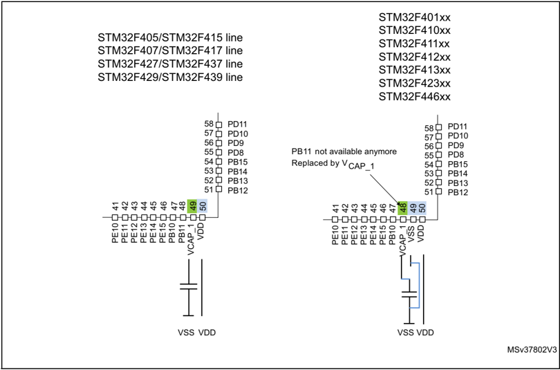

Figure 2. Compatible board design for LQFP64 package

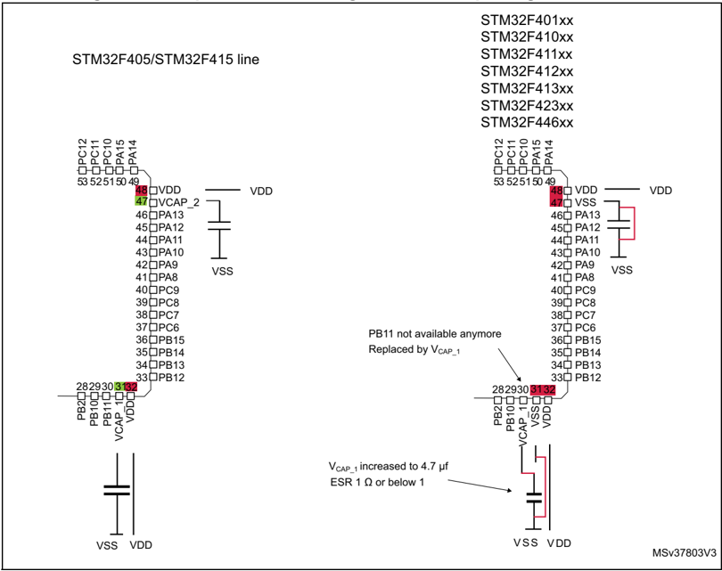

57

Figure 3. STM32F411xC/xE block diagram

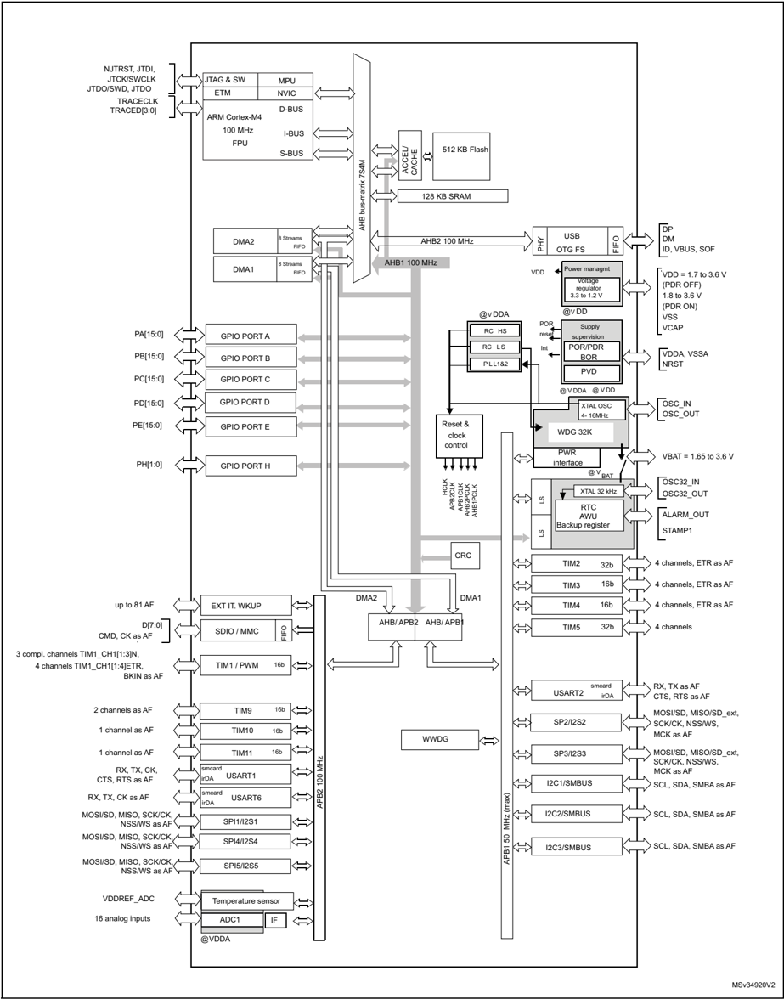

1. The timers connected to APB2 are clocked from TIMxCLK up to 100 MHz, while the timers connected to APB1 are clocked from TIMxCLK up to 100 MHz.

## 3 Functional overview

## 3.1 Arm ®  Cortex ® -M4 with FPU core with embedded flash memory and SRAM

The Arm ® Cortex ® -M4 with FPU processor is the latest generation of Arm processors for embedded systems. It was developed to provide a low-cost platform that meets the needs of MCU implementation, with a reduced pin count and low-power consumption, while delivering outstanding computational performance and an advanced response to interrupts.

The Arm ® Cortex ® -M4 with FPU 32-bit RISC processor features exceptional codeefficiency, delivering the high-performance expected from an Arm core in the memory size usually associated with 8- and 16-bit devices. The processor supports a set of DSP instructions, which allow efficient signal processing and complex algorithm execution. Its single precision FPU (floating-point unit) speeds up software development by using metalanguage development tools, while avoiding saturation.

The STM32F411xC/xE devices are compatible with all Arm tools and software.

Figure 3 shows the general block diagram of the STM32F411xC/xE.

® ®

Note: Cortex -M4 with FPU is binary compatible with Cortex -M3.

## 3.2 Adaptive real-time memory accelerator (ART Accelerator)

The ART Accelerator is a memory accelerator, which is optimized for STM32 industrystandard Arm ®  Cortex ® -M4 with FPU processors. It balances the inherent performance advantage of the Arm ® Cortex ® -M4 with FPU over flash memory technologies, which normally requires the processor to wait for the flash memory at higher frequencies.

To release the processor full 105 DMIPS performance at this frequency, the accelerator implements an instruction prefetch queue and branch cache, which increases program execution speed from the -bit flash memory. Based on CoreMark benchmark, the performance achieved thanks to the ART Accelerator is equivalent to 0 wait state program execution from flash memory at a CPU frequency up to 100 MHz.

## 3.3 Batch acquisition mode (BAM)

The batch acquisition mode allows enhanced power efficiency during data batching. It enables data acquisition through any communication peripherals directly to memory using the DMA in reduced power consumption as well as data processing while the rest of the system is in low-power mode (including the flash and ART). For example in an audio system, a smart combination of PDM audio sample acquisition and processing from the I2S directly to RAM (flash and ART™ stopped) with the DMA using BAM followed by some very short processing from flash allows to drastically reduce the power consumption of the application. A dedicated application note (AN4515) describes how to implement the BAM to allow the best power efficiency.

57

## 3.4 Memory protection unit

The memory protection unit (MPU) is used to manage the CPU accesses to memory to prevent one task to accidentally corrupt the memory or resources used by any other active task. This memory area is organized into up to eight protected areas that can in turn be divided up into eight subareas. The protection area sizes are between 32 bytes and the whole 4 gigabytes of addressable memory.

The MPU is especially helpful for applications where some critical or certified code has to be protected against the misbehavior of other tasks. It is usually managed by an RTOS (realtime operating system). If a program accesses a memory location that is prohibited by the MPU, the RTOS can detect it and take action. In an RTOS environment, the kernel can dynamically update the MPU area setting, based on the process to be executed.

The MPU is optional and can be bypassed for applications that do not need it.

## 3.5 Embedded flash memory

The devices embed up to 512 Kbytes of flash memory available for storing programs and data.

To optimize the power consumption the flash memory can also be switched off in Run or in Sleep mode (see Section 3.18: Low-power modes ). Two modes are available: Flash in Stop mode or in DeepSleep mode (trade off between power saving and startup time, see Table 34: Low-power mode wakeup timings (1) ). Before disabling the flash memory, the code must be executed from the internal RAM. One-time programmable bytes

A one-time programmable area is available with 16 OTP blocks of 32 bytes. Each block can be individually locked.

(Additional information can be found in the product reference manual.)

## 3.6 CRC (cyclic redundancy check) calculation unit

The CRC (cyclic redundancy check) calculation unit is used to get a CRC code from a 32-bit data word and a fixed generator polynomial.

Among other applications, CRC-based techniques are used to verify data transmission or storage integrity. In the scope of the EN/IEC 60335-1 standard, they offer a means of verifying the flash memory integrity. The CRC calculation unit helps compute a software signature during runtime, to be compared with a reference signature generated at link-time and stored at a given memory location.

## 3.7 Embedded SRAM

All devices embed:

- 128 Kbytes of system SRAM, which can be accessed (read/write) at CPU clock speed with 0 wait states

## 3.8 Multi-AHB bus matrix

The 32-bit multi-AHB bus matrix interconnects all the masters (CPU, DMAs) and the slaves (flash memory, RAM, AHB and APB peripherals) and ensures a seamless and efficient operation even when several high-speed peripherals work simultaneously.

Figure 4. Multi-AHB matrix

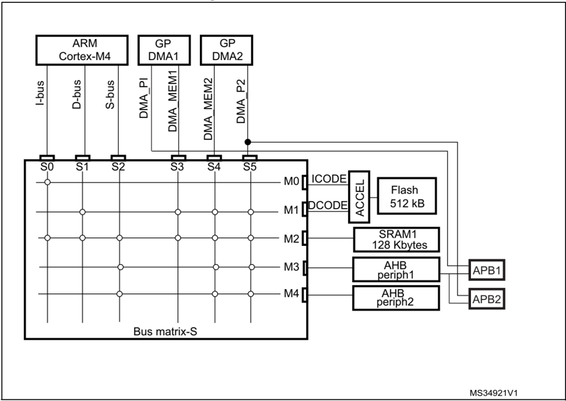

## 3.9 DMA controller (DMA)

The devices feature two general-purpose dual-port DMAs (DMA1 and DMA2) with 8 streams each. They are able to manage memory-to-memory, peripheral-to-memory, and memory-to-peripheral transfers. They feature dedicated FIFOs for APB/AHB peripherals, support burst transfer and are designed to provide the maximum peripheral bandwidth (AHB/APB).

The two DMA controllers support circular buffer management, so that no specific code is needed when the controller reaches the end of the buffer. The two DMA controllers also have a double buffering feature, which automates the use and switching of two memory buffers without requiring any special code.

Each stream is connected to dedicated hardware DMA requests, with support for software trigger on each stream. Configuration is made by software and transfer sizes between source and destination are independent.

57

The DMA can be used with the main peripherals:

- SPI and I 2 S
- I 2 C
- USART
- General-purpose, basic and advanced-control timers TIMx
- SD/SDIO/MMC/eMMC host interface
- ADC

## 3.10 Nested vectored interrupt controller (NVIC)

The devices embed a nested vectored interrupt controller able to manage 16 priority levels, and handle up to 62 maskable interrupt channels plus the 16 interrupt lines of the Cortex ® -M4 with FPU.

- Closely coupled NVIC gives low-latency interrupt processing
- Interrupt entry vector table address passed directly to the core
- Allows early processing of interrupts
- Processing of late arriving, higher-priority interrupts
- Support tail chaining
- Processor state automatically saved
- Interrupt entry restored on interrupt exit with no instruction overhead

This hardware block provides flexible interrupt management features with minimum interrupt latency.

## 3.11 External interrupt/event controller (EXTI)

The external interrupt/event controller consists of 21 edge-detector lines used to generate interrupt/event requests. Each line can be independently configured to select the trigger event (rising edge, falling edge, both) and can be masked independently. A pending register maintains the status of the interrupt requests. The EXTI can detect an external line with a pulse width shorter than the Internal APB2 clock period. Up to 81 GPIOs can be connected to the 16 external interrupt lines.

## 3.12 Clocks and startup

On reset the 16 MHz internal RC oscillator is selected as the default CPU clock. The 16 MHz internal RC oscillator is factory-trimmed to offer 1% accuracy at 25 °C. The application can then select as system clock either the RC oscillator or an external 4-26 MHz clock source. This clock can be monitored for failure. If a failure is detected, the system automatically switches back to the internal RC oscillator and a software interrupt is generated (if enabled). This clock source is input to a PLL thus allowing to increase the frequency up to 100 MHz. Similarly, full interrupt management of the PLL clock entry is available when necessary (for example if an indirectly used external oscillator fails).

Several prescalers allow the configuration of the two AHB buses, the high-speed APB (APB2) and the low-speed APB (APB1) domains. The maximum frequency of the two AHB

buses is 100 MHz while the maximum frequency of the high-speed APB domains is 100 MHz. The maximum allowed frequency of the low-speed APB domain is 50 MHz.

The devices embed a dedicated PLL (PLLI2S), which allows to achieve audio class performance. In this case, the I 2 S master clock can generate all standard sampling frequencies from 8 kHz to 192 kHz.

## 3.13 Boot modes

At startup, boot pins are used to select one out of three boot options:

- Boot from user flash memory
- Boot from system memory
- Boot from embedded SRAM

The bootloader is located in system memory. It is used to reprogram the flash memory by using USART1(PA9/10), USART2(PD5/6), USB OTG FS in device mode (PA11/12) through DFU (device firmware upgrade), I2C1(PB6/7), I2C2(PB10/3), I2C3(PA8/PB4), SPI1(PA4/5/6/7), SPI2(PB12/13/14/15) or SPI3(PA15, PC10/11/12).

For more detailed information on the bootloader, refer to Application Note: AN2606, STM32 microcontroller system memory boot mode .

## 3.14 Power supply schemes

- VDD = 1.7 to 3.6 V: external power supply for I/Os with the internal supervisor (POR/PDR) disabled, provided externally through VDD pins. Requires the use of an external power supply supervisor connected to the VDD and NRST pins.
- VSSA , V DDA  = 1.7 to 3.6 V: external analog power supplies for ADC, Reset blocks, RCs, and PLL. V DDA  and V SSA  must be connected to V DD  and V SS , respectively, with decoupling technique.
- VBAT  = 1.65 to 3.6 V: power supply for RTC, external clock 32 kHz oscillator and backup registers (through power switch) when V DD  is not present.

Refer to Figure 17: Power supply scheme for more details.

57

## 3.15 Power supply supervisor

## 3.15.1 Internal reset ON

This feature is available for V DD  operating voltage range 1.8 V to 3.6 V.

The internal power supply supervisor is enabled by holding PDR\_ON high.

The devices have an integrated power-on reset (POR) / power-down reset (PDR) circuitry coupled with a brownout reset (BOR) circuitry. At power-on, POR is always active, and ensures proper operation starting from 1.8 V. After the 1.8 V POR threshold level is reached, the option byte loading process starts, either to confirm or modify default thresholds, or to disable BOR permanently. Three BOR thresholds are available through option bytes.

The devices remain in reset mode when V DD  is below a specified threshold, VPOR/PDR, or VBOR , without the need for an external reset circuit.

The devices also feature an embedded programmable voltage detector (PVD) that monitors the V DD /V DDA  power supply and compares it to the V PVD  threshold. An interrupt can be generated when V DD /V DDA  drops below the V PVD  threshold and/or when V DD /V DDA  is higher than the V PVD  threshold. The interrupt service routine can then generate a warning message and/or put the MCU into a safe state. The PVD is enabled by software.

## 3.15.2 Internal reset OFF

This feature is available only on packages featuring the PDR\_ON pin. The internal power-on reset (POR) / power-down reset (PDR) circuitry is disabled by setting the PDR\_ON pin to low.

An external power supply supervisor should monitor V DD  and should set the device in reset mode when V DD  is below 1.7 V. NRST should be connected to this external power supply supervisor. Refer to Figure 5 .

Figure 5. Power supply supervisor interconnection with internal reset OFF (1)

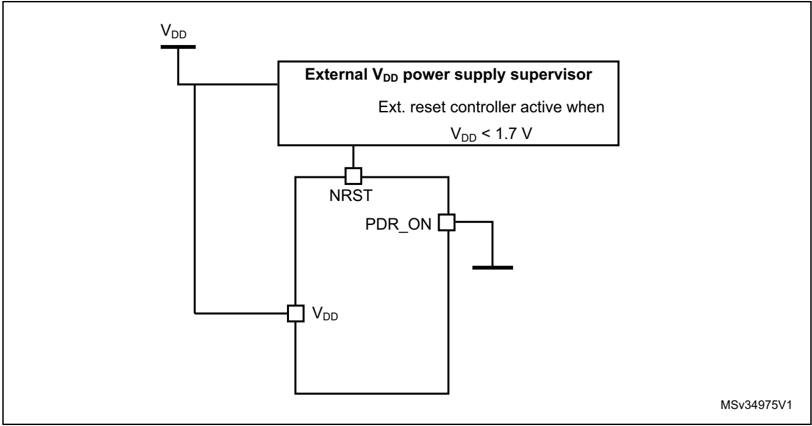

1. The PRD\_ON pin is only available on the WLCSP49 and UFBGA100 packages.

A comprehensive set of power-saving mode allows to design low-power applications.

When the internal reset is OFF, the following integrated features are no longer supported:

- The integrated power-on reset (POR) / power-down reset (PDR) circuitry is disabled.
- The brownout reset (BOR) circuitry must be disabled.
- The embedded programmable voltage detector (PVD) is disabled.
- VBAT  functionality is no more available and the VBAT pin should be connected to V DD .

## 3.16 Voltage regulator

The regulator has four operating modes:

- Regulator ON
- -Main regulator mode (MR)
- -Low power regulator (LPR)
- -Power-down
- Regulator OFF

## 3.16.1 Regulator ON

On packages embedding the BYPASS\_REG pin, the regulator is enabled by holding BYPASS\_REG low. On all other packages, the regulator is always enabled.

There are three power modes configured by software when the regulator is ON:

- MR is used in the nominal regulation mode (With different voltage scaling in Run) In Main regulator mode (MR mode), different voltage scaling are provided to reach the best compromise between maximum frequency and dynamic power consumption.
- LPR is used in the Stop modes The LP regulator mode is configured by software when entering Stop mode.
- Power-down is used in Standby mode.

The Power-down mode is activated only when entering in Standby mode. The regulator output is in high impedance and the kernel circuitry is powered down, inducing zero consumption. The contents of the registers and SRAM are lost.

Depending on the package, one or two external ceramic capacitors should be connected on the V CAP\_1  and V CAP\_2  pins. The V CAP\_2  pin is only available for the LQFP100 and UFBGA100 packages.

All packages have the regulator ON feature.

## 3.16.2 Regulator OFF

The Regulator OFF is available only on the UFBGA100, which features the BYPASS\_REG pin. The regulator is disabled by holding BYPASS\_REG high. The regulator OFF mode allows to supply externally a V12 voltage source through V CAP\_1  and V CAP\_2  pins.

Since the internal voltage scaling is not managed internally, the external voltage value must be aligned with the targeted maximum frequency. Refer to Table 14: General operating conditions .

The two 2.2 µF V CAP ceramic capacitors should be replaced by two 100 nF decoupling capacitors. Refer to Figure 17: Power supply scheme .

57

When the regulator is OFF, there is no more internal monitoring on V12. An external power supply supervisor should be used to monitor the V12 of the logic power domain. PA0 pin should be used for this purpose, and act as a power-on reset on the V12 power domain.

In regulator OFF mode, the following features are no more supported:

- PA0 cannot be used as a GPIO pin since it allows to reset a part of the V12 logic power domain, which is not reset by the NRST pin.
- As long as PA0 is kept low, the debug mode cannot be used under power-on reset. As a consequence, PA0 and NRST pins must be managed separately if the debug connection under reset or prereset is required.

Figure 6. Regulator OFF

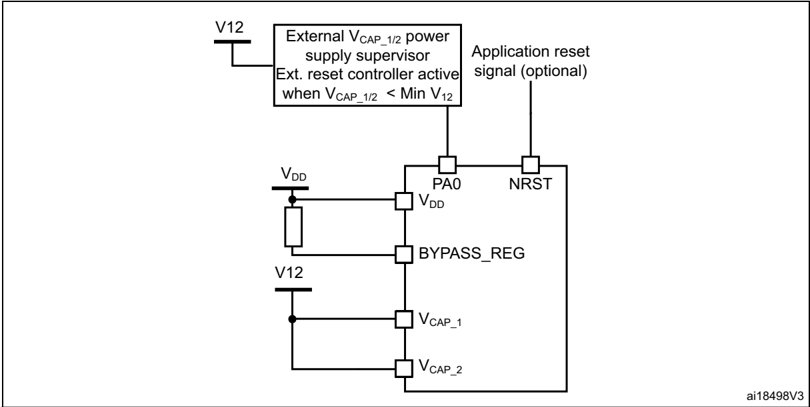

The following conditions must be respected:

- VDD  should always be higher than V CAP\_1  and V CAP\_2  to avoid current injection between power domains.
- If the time for V CAP\_1  and V CAP\_2  to reach V 12  minimum value is faster than the time for VDD  to reach 1.7 V, then PA0 should be kept low to cover both conditions: until V CAP\_1 and V CAP\_2  reach V 12  minimum value and until V DD  reaches 1.7 V (see Figure 7 ).
- Otherwise, if the time for V CAP\_1  and V CAP\_2  to reach the V 12  minimum value is slower than the time for V DD  to reach 1.7 V, then PA0 could be asserted low externally (see Figure 8 ).
- If V CAP\_1  and V CAP\_2  go below V 12  minimum value and V DD  is higher than 1.7 V, then a reset must be asserted on PA0 pin.

Note: The minimum value of V 12  depends on the maximum frequency targeted in the application

Figure 7. Startup in regulator OFF: slow V DD  slope power-down reset risen after V CAP\_1 /V CAP\_2  stabilization

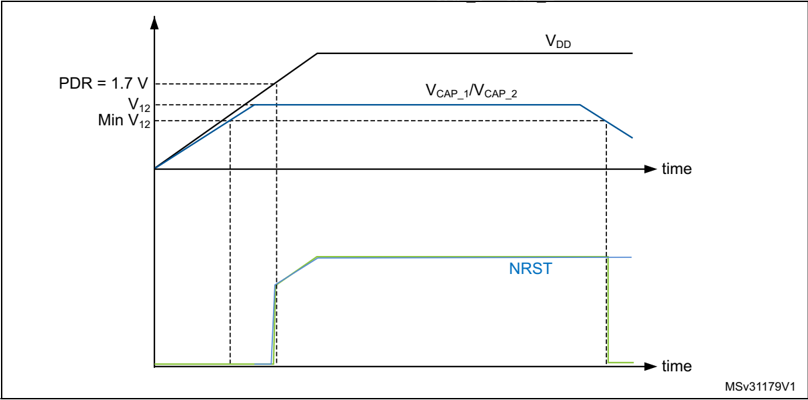

1. This figure is valid whatever the internal reset mode (ON or OFF).
1. This figure is valid whatever the internal reset mode (ON or OFF).

Figure 8. Startup in regulator OFF mode: fast V DD  slope power-down reset risen before V CAP\_1 /V CAP\_2  stabilization

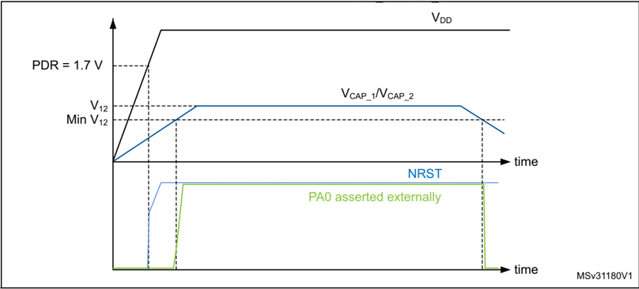

57

## 3.16.3 Regulator ON/OFF and internal power supply supervisor availability

Table 3. Regulator ON/OFF and internal power supply supervisor availability

| Package   | Regulator ON              | Regulator OFF             | Power supply supervisor ON   | Power supply supervisor OFF     |
|-----------|---------------------------|---------------------------|------------------------------|---------------------------------|
| UFQFPN48  | Yes                       | No                        | Yes                          | No                              |
| WLCSP49   | Yes                       | No                        | Yes PDR_ON set to VDD        | Yes PDR_ON external control (1) |
| LQFP64    | Yes                       | No                        | Yes                          | No                              |
| LQFP100   | Yes                       | No                        | Yes                          | No                              |
| UFBGA100  | Yes BYPASS_REG set to VSS | Yes BYPASS_REG set to VDD | Yes PDR_ON set to VDD        | Yes PDR_ON external control (1) |

1. Refer to Section 3.15: Power supply supervisor

## 3.17 Real-time clock (RTC) and backup registers

The backup domain includes:

- The real-time clock (RTC)
- 20 backup registers

The real-time clock (RTC) is an independent BCD timer/counter. Dedicated registers contain the second, minute, hour (in 12/24 hour), week day, date, month, year, in BCD (binarycoded decimal) format. Correction for 28 th , 29 th (leap year), 30 th , and 31 st  day of the month are performed automatically. The RTC features a reference clock detection, a more precise second source clock (50 or 60 Hz) can be used to enhance the calendar precision. The RTC provides a programmable alarm and programmable periodic interrupts with wakeup from Stop and Standby modes. The subseconds value is also available in binary format.

It is clocked by a 32.768 kHz external crystal, resonator or oscillator, the internal low-power RC oscillator or the high-speed external clock divided by 128. The internal low-speed RC has a typical frequency of 32 kHz. The RTC can be calibrated using an external 512 Hz output to compensate for any natural quartz deviation.

Two alarm registers are used to generate an alarm at a specific time and calendar fields can be independently masked for alarm comparison. To generate a periodic interrupt, a 16-bit programmable binary autoreload downcounter with programmable resolution is available and allows automatic wakeup and periodic alarms from every 120 µs to every 36 hours.

A 20-bit prescaler is used for the time base clock. It is by default configured to generate a time base of 1 second from a clock at 32.768 kHz.

The backup registers are 32-bit registers used to store 80 bytes of user application data when V DD  power is not present. Backup registers are not reset by a system, a power reset, or when the device wakes up from the Standby mode (see Section 3.18 ).

Additional 32-bit registers contain the programmable alarm subseconds, seconds, minutes, hours, day, and date.

The RTC and backup registers are supplied through a switch that is powered either from the VDD  supply when present or from the V BAT  pin.

## 3.18 Low-power modes

The devices support three low-power modes to achieve the best compromise between low power consumption, short startup time and available wakeup sources:

## · Sleep mode

In Sleep mode, only the CPU is stopped. All peripherals continue to operate and can wake up the CPU when an interrupt/event occurs.

To further reduce the power consumption, the flash memory can be switched off before entering in Sleep mode. Note that this requires a code execution from the RAM.

- Stop mode

The Stop mode achieves the lowest power consumption while retaining the contents of SRAM and registers. All clocks in the 1.2 V domain are stopped, the PLL, the HSI RC and the HSE crystal oscillators are disabled. The voltage regulator can also be put either in normal or in low-power mode.

The devices can be woken up from the Stop mode by any of the EXTI lines (the EXTI line source can be one of the 16 external lines, the PVD output, the RTC alarm/ wakeup/ tamper/ time stamp events).

- Standby mode

The Standby mode is used to achieve the lowest power consumption. The internal voltage regulator is switched off so that the entire 1.2 V domain is powered off. The PLL, the HSI RC and the HSE crystal oscillators are also switched off. After entering Standby mode, the SRAM and register contents are lost except for registers in the backup domain when selected.

The devices exit the Standby mode when an external reset (NRST pin), an IWDG reset, a rising edge on the WKUP pin, or an RTC alarm/ wakeup/ tamper/time stamp event occurs.

Standby mode is not supported when the embedded voltage regulator is bypassed and the 1.2 V domain is controlled by an external power.

## 3.19 VBAT  operation

The VBAT pin allows to power the device V BAT  domain from an external battery, an external super-capacitor, or from V DD  when no external battery and an external super-capacitor are present.

VBAT  operation is activated when V DD  is not present.

The VBAT pin supplies the RTC and the backup registers.

When the microcontroller is supplied from VBAT, external interrupts and RTC alarm/events do not exit it from V BAT  operation. When PDR\_ON pin is not connected to V DD  (internal Reset OFF), the V BAT  functionality is no more available and VBAT pin should be connected to V DD .

Note:

57

## 3.20 Timers and watchdogs

The devices embed one advanced-control timer, seven general-purpose timers, and two watchdog timers.

All timer counters can be frozen in debug mode.

Table 4 compares the features of the advanced-control and general-purpose timers.

Table 4. Timer feature comparison

| Timer type        | Timer        | Counter resolution   | Counter type      | Prescaler factor                | DMA request generation   |   Capture/ compare channels | Complemen- tary output   |   Max. interface clock (MHz) |   Max. timer clock (MHz) |
|-------------------|--------------|----------------------|-------------------|---------------------------------|--------------------------|-----------------------------|--------------------------|------------------------------|--------------------------|
| Advanced -control | TIM1         | 16-bit               | Up, Down, Up/down | Any integer between 1 and 65536 | Yes                      |                           4 | Yes                      |                          100 |                      100 |
| General purpose   | TIM2, TIM5   | 32-bit               | Up, Down, Up/down | Any integer between 1 and 65536 | Yes                      |                           4 | No                       |                           50 |                      100 |
| General purpose   | TIM3, TIM4   | 16-bit               | Up, Down, Up/down | Any integer between 1 and 65536 | Yes                      |                           4 | No                       |                           50 |                      100 |
| General purpose   | TIM9         | 16-bit               | Up                | Any integer between 1 and 65536 | No                       |                           2 | No                       |                          100 |                      100 |
| General purpose   | TIM10, TIM11 | 16-bit               | Up                | Any integer between 1 and 65536 | No                       |                           1 | No                       |                          100 |                      100 |

## 3.20.1 Advanced-control timers (TIM1)

The advanced-control timer (TIM1) can be seen as three-phase PWM generators multiplexed on four independent channels. It has complementary PWM outputs with programmable inserted dead times. It can also be considered as a complete generalpurpose timer. Its four independent channels can be used for:

- Input capture
- Output compare
- PWM generation (edge- or center-aligned modes)
- One-pulse mode output

If configured as a standard 16-bit timers, it has the same features as the general-purpose TIMx timers. If configured as a 16-bit PWM generator, it has full modulation capability (0-100%).

The advanced-control timer can work together with the TIMx timers via the Timer Link feature for synchronization or event chaining.

TIM1 supports independent DMA request generation.

## 3.20.2 General-purpose timers (TIMx)

There are seven synchronizable general-purpose timers embedded in the STM32F411xC/xE (see Table 4 for differences).

## · TIM2, TIM3, TIM4, TIM5

The STM32F411xC/xE devices are 4 full-featured general-purpose timers: TIM2, TIM5, TIM3, and TIM4.The TIM2 and TIM5 timers are based on a 32-bit autoreload up/downcounter and a 16-bit prescaler. The TIM3 and TIM4 timers are based on a 16bit autoreload up/downcounter and a 16-bit prescaler. They all feature four independent channels for input capture/output compare, PWM or one-pulse mode output. This gives up to 15 input capture/output compare/PWMs.

The TIM2, TIM3, TIM4, TIM5 general-purpose timers can work together, or with the other general-purpose timers and the advanced-control timer TIM1 via the timer Link feature for synchronization or event chaining.

Any of these general-purpose timers can be used to generate PWM outputs.

TIM2, TIM3, TIM4, TIM5 all have independent DMA request generation. They are capable of handling quadrature (incremental) encoder signals and the digital outputs from 1 to 4 hall-effect sensors.

## · TIM9, TIM10, and TIM11

These timers are based on a 16-bit autoreload upcounter and a 16-bit prescaler. TIM10 and TIM11 feature one independent channel, whereas TIM9 has two independent channels for input capture/output compare, PWM or one-pulse mode output. They can be synchronized with the TIM2, TIM3, TIM4, TIM5 full-featured general-purpose timers. They can also be used as simple time bases.

## 3.20.3 Independent watchdog

The independent watchdog is based on a 12-bit downcounter and 8-bit prescaler. It is clocked from an independent 32 kHz internal RC and as it operates independently from the main clock, it can operate in Stop and Standby modes. It can be used either as a watchdog to reset the device when a problem occurs, or as a free-running timer for application timeout management. It is hardware- or software-configurable through the option bytes.

## 3.20.4 Window watchdog

The window watchdog is based on a 7-bit downcounter that can be set as free-running. It can be used as a watchdog to reset the device when a problem occurs. It is clocked from the main clock. It has an early warning interrupt capability and the counter can be frozen in debug mode.

57

## 3.20.5 SysTick timer

This timer is dedicated to real-time operating systems, but could also be used as a standard downcounter. It features:

- A 24-bit downcounter
- Auto reload capability
- Maskable system interrupt generation when the counter reaches 0
- Programmable clock source.

## 3.21 Inter-integrated circuit interface (I 2 C)

Up to three I 2 C bus interfaces can operate in multimaster and slave modes. They can support the standard (up to 100 kHz) and fast (up to 400 kHz) modes. The I2C bus frequency can be increased up to 1 MHz. For more details about the complete solution, please contact your local ST sales representative. They also support the 7/10-bit addressing mode and the 7-bit dual addressing mode (as slave). A hardware CRC generation/verification is embedded.

They can be served by DMA and they support SMBus 2.0/PMBus.

The devices also include programmable analog and digital noise filters (see Table 5 ).

Table 5. Comparison of I2C analog and digital filters

| -                                | Analog filter   | Digital filter                                         |
|----------------------------------|-----------------|--------------------------------------------------------|
| Pulse width of suppressed spikes | ≥ 50 ns         | Programmable length from 1 to 15 I2C peripheral clocks |

## 3.22 Universal synchronous/asynchronous receiver transmitters (USART)

The devices embed three universal synchronous/asynchronous receiver transmitters (USART1, USART2, and USART6).

These three interfaces provide asynchronous communication, IrDA SIR ENDEC support, multiprocessor communication mode, single-wire half-duplex communication mode and have LIN Master/Slave capability. The USART1 and USART6 interfaces are able to communicate at speeds of up to 12.5 Mbit/s. The USART2 interface communicates at up to 6.25 bit/s.

USART1 and USART2 also provide hardware management of the CTS and RTS signals, smartcard mode (ISO 7816 compliant) and SPI-like communication capability. All interfaces can be served by the DMA controller.

Table 6. USART feature comparison

| USART name   | Standard features   | Modem (RTS/CTS)   | LIN   | SPI master   | irDA   | Smartcard (ISO 7816)   |   Max. baud rate in Mbit/s (oversampling by 16) |   Max. baud rate in Mbit/s (oversampling by 8) | APB mapping         |
|--------------|---------------------|-------------------|-------|--------------|--------|------------------------|-------------------------------------------------|------------------------------------------------|---------------------|
| USART1       | X                   | X                 | X     | X            | X      | X                      |                                            6.25 |                                           12.5 | APB2 (max. 100 MHz) |
| USART2       | X                   | X                 | X     | X            | X      | X                      |                                            3.12 |                                           6.25 | APB1 (max. 50 MHz)  |
| USART6       | X                   | N.A               | X     | X            | X      | X                      |                                            6.25 |                                           12.5 | APB2 (max. 100 MHz) |

## 3.23 Serial peripheral interface (SPI)

The devices feature five SPIs in slave and master modes in full-duplex and simplex communication modes. SPI1, SPI4, and SPI5 can communicate at up to 50 Mbit/s, SPI2 and SPI3 can communicate at up to 25 Mbit/s. The 3-bit prescaler gives 8 master mode frequencies and the frame is configurable to 8 bits or 16 bits. The hardware CRC generation/verification supports basic SD Card/MMC modes. All SPIs can be served by the DMA controller.

The SPI interface can be configured to operate in TI mode for communications in master mode and slave mode.

## 3.24 Inter-integrated sound (I 2 S)

Five standard I 2 S interfaces (multiplexed with SPI1 to SPI5) are available. They can be operated in master or slave mode, in simplex communication modes and full duplex for I2S2 and I2S3 and can be configured to operate with a 16-/32-bit resolution as an input or output channel. All the I2Sx audio sampling frequencies from 8 kHz up to 192 kHz are supported. When either or both of the I 2 S interfaces is/are configured in master mode, the master clock can be output to the external DAC/CODEC at 256 times the sampling frequency.

All I 2 Sx can be served by the DMA controller.

## 3.25 Audio PLL (PLLI2S)

The devices feature an additional dedicated PLL for audio I 2 S application, making it possible to achieve error-free I 2 S sampling clock accuracy without compromising on the CPU performance.

The PLLI2S configuration can be modified to manage an I 2 S sample rate change without disabling the main PLL (PLL) used for the CPU.

The audio PLL can be programmed with very low error to obtain sampling rates ranging from 8 kHz to 192 kHz.

57

In addition to the audio PLL, a master clock input pin can be used to synchronize the I2S flow with an external PLL (or Codec output).

## 3.26 Secure digital input/output interface (SDIO)

An SD/SDIO/MMC/eMMC host interface is available that supports MultiMediaCard System Specification Version 4.2 in three different databus modes: 1-bit (default), 4-bit and 8-bit.

The interface allows data transfer at up to 50 MHz, and is compliant with the SD memory card specification version 2.0.

The SDIO Card Specification Version 2.0 is also supported with two different databus modes: 1-bit (default) and 4-bit.

The current version supports only one SD/SDIO/MMC4.2 card at any one time and a stack of MMC4.1 or previous.

In addition to SD/SDIO/MMC/eMMC, this interface is fully compliant with the CE-ATA digital protocol Rev1.1.

## 3.27 Universal serial bus on-the-go full-speed (OTG\_FS)

The devices embed a USB OTG full-speed device/host/OTG peripheral with integrated transceivers. The USB OTG FS peripheral is compliant with the USB 2.0 specification and with the OTG 1.0 specification. It has software-configurable endpoint setting and supports suspend/resume. The USB OTG full-speed controller requires a dedicated 48 MHz clock that is generated by a PLL connected to the HSE oscillator. The major features are:

- Combined Rx and Tx FIFO size of 320 × 35 bits with dynamic FIFO sizing
- Supports the session request protocol (SRP) and host negotiation protocol (HNP)
- 4 bidirectional endpoints
- 8 host channels with periodic OUT support
- HNP/SNP/IP inside (no need for any external resistor)
- For OTG/Host modes, a power switch is needed in case bus-powered devices are connected

## 3.28 General-purpose input/outputs (GPIOs)

Each of the GPIO pins can be configured by software as output (push-pull or open-drain, with or without pull-up or pull-down), as input (floating, with or without pull-up or pull-down) or as peripheral alternate function. Most of the GPIO pins are shared with digital or analog alternate functions. All GPIOs are high-current-capable and have speed selection to better manage internal noise, power consumption and electromagnetic emission.

The I/O configuration can be locked if needed by following a specific sequence to avoid spurious writing to the I/Os registers.

Fast I/O handling allowing maximum I/O toggling up to 100 MHz.

## 3.29 Analog-to-digital converter (ADC)

One 12-bit analog-to-digital converter is embedded and shares up to 16 external channels, performing conversions in the single-shot or scan mode. In scan mode, automatic conversion is performed on a selected group of analog inputs.

The ADC can be served by the DMA controller. An analog watchdog feature allows very precise monitoring of the converted voltage of one, some or all selected channels. An interrupt is generated when the converted voltage is outside the programmed thresholds.

To synchronize A/D conversion and timers, the ADCs could be triggered by any of the TIM1, TIM2, TIM3, TIM4, or TIM5 timer.

## 3.30 Temperature sensor

The temperature sensor has to generate a voltage that varies linearly with temperature. The conversion range is between 1.7 V and 3.6 V. The temperature sensor is internally connected to the ADC\_IN18 input channel, which is used to convert the sensor output voltage into a digital value. Refer to the reference manual for additional information.

As the offset of the temperature sensor varies from chip to chip due to process variation, the internal temperature sensor is mainly suitable for applications that detect temperature changes instead of absolute temperatures. If an accurate temperature reading is needed, then an external temperature sensor part should be used.

## 3.31 Serial wire JTAG debug port (SWJ-DP)

The Arm SWJ-DP interface is embedded, and is a combined JTAG and serial wire debug port that enables either a serial wire debug or a JTAG probe to be connected to the target.

Debug is performed using 2 pins only instead of the five reuse as GPIO with the alternate function): the JTAG TMS and TCK pins are shared with SWDIO and SWCLK, respectively, and a specific sequence on the TMS pin is used to switch between JTAG-DP and SW-DP.

## 3.32 Embedded Trace Macrocell™

The Arm Embedded Trace Macrocell provides a greater visibility of the instruction and data flow inside the CPU core by streaming compressed data at a very high rate from the STM32F411xC/xE through a small number of ETM pins to an external hardware trace port analyzer (TPA) device. The TPA is connected to a host computer using any high-speed channel available. Real-time instruction and data flow activity can be recorded and then formatted for display on the host computer that runs the debugger software. TPA hardware is commercially available from common development tool vendors.

The Embedded Trace Macrocell operates with third party debugger software tools.

57

## 4 Pinouts and pin description

Figure 9. STM32F411xC/xE WLCSP49 pinout

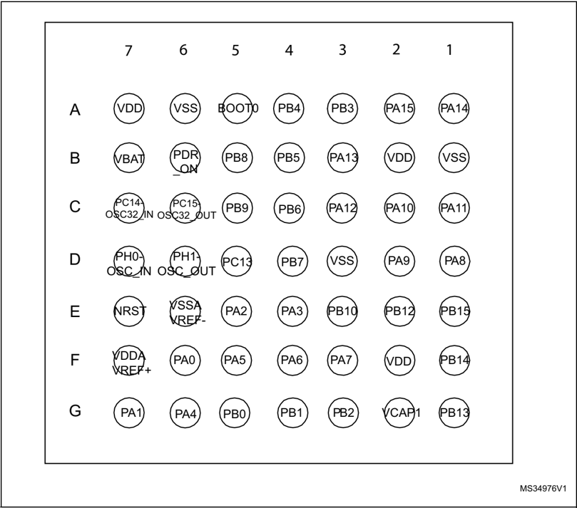

1. The above figure shows the package bump side.

Figure 10. STM32F411xC/xE UFQFPN48 pinout

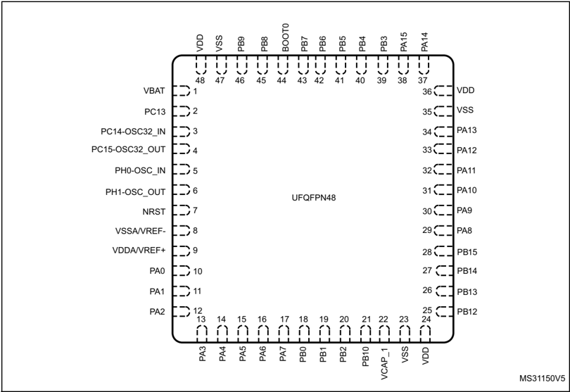

1. The above figure shows the package top view.

57

Figure 11. STM32F411xC/xE LQFP64 pinout

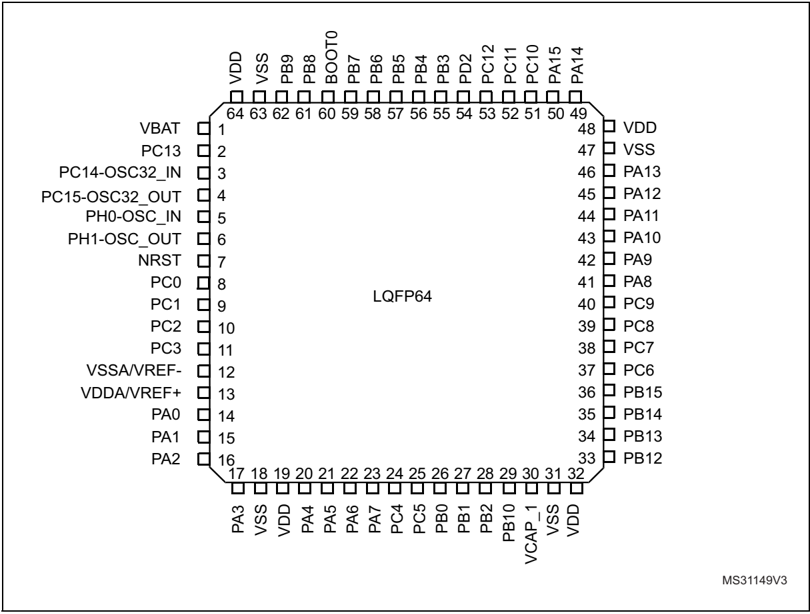

Figure 12. STM32F411xC/xE LQFP100 pinout

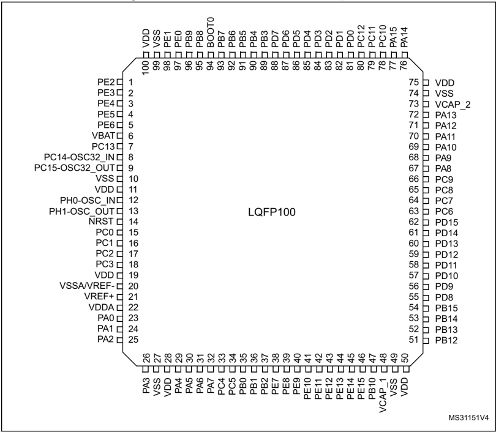

1. The above figure shows the package top view.

57

Figure 13. STM32F411xC/xE UFBGA100 pinout

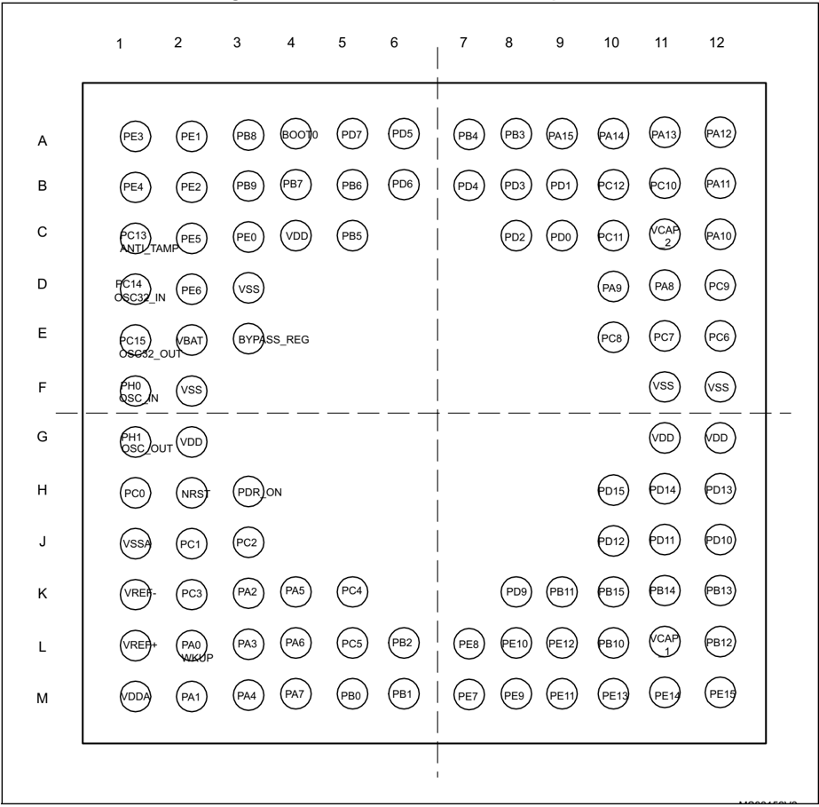

1. This figure shows the package top view

06     9

Table 7. Legend/abbreviations used in the pinout table

| Name                 | Abbreviation                                                                                                                          | Definition                                                                                                                            |
|----------------------|---------------------------------------------------------------------------------------------------------------------------------------|---------------------------------------------------------------------------------------------------------------------------------------|
| Pin name             | Unless otherwise specified in brackets below the pin name, the pin function during and after reset is the same as the actual pin name | Unless otherwise specified in brackets below the pin name, the pin function during and after reset is the same as the actual pin name |
| Pin type             | S                                                                                                                                     | Supply pin                                                                                                                            |
| Pin type             | I                                                                                                                                     | Input only pin                                                                                                                        |
| Pin type             | I/O                                                                                                                                   | Input/ output pin                                                                                                                     |
| I/O structure        | FT                                                                                                                                    | 5 V tolerant I/O                                                                                                                      |
| I/O structure        | TC                                                                                                                                    | Standard 3.3 V I/O                                                                                                                    |
| I/O structure        | B                                                                                                                                     | Dedicated BOOT0 pin                                                                                                                   |
| I/O structure        | NRST                                                                                                                                  | Bidirectional reset pin with embedded weak pull-up resistor                                                                           |
| Notes                | Unless otherwise specified by a note, all I/Os are set as floating inputs during and after reset                                      | Unless otherwise specified by a note, all I/Os are set as floating inputs during and after reset                                      |
| Alternate functions  | Functions selected through GPIOx_AFR registers                                                                                        | Functions selected through GPIOx_AFR registers                                                                                        |
| Additional functions | Functions directly selected/enabled through peripheral registers                                                                      | Functions directly selected/enabled through peripheral registers                                                                      |

Table 8. STM32F411xC/xE pin definitions

| Pin number   | Pin number   | Pin number   | Pin number   | Pin number   |                                     |          |               |       |                                                        |                      |
|--------------|--------------|--------------|--------------|--------------|-------------------------------------|----------|---------------|-------|--------------------------------------------------------|----------------------|
| UFQFPN48     | LQFP64       | WLCSP49      | LQFP100      | UFBGA100     | Pin name (function after reset) (1) | Pin type | I/O structure | Notes | Alternate functions                                    | Additional functions |
| -            | -            | -            | 1            | B2           | PE2                                 | I/O      | FT            | -     | TRACECLK, SPI4_SCK/I2S4_CK, SPI5_SCK/I2S5_CK, EVENTOUT | -                    |
| -            | -            | -            | 2            | A1           | PE3                                 | I/O      | FT            | -     | TRACED0, EVENTOUT                                      | -                    |
| -            | -            | -            | 3            | B1           | PE4                                 | I/O      | FT            | -     | TRACED1, SPI4_NSS/I2S4_WS, SPI5_NSS/I2S5_WS, EVENTOUT  | -                    |
| -            | -            | -            | 4            | C2           | PE5                                 | I/O      | FT            | -     | TRACED2, TIM9_CH1, SPI4_MISO, SPI5_MISO, EVENTOUT      | -                    |

57

## Table 8. STM32F411xC/xE pin definitions (continued)

| Pin number   | Pin number   | Pin number   | Pin number   | Pin number   |                                     |          |               |            |                                                                   |                           |
|--------------|--------------|--------------|--------------|--------------|-------------------------------------|----------|---------------|------------|-------------------------------------------------------------------|---------------------------|
| UFQFPN48     | LQFP64       | WLCSP49      | LQFP100      | UFBGA100     | Pin name (function after reset) (1) | Pin type | I/O structure | Notes      | Alternate functions                                               | Additional functions      |
| -            | -            | -            | 5            | D2           | PE6                                 | I/O      | FT            | -          | TRACED3, TIM9_CH2, SPI4_MOSI/I2S4_SD, SPI5_MOSI/I2S5_SD, EVENTOUT | -                         |
| -            | -            | -            | -            | D3           | VSS                                 | S        | -             | -          | -                                                                 | -                         |
| -            | -            | -            | -            | C4           | VDD                                 | S        | -             | -          | -                                                                 | -                         |
| 1            | 1            | B7           | 6            | E2           | VBAT                                | S        | -             | -          | -                                                                 | -                         |
| 2            | 2            | D5           | 7            | C1           | PC13- ANTI_TAMP                     | I/O      | FT            | (2)(3)     | -                                                                 | RTC_AMP1, RTC_OUT, RTC_TS |
| 3            | 3            | C7           | 8            | D1           | PC14- OSC32_IN                      | I/O      | FT            | (2)(3) (4) | -                                                                 | OSC32_IN                  |
| 4            | 4            | C6           | 9            | E1           | PC15- OSC32_OUT                     | I/O      | FT            | -          | -                                                                 | OSC32_OUT                 |
| -            | -            | -            | 10           | F2           | VSS                                 | S        | -             | -          | -                                                                 | -                         |
| -            | -            | -            | 11           | G2           | VDD                                 | S        | -             | -          | -                                                                 | -                         |
| 5            | 5            | D7           | 12           | F1           | PH0 - OSC_IN                        | I/O      | FT            | -          | -                                                                 | OSC_IN                    |
| 6            | 6            | D6           | 13           | G1           | PH1 - OSC_OUT                       | I/O      | FT            | -          | -                                                                 | OSC_OUT                   |
| 7            | 7            | E7           | 14           | H2           | NRST                                | I/O      | FT            | -          | EVENTOUT                                                          | -                         |
| -            | 8            | -            | 15           | H1           | PC0                                 | I/O      | FT            | -          | EVENTOUT                                                          | ADC1_10                   |
| -            | 9            | -            | 16           | J2           | PC1                                 | I/O      | FT            | -          | EVENTOUT                                                          | ADC1_11                   |
| -            | 10           | -            | 17           | J3           | PC2                                 | I/O      | FT            | -          | SPI2_MISO, I2S2ext_SD, EVENTOUT                                   | ADC1_12                   |
| -            | 11           | -            | 18           | K2           | PC3                                 | I/O      | FT            | -          | SPI2_MOSI/I2S2_SD, EVENTOUT                                       | ADC1_13                   |
| -            | -            | -            | 19           | -            | VDD                                 | S        | -             | -          | -                                                                 | -                         |
| 8            | 12           | E6           | 20           | -            | VSSA/VREF-                          | S        | -             | -          | -                                                                 | -                         |
| -            | -            | -            | -            | J1           | VSSA                                | S        | -             | -          | -                                                                 | -                         |
| -            | -            | -            | -            | K1           | VREF-                               | S        | -             | -          | -                                                                 | -                         |
| 9            | 13           | F7           | -            | -            | VDDA/VREF+                          | S        | -             | -          | -                                                                 | -                         |
| -            | -            | -            | 21           | L1           | VREF+                               | S        |               |            | -                                                                 | -                         |
| -            | -            | -            | 22           | M1           | VDDA                                | S        | -             | -          | -                                                                 | -                         |

## Table 8. STM32F411xC/xE pin definitions (continued)

| Pin number   | Pin number   | Pin number   | Pin number   | Pin number   |                                     |          |               |       |                                                              | Additional    |
|--------------|--------------|--------------|--------------|--------------|-------------------------------------|----------|---------------|-------|--------------------------------------------------------------|---------------|
| UFQFPN48     | LQFP64       | WLCSP49      | LQFP100      | UFBGA100     | Pin name (function after reset) (1) | Pin type | I/O structure | Notes | Alternate functions                                          | functions     |
| 10           | 14           | F6           | 23           | L2           | PA0-WKUP                            | I/O      | TC            | (5)   | TIM2_CH1/TIM2_ET, TIM5_CH1, USART2_CTS, EVENTOUT             | ADC1_0, WKUP1 |
| 11           | 15           | G7           | 24           | M2           | PA1                                 | I/O      | FT            | -     | TIM2_CH2, TIM5_CH2, SPI4_MOSI/I2S4_SD, USART2_RTS, EVENTOUT  | ADC1_1        |
| 12           | 16           | E5           | 25           | K3           | PA2                                 | I/O      | FT            | -     | TIM2_CH3, TIM5_CH3, TIM9_CH1, I2S2_CKIN, USART2_TX, EVENTOUT | ADC1_2        |
| 13           | 17           | E4           | 26           | L3           | PA3                                 | I/O      | FT            | -     | TIM2_CH4, TIM5_CH4, TIM9_CH2, I2S2_MCK, USART2_RX, EVENTOUT  | ADC1_3        |
| -            | 18           | -            | 27           | -            | VSS                                 | S        | -             | -     | -                                                            | -             |
| -            | -            | -            | -            | E3           | BYPASS_REG                          | S        | -             | -     | -                                                            | -             |
| -            | 19           | -            | 28           | -            | VDD                                 | I        | FT            | -     | EVENTOUT                                                     | -             |
| 14           | 20           | G6           | 29           | M3           | PA4                                 | I/O      | FT            | -     | SPI1_NSS/I2S1_WS, SPI3_NSS/I2S3_WS, USART2_CK, EVENTOUT      | ADC1_4        |
| 15           | 21           | F5           | 30           | K4           | PA5                                 | I/O      | FT            | -     | TIM2_CH1/TIM2_ET, SPI1_SCK/I2S1_CK, EVENTOUT                 | ADC1_5        |
| 16           | 22           | F4           | 31           | L4           | PA6                                 | I/O      | FT            | -     | TIM1_BKIN, TIM3_CH1, SPI1_MISO, I2S2_MCK, SDIO_CMD, EVENTOUT | ADC1_6        |
| 17           | 23           | F3           | 32           | M4           | PA7                                 | I/O      | FT            | -     | TIM1_CH1N, TIM3_CH2, SPI1_MOSI/I2S1_SD, EVENTOUT             | ADC1_7        |

57

## Table 8. STM32F411xC/xE pin definitions (continued)

| Pin number   | Pin number   | Pin number   | Pin number   | Pin number   |                                     |          |               |       |                                                          |                      |
|--------------|--------------|--------------|--------------|--------------|-------------------------------------|----------|---------------|-------|----------------------------------------------------------|----------------------|
| UFQFPN48     | LQFP64       | WLCSP49      | LQFP100      | UFBGA100     | Pin name (function after reset) (1) | Pin type | I/O structure | Notes | Alternate functions                                      | Additional functions |
| -            | 24           | -            | 33           | K5           | PC4                                 | I/O      | FT            | -     | EVENTOUT                                                 | ADC1_14              |
| -            | 25           | -            | 34           | L5           | PC5                                 | I/O      | FT            | -     | EVENTOUT                                                 | ADC1_15              |
| 18           | 26           | G5           | 35           | M5           | PB0                                 | I/O      | FT            | -     | TIM1_CH2N, TIM3_CH3, SPI5_SCK/I2S5_CK, EVENTOUT          | ADC1_8               |
| 19           | 27           | G4           | 36           | M6           | PB1                                 | I/O      | FT            | -     | TIM1_CH3N, TIM3_CH4, SPI5_NSS/I2S5_WS, EVENTOUT          | ADC1_9               |
| 20           | 28           | G3           | 37           | L6           | PB2                                 | I/O      | FT            | -     | EVENTOUT                                                 | BOOT1                |
| -            | -            | -            | 38           | M7           | PE7                                 | I/O      | FT            | -     | TIM1_ETR, EVENTOUT                                       | -                    |
| -            | -            | -            | 39           | L7           | PE8                                 | I/O      | FT            | -     | TIM1_CH1N, EVENTOUT                                      | -                    |
| -            | -            | -            | 40           | M8           | PE9                                 | I/O      | FT            | -     | TIM1_CH1, EVENTOUT                                       | -                    |
| -            | -            | -            | 41           | L8           | PE10                                | I/O      | FT            | -     | TIM1_CH2N, EVENTOUT                                      | -                    |
| -            | -            | -            | 42           | M9           | PE11                                | I/O      | FT            | -     | TIM1_CH2, SPI4_NSS/I2S4_WS, SPI5_NSS/I2S5_WS, EVENTOUT   | -                    |
| -            | -            | -            | 43           | L9           | PE12                                | I/O      | FT            | -     | TIM1_CH3N, SPI4_SCK/I2S4_CK, SPI5_SCK/I2S5_CK, EVENTOUT  | -                    |
| -            | -            | -            | 44           | M10          | PE13                                | I/O      | FT            | -     | TIM1_CH3, SPI4_MISO, SPI5_MISO, EVENTOUT                 | -                    |
| -            | -            | -            | 45           | M11          | PE14                                | I/O      | FT            | -     | TIM1_CH4, SPI4_MOSI/I2S4_SD, SPI5_MOSI/I2S5_SD, EVENTOUT | -                    |
| -            | -            | -            | 46           | M12          | PE15                                | I/O      | FT            | -     | TIM1_BKIN, EVENTOUT                                      | -                    |

## Table 8. STM32F411xC/xE pin definitions (continued)

| Pin number   | Pin number   | Pin number   | Pin number   | Pin number   |                                     |          |               |       |                                                                                      |                      |
|--------------|--------------|--------------|--------------|--------------|-------------------------------------|----------|---------------|-------|--------------------------------------------------------------------------------------|----------------------|
| UFQFPN48     | LQFP64       | WLCSP49      | LQFP100      | UFBGA100     | Pin name (function after reset) (1) | Pin type | I/O structure | Notes | Alternate functions                                                                  | Additional functions |
| 21           | 29           | E3           | 47           | L10          | PB10                                | I/O      | FT            | -     | TIM2_CH3, I2C2_SCL, SPI2_SCK/I2S2_CK, I2S3_MCK, SDIO_D7, EVENTOUT                    | -                    |
| -            | -            | -            | -            | K9           | PB11                                | I/O      | FT            | -     | TIM2_CH4, I2C2_SDA, I2S2_CKIN, EVENTOUT                                              | -                    |
| 22           | 30           | G2           | 48           | L11          | VCAP_1                              | S        | -             | -     | -                                                                                    | -                    |
| 23           | 31           | D3           | 49           | F12          | VSS                                 | S        | -             | -     | -                                                                                    | -                    |
| 24           | 32           | F2           | 50           | G12          | VDD                                 | S        | -             | -     | -                                                                                    | -                    |
| 25           | 33           | E2           | 51           | L12          | PB12                                | I/O      | FT            | -     | TIM1_BKIN, I2C2_SMBA, SPI2_NSS/I2S2_WS, SPI4_NSS/I2S4_WS, SPI3_SCK/I2S3_CK, EVENTOUT | -                    |
| 26           | 34           | G1           | 52           | K12          | PB13                                | I/O      | FT            | -     | TIM1_CH1N, SPI2_SCK/I2S2_CK, SPI4_SCK/I2S4_CK, EVENTOUT                              | -                    |
| 27           | 35           | F1           | 53           | K11          | PB14                                | I/O      | FT            | -     | TIM1_CH2N, SPI2_MISO, I2S2ext_SD, SDIO_D6, EVENTOUT                                  | -                    |
| 28           | 36           | E1           | 54           | K10          | PB15                                | I/O      | FT            | -     | RTC_50Hz, TIM1_CH3N, SPI2_MOSI/I2S2_SD, SDIO_CK, EVENTOUT                            | RTC_REFIN            |
| -            | -            | -            | 55           | -            | PD8                                 | I/O      | FT            | -     | -                                                                                    | -                    |
| -            | -            | -            | 56           | K8           | PD9                                 | I/O      | FT            | -     | -                                                                                    | -                    |
| -            | -            | -            | 57           | J12          | PD10                                | I/O      | FT            | -     | -                                                                                    | -                    |
| -            | -            | -            | 58           | J11          | PD11                                | I/O      | FT            | -     | -                                                                                    | -                    |
| -            | -            | -            | 59           | J10          | PD12                                | I/O      | FT            | -     | TIM4_CH1, EVENTOUT                                                                   | -                    |

57

## Table 8. STM32F411xC/xE pin definitions (continued)

| Pin number   | Pin number   | Pin number   | Pin number   | Pin number   |                                     |          |               |       |                                                                     |                      |
|--------------|--------------|--------------|--------------|--------------|-------------------------------------|----------|---------------|-------|---------------------------------------------------------------------|----------------------|
| UFQFPN48     | LQFP64       | WLCSP49      | LQFP100      | UFBGA100     | Pin name (function after reset) (1) | Pin type | I/O structure | Notes | Alternate functions                                                 | Additional functions |
| -            | -            | -            | 60           | H12          | PD13                                | I/O      | FT            | -     | TIM4_CH2, EVENTOUT                                                  | -                    |
| -            | -            | -            | 61           | H11          | PD14                                | I/O      | FT            | -     | TIM4_CH3, EVENTOUT                                                  | -                    |
| -            | -            | -            | 62           | H10          | PD15                                | I/O      | FT            | -     | TIM4_CH4, EVENTOUT                                                  | -                    |
| -            | 37           | -            | 63           | E12          | PC6                                 | I/O      | FT            | -     | TIM3_CH1, I2S2_MCK, USART6_TX, SDIO_D6, EVENTOUT                    | -                    |
| -            | 38           | -            | 64           | E11          | PC7                                 | I/O      | FT            | -     | TIM3_CH2, SPI2_SCK/I2S2_CK, I2S3_MCK, USART6_RX, SDIO_D7, EVENTOUT  | -                    |
| -            | 39           | -            | 65           | E10          | PC8                                 | I/O      | FT            | -     | TIM3_CH3, USART6_CK, SDIO_D0, EVENTOUT                              | -                    |
| -            | 40           | -            | 66           | D12          | PC9                                 | I/O      | FT            | -     | MCO_2, TIM3_CH4, I2C3_SDA, I2S2_CKIN, SDIO_D1, EVENTOUT             | -                    |
| 29           | 41           | D1           | 67           | D11          | PA8                                 | I/O      | FT            | -     | MCO_1, TIM1_CH1, I2C3_SCL, USART1_CK, USB_FS_SOF, SDIO_D1, EVENTOUT | -                    |
| 30           | 42           | D2           | 68           | D10          | PA9                                 | I/O      | FT            | -     | TIM1_CH2, I2C3_SMBA, USART1_TX, USB_FS_VBUS, SDIO_D2, EVENTOUT      | OTG_FS_VBUS          |

## Table 8. STM32F411xC/xE pin definitions (continued)

| Pin number   | Pin number   | Pin number   | Pin number   | Pin number   |                                     |          |               |       |                                                                                   |                      |
|--------------|--------------|--------------|--------------|--------------|-------------------------------------|----------|---------------|-------|-----------------------------------------------------------------------------------|----------------------|
| UFQFPN48     | LQFP64       | WLCSP49      | LQFP100      | UFBGA100     | Pin name (function after reset) (1) | Pin type | I/O structure | Notes | Alternate functions                                                               | Additional functions |
| 31           | 43           | C2           | 69           | C12          | PA10                                | I/O      | FT            | -     | TIM1_CH3, SPI5_MOSI/I2S5_SD, USART1_RX, USB_FS_ID, EVENTOUT                       | -                    |
| 32           | 44           | C1           | 70           | B12          | PA11                                | I/O      | FT            | -     | TIM1_CH4, SPI4_MISO, USART1_CTS, USART6_TX, USB_FS_DM, EVENTOUT                   | -                    |
| 33           | 45           | C3           | 71           | A12          | PA12                                | I/O      | FT            | -     | TIM1_ETR, SPI5_MISO, USART1_RTS, USART6_RX, USB_FS_DP, EVENTOUT                   | -                    |
| 34           | 46           | B3           | 72           | A11          | PA13                                | I/O      | FT            | -     | JTMS-SWDIO, EVENTOUT                                                              | -                    |
| -            | -            | -            | 73           | C11          | VCAP_2                              | S        | -             | -     | -                                                                                 | -                    |
| 35           | 47           | B1           | 74           | F11          | VSS                                 | S        | -             | -     | -                                                                                 | -                    |
| 36           | 48           | B2           | 75           | G11          | VDD                                 | S        | -             | -     | -                                                                                 | -                    |
| 37           | 49           | A1           | 76           | A10          | PA14                                | I/O      | FT            | -     | JTCK-SWCLK, EVENTOUT                                                              | -                    |
| 38           | 50           | A2           | 77           | A9           | PA15                                | I/O      | FT            | -     | JTDI, TIM2_CH1/TIM2_ETR , SPI1_NSS/I2S1_WS, SPI3_NSS/I2S3_WS, USART1_TX, EVENTOUT | -                    |
| -            | 51           | -            | 78           | B11          | PC10                                | I/O      | FT            | -     | SPI3_SCK/I2S3_CK, SDIO_D2, EVENTOUT                                               | -                    |
| -            | 52           | -            | 79           | C10          | PC11                                | I/O      | FT            | -     | I2S3ext_SD, SPI3_MISO, SDIO_D3, EVENTOUT                                          | -                    |
| -            | 53           | -            | 80           | B10          | PC12                                | I/O      | FT            | -     | SPI3_MOSI/I2S3_SD, SDIO_CK, EVENTOUT                                              | -                    |

57

## Table 8. STM32F411xC/xE pin definitions (continued)

| Pin number   | Pin number   | Pin number   | Pin number   | Pin number   |                                     |          |               |       |                                                                                       |                      |
|--------------|--------------|--------------|--------------|--------------|-------------------------------------|----------|---------------|-------|---------------------------------------------------------------------------------------|----------------------|
| UFQFPN48     | LQFP64       | WLCSP49      | LQFP100      | UFBGA100     | Pin name (function after reset) (1) | Pin type | I/O structure | Notes | Alternate functions                                                                   | Additional functions |
| -            | -            | -            | 81           | C9           | PD0                                 | I/O      | FT            | -     | EVENTOUT                                                                              | -                    |
| -            | -            | -            | 82           | B9           | PD1                                 | I/O      | FT            | -     | EVENTOUT                                                                              | -                    |
| -            | 54           | -            | 83           | C8           | PD2                                 | I/O      | FT            | -     | TIM3_ETR, SDIO_CMD, EVENTOUT                                                          | -                    |
| -            | -            | -            | 84           | B8           | PD3                                 | I/O      | FT            | -     | SPI2_SCK/I2S2_CK, USART2_CTS, EVENTOUT                                                | -                    |
| -            | -            | -            | 85           | B7           | PD4                                 | I/O      | FT            | -     | USART2_RTS, EVENTOUT                                                                  | -                    |
| -            | -            | -            | 86           | A6           | PD5                                 | I/O      | FT            | -     | USART2_TX, EVENTOUT                                                                   | -                    |
| -            | -            | -            | 87           | B6           | PD6                                 | I/O      | FT            | -     | SPI3_MOSI/I2S3_SD, USART2_RX, EVENTOUT                                                | -                    |
| -            | -            | -            | 88           | A5           | PD7                                 | I/O      | FT            | -     | USART2_CK, EVENTOUT                                                                   | -                    |
| 39           | 55           | A3           | 89           | A8           | PB3                                 | I/O      | FT            | -     | JTDO-SWO, TIM2_CH2, SPI1_SCK/I2S1_CK, SPI3_SCK/I2S3_CK, USART1_RX, I2C2_SDA, EVENTOUT | -                    |
| 40           | 56           | A4           | 90           | A7           | PB4                                 | I/O      | FT            | -     | JTRST, TIM3_CH1, SPI1_MISO, SPI3_MISO, I2S3ext_SD, I2C3_SDA, SDIO_D0, EVENTOUT        | -                    |
| 41           | 57           | B4           | 91           | C5           | PB5                                 | I/O      | TC            | -     | TIM3_CH2, I2C1_SMBA, SPI1_MOSI/I2S1_SD, SPI3_MOSI/I2S3_SD, SDIO_D3, EVENTOUT          | -                    |
| 42           | 58           | C4           | 92           | B5           | PB6                                 | I/O      | FT            | -     | TIM4_CH1, I2C1_SCL, USART1_TX, EVENTOUT                                               | -                    |

## Table 8. STM32F411xC/xE pin definitions (continued)

| Pin number   | Pin number   | Pin number   | Pin number   | Pin number   |                                     |          |               |       |                                                                               |                      |
|--------------|--------------|--------------|--------------|--------------|-------------------------------------|----------|---------------|-------|-------------------------------------------------------------------------------|----------------------|
| UFQFPN48     | LQFP64       | WLCSP49      | LQFP100      | UFBGA100     | Pin name (function after reset) (1) | Pin type | I/O structure | Notes | Alternate functions                                                           | Additional functions |
| 43           | 59           | D4           | 93           | B4           | PB7                                 | I/O      | FT            | -     | TIM4_CH2, I2C1_SDA, USART1_RX, SDIO_D0, EVENTOUT                              | -                    |
| 44           | 60           | A5           | 94           | A4           | BOOT0                               | I        | B             | -     | -                                                                             | VPP                  |
| 45           | 61           | B5           | 95           | A3           | PB8                                 | I/O      | FT            | -     | TIM4_CH3, TIM10_CH1, I2C1_SCL, SPI5_MOSI/I2S5_SD, I2C3_SDA, SDIO_D4, EVENTOUT | -                    |
| 46           | 62           | C5           | 96           | B3           | PB9                                 | I/O      | FT            | -     | TIM4_CH4, TIM11_CH1, I2C1_SDA, SPI2_NSS/I2S2_WS, I2C2_SDA, SDIO_D5, EVENTOUT  | -                    |
| -            | -            | -            | 97           | C3           | PE0                                 | I/O      | FT            | -     | TIM4_ETR, EVENTOUT                                                            | -                    |
| -            | -            | -            | 98           | A2           | PE1                                 | I/O      | FT            | -     | EVENTOUT                                                                      | -                    |
| 47           | 63           | A6           | 99           | -            | VSS                                 | S        | -             | -     | -                                                                             | -                    |
| -            | -            | B6           | -            | H3           | PDR_ON                              | I        | FT            | -     | -                                                                             | -                    |
| 48           | 64           | A7           | 100          | -            | VDD                                 | S        | -             | -     | -                                                                             | -                    |

1. Function availability depends on the chosen device.

2. PC13, PC14 and PC15 are supplied through the power switch. Since the switch only sinks a limited amount of current (3 mA), the use of GPIOs PC13 to PC15 in output mode is limited:

- These I/Os must not be used as a current source (e.g. to drive an LED).

- The speed should not exceed 2 MHz with a maximum load of 30 pF.

3. Main function after the first backup domain power-up. Later on, it depends on the contents of the RTC registers even after reset (because these registers are not reset by the main reset). For details on how to manage these I/Os, refer to the RTC register description sections in the STM32F411xx reference manual.
4. FT = 5 V tolerant except when in analog mode or oscillator mode (for PC14, PC15, PH0 and PH1).
5. If the device is delivered in an UFBGA100 and the BYPASS\_REG pin is set to VDD (Regulator off/internal reset ON mode), then PA0 is used as an internal Reset (active low)

57

## Table 9. Alternate function mapping

|      | AF00        | AF01                  | AF02              | AF03               | AF04                                       | AF05                                  | AF06                                 | AF07        | AF08       | AF09    | AF10         | AF11   | AF12      | AF13   | AF14   | AF15      |
|------|-------------|-----------------------|-------------------|--------------------|--------------------------------------------|---------------------------------------|--------------------------------------|-------------|------------|---------|--------------|--------|-----------|--------|--------|-----------|
| Port | SYS_AF      | TIM1/TIM2 TIM3/ TIM4/ | TIM5              | TIM9/ TIM10/ TIM11 | I2C1/I2C2/ I2C3 SPI1/I2S1S PI2/ I2S2/SPI3/ | I2S3 SPI2/I2S2/ I2S3/SPI4/ I2S4/SPI5/ | SPI3/ I2S5 SPI3/I2S3/ USART1/ USART2 | USART6      | I2C2/ I2C3 | OTG1_FS |              |        | SDIO      |        |        |           |
| PA0  | -           | TIM2_CH1/ TIM2_ETR    | TIM5_CH1          | -                  | -                                          | -                                     | - CTS                                | USART2_     | -          | -       | -            | -      | -         | -      | -      | EVENT OUT |
| PA1  | -           | TIM2_CH2              | TIM5_CH2          | - -                | SPI4_MOSI /I2S4_SD                         |                                       | - RTS                                | USART2_     | -          | -       | -            | -      | -         | -      | -      | EVENT OUT |
| PA2  | -           | TIM2_CH3              | TIM5_CH3 TIM9_CH1 | -                  |                                            | I2S2_CKIN                             | - TX                                 | USART2_     | -          | -       | -            | -      | -         | -      | -      | EVENT OUT |
| PA3  | -           | TIM2_CH4              | TIM5_CH4          | TIM9_CH2           | -                                          | I2S2_MCK                              | -                                    | USART2_ RX  | -          | -       | -            | -      | -         | -      | -      | EVENT OUT |
| PA4  | -           | -                     | -                 | -                  | -                                          | SPI1_NSS/I 2S1_WS                     | SPI3_NSS/I2 S3_WS                    | USART2_ CK  | -          | -       | -            | -      | -         | -      | -      | EVENT OUT |
| PA5  | -           | TIM2_CH1/ TIM2_ETR    | -                 | -                  | -                                          | SPI1_SCK/I 2S1_CK                     | -                                    | -           | -          | -       | -            | -      | -         | -      | -      | EVENT OUT |
| PA6  | -           | TIM1_BKIN             | TIM3_CH1          | -                  | -                                          | SPI1_MISO                             | I2S2_MCK                             | -           | -          | -       | -            | -      | SDIO_ CMD | -      | -      | EVENT OUT |
| PA7  | -           | TIM1_CH1N TIM3_CH2    |                   | -                  | -                                          | SPI1_MOSI /I2S1_SD                    | - -                                  |             | -          | -       | -            | -      | -         | -      | -      | EVENT OUT |
| PA8  | MCO_1       | TIM1_CH1              | -                 | - I2C3_ SCL        | -                                          |                                       | -                                    | USART1_ CK  | -          | -       | USB_FS_ SOF  | -      | SDIO_ D1  | -      | -      | EVENT OUT |
| PA9  | -           | TIM1_CH2 -            | -                 | I2C3_ SMBA         | -                                          |                                       | - TX                                 | USART1_     | -          | -       | USB_FS_ VBUS | -      | SDIO_ D2  | -      | -      | EVENT OUT |
| PA10 | -           | TIM1_CH3              | - -               | -                  |                                            | -                                     | SPI5_MOSI/I 2S5_SD                   | USART1_ RX  | -          | -       | USB_FS_ ID   | -      | -         | -      | -      | EVENT OUT |
| PA11 | -           | TIM1_CH4 -            | -                 | -                  |                                            | -                                     | SPI4_MISO                            | USART1_ CTS | USART6_ TX | -       | USB_FS_ DM   | -      | -         | -      | -      | EVENT OUT |
| PA12 | -           | TIM1_ETR              | - -               | -                  |                                            | -                                     | SPI5_MISO                            | USART1_ RTS | USART6_ RX | -       | USB_FS_ DP   | -      | -         | -      | -      | EVENT OUT |
| PA13 | JTMS- SWDIO | -                     | - -               | -                  |                                            | -                                     | -                                    | -           | -          | -       | -            | -      | -         | -      | -      | EVENT OUT |
| PA14 | JTCK- SWCLK | -                     | - -               |                    | -                                          | -                                     | -                                    | -           | -          | -       | -            | -      | -         | -      | -      | EVENT OUT |
| PA15 | JTDI        | TIM2_CH1/ TIM2_ETR    | - -               | -                  |                                            | SPI1_NSS/I 2S1_WS                     | SPI3_NSS/I2 S3_WS                    | USART1_ TX  | -          | -       | -            | -      | -         | -      | -      | EVENT OUT |

## Table 9. Alternate function mapping (continued)

|      |          | AF00      | AF01        | AF02             | AF03               | AF04               | AF05                            | AF06                                        | AF07                      | AF08              | AF09     | AF10   | AF11     | AF12     | AF13   | AF14   | AF15      |
|------|----------|-----------|-------------|------------------|--------------------|--------------------|---------------------------------|---------------------------------------------|---------------------------|-------------------|----------|--------|----------|----------|--------|--------|-----------|
| Port | Port     | SYS_AF    | TIM1/TIM2   | TIM3/ TIM4/ TIM5 | TIM9/ TIM10/ TIM11 | I2C1/I2C2/ I2C3    | SPI1/I2S1S PI2/ I2S2/SPI3/ I2S3 | SPI2/I2S2/ SPI3/ I2S3/SPI4/ I2S4/SPI5/ I2S5 | SPI3/I2S3/ USART1/ USART2 | USART6 I2C2/ I2C3 | OTG1_FS  |        |          | SDIO     |        |        |           |
|      | PB0      | -         | TIM1_CH2N   | TIM3_CH3         | -                  | -                  | -                               | SPI5_SCK /I2S5_CK                           | -                         | -                 | -        | -      | -        | -        |        | -      | EVENT OUT |
|      | PB1      | -         | TIM1_CH3N   | TIM3_CH4 -       | -                  | -                  | SPI5_NSS /I2S5_WS               |                                             | -                         | -                 | -        | -      | -        |          | -      | -      | EVENT OUT |
|      | PB2      | -         | -           | - -              | -                  | -                  | -                               | -                                           | -                         | -                 | -        | -      | -        |          | -      | -      | EVENT OUT |
|      | PB3      | JTDO- SWO | TIM2_CH2    | - -              | -                  | SPI1_SCK/I 2S1_CK  | SPI3_SCK /I2S3_CK               | USART1_ RX                                  | -                         | I2C2_SDA          | -        | -      | -        | -        |        | -      | EVENT OUT |
|      | PB4      | JTRST     |             | TIM3_CH1         | -                  | -                  | SPI1_MISO                       | SPI3_MISO I2S3ext_S D                       |                           | -                 | I2C3_SDA |        |          | SDIO_ D0 | -      | -      | EVENT OUT |
|      | PB5      | -         | -           | TIM3_CH2 -       | I2C1_SMB A         | SPI1_MOSI /I2S1_SD | SPI3_MOSI/ I2S3_SD              |                                             | -                         | -                 | -        | -      | SDIO_    | D3       | -      | -      | EVENT OUT |
|      | PB6      | -         | -           | TIM4_CH1 -       | I2C1_SCL           | -                  | -                               | USART1_ TX                                  | -                         | -                 | -        | -      |          |          | -      | -      | EVENT OUT |
|      | B PB7    | -         | - TIM4_CH2  | -                | I2C1_SDA           | -                  | -                               | USART1_ RX                                  | -                         | -                 | -        | -      |          | SDIO_ D0 | -      | -      | EVENT OUT |
|      | Port PB8 | -         | - TIM4_CH3  | TIM10_CH1        | I2C1_SCL           | -                  | SPI5_MOSI/ I2S5_SD              | -                                           | -                         | I2C3_SDA          | -        | -      |          | SDIO_ D4 | -      | -      | EVENT OUT |
|      | PB9      | -         | - TIM4_CH4  | TIM11_CH1        | I2C1_SDA           | SPI2_NSS/I 2S2_WS  | -                               | -                                           | -                         | I2C2_SDA          | -        | -      |          | SDIO_ D5 | -      | -      | EVENT OUT |
|      | PB10     | -         | TIM2_CH3    | - -              | I2C2_SCL           | SPI2_SCK/I 2S2_CK  | I2S3_MCK                        | -                                           | -                         | -                 | -        | -      | SDIO_ D7 |          | -      | -      | EVENT OUT |
|      | PB11     | -         | TIM2_CH4 -  | -                | I2C2_SDA           | I2S2_CKIN          | -                               | -                                           | -                         | -                 | -        |        | -        | -        | -      | -      | EVENT OUT |
|      | PB12     | -         | TIM1_BKIN   | - -              | I2C2_SMB A         | SPI2_NSS/I 2S2_WS  | SPI4_NSS /I2S4_WS               | SPI3_SCK /I2S3_CK                           | -                         | -                 | -        | -      |          | -        | -      | -      | EVENT OUT |
|      | PB13     | -         | TIM1_CH1N - | -                | -                  | SPI2_SCK/I 2S2_CK  | SPI4_SCK/ I2S4_CK               | -                                           | -                         | -                 | -        |        | -        | -        | -      | -      | EVENT OUT |
|      | PB14     | -         | TIM1_CH2N - | -                | -                  | SPI2_MISO          | I2S2ext_SD                      | -                                           | -                         | -                 | -        |        | -        | SDIO_ D6 | -      | -      | EVENT OUT |
|      | PB15     | RTC_50H z | TIM1_CH3N   | - -              | -                  | SPI2_MOSI /I2S2_SD | -                               | -                                           | -                         | -                 | -        |        | -        | SDIO_ CK | -      | -      | EVENT OUT |

Table 9. Alternate function mapping (continued)

|      | AF00   | AF01                  | AF02   | AF03 AF04                          | AF05                            | AF06                                                                  | AF07   | AF08       | AF09       | AF10    | AF11   | AF12     | AF13   | AF14   | AF15      |
|------|--------|-----------------------|--------|------------------------------------|---------------------------------|-----------------------------------------------------------------------|--------|------------|------------|---------|--------|----------|--------|--------|-----------|
| Port | SYS_AF | TIM1/TIM2 TIM3/ TIM4/ | TIM5   | TIM9/ TIM10/ TIM11 I2C1/I2C2/ I2C3 | SPI1/I2S1S PI2/ I2S2/SPI3/ I2S3 | SPI2/I2S2/ SPI3/ I2S3/SPI4/ I2S4/SPI5/ I2S5 SPI3/I2S3/ USART1/ USART2 |        | USART6     | I2C2/ I2C3 | OTG1_FS |        | SDIO     |        |        |           |
| PC0  | -      | - -                   | -      | -                                  | -                               | -                                                                     | -      | -          | -          | -       | -      | -        | -      | -      | EVENT OUT |
| PC1  | -      | - -                   | -      | -                                  | -                               | - -                                                                   |        | - -        | -          |         | -      | - -      |        | -      | EVENT OUT |
| PC2  | -      | - -                   | -      | -                                  | SPI2_MISO I2S2ext_SD            |                                                                       | -      | -          | -          | -       | -      | -        | -      | -      | EVENT OUT |
| PC3  | -      | - -                   | -      | -                                  | SPI2_MOSI /I2S2_SD              | -                                                                     | -      | -          | -          | -       | -      | -        | -      | -      | EVENT OUT |
| PC4  | -      | - -                   | -      | -                                  |                                 | -                                                                     | -      | -          | -          | -       | -      | -        | -      | -      | EVENT OUT |
| PC5  | -      | - -                   |        | - -                                |                                 | -                                                                     | -      | -          | -          | -       | -      | -        | -      | -      | EVENT OUT |
| PC6  | -      | - TIM3_CH1            | -      | -                                  | I2S2_MCK                        | -                                                                     | -      | USART6_ TX | -          | -       | -      | SDIO_ D6 | -      | -      | EVENT OUT |
| PC7  | -      | - TIM3_CH2            | -      | -                                  | SPI2_SCK/I 2S2_CK               | I2S3_MCK                                                              | -      | USART6_ RX | -          | -       | -      | SDIO_ D7 | -      | -      | EVENT OUT |
| PC8  | -      | - TIM3_CH3            | -      | -                                  | -                               | -                                                                     | -      | USART6_ CK | -          | -       | -      | SDIO_ D0 | -      | -      | EVENT OUT |
| PC9  | MCO_2  | - TIM3_CH4            | -      | I2C3_SDA                           | I2S2_CKIN                       | -                                                                     | -      |            | -          | -       | -      | SDIO_ D1 | -      | -      | EVENT OUT |
| PC10 | -      | - -                   | -      | -                                  | -                               | SPI3_SCK/I2 S3_CK                                                     | -      | -          | -          | -       | -      | SDIO_ D2 | -      | -      | EVENT OUT |
| PC11 | -      | - -                   | -      | -                                  | I2S3ext_SD                      | SPI3_MISO                                                             | -      | -          | -          | -       | -      | SDIO_ D3 | -      | -      | EVENT OUT |
| PC12 | -      | - -                   | -      | -                                  | -                               | SPI3_MOSI/I 2S3_SD                                                    | -      | -          | -          | -       | -      | SDIO_ CK | -      | -      | EVENT OUT |
| PC13 | -      | - -                   | -      | -                                  | -                               | -                                                                     | -      | -          | -          | -       | -      | -        | -      | -      | -         |
| PC14 | -      | - -                   | -      | -                                  | -                               | -                                                                     | -      | -          | -          | -       | -      | -        | -      | -      | -         |
| PC15 | -      | - -                   | -      | -                                  | -                               | -                                                                     | -      | -          | -          | -       | -      | -        | -      | -      | -         |

## Table 9. Alternate function mapping (continued)

|      | AF00 AF01        | AF02             | AF03               | AF04            | AF05                            | AF06                                        | AF07                      | AF08   | AF09       | AF10    | AF11   | AF12      | AF13   | AF14   | AF15      |
|------|------------------|------------------|--------------------|-----------------|---------------------------------|---------------------------------------------|---------------------------|--------|------------|---------|--------|-----------|--------|--------|-----------|
| Port | SYS_AF TIM1/TIM2 | TIM3/ TIM4/ TIM5 | TIM9/ TIM10/ TIM11 | I2C1/I2C2/ I2C3 | SPI1/I2S1S PI2/ I2S2/SPI3/ I2S3 | SPI2/I2S2/ SPI3/ I2S3/SPI4/ I2S4/SPI5/ I2S5 | SPI3/I2S3/ USART1/ USART2 | USART6 | I2C2/ I2C3 | OTG1_FS |        | SDIO      |        |        |           |
| PD0  | - -              | -                | -                  | -               | -                               | -                                           | -                         | -      | -          | -       | -      | -         | -      | -      | EVENT OUT |
| PD1  | - -              | -                | -                  | -               | -                               | -                                           | -                         | -      | -          | -       | -      | -         | -      | -      | EVENT OUT |
| PD2  | - -              | TIM3_ETR         | -                  | -               | -                               | -                                           | -                         | -      | -          | -       | -      | SDIO_ CMD |        |        | EVENT OUT |
| PD3  | - -              | -                | -                  | -               | SPI2_SCK/I 2S2_CK               |                                             | USART2_ CTS               | -      | -          | -       | -      | -         | -      | -      | EVENT OUT |
| PD4  | - -              | -                | -                  | -               | -                               | -                                           | USART2_ RTS               | -      | -          | -       | -      | -         | -      | -      | EVENT OUT |
| PD5  | - -              | -                | -                  | -               | -                               | -                                           | USART2_ TX                | -      | -          | -       | -      | -         | -      | -      | EVENT OUT |
| PD6  | - -              | -                | -                  | -               | SPI3_MOSI /I2S3_SD              | -                                           | USART2_ RX                | -      | -          | -       | -      | -         | -      | -      | EVENT OUT |
| PD7  | - -              | -                | -                  | -               | -                               | -                                           | USART2_ CK                | -      | -          | -       | -      | -         | -      | -      | EVENT OUT |
| PD8  | - -              | -                | -                  | -               | -                               | -                                           | -                         | -      | -          | -       | -      | -         | -      | -      | EVENT OUT |
| PD9  | - -              | -                | -                  | -               | -                               | -                                           | -                         | -      | -          | -       | -      | -         | -      | -      | EVENT OUT |
| PD10 | - -              | -                | -                  | -               | -                               | -                                           | -                         | -      | -          | -       | -      | -         | -      | -      | EVENT OUT |
| PD11 | - -              | -                | -                  | -               | -                               | -                                           | -                         | -      | -          | -       | -      | -         | -      | -      | EVENT OUT |
| PD12 | - -              | TIM4_CH1         | -                  | -               | -                               | -                                           | -                         | -      | -          | -       | -      | -         | -      | -      | EVENT OUT |
| PD13 | - -              | TIM4_CH2         | -                  | -               | -                               | -                                           | -                         | -      | -          | -       | -      | -         | -      | -      | EVENT OUT |
| PD14 | - -              | TIM4_CH3         | -                  | -               | -                               | -                                           | -                         | -      | -          | -       | -      | -         | -      | -      | EVENT OUT |
| PD15 | - -              | TIM4_CH4         | -                  | -               | -                               | -                                           | -                         | -      | -          | -       | -      | -         | -      | -      | EVENT OUT |

52/151

## Table 9. Alternate function mapping (continued)

|          | AF00      | AF01       | AF02             | AF03               | AF04            | AF05                            | AF06                                        | AF07                      | AF08   | AF09       | AF10    | AF11   | AF12   | AF13   | AF14   | AF15      |
|----------|-----------|------------|------------------|--------------------|-----------------|---------------------------------|---------------------------------------------|---------------------------|--------|------------|---------|--------|--------|--------|--------|-----------|
| Port     | SYS_AF    | TIM1/TIM2  | TIM3/ TIM4/ TIM5 | TIM9/ TIM10/ TIM11 | I2C1/I2C2/ I2C3 | SPI1/I2S1S PI2/ I2S2/SPI3/ I2S3 | SPI2/I2S2/ SPI3/ I2S3/SPI4/ I2S4/SPI5/ I2S5 | SPI3/I2S3/ USART1/ USART2 | USART6 | I2C2/ I2C3 | OTG1_FS |        | SDIO   |        |        |           |
| PE0      | -         | -          | TIM4_ETR         | -                  | -               | -                               | -                                           | -                         | -      | -          | -       | -      | -      | -      | -      | EVENT OUT |
| PE1      | -         | -          |                  | -                  | -               | -                               | -                                           | -                         | -      | -          | -       | -      | -      | -      | -      | EVENT OUT |
| PE2      | TRACECL K | -          | -                | -                  | -               | SPI4_SCK/I 2S4_CK               | SPI5_SCK/I2 S5_CK                           | -                         | -      | -          | -       | -      | -      | -      | -      | EVENT OUT |
| PE3      | TRACED0   | -          | -                | -                  | -               | -                               | -                                           | -                         | -      | -          | -       | -      | -      | -      | -      | EVENT OUT |
| PE4      | TRACED1   | -          | -                | -                  | -               | SPI4_NSS/I 2S4_WS               | SPI5_NSS/I2 S5_WS                           | -                         | -      | -          | -       | -      | -      | -      | -      | EVENT OUT |
| PE5      | TRACED2   | -          | -                | TIM9_CH1           | -               | SPI4_MISO                       | SPI5_MISO                                   | -                         | -      | -          | -       | -      | -      | -      | -      | EVENT OUT |
| PE6      | TRACED3   | -          | -                | TIM9_CH2           | -               | SPI4_MOSI /I2S4_SD              | SPI5_MOSI/I 2S5_SD                          | -                         | -      | -          | -       | -      | -      | -      | -      | EVENT OUT |
| E PE7    | -         | TIM1_ETR   | -                | -                  | -               | -                               | -                                           | -                         | -      | -          | -       | -      | -      | -      | -      | EVENT OUT |
| Port PE8 | -         | TIM1_CH1N  | -                | -                  | -               | -                               | -                                           | -                         | -      | -          | -       | -      | -      | -      | -      | EVENT OUT |
| PE9      | -         | TIM1_CH1   | -                | -                  | -               | -                               | -                                           | -                         | -      | -          | -       | -      | -      | -      | -      | EVENT OUT |
| PE10     | -         | TIM1_CH2N  | -                | -                  | -               | -                               | -                                           | -                         | -      | -          | -       | -      | -      | -      | -      | EVENT OUT |
| PE11     | -         | TIM1_CH2   | -                | -                  | -               | SPI4_NSS/I 2S4_WS               | SPI5_NSS/I2 S5_WS                           | -                         | -      | -          | -       | -      | -      | -      | -      | EVENT OUT |
| PE12     | -         | TIM1_CH3N  | -                | -                  | -               | SPI4_SCK/I 2S4_CK               | SPI5_SCK/I2 S5_CK                           | -                         | -      | -          | -       | -      | -      | -      | -      | EVENT OUT |
| PE13     | -         | TIM1_CH3   | -                | -                  | -               | SPI4_MISO                       | SPI5_MISO                                   | -                         | -      | -          | -       | -      | -      | -      | -      | EVENT OUT |
| PE14     | -         | TIM1_CH4 - |                  | -                  | -               | SPI4_MOSI /I2S4_SD              | SPI5_MOSI/I 2S5_SD                          | -                         | -      | -          | -       | -      | -      | -      | -      | EVENT OUT |
| PE15     | -         | TIM1_BKIN  | -                | -                  | -               | -                               | -                                           | -                         | -      | -          | -       | -      | -      | -      | -      | EVENT OUT |

## Table 9. Alternate function mapping (continued)

|          | AF00   | AF01      | AF02             | AF03               | AF04            | AF05                            | AF06                                        | AF07                      | AF08   | AF09       | AF10    | AF11   | AF12   | AF13   | AF14   | AF15   |
|----------|--------|-----------|------------------|--------------------|-----------------|---------------------------------|---------------------------------------------|---------------------------|--------|------------|---------|--------|--------|--------|--------|--------|
| Port     | SYS_AF | TIM1/TIM2 | TIM3/ TIM4/ TIM5 | TIM9/ TIM10/ TIM11 | I2C1/I2C2/ I2C3 | SPI1/I2S1S PI2/ I2S2/SPI3/ I2S3 | SPI2/I2S2/ SPI3/ I2S3/SPI4/ I2S4/SPI5/ I2S5 | SPI3/I2S3/ USART1/ USART2 | USART6 | I2C2/ I2C3 | OTG1_FS |        | SDIO   |        |        |        |
| H PH0    | -      | -         | -                | -                  | -               | -                               | -                                           | -                         | -      | -          | -       | -      | -      | -      | -      | -      |
| Port PH1 | -      | -         | -                | -                  | -               | -                               | -                                           | -                         | -      | -          | -       | -      | -      | -      | -      | -      |

## 5 Memory mapping

The memory map is shown in Figure 14 .

Figure 14. Memory map

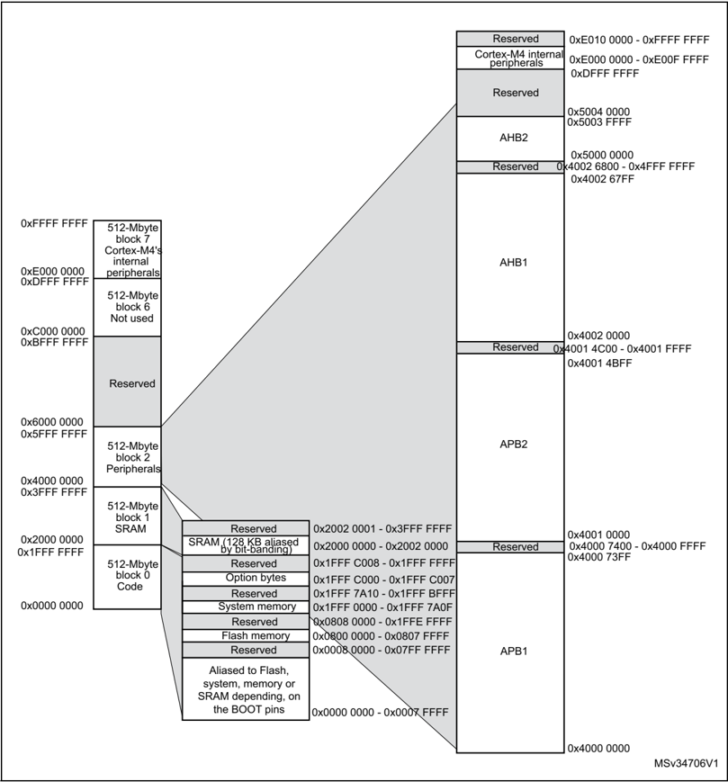

Table 10. STM32F411xC/xE register boundary addresses

| Bus          | Boundary address          | Peripheral                     |
|--------------|---------------------------|--------------------------------|
|              | 0xE010 0000 - 0xFFFF FFFF | Reserved                       |
| Cortex ® -M4 | 0xE000 0000 - 0xE00F FFFF | Cortex-M4 internal peripherals |
|              | 0x5004 0000 - 0xDFFF FFFF | Reserved                       |

Table 10. STM32F411xC/xE register boundary addresses (continued)

| Bus   | Boundary address          | Peripheral               |
|-------|---------------------------|--------------------------|
| AHB2  | 0x5000 0000 - 0x5003 FFFF | USB OTG FS               |
| AHB1  | 0x4002 6800 - 0x4FFF FFFF | Reserved                 |
| AHB1  | 0x4002 6400 - 0x4002 67FF | DMA2                     |
| AHB1  | 0x4002 6000 - 0x4002 63FF | DMA1                     |
| AHB1  | 0x4002 5000 - 0x4002 4FFF | Reserved                 |
| AHB1  | 0x4002 3C00 - 0x4002 3FFF | Flash interface register |
| AHB1  | 0x4002 3800 - 0x4002 3BFF | RCC                      |
| AHB1  | 0x4002 3400 - 0x4002 37FF | Reserved                 |
| AHB1  | 0x4002 3000 - 0x4002 33FF | CRC                      |
| AHB1  | 0x4002 2000 - 0x4002 2FFF | Reserved                 |
| AHB1  | 0x4002 1C00 - 0x4002 1FFF | GPIOH                    |
| AHB1  | 0x4002 1400 - 0x4002 1BFF | Reserved                 |
| AHB1  | 0x4002 1000 - 0x4002 13FF | GPIOE                    |
| AHB1  | 0x4002 0C00 - 0x4002 0FFF | GPIOD                    |
| AHB1  | 0x4002 0800 - 0x4002 0BFF | GPIOC                    |
| AHB1  | 0x4002 0400 - 0x4002 07FF | GPIOB                    |
| AHB1  | 0x4002 0000 - 0x4002 03FF | GPIOA                    |

57

Table 10. STM32F411xC/xE register boundary addresses (continued)

| Bus   | Boundary address           | Peripheral   |
|-------|----------------------------|--------------|
| APB2  | 0x4001 5400- 0x4001 FFFF   | Reserved     |
| APB2  | 0x4001 5000 - 0x4001 53FFF | SPI5/I2S5    |
| APB2  | 0x4001 4800 - 0x4001 4BFF  | TIM11        |
| APB2  | 0x4001 4400 - 0x4001 47FF  | TIM10        |
| APB2  | 0x4001 4000 - 0x4001 43FF  | TIM9         |
| APB2  | 0x4001 3C00 - 0x4001 3FFF  | EXTI         |
| APB2  | 0x4001 3800 - 0x4001 3BFF  | SYSCFG       |
| APB2  | 0x4001 3400 - 0x4001 37FF  | SPI4/I2S4    |
| APB2  | 0x4001 3000 - 0x4001 33FF  | SPI1/I2S1    |
| APB2  | 0x4001 2C00 - 0x4001 2FFF  | SDIO         |
| APB2  | 0x4001 2400 - 0x4001 2BFF  | Reserved     |
| APB2  | 0x4001 2000 - 0x4001 23FF  | ADC1         |
| APB2  | 0x4001 1800 - 0x4001 1FFF  | Reserved     |
| APB2  | 0x4001 1400 - 0x4001 17FF  | USART6       |
| APB2  | 0x4001 1000 - 0x4001 13FF  | USART1       |
| APB2  | 0x4001 0400 - 0x4001 0FFF  | Reserved     |
| APB2  | 0x4001 0000 - 0x4001 03FF  | TIM1         |
| APB2  | 0x4000 7400 - 0x4000 FFFF  | Reserved     |

Table 10. STM32F411xC/xE register boundary addresses (continued)

| Bus   | Boundary address          | Peripheral          |
|-------|---------------------------|---------------------|
| APB1  | 0x4000 7000 - 0x4000 73FF | PWR                 |
| APB1  | 0x4000 6000 - 0x4000 6FFF | Reserved            |
| APB1  | 0x4000 5C00 - 0x4000 5FFF | I2C3                |
| APB1  | 0x4000 5800 - 0x4000 5BFF | I2C2                |
| APB1  | 0x4000 5400 - 0x4000 57FF | I2C1                |
| APB1  | 0x4000 4800 - 0x4000 53FF | Reserved            |
| APB1  | 0x4000 4400 - 0x4000 47FF | USART2              |
| APB1  | 0x4000 4000 - 0x4000 43FF | I2S3ext             |
| APB1  | 0x4000 3C00 - 0x4000 3FFF | SPI3 / I2S3         |
| APB1  | 0x4000 3800 - 0x4000 3BFF | SPI2 / I2S2         |
| APB1  | 0x4000 3400 - 0x4000 37FF | I2S2ext             |
| APB1  | 0x4000 3000 - 0x4000 33FF | IWDG                |
| APB1  | 0x4000 2C00 - 0x4000 2FFF | WWDG                |
| APB1  | 0x4000 2800 - 0x4000 2BFF | RTC & BKP Registers |
| APB1  | 0x4000 1000 - 0x4000 27FF | Reserved            |
| APB1  | 0x4000 0C00 - 0x4000 0FFF | TIM5                |
| APB1  | 0x4000 0800 - 0x4000 0BFF | TIM4                |
| APB1  | 0x4000 0400 - 0x4000 07FF | TIM3                |
| APB1  | 0x4000 0000 - 0x4000 03FF | TIM2                |

57

## 6 Electrical characteristics

## 6.1 Parameter conditions

Unless otherwise specified, all voltages are referenced to V SS .

## 6.1.1 Minimum and maximum values

Unless otherwise specified the minimum and maximum values are guaranteed in the worst conditions of ambient temperature, supply voltage and frequencies by tests in production on 100% of the devices with an ambient temperature at T A  = 25 °C and T A  = T A max (given by the selected temperature range).

Data based on characterization results, design simulation and/or technology characteristics are indicated in the table footnotes and are not tested in production. Based on characterization, the minimum and maximum values refer to sample tests and represent the mean value plus or minus three times the standard deviation (mean ±3 σ ).

## 6.1.2 Typical values

Unless otherwise specified, typical data are based on T A  = 25 °C, V DD  = 3.3 V (for the 1.7 V ≤ VDD ≤ 3.6 V voltage range). They are given only as design guidelines and are not tested.

Typical ADC accuracy values are determined by characterization of a batch of samples from a standard diffusion lot over the full temperature range, where 95% of the devices have an error less than or equal to the value indicated (mean ±2 σ ).

## 6.1.3 Typical curves

Unless otherwise specified, all typical curves are given only as design guidelines and are not tested.

## 6.1.4 Loading capacitor

The loading conditions used for pin parameter measurement are shown in Figure 15 .

Figure 15. Pin loading conditions

## 6.1.5 Pin input voltage

The input voltage measurement on a pin of the device is described in Figure 16 .

Figure 16. Input voltage measurement

124

## 6.1.6 Power supply scheme

Figure 17. Power supply scheme

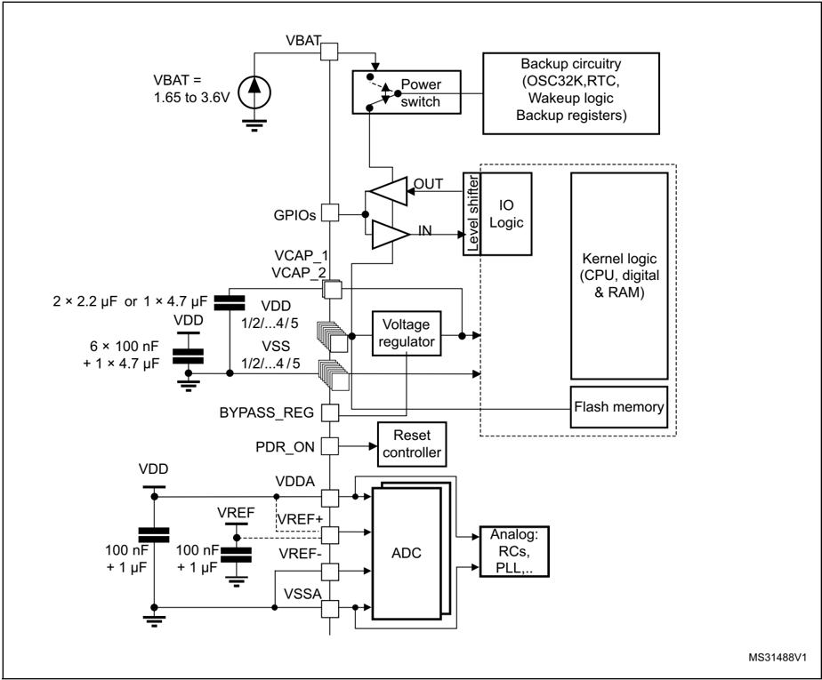

1. To connect PDR\_ON pin, refer to Section 3.15: Power supply supervisor .
2. The 4.7 µF ceramic capacitor must be connected to one of the V DD  pin.
3. VCAP\_2 pad is only available on LQFP100 and UFBGA100 packages.
4. VDDA =V DD  and V SSA =V SS .

## Caution:

Each power supply pair (for example V DD /V SS , V DDA /V SSA ) must be decoupled with filtering ceramic capacitors as shown above. These capacitors must be placed as close as possible to, or below, the appropriate pins on the underside of the PCB to ensure good operation of the device. It is not recommended to remove filtering capacitors to reduce PCB size or cost. This might cause incorrect operation of the device.

## 6.1.7 Current consumption measurement

Figure 18. Current consumption measurement scheme

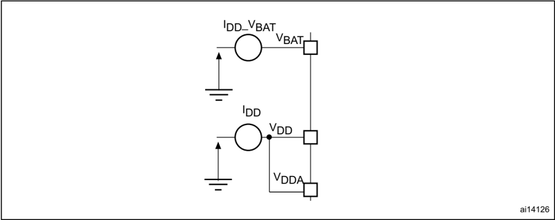

## 6.2 Absolute maximum ratings

Stresses above the absolute maximum ratings listed in Table 11: Voltage characteristics , Table 12: Current characteristics , and Table 13: Thermal characteristics may cause permanent damage to the device. These are stress ratings only and functional operation of the device at these conditions is not implied. Exposure to maximum rating conditions for extended periods may affect device reliability.

Table 11. Voltage characteristics

| Symbol                    | Ratings                                                              | Min                                                      | Max                                                      | Unit   |
|---------------------------|----------------------------------------------------------------------|----------------------------------------------------------|----------------------------------------------------------|--------|
| V DD -V SS                | External main supply voltage (including V DDA , V DD and V BAT ) (1) | -0.3                                                     | 4.0                                                      | V      |
| V IN                      | Input voltage on FT and TC pins (2)                                  | V SS -0.3                                                | V DD +4.0                                                | V      |
| V IN                      | Input voltage on any other pin                                       | V SS -0.3                                                | 4.0                                                      | V      |
| V IN                      | Input voltage for BOOT0                                              | V SS                                                     | 9.0                                                      | V      |
| &#124; Δ V DDx &#124;     | Variations between different V DD power pins                         | -                                                        | 50                                                       | mV     |
| &#124;V SSX - V SS &#124; | Variations between all the different ground pins                     | -                                                        | 50                                                       | mV     |
| V ESD(HBM)                | Electrostatic discharge voltage (human body model)                   | see Section 6.3.14: Absolute maximum ratings (electrical | see Section 6.3.14: Absolute maximum ratings (electrical |        |

124

Table 12. Current characteristics

| Symbol         | Ratings                                                              | Max.   | Unit   |
|----------------|----------------------------------------------------------------------|--------|--------|
| Σ I VDD        | Total current into sum of all V DD_x power lines (source) (1)        | 160    | mA     |
| Σ I VSS        | Total current out of sum of all V SS_x ground lines (sink) (1)       | -160   | mA     |
| I VDD          | Maximum current into each V DD_x power line (source) (1)             | 100    | mA     |
| I VSS          | Maximum current out of each V SS_x ground line (sink) (1)            | -100   | mA     |
| I IO           | Output current sunk by any I/O and control pin                       | 25     | mA     |
| I IO           | Output current sourced by any I/O and control pin                    | -25    | mA     |
| Σ I IO         | Total output current sunk by sum of all I/O and control pins (2)     | 120    | mA     |
| Σ I IO         | Total output current sourced by sum of all I/Os and control pins (2) | -120   | mA     |
| I INJ(PIN) (3) | Injected current on FT and TC pins (4)                               | -5/+0  | mA     |
| I INJ(PIN) (3) | Injected current on NRST and B pins (4)                              | -5/+0  | mA     |
| Σ I INJ(PIN)   | Total injected current (sum of all I/O and control pins) (5)         | ±25    | mA     |

2. This current consumption must be correctly distributed over all I/Os and control pins.
3. Negative injection disturbs the analog performance of the device. See note in Section 6.3.20: 12-bit ADC characteristics .
4. Positive injection is not possible on these I/Os and does not occur for input voltages lower than the specified maximum value.
5. When several inputs are submitted to a current injection, the maximum Σ I INJ(PIN) is the absolute sum of the positive and negative injected currents (instantaneous values).

Table 13. Thermal characteristics

| Symbol   | Ratings                                                                             | Value        | Unit   |
|----------|-------------------------------------------------------------------------------------|--------------|--------|
| T STG    | Storage temperature range                                                           | -65 to +150  | °C     |
| T J      | Maximum junction temperature                                                        | 130          | °C     |
| T LEAD   | Maximum lead temperature during soldering (WLCSP49, LQFP64/100, UFQFPN48, UFBGA100) | see note (1) | °C     |

## 6.3 Operating conditions

## 6.3.1 General operating conditions

Table 14. General operating conditions

| Symbol       | Parameter                                                                                    | Conditions                                                          | Min      | Typ   | Max      | Unit   |
|--------------|----------------------------------------------------------------------------------------------|---------------------------------------------------------------------|----------|-------|----------|--------|
| f HCLK       | Internal AHB clock frequency                                                                 | Power Scale3: Regulator ON, VOS[1:0] bits in PWR_CR register = 0x01 | 0        | -     | 64       | MHz    |
| f HCLK       | Internal AHB clock frequency                                                                 | Power Scale2: Regulator ON, VOS[1:0] bits in PWR_CR register = 0x10 | 0        | -     | 84       | MHz    |
| f HCLK       | Internal AHB clock frequency                                                                 | Power Scale1: Regulator ON, VOS[1:0] bits in PWR_CR register = 0x11 | 0        | -     | 100      | MHz    |
| f PCLK1      | Internal APB1 clock frequency                                                                |                                                                     | 0        | -     | 50       | MHz    |
| f PCLK2      | Internal APB2 clock frequency                                                                |                                                                     | 0        | -     | 100      | MHz    |
| V DD         | Standard operating voltage                                                                   |                                                                     | 1.7 (1)  | -     | 3.6      | V      |
| V DDA (2)(3) | Analog operating voltage (ADC limited to 1.2 M samples)                                      | Must be the same potential as V DD (4)                              | 1.7 (1)  | -     | 2.4      | V      |
| V DDA (2)(3) | Analog operating voltage (ADC limited to 2.4 M samples)                                      | Must be the same potential as V DD (4)                              | 2.4      | -     | 3.6      | V      |
| V BAT        | Backup operating voltage                                                                     |                                                                     | 1.65     | -     | 3.6      | V      |
| V 12         | Regulator ON: 1.2 V internal voltage on VCAP_1/VCAP_2 pins                                   | VOS[1:0] bits in PWR_CR register = 0x01 Max frequency 64 MHz        | 1.08 (5) | 1.14  | 1.20 (5) | V      |
| V 12         | Regulator ON: 1.2 V internal voltage on VCAP_1/VCAP_2 pins                                   | VOS[1:0] bits in PWR_CR register = 0x10 Max frequency 84 MHz        | 1.20 (5) | 1.26  | 1.32 (5) | V      |
| V 12         | Regulator ON: 1.2 V internal voltage on VCAP_1/VCAP_2 pins                                   | VOS[1:0] bits in PWR_CR register = 0x11 Max frequency 100 MHz       | 1.26     | 1.32  | 1.38     | V      |
| V 12         | Regulator OFF: 1.2 V external voltage must be supplied on VCAP_1/VCAP_2 pins                 | Max frequency 64 MHz                                                | 1.10     | 1.14  | 1.20     | V      |
| V 12         | Regulator OFF: 1.2 V external voltage must be supplied on VCAP_1/VCAP_2 pins                 | Max frequency 84 MHz                                                | 1.20     | 1.26  | 1.32     | V      |
| V 12         | Regulator OFF: 1.2 V external voltage must be supplied on VCAP_1/VCAP_2 pins                 | Max frequency 100 MHz                                               | 1.26     | 1.32  | 1.38     | V      |
| V IN         | Input voltage on RST, FT and TC pins (6)                                                     | 2 V ≤ V DD ≤ 3.6 V                                                  | -0.3     | -     | 5.5      | V      |
| V IN         | Input voltage on RST, FT and TC pins (6)                                                     | V DD ≤ 2 V                                                          | -0.3     | -     | 5.2      | V      |
| P D          | Input voltage on BOOT0 pin Power dissipation at T A = 85°C (range 6) or 105 °C (range 7) (7) | -                                                                   | 0        | -     | 9        |        |
| P D          | Input voltage on BOOT0 pin Power dissipation at T A = 85°C (range 6) or 105 °C (range 7) (7) | UFQFPN48                                                            | -        | -     | 625 392  | mW     |
| P D          | Input voltage on BOOT0 pin Power dissipation at T A = 85°C (range 6) or 105 °C (range 7) (7) | WLCSP49                                                             | -        | -     |          | mW     |
| P D          | Input voltage on BOOT0 pin Power dissipation at T A = 85°C (range 6) or 105 °C (range 7) (7) | LQFP64 LQFP100                                                      | - -      | - -   | 425 465  | mW     |
| P D          | Input voltage on BOOT0 pin Power dissipation at T A = 85°C (range 6) or 105 °C (range 7) (7) | UFBGA100                                                            | -        | -     | 323      | mW     |
| P D          | Input voltage on BOOT0 pin Power dissipation at T A = 85°C (range 6) or 105 °C (range 7) (7) |                                                                     |          |       |          | mW     |

124

Table 14. General operating conditions (continued)

| Symbol   | Parameter                                       | Conditions                | Min   | Typ   |   Max | Unit   |
|----------|-------------------------------------------------|---------------------------|-------|-------|-------|--------|
| P D      | Power dissipation at T A = 125 °C (range 3) (7) | UFQFPN48                  | -     | -     |   156 | mW     |
| P D      | Power dissipation at T A = 125 °C (range 3) (7) | WLCSP49                   | -     | -     |    98 | mW     |
| P D      | Power dissipation at T A = 125 °C (range 3) (7) | LQFP64                    | -     | -     |   106 | mW     |
| P D      | Power dissipation at T A = 125 °C (range 3) (7) | LQFP100                   | -     | -     |   116 | mW     |
| P D      | Power dissipation at T A = 125 °C (range 3) (7) | UFBGA100                  | -     | -     |    81 | mW     |
| T A      | Ambient temperature for range 6                 | Maximum power dissipation | - 40  | -     |    85 | °C     |
| T A      | Ambient temperature for range 6                 | Low power dissipation (8) | - 40  | -     |   105 | °C     |
| T A      | Ambient temperature for range 7                 | Maximum power dissipation | - 40  | -     |   105 | °C     |
| T A      | Ambient temperature for range 7                 | Low power dissipation (8) | - 40  | -     |   125 | °C     |
| T A      | Ambient temperature for range 3                 | Maximum power dissipation | - 40  | -     |   110 | °C     |
| T A      | Ambient temperature for range 3                 | Low power dissipation (8) | - 40  | -     |   130 | °C     |
| T J      | Junction temperature range                      | Range 6                   | - 40  | -     |   105 | °C     |
| T J      | Junction temperature range                      | Range 7                   | - 40  | -     |   125 | °C     |
| T J      | Junction temperature range                      | Range 3                   | - 40  | -     |   130 | °C     |

2. When the ADC is used, refer to Table 65: ADC characteristics .
3. If VREF+ pin is present, it must respect the following condition: VDDA-VREF+ &lt; 1.2 V.
4. It is recommended to power V DD  and V DDA  from the same source. A maximum difference of 300 mV between V DD  and VDDA  can be tolerated during power-up and power-down operation.
5. Guaranteed by test in production.
6. To sustain a voltage higher than VDD+0.3, the internal Pull-up and Pull-Down resistors must be disabled
7. If T A  is lower, higher P D  values are allowed as long as T J does not exceed T Jmax .
8. In low power dissipation state, T A  can be extended to this range as long as T J does not exceed T Jmax .

Table 15. Features depending on the operating power supply range

| Operating power supply range   | ADC operation                  | Maximum flash memory access frequency with no wait states (f Flashmax )   | Maximum flash memory access frequency with wait states (1)(2)   | I/O operation         | Clock output frequency on I/O pins (3)   | Possible flash memory operations        |
|--------------------------------|--------------------------------|---------------------------------------------------------------------------|-----------------------------------------------------------------|-----------------------|------------------------------------------|-----------------------------------------|
| V DD =1.7 to 2.1 V (4)         | Conversion time up to 1.2 Msps | 16 MHz (5)                                                                | 100 MHz with 6 wait states                                      | - No I/O compensation | up to 30 MHz                             | 8-bit erase and program operations only |
| V DD = 2.1 to 2.4 V            | Conversion time up to 1.2 Msps | 18 MHz                                                                    | 100 MHz with 5 wait states                                      | - No I/O compensation | up to 30 MHz                             | 16-bit erase and program operations     |

Table 15. Features depending on the operating power supply range (continued)

| Operating power supply range   | ADC operation                  | Maximum flash memory access frequency with no wait states (f Flashmax )   | Maximum flash memory access frequency with wait states (1)(2)   | I/O operation            | Clock output frequency on I/O pins (3)                                           | Possible flash memory operations    |
|--------------------------------|--------------------------------|---------------------------------------------------------------------------|-----------------------------------------------------------------|--------------------------|----------------------------------------------------------------------------------|-------------------------------------|
| V DD = 2.4 to 2.7 V            | Conversion time up to 2.4 Msps | 24 MHz                                                                    | 100 MHz with 4 wait states                                      | - I/O compensation works | up to 50 MHz                                                                     | 16-bit erase and program operations |
| V DD = 2.7 to 3.6 V (6)        | Conversion time up to 2.4 Msps | 30 MHz                                                                    | 100 MHz with 3 wait states                                      | - I/O compensation works | - up to 100 MHz when V DD = 3.0 to 3.6 V - up to 50 MHz when V DD = 2.7 to 3.0 V | 32-bit erase and program operations |

1. Applicable only when the code is executed from flash memory. When the code is executed from RAM, no wait state is required.
2. Thanks to the ART accelerator and the 128-bit flash memory, the number of wait states given here does not impact the execution speed from flash memory since the ART accelerator allows to achieve a performance equivalent to 0 wait state program execution.
3. Refer to Table 55: I/O AC characteristics for frequencies vs. external load.
4. VDD /V DDA  minimum value of 1.7 V, with the use of an external power supply supervisor (refer to Section 3.15.2: Internal reset OFF ).
5. Prefetch is not available. Refer to AN3430 application note for details on how to adjust performance and power.
6. The voltage range for the USB full speed embedded PHY can drop down to 2.7 V. However the electrical characteristics of D- and D+ pins will be degraded between 2.7 and 3 V.

## 6.3.2 VCAP\_1/VCAP\_2 external capacitors

Stabilization for the main regulator is achieved by connecting the external capacitor C EXT  to the VCAP\_1 and VCAP\_2 pins. For packages supporting only 1 VCAP pin, the 2 CEXT capacitors are replaced by a single capacitor.

CEXT  is specified in Table 16 .

Figure 19. External capacitor C EXT

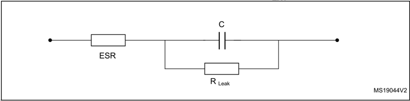

1. Legend: ESR is the equivalent series resistance.

124

Table 16. VCAP\_1/VCAP\_2 operating conditions (1)

| Symbol   | Parameter                                                          | Conditions   |
|----------|--------------------------------------------------------------------|--------------|
| CEXT     | Capacitance of external capacitor with a single VCAP pin available | 4.7 µF       |
| ESR      | ESR of external capacitor with a single VCAP pin available         | < 1 Ω        |

## 6.3.3 Operating conditions at power-up/power-down (regulator ON)

Subject to general operating conditions for T A .

Table 17. Operating conditions at power-up / power-down (regulator ON)

| Symbol   | Parameter           |   Min | Max   | Unit   |
|----------|---------------------|-------|-------|--------|
| t VDD    | V DD rise time rate |    20 | ∞     | µs/V   |
| t VDD    | V DD fall time rate |    20 | ∞     | µs/V   |

## 6.3.4 Operating conditions at power-up / power-down (regulator OFF)

Subject to general operating conditions for T A .

Table 18. Operating conditions at power-up / power-down (regulator OFF) (1)

| Symbol   | Parameter                          | Conditions   |   Min | Max   | Unit   |
|----------|------------------------------------|--------------|-------|-------|--------|
| t VDD    | V DD rise time rate                | Power-up     |    20 | ∞     | µs/V   |
| t VDD    | V DD fall time rate                | Power-down   |    20 | ∞     | µs/V   |
| t VCAP   | V CAP_1 and V CAP_2 rise time rate | Power-up     |    20 | ∞     | µs/V   |
| t VCAP   | V CAP_1 and V CAP_2 fall time rate | Power-down   |    20 | ∞     | µs/V   |

Note: This feature is only available for UFBGA100 package.

## 6.3.5 Embedded reset and power control block characteristics

The parameters given in Table 19 are derived from tests performed under ambient temperature and V DD  supply voltage @ 3.3V.

Table 19. Embedded reset and power control block characteristics

| Symbol            | Parameter                           | Conditions                  | Min      |   Typ | Max   | Unit   |
|-------------------|-------------------------------------|-----------------------------|----------|-------|-------|--------|
| V PVD             | Programmable detector level         | PLS[2:0]=000 (rising edge)  | 2.09     |  2.14 | 2.19  | V      |
| V PVD             |                                     | PLS[2:0]=000 (falling edge) | 1.98     |  2.04 | 2.08  | V      |
| V PVD             |                                     | PLS[2:0]=001 (rising edge)  | 2.23     |  2.30 | 2.37  | V      |
| V PVD             |                                     | PLS[2:0]=001 (falling edge) | 2.13     |  2.19 | 2.25  | V      |
| V PVD             |                                     | PLS[2:0]=010 (rising edge)  | 2.39     |  2.45 | 2.51  | V      |
| V PVD             |                                     | PLS[2:0]=010 (falling edge) | 2.29     |  2.35 | 2.39  | V      |
| V PVD             |                                     | PLS[2:0]=011 (rising edge)  | 2.54     |  2.60 | 2.65  | V      |
| V PVD             | voltage                             | PLS[2:0]=011 (falling edge) | 2.44     |  2.51 | 2.56  | V      |
| V PVD             | selection                           | PLS[2:0]=100 (rising edge)  | 2.70     |  2.76 | 2.82  | V      |
| V PVD             |                                     | PLS[2:0]=100 (falling edge) | 2.59     |  2.66 | 2.71  | V      |
| V PVD             |                                     | PLS[2:0]=101 (rising edge)  | 2.86     |  2.93 | 2.99  | V      |
| V PVD             |                                     | PLS[2:0]=101 (falling edge) | 2.77     |  2.82 | 2.89  | V      |
| V PVD             |                                     | PLS[2:0]=110 (rising edge)  | 2.96     |  3.03 | 3.10  | V      |
| V PVD             |                                     | PLS[2:0]=110 (falling edge) | 2.85     |  2.93 | 2.99  | V      |
| V PVD             |                                     | PLS[2:0]=111 (rising edge)  | 3.07     |  3.14 | 3.21  | V      |
| V PVD             |                                     | PLS[2:0]=111 (falling edge) | 2.95     |  3.03 | 3.09  | V      |
| V PVDhyst (2)     | PVD hysteresis                      | -                           | -        |   100 | -     | mV     |
| V POR/PDR         | Power-on/power-down reset threshold | Falling edge                | 1.60 (1) |  1.68 | 1.76  | V      |
| V POR/PDR         |                                     | Rising edge                 | 1.64     |  1.72 | 1.80  | V      |
| V PDRhyst (2)     | PDR hysteresis                      | -                           | -        |    40 | -     | mV     |
| V BOR1            | Brownout level 1 threshold          | Falling edge                | 2.13     |  2.19 | 2.24  | V      |
| V BOR1            |                                     | Rising edge                 | 2.23     |  2.29 | 2.33  | V      |
| V BOR2            | Brownout level 2                    | Falling edge                | 2.44     |  2.50 | 2.56  | V      |
| V BOR2            | threshold                           | Rising edge                 | 2.53     |  2.59 | 2.63  | V      |
| V BOR3            | Brownout level 3 threshold          | Falling edge                | 2.75     |  2.83 | 2.88  | V      |
| V BOR3            |                                     | Rising edge                 | 2.85     |  2.92 | 2.97  | V      |
| V BORhyst (2)     | BOR hysteresis                      | -                           | -        |   100 | -     | mV     |
| T RSTTEMPO (2)(3) | POR reset timing                    | -                           | 0.5      |   1.5 | 3.0   | ms     |

124

Table 19. Embedded reset and power control block characteristics (continued)

| Symbol     | Parameter                                                                   | Conditions                                            | Min   | Typ   |   Max | Unit   |
|------------|-----------------------------------------------------------------------------|-------------------------------------------------------|-------|-------|-------|--------|
| I RUSH (2) | In-Rush current on voltage regulator power- on (POR or wakeup from Standby) | -                                                     | -     | 160   |   200 | mA     |
| E RUSH (2) | In-Rush energy on voltage regulator power- on (POR or wakeup from Standby)  | V DD = 1.7 V, T A = 125 °C, I RUSH = 171 mA for 31 µs | -     | -     |   5.4 | µC     |

2. Guaranteed by design - Not tested in production.
3. The reset timing is measured from the power-on (POR reset or wakeup from V BAT ) to the instant when first instruction is fetched by the user application code.

## 6.3.6 Supply current characteristics

The current consumption is a function of several parameters and factors such as the operating voltage, ambient temperature, I/O pin loading, device software configuration, operating frequencies, I/O pin switching rate, program location in memory and executed binary code.

The current consumption is measured as described in Figure 18: Current consumption measurement scheme .

All the run-mode current consumption measurements given in this section are performed with a reduced code that gives a consumption equivalent to CoreMark code.

## Typical and maximum current consumption

The MCU is placed under the following conditions:

- All I/O pins are in input mode with a static value at VDD or VSS (no load).
- All peripherals are disabled except if it is explicitly mentioned.
- The flash memory access time is adjusted to both f HCLK  frequency and VDD ranges (refer to Table 15: Features depending on the operating power supply range ).
- The voltage scaling is adjusted to f HCLK  frequency as follows:
- -Scale 3 for f HCLK ≤ 64 MHz
- -Scale 2 for 64 MHz &lt; f HCLK ≤ 84 MHz
- -Scale 1 for 84 MHz &lt; f HCLK ≤ 100 MHz
- The system clock is HCLK, f PCLK1  = f HCLK /2, and f PCLK2  = f HCLK .
- External clock is 4 MHz and PLL is ON except if it is explicitly mentioned.
- The maximum values are obtained for V DD  = 3.6 V and a maximum ambient temperature (T A ), and the typical values for T A = 25 °C and V DD  = 3.3 V unless otherwise specified.

Table 20. Typical and maximum current consumption, code with data processing (ART accelerator disabled) running from SRAM - V DD  = 1.7 V

| Symbol   |                            |                                                             | f HCLK (MHz)   | Typ         | Max (1)     | Max (1)     | Max (1)      | Max (1)      |    |
|----------|----------------------------|-------------------------------------------------------------|----------------|-------------|-------------|-------------|--------------|--------------|----|
| Symbol   |                            |                                                             | f HCLK (MHz)   | T A = 25 °C | T A = 25 °C | T A = 85 °C | T A = 105 °C | T A = 125 °C |    |
| I DD     | Supply current in Run mode | External clock, PLL ON (2) , all peripherals enabled (3)(4) | 100            | 21.4        | 23.0        | 23.6        | 24.0         | 25.0         | mA |
| I DD     | Supply current in Run mode | External clock, PLL ON (2) , all peripherals enabled (3)(4) | 84             | 17.2        | 18.9 (5)    | 19.1        | 19.2         | 20.2         | mA |
| I DD     | Supply current in Run mode | External clock, PLL ON (2) , all peripherals enabled (3)(4) | 64             | 11.9        | 12.9        | 13.2        | 13.7         | 14.6         | mA |
| I DD     | Supply current in Run mode | External clock, PLL ON (2) , all peripherals enabled (3)(4) | 50             | 9.4         | 10.1        | 10.4        | 11.0         | 11.9         | mA |
| I DD     | Supply current in Run mode | External clock, PLL ON (2) , all peripherals enabled (3)(4) | 20             | 4.3         | 4.8         | 5.0         | 5.6          | 6.5          | mA |
| I DD     | Supply current in Run mode | HSI, PLL off, all peripherals enabled (4)                   | 16             | 3.0         | 3.3         | 3.6         | 4.3          | 5.2          | mA |
| I DD     | Supply current in Run mode | HSI, PLL off, all peripherals enabled (4)                   | 1              | 0.5         | 0.7         | 1.0         | 1.7          | 2.6          | mA |
| I DD     | Supply current in Run mode | External clock, PLL on (2) )all peripherals disabled (3)    | 100            | 12.7        | 14.0        | 14.4        | 14.8         | 15.8         | mA |
| I DD     | Supply current in Run mode | External clock, PLL on (2) )all peripherals disabled (3)    | 84             | 10.2        | 11.6 (5)    | 11.8        | 12.0         | 13.0         | mA |
| I DD     | Supply current in Run mode | External clock, PLL on (2) )all peripherals disabled (3)    | 64             | 7.1         | 7.9         | 8.2         | 8.7          | 9.7          | mA |
| I DD     | Supply current in Run mode | External clock, PLL on (2) )all peripherals disabled (3)    | 50             | 5.6         | 6.3         | 6.5         | 7.1          | 8.0          | mA |
| I DD     | Supply current in Run mode | External clock, PLL on (2) )all peripherals disabled (3)    | 20             | 2.5         | 3.0         | 3.3         | 3.9          | 4.8          | mA |
| I DD     | Supply current in Run mode | HSI, PLL off, all peripherals disabled (4)                  | 16             | 1.9         | 2.1         | 2.4         | 3.0          | 3.9          | mA |
| I DD     | Supply current in Run mode | HSI, PLL off, all peripherals disabled (4)                  | 1              | 0.4         | 0.5         | 0.9         | 1.6          | 2.5          | mA |

1. Evaluated by characterization - Not tested in production.
2. Refer to Table 41 and RM0383 for the possible PLL VCO setting
3. When analog peripheral blocks such as ADC, HSE, LSE, HSI, or LSI are ON, an additional power consumption has to be considered.
4. When the ADC is ON (ADON bit set in the ADC\_CR2 register), add an additional power consumption of 1.6 mA for the analog part.
5. Guaranteed by test in production.

124

Table 21. Typical and maximum current consumption, code with data processing (ART accelerator disabled) running from SRAM - V DD  = 3.6 V

| Symbol   |                            |                                                             | f HCLK   | Typ   | Max (1)     | Max (1)     | Max (1)      | Max (1)      |    |
|----------|----------------------------|-------------------------------------------------------------|----------|-------|-------------|-------------|--------------|--------------|----|
| Symbol   |                            |                                                             | (MHz)    | Typ   | T A = 25 °C | T A = 85 °C | T A = 105 °C | T A = 125 °C |    |
| I DD     | Supply current in Run mode | External clock, PLL ON (2) , all peripherals enabled (3)(4) | 100      | 21.7  | 23.3        | 23.9        | 24.3         | 25.3         | mA |
| I DD     | Supply current in Run mode | External clock, PLL ON (2) , all peripherals enabled (3)(4) | 84       | 17.5  | 19.2 (5)    | 19.4        | 19.5         | 20.5         | mA |
| I DD     | Supply current in Run mode | External clock, PLL ON (2) , all peripherals enabled (3)(4) | 64       | 12.2  | 13.2        | 13.5        | 14.0         | 14.9         | mA |
| I DD     | Supply current in Run mode | External clock, PLL ON (2) , all peripherals enabled (3)(4) | 50       | 9.6   | 10.4        | 10.7        | 11.2         | 12.1         | mA |
| I DD     | Supply current in Run mode | External clock, PLL ON (2) , all peripherals enabled (3)(4) | 20       | 4.5   | 5.0         | 5.3         | 5.9          | 6.8          | mA |
| I DD     | Supply current in Run mode | HSI, PLL OFF, all peripherals enabled (3)                   | 16       | 3.0   | 3.3         | 3.6         | 4.3          | 5.2          | mA |
| I DD     | Supply current in Run mode | HSI, PLL OFF, all peripherals enabled (3)                   | 1        | 0.5   | 0.7         | 1.0         | 1.7          | 2.6          | mA |
| I DD     | Supply current in Run mode | External clock, PLL OFF (2) , all peripherals disabled (3)  | 100      | 13.0  | 14.6 (5)    | 14.6        | 14.9         | 16.0         | mA |
| I DD     | Supply current in Run mode | External clock, PLL OFF (2) , all peripherals disabled (3)  | 84       | 10.5  | 11.9 (5)    | 12.1        | 12.2         | 13.2         | mA |
| I DD     | Supply current in Run mode | External clock, PLL OFF (2) , all peripherals disabled (3)  | 64       | 7.4   | 8.4 (5)     | 8.8         | 8.9          | 9.9          | mA |
| I DD     | Supply current in Run mode | External clock, PLL OFF (2) , all peripherals disabled (3)  | 50       | 5.9   | 6.6         | 6.8         | 7.3          | 8.2          | mA |
| I DD     | Supply current in Run mode | External clock, PLL OFF (2) , all peripherals disabled (3)  | 20       | 2.8   | 3.3         | 3.5         | 4.2          | 5.1          | mA |
| I DD     | Supply current in Run mode | HSI, PLL OFF, all peripherals disabled (3)                  | 16       | 1.9   | 2.1         | 2.4         | 3.1          | 4.0          | mA |
| I DD     | Supply current in Run mode | HSI, PLL OFF, all peripherals disabled (3)                  | 1        | 0.4   | 0.5         | 0.9         | 1.6          | 2.5          | mA |

1. Evaluated by characterization - Not tested in production.
2. Refer to Table 41 and RM0383 for the possible PLL VCO setting
3. When analog peripheral blocks such as ADC, HSE, LSE, HSI, or LSI are ON, an additional power consumption has to be considered.
4. When the ADC is ON (ADON bit set in the ADC\_CR2 register), add an additional power consumption of 1.6 mA for the analog part.
5. Guaranteed by test in production.

Table 22. Typical and maximum current consumption in run mode, code with data processing (ART accelerator enabled except prefetch) running from flash memory- V DD  = 1.7 V

|        |                            |                                                             | f HCLK   |   Typ | Max (1)     | Max (1)     | Max (1)      | Max (1)      | Unit   |
|--------|----------------------------|-------------------------------------------------------------|----------|-------|-------------|-------------|--------------|--------------|--------|
| Symbol | Parameter                  | Conditions                                                  | (MHz)    |       | T A = 25 °C | T A = 85 °C | T A = 105 °C | T A = 125 °C |        |
| I DD   | Supply current in Run mode | External clock, PLL ON (2) , all peripherals enabled (3)(4) | 100      |  20.4 | 21.8        | 22.1        | 22.8         | 23.8         | mA     |
| I DD   | Supply current in Run mode | External clock, PLL ON (2) , all peripherals enabled (3)(4) | 84       |  16.5 | 17.6        | 17.8        | 18.6         | 19.6         | mA     |
| I DD   | Supply current in Run mode | External clock, PLL ON (2) , all peripherals enabled (3)(4) | 64       |  11.4 | 12.3        | 12.5        | 13.1         | 14.1         | mA     |
| I DD   | Supply current in Run mode | External clock, PLL ON (2) , all peripherals enabled (3)(4) | 50       |   9.0 | 9.7         | 10.0        | 10.6         | 11.6         | mA     |
| I DD   | Supply current in Run mode | External clock, PLL ON (2) , all peripherals enabled (3)(4) | 20       |   4.6 | 5.0         | 5.3         | 6.0          | 7.0          | mA     |
| I DD   | Supply current in Run mode | HSI, PLL OFF (2) , all peripherals enabled (3)              | 16       |   2.9 | 3.2         | 3.6         | 4.3          | 5.3          | mA     |
| I DD   | Supply current in Run mode | HSI, PLL OFF (2) , all peripherals enabled (3)              | 1        |   0.7 | 0.8         | 1.3         | 1.9          | 2.9          | mA     |
| I DD   | Supply current in Run mode | External clock, PLL ON (2) all peripherals disabled (3)     | 100      |  11.2 | 12.2        | 12.4        | 13.2         | 14.2         | mA     |
| I DD   | Supply current in Run mode | External clock, PLL ON (2) all peripherals disabled (3)     | 84       |   9.1 | 9.9         | 10.1        | 10.9         | 11.9         | mA     |
| I DD   | Supply current in Run mode | External clock, PLL ON (2) all peripherals disabled (3)     | 64       |   6.4 | 7.0         | 7.3         | 7.9          | 8.9          | mA     |
| I DD   | Supply current in Run mode | External clock, PLL ON (2) all peripherals disabled (3)     | 50       |   5.1 | 5.6         | 5.9         | 6.6          | 7.6          | mA     |
| I DD   | Supply current in Run mode | External clock, PLL ON (2) all peripherals disabled (3)     | 20       |   2.6 | 3.0         | 3.3         | 4.0          | 5.0          | mA     |
| I DD   | Supply current in Run mode | HSI, PLL OFF (2) , all peripherals disabled (3)             | 16       |   1.8 | 2.0         | 2.4         | 3.0          | 4.0          | mA     |
| I DD   | Supply current in Run mode | HSI, PLL OFF (2) , all peripherals disabled (3)             | 1        |   0.6 | 0.7         | 1.2         | 1.9          | 2.9          | mA     |

1. Evaluated by characterization - Not tested in production.
2. Refer to Table 41 and RM0383 for the possible PLL VCO setting
3. Add an additional power consumption of 1.6 mA per ADC for the analog part. In applications, this consumption occurs only while the ADC is ON (ADON bit is set in the ADC\_CR2 register).
4. When the ADC is ON (ADON bit set in the ADC\_CR2), add an additional power consumption of 1.6mA per ADC for the analog part.

124

Table 23. Typical and maximum current consumption in run mode, code with data processing (ART accelerator enabled except prefetch) running from flash memory - V DD  = 3.6 V

|        |                            |                                                             | f HCLK   |   Typ | Max (1)     | Max (1)     | Max (1)      | Max (1)      | Unit   |
|--------|----------------------------|-------------------------------------------------------------|----------|-------|-------------|-------------|--------------|--------------|--------|
| Symbol | Parameter                  | Conditions                                                  | (MHz)    |       | T A = 25 °C | T A = 85 °C | T A = 105 °C | T A = 125 °C |        |
| I DD   | Supply current in Run mode | External clock, PLL ON (2) , all peripherals enabled (3)(4) | 100      |  20.7 | 22.2        | 22.5        | 23.2         | 24.4         | mA     |
| I DD   | Supply current in Run mode | External clock, PLL ON (2) , all peripherals enabled (3)(4) | 84       |  16.8 | 18.0        | 18.3        | 19.0         | 20.1         | mA     |
| I DD   | Supply current in Run mode | External clock, PLL ON (2) , all peripherals enabled (3)(4) | 64       |  11.8 | 12.7        | 12.9        | 13.6         | 14.6         | mA     |
| I DD   | Supply current in Run mode | External clock, PLL ON (2) , all peripherals enabled (3)(4) | 50       |   9.3 | 10.2        | 10.4        | 11.1         | 12.0         | mA     |
| I DD   | Supply current in Run mode | External clock, PLL ON (2) , all peripherals enabled (3)(4) | 20       |   4.8 | 5.5         | 5.8         | 6.5          | 7.4          | mA     |
| I DD   | Supply current in Run mode | HSI, PLL OFF (2) , all peripherals enabled (3)              | 16       |   3.0 | 3.3         | 3.8         | 4.5          | 5.4          | mA     |
| I DD   | Supply current in Run mode | HSI, PLL OFF (2) , all peripherals enabled (3)              | 1        |   0.7 | 1.0         | 1.4         | 2.1          | 3.0          | mA     |
| I DD   | Supply current in Run mode | External clock, PLL ON (2) all peripherals disabled (3)     | 100      |  11.6 | 12.6        | 12.9        | 13.6         | 14.8         | mA     |
| I DD   | Supply current in Run mode | External clock, PLL ON (2) all peripherals disabled (3)     | 84       |   9.7 | 10.2 (5)    | 11.1        | 11.3         | 12.5         | mA     |
| I DD   | Supply current in Run mode | External clock, PLL ON (2) all peripherals disabled (3)     | 64       |   6.7 | 7.4         | 7.7         | 8.3          | 9.4          | mA     |
| I DD   | Supply current in Run mode | External clock, PLL ON (2) all peripherals disabled (3)     | 50       |   5.4 | 6.0         | 6.3         | 7.0          | 8.0          | mA     |
| I DD   | Supply current in Run mode | External clock, PLL ON (2) all peripherals disabled (3)     | 20       |   2.9 | 3.4         | 3.7         | 4.4          | 5.4          | mA     |
| I DD   | Supply current in Run mode | HSI, PLL OFF (2) , all peripherals disabled (3)             | 16       |   1.9 | 2.2         | 2.6         | 3.3          | 4.3          | mA     |
| I DD   | Supply current in Run mode | HSI, PLL OFF (2) , all peripherals disabled (3)             | 1        |   0.7 | 0.9         | 1.3         | 2.1          | 3.1          | mA     |

1. Evaluated by characterization - Not tested in production.
2. Refer to Table 41 and RM0383 for the possible PLL VCO setting
3. Add an additional power consumption of 1.6 mA per ADC for the analog part. In applications, this consumption occurs only while the ADC is ON (ADON bit is set in the ADC\_CR2 register).
4. When the ADC is ON (ADON bit set in the ADC\_CR2), add an additional power consumption of 1.6mA per ADC for the analog part.
5. Guaranteed by test in production.

Table 24.  Typical and maximum current consumption in run mode, code with data processing (ART accelerator disabled) running from flash memory - V DD  = 3.6 V

|        |                            |                                                             | f HCLK   |   Typ | Max (1)     | Max (1)     | Max (1)      | Max (1)      | Unit   |
|--------|----------------------------|-------------------------------------------------------------|----------|-------|-------------|-------------|--------------|--------------|--------|
| Symbol | Parameter                  | Conditions                                                  | (MHz)    |       | T A = 25 °C | T A = 85 °C | T A = 105 °C | T A = 125 °C |        |
| I DD   | Supply current in Run mode | External clock, PLL ON (2) , all peripherals enabled (3)(4) | 100      |  29.5 | 31.5        | 32.3        | 33.3         | 34.7         | mA     |
| I DD   | Supply current in Run mode | External clock, PLL ON (2) , all peripherals enabled (3)(4) | 84       |  25.5 | 27.1        | 27.9        | 28.9         | 30.2         | mA     |
| I DD   | Supply current in Run mode | External clock, PLL ON (2) , all peripherals enabled (3)(4) | 64       |  18.6 | 19.8        | 20.4        | 21.2         | 22.4         | mA     |
| I DD   | Supply current in Run mode | External clock, PLL ON (2) , all peripherals enabled (3)(4) | 50       |  15.2 | 16.4        | 16.9        | 17.7         | 18.7         | mA     |
| I DD   | Supply current in Run mode | External clock, PLL ON (2) , all peripherals enabled (3)(4) | 20       |   7.6 | 8.4         | 8.8         | 9.5          | 10.5         | mA     |
| I DD   | Supply current in Run mode | HSI, PLL OFF (2) , all peripherals enabled (3)              | 16       |   4.8 | 5.2         | 5.7         | 6.5          | 7.5          | mA     |
| I DD   | Supply current in Run mode | HSI, PLL OFF (2) , all peripherals enabled (3)              | 1        |   0.9 | 1.3         | 1.6         | 2.4          | 3.4          | mA     |
| I DD   | Supply current in Run mode | External clock, PLL ON (2) all peripherals disabled (3)     | 100      |  20.4 | 21.8        | 22.7        | 23.8         | 25.1         | mA     |
| I DD   | Supply current in Run mode | External clock, PLL ON (2) all peripherals disabled (3)     | 84       |  18.4 | 19.2 (5)    | 20.9        | 21.1         | 22.4         | mA     |
| I DD   | Supply current in Run mode | External clock, PLL ON (2) all peripherals disabled (3)     | 64       |  13.5 | 14.5        | 15.2        | 15.9         | 17.2         | mA     |
| I DD   | Supply current in Run mode | External clock, PLL ON (2) all peripherals disabled (3)     | 50       |  11.3 | 12.2        | 12.8        | 13.6         | 14.7         | mA     |
| I DD   | Supply current in Run mode | External clock, PLL ON (2) all peripherals disabled (3)     | 20       |   5.6 | 6.4         | 6.7         | 7.4          | 8.5          | mA     |
| I DD   | Supply current in Run mode | HSI, PLL OFF (2) , all peripherals disabled (3)             | 16       |   3.6 | 4.1         | 4.5         | 5.2          | 6.3          | mA     |
| I DD   | Supply current in Run mode | HSI, PLL OFF (2) , all peripherals disabled (3)             | 1        |   0.9 | 1.2         | 1.6         | 2.3          | 3.4          | mA     |

1. Evaluated by characterization - Not tested in production.
2. Refer to Table 41 and RM0383 for the possible PLL VCO setting
3. Add an additional power consumption of 1.6 mA per ADC for the analog part. In applications, this consumption occurs only while the ADC is ON (ADON bit is set in the ADC\_CR2 register).
4. When the ADC is ON (ADON bit set in the ADC\_CR2), add an additional power consumption of 1.6mA per ADC for the analog part.
5. Guaranteed by test in production.

124

Table 25. Typical and maximum current consumption in run mode, code with data processing (ART accelerator enabled with prefetch) running from flash memory - V DD  = 3.6 V

|        |                            |                                                             | f HCLK   |   Typ | Max (1)     | Max (1)     | Max (1)      | Max (1)      | Unit   |
|--------|----------------------------|-------------------------------------------------------------|----------|-------|-------------|-------------|--------------|--------------|--------|
| Symbol | Parameter                  | Conditions                                                  | (MHz)    |       | T A = 25 °C | T A = 85 °C | T A = 105 °C | T A = 125 °C |        |
| I DD   | Supply current in Run mode | External clock, PLL ON (2) , all peripherals enabled (3)(4) | 100      |  31.7 | 33.6        | 34.5        | 35.5         | 37.0         | mA     |
| I DD   | Supply current in Run mode | External clock, PLL ON (2) , all peripherals enabled (3)(4) | 84       |  26.9 | 28.6        | 29.4        | 30.3         | 31.6         | mA     |
| I DD   | Supply current in Run mode | External clock, PLL ON (2) , all peripherals enabled (3)(4) | 64       |  19.6 | 20.9        | 21.5        | 22.3         | 23.5         | mA     |
| I DD   | Supply current in Run mode | External clock, PLL ON (2) , all peripherals enabled (3)(4) | 50       |  15.6 | 16.7        | 17.2        | 18.0         | 19.1         | mA     |
| I DD   | Supply current in Run mode | External clock, PLL ON (2) , all peripherals enabled (3)(4) | 20       |   7.6 | 8.4         | 8.8         | 9.5          | 10.6         | mA     |
| I DD   | Supply current in Run mode | HSI, PLL OFF (2) , all peripherals enabled (3)              | 16       |   5.1 | 5.6         | 6.1         | 6.8          | 7.9          | mA     |
| I DD   | Supply current in Run mode | HSI, PLL OFF (2) , all peripherals enabled (3)              | 1        |   1.0 | 1.3         | 1.7         | 2.3          | 3.4          | mA     |
| I DD   | Supply current in Run mode | External clock, PLL ON (2) all peripherals disabled (3)     | 100      |  22.5 | 24.2        | 24.9        | 26.0         | 27.3         | mA     |
| I DD   | Supply current in Run mode | External clock, PLL ON (2) all peripherals disabled (3)     | 84       |  19.5 | 21.1 (5)    | 21.8        | 22.8         | 24.1         | mA     |
| I DD   | Supply current in Run mode | External clock, PLL ON (2) all peripherals disabled (3)     | 64       |  14.5 | 15.7        | 16.3        | 17.1         | 18.3         | mA     |
| I DD   | Supply current in Run mode | External clock, PLL ON (2) all peripherals disabled (3)     | 50       |  11.7 | 12.7        | 13.2        | 14.0         | 15.1         | mA     |
| I DD   | Supply current in Run mode | External clock, PLL ON (2) all peripherals disabled (3)     | 20       |   5.6 | 6.4         | 6.8         | 7.4          | 8.5          | mA     |
| I DD   | Supply current in Run mode | HSI, PLL OFF (2) , all peripherals disabled (3)             | 16       |   4.0 | 4.5         | 4.9         | 5.6          | 6.7          | mA     |
| I DD   | Supply current in Run mode | HSI, PLL OFF (2) , all peripherals disabled (3)             | 1        |   0.9 | 1.2         | 1.6         | 2.2          | 3.3          | mA     |

1. Evaluated by characterization - Not tested in production.
2. Refer to Table 41 and RM0383 for the possible PLL VCO setting
3. Add an additional power consumption of 1.6 mA per ADC for the analog part. In applications, this consumption occurs only while the ADC is ON (ADON bit is set in the ADC\_CR2 register).
4. When the ADC is ON (ADON bit set in the ADC\_CR2), add an additional power consumption of 1.6mA per ADC for the analog part.
5. Guaranteed by test in production.

Table 26. Typical and maximum current consumption in Sleep mode - V DD  = 3.6 V

|        |                              |                                                             | f HCLK   |   Typ | Max (1)     | Max (1)     | Max (1)      | Max (1)      | Unit   |
|--------|------------------------------|-------------------------------------------------------------|----------|-------|-------------|-------------|--------------|--------------|--------|
| Symbol | Parameter                    | Conditions                                                  | (MHz)    |       | T A = 25 °C | T A = 85 °C | T A = 105 °C | T A = 125 °C |        |
| I DD   | Supply current in Sleep mode | External clock, PLL ON (2) , all peripherals enabled (3)(4) | 100      |  12.2 | 13.2        | 13.4        | 14.1         | 15.3         | mA     |
| I DD   | Supply current in Sleep mode | External clock, PLL ON (2) , all peripherals enabled (3)(4) | 84       |   9.8 | 10.6        | 10.9        | 11.6         | 12.8         | mA     |
| I DD   | Supply current in Sleep mode | External clock, PLL ON (2) , all peripherals enabled (3)(4) | 64       |   6.9 | 7.4         | 7.7         | 8.3          | 9.5          | mA     |
| I DD   | Supply current in Sleep mode | External clock, PLL ON (2) , all peripherals enabled (3)(4) | 50       |   5.4 | 5.9         | 6.2         | 6.8          | 8.0          | mA     |
| I DD   | Supply current in Sleep mode | External clock, PLL ON (2) , all peripherals enabled (3)(4) | 20       |   2.8 | 3.2         | 3.5         | 4.1          | 5.3          | mA     |
| I DD   | Supply current in Sleep mode | HSI, PLL OFF (2) , all peripherals enabled (3)              | 16       |   1.3 | 1.7         | 2.2         | 2.8          | 4.0          | mA     |
| I DD   | Supply current in Sleep mode | HSI, PLL OFF (2) , all peripherals enabled (3)              | 1        |   0.4 | 0.5         | 0.9         | 1.6          | 2.8          | mA     |
| I DD   | Supply current in Sleep mode | External clock, PLL ON (2) all peripherals disabled (3)     | 100      |   3.0 | 3.6         | 3.9         | 4.5          | 5.7          | mA     |
| I DD   | Supply current in Sleep mode | External clock, PLL ON (2) all peripherals disabled (3)     | 84       |   2.5 | 3.0         | 3.2         | 3.9          | 5.1          | mA     |
| I DD   | Supply current in Sleep mode | External clock, PLL ON (2) all peripherals disabled (3)     | 64       |   1.9 | 2.2         | 2.5         | 3.0          | 4.2          | mA     |
| I DD   | Supply current in Sleep mode | External clock, PLL ON (2) all peripherals disabled (3)     | 50       |   1.6 | 1.9         | 2.1         | 2.7          | 3.9          | mA     |
| I DD   | Supply current in Sleep mode | External clock, PLL ON (2) all peripherals disabled (3)     | 20       |   1.1 | 1.4         | 1.7         | 2.3          | 3.5          | mA     |
| I DD   | Supply current in Sleep mode | HSI, PLL OFF (2) , all peripherals disabled (3)             | 16       |   0.4 | 0.5         | 0.9         | 1.6          | 2.8          | mA     |
| I DD   | Supply current in Sleep mode | HSI, PLL OFF (2) , all peripherals disabled (3)             | 1        |   0.3 | 0.4         | 0.8         | 1.5          | 2.7          | mA     |

1. Evaluated by characterization - Not tested in production.
2. Refer to Table 41 and RM0383 for the possible PLL VCO setting.
3. Add an additional power consumption of 1.6 mA per ADC for the analog part. In applications, this consumption occurs only while the ADC is ON (ADON bit is set in the ADC\_CR2 register).
4. When the ADC is ON (ADON bit set in the ADC\_CR2), add an additional power consumption of 1.6mA per ADC for the analog part.

Table 27. Typical and maximum current consumptions in Stop mode - V DD  = 1.7 V

|           |                                                                             |                                       | Typ (1)     | Max (1)     | Max (1)     | Max (1)      | Max (1)      |      |
|-----------|-----------------------------------------------------------------------------|---------------------------------------|-------------|-------------|-------------|--------------|--------------|------|
| Symbol    | Conditions                                                                  | Parameter                             | T A = 25 °C | T A = 25 °C | T A = 85 °C | T A = 105 °C | T A = 125 °C | Unit |
| I DD_STOP | Flash in Stop mode, all oscillators OFF, no independent watchdog            | Main regulator usage                  | 112         | 142 (2)     | 400         | 710          | 1200 (2)     | µA   |
| I DD_STOP | Flash in Stop mode, all oscillators OFF, no independent watchdog            | Low power regulator usage             | 42.6        | 67 (2)      | 300         | 580          | 1044 (2)     | µA   |
| I DD_STOP | Flash in Deep power down mode, all oscillators OFF, no independent watchdog | Main regulator usage                  | 75          | 99 (2)      | 310         | 580          | 993 (2)      | µA   |
| I DD_STOP | Flash in Deep power down mode, all oscillators OFF, no independent watchdog | Low power regulator usage             | 13.6        | 37 (2)      | 265         | 550          | 1007 (2)     | µA   |
| I DD_STOP | Flash in Deep power down mode, all oscillators OFF, no independent watchdog | Low power low voltage regulator usage | 9           | 28 (2)      | 230         | 500          | 910 (2)      | µA   |

124

Table 28. Typical and maximum current consumption in Stop mode - V DD =3.6 V

|           |                                                                             |                                       | Typ         | Max (1)     | Max (1)     | Max (1)      | Max (1)      |    |
|-----------|-----------------------------------------------------------------------------|---------------------------------------|-------------|-------------|-------------|--------------|--------------|----|
| Symbol    | Conditions                                                                  | Parameter                             | T A = 25 °C | T A = 25 °C | T A = 85 °C | T A = 105 °C | T A = 125 °C |    |
| I DD_STOP | Flash in Stop mode, all oscillators OFF, no independent watchdog            | Main regulator usage                  | 113.7       | 145 (2)     | 410         | 720          | 1217 (2)     | µA |
| I DD_STOP | Flash in Stop mode, all oscillators OFF, no independent watchdog            | Low power regulator usage             | 43.1        | 68 (2)      | 310         | 600          | 1073 (2)     | µA |
| I DD_STOP | Flash in Deep power down mode, all oscillators OFF, no independent watchdog | Main regulator usage                  | 76.2        | 105 (2)     | 320         | 600          | 1019 (2)     | µA |
| I DD_STOP | Flash in Deep power down mode, all oscillators OFF, no independent watchdog | Low power regulator usage             | 14          | 38 (2)      | 275         | 560          | 1025 (2)     | µA |
| I DD_STOP | Flash in Deep power down mode, all oscillators OFF, no independent watchdog | Low power low voltage regulator usage | 10          | 30 (2)      | 235         | 510          | 928 (2)      | µA |

1. Evaluated by characterization - Not tested in production.
2. Guaranteed by test in production.
2. Evaluated by characterization - Not tested in production.
3. Guaranteed by test in production.
2. Evaluated by characterization - Not tested in production.
3. Guaranteed by test in production.

Table 29. Typical and maximum current consumption in Standby mode - V DD = 1.7 V

|           |                           |                                       | Typ (1)     | Max (2)     | Max (2)     | Max (2)      | Max (2)      |      |
|-----------|---------------------------|---------------------------------------|-------------|-------------|-------------|--------------|--------------|------|
| Symbol    | Parameter                 | Conditions                            | T A = 25 °C | T A = 25 °C | T A = 85 °C | T A = 105 °C | T A = 125 °C | Unit |
| I DD_STBY | Supply current in Standby | Low-speed oscillator (LSE) and RTC ON | 2.4         | 4           | 12          | 25           | 50           | µA   |
| I DD_STBY | mode RTC and LSE          | OFF                                   | 1.8         | 3 (3)       | 11          | 24           | 49 (3)       | µA   |

Table 30. Typical and maximum current consumption in Standby mode - V DD = 3.6 V

|           |                                |                                       | Typ (1)     | Max (2)     | Max (2)     | Max (2)      | Max (2)      | Unit   |
|-----------|--------------------------------|---------------------------------------|-------------|-------------|-------------|--------------|--------------|--------|
| Symbol    | Parameter                      | Conditions                            | T A = 25 °C | T A = 25 °C | T A = 85 °C | T A = 105 °C | T A = 125 °C |        |
| I DD_STBY | Supply current in Standby mode | Low-speed oscillator (LSE) and RTC ON | 2.8         | 5           | 14          | 29           | 59           | µA     |
| I DD_STBY | Supply current in Standby mode | RTC and LSE OFF                       | 2.1         | 4 (3)       | 13.5        | 28           | 58 (3)       | µA     |

Table 31. Typical and maximum current consumptions in V BAT  mode

|           |                      |                                                           | Typ           | Typ           | Typ           | Max (2)       | Max (2)       | Max (2)       |      |
|-----------|----------------------|-----------------------------------------------------------|---------------|---------------|---------------|---------------|---------------|---------------|------|
| Symbol    | Parameter            | Conditions (1)                                            | T A = 25 °C   | T A = 25 °C   | T A = 25 °C   | T A = 85 °C   | T A = 105 °C  | T A = 125 °C  | Unit |
|           |                      |                                                           | V BAT = 1.7 V | V BAT = 2.4 V | V BAT = 3.3 V | V BAT = 3.6 V | V BAT = 3.6 V | V BAT = 3.6 V |      |
| I DD_VBAT | Backup domain supply | Low-speed oscillator (LSE in low- drive mode) and RTC ON  | 0.7           | 0.8           | 1.0           | 3             | 5             | 6.8           | µA   |
| I DD_VBAT | current              | Low-speed oscillator (LSE in high- drive mode) and RTC ON | 1.5           | 1.6           | 1.9           | 3.8           | 5.8           | 8.6           | µA   |
| I DD_VBAT |                      | RTC and LSE OFF                                           | 0.1           | 0.1           | 0.1           | 2             | 4             | 5.8           | µA   |

2. Evaluated by characterization - Not tested in production.

Figure 20. Typical V BAT  current consumption (LSE in low-drive mode and RTC ON)

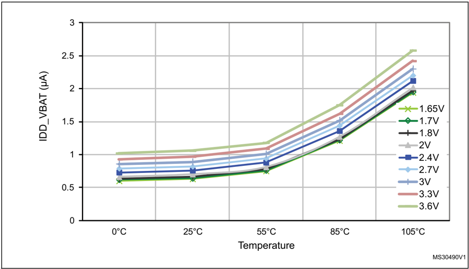

124

Caution:

## I/O system current consumption

The current consumption of the I/O system has two components: static and dynamic.

## I/O static current consumption

All the I/Os used as inputs with pull-up generate current consumption when the pin is externally held low. The value of this current consumption can be simply computed by using the pull-up/pull-down resistors values given in Table 53: I/O static characteristics .

For the output pins, any external pull-down or external load must also be considered to estimate the current consumption.

Additional I/O current consumption is due to I/Os configured as inputs if an intermediate voltage level is externally applied. This current consumption is caused by the input Schmitt trigger circuits used to discriminate the input value. Unless this specific configuration is required by the application, this supply current consumption can be avoided by configuring these I/Os in analog mode. This is notably the case of ADC input pins which should be configured as analog inputs.

Any floating input pin can also settle to an intermediate voltage level or switch inadvertently, as a result of external electromagnetic noise. To avoid current consumption related to floating pins, they must either be configured in analog mode, or forced internally to a definite digital value. This can be done either by using pull-up/down resistors or by configuring the pins in output mode.

## I/O dynamic current consumption

In addition to the internal peripheral current consumption (see Table 33: Peripheral current consumption ), the I/Os used by an application also contribute to the current consumption. When an I/O pin switches, it uses the current from the MCU supply voltage to supply the I/O pin circuitry and to charge/discharge the capacitive load (internal or external) connected to the pin:

<!-- formula-not-decoded -->

where

I SW is the current sunk by a switching I/O to charge/discharge the capacitive load

VDD  is the MCU supply voltage

f SW is the I/O switching frequency

C is the total capacitance seen by the I/O pin: C = C INT + C EXT

The test pin is configured in push-pull output mode and is toggled by software at a fixed frequency.

Table 32. Switching output I/O current consumption

| Symbol   | Parameter             | Conditions (1)                                     | I/O toggling frequency (f SW )   |   Typ | Unit   |
|----------|-----------------------|----------------------------------------------------|----------------------------------|-------|--------|
| IDDIO    | I/O switching current | V DD = 3.3 V C = C INT                             | 2 MHz                            |  0.05 | mA     |
|          |                       | V DD = 3.3 V C = C INT                             | 8 MHz                            |  0.15 |        |
|          |                       | V DD = 3.3 V C = C INT                             | 25 MHz                           |  0.45 |        |
|          |                       | V DD = 3.3 V C = C INT                             | 50 MHz                           |  0.85 |        |
|          |                       | V DD = 3.3 V C = C INT                             | 60 MHz                           |  1.00 |        |
|          |                       | V DD = 3.3 V C = C INT                             | 84 MHz                           |  1.40 |        |
|          |                       | V DD = 3.3 V C = C INT                             | 90 MHz                           |  1.67 |        |
|          |                       | V DD = 3.3 V C EXT = 0 pF C = C INT + C EXT + C S  | 2 MHz                            |  0.10 |        |
|          |                       | V DD = 3.3 V C EXT = 0 pF C = C INT + C EXT + C S  | 8 MHz                            |  0.35 |        |
|          |                       | V DD = 3.3 V C EXT = 0 pF C = C INT + C EXT + C S  | 25 MHz                           |  1.05 |        |
|          |                       | V DD = 3.3 V C EXT = 0 pF C = C INT + C EXT + C S  | 50 MHz                           |  2.20 |        |
|          |                       | V DD = 3.3 V C EXT = 0 pF C = C INT + C EXT + C S  | 60 MHz                           |  2.40 |        |
|          |                       | V DD = 3.3 V C EXT = 0 pF C = C INT + C EXT + C S  | 84 MHz                           |  3.55 |        |
|          |                       | V DD = 3.3 V C EXT = 0 pF C = C INT + C EXT + C S  | 90 MHz                           |  4.23 |        |
|          |                       | V DD = 3.3 V C EXT =10 pF C = C INT + C EXT + C S  | 2 MHz                            |  0.20 |        |
|          |                       | V DD = 3.3 V C EXT =10 pF C = C INT + C EXT + C S  | 8 MHz                            |  0.65 |        |
|          |                       | V DD = 3.3 V C EXT =10 pF C = C INT + C EXT + C S  | 25 MHz                           |  1.85 |        |
|          |                       | V DD = 3.3 V C EXT =10 pF C = C INT + C EXT + C S  | 50 MHz                           |  2.45 |        |
|          |                       | V DD = 3.3 V C EXT =10 pF C = C INT + C EXT + C S  | 60 MHz                           |  4.70 |        |
|          |                       | V DD = 3.3 V C EXT =10 pF C = C INT + C EXT + C S  | 84 MHz                           |  8.80 |        |
|          |                       | V DD = 3.3 V C EXT =10 pF C = C INT + C EXT + C S  | 90 MHz                           | 10.47 |        |
|          |                       | V DD = 3.3 V C EXT = 22 pF C = C INT + C EXT + C S | 2 MHz                            |  0.25 |        |
|          |                       | V DD = 3.3 V C EXT = 22 pF C = C INT + C EXT + C S | 8 MHz                            |  1.00 |        |
|          |                       | V DD = 3.3 V C EXT = 22 pF C = C INT + C EXT + C S | 25 MHz                           |  3.45 |        |
|          |                       | V DD = 3.3 V C EXT = 22 pF C = C INT + C EXT + C S | 50 MHz                           |  7.15 |        |
|          |                       | V DD = 3.3 V C EXT = 33 pF C = C INT + C EXT + C S | 60 MHz                           | 11.55 |        |
|          |                       | V DD = 3.3 V C EXT = 33 pF C = C INT + C EXT + C S | 2 MHz                            |  0.32 |        |
|          |                       | V DD = 3.3 V C EXT = 33 pF C = C INT + C EXT + C S | 8 MHz                            |  1.27 |        |
|          |                       | V DD = 3.3 V C EXT = 33 pF C = C INT + C EXT + C S | 25 MHz                           |  3.88 |        |
|          |                       | V DD = 3.3 V C EXT = 33 pF C = C INT + C EXT + C S | 50 MHz                           | 12.34 |        |

1. CS is the PCB board capacitance including the pad pin. CS = 7 pF (estimated value).

124

## On-chip peripheral current consumption

The MCU is placed under the following conditions:

- At startup, all I/O pins are in analog input configuration.
- All peripherals are disabled unless otherwise mentioned.
- The ART accelerator is ON.
- Voltage Scale 2 mode selected, internal digital voltage V12 = 1.26 V.
- HCLK is the system clock at 84 MHz. f PCLK1  = f HCLK /2, and f PCLK2  = f HCLK .

The given value is calculated by measuring the difference of current consumption

- -with all peripherals clocked off
- -with only one peripheral clocked on
- Ambient operating temperature is 25 °C and V DD =3.3 V.

Table 33. Peripheral current consumption

| Peripheral   | Peripheral   | I DD (Typ)   | Unit   |
|--------------|--------------|--------------|--------|
|              | GPIOA        | 1.55         | µA/MHz |
|              | GPIOB        | 1.55         | µA/MHz |
|              | GPIOC        | 1.55         | µA/MHz |
|              | GPIOD        | 1.55         | µA/MHz |
|              | GPIOE        | 1.55         | µA/MHz |
|              | GPIOH        | 1.55         | µA/MHz |
|              | CRC          | 0.36         | µA/MHz |
|              | DMA1 (1)     | 14.96        | µA/MHz |
|              | DMA1 (2)     | 1.54N+2.66   | µA/MHz |
|              | DMA2 (1)     | 14.96        | µA/MHz |
|              | DMA2 (2)     | 1.54N+2.66   | µA/MHz |
|              | TIM2         | 11.19        | µA/MHz |
|              | TIM3         | 8.57         | µA/MHz |
|              | TIM4         | 8.33         | µA/MHz |
|              | TIM5         | 11.19        | µA/MHz |
|              | PWR          | 0.71         | µA/MHz |
|              | USART2       | 3.33         | µA/MHz |
|              | I2C1/2/3     | 3.10         | µA/MHz |
|              | SPI2 (3)     | 2.62         | µA/MHz |
|              | SPI3 (3)     | 2.86         | µA/MHz |
|              | I2S2         | 1.90         | µA/MHz |
|              | I2S3         | 1.67         | µA/MHz |
|              | WWDG         | 0.71         | µA/MHz |

Table 33. Peripheral current consumption (continued)

| Peripheral           | Peripheral   |   I DD (Typ) | Unit   |
|----------------------|--------------|--------------|--------|
| APB2 (up to 100 MHz) | TIM1         |         5.71 | µA/MHz |
| APB2 (up to 100 MHz) | TIM9         |         2.86 | µA/MHz |
| APB2 (up to 100 MHz) | TIM10        |         1.79 | µA/MHz |
| APB2 (up to 100 MHz) | TIM11        |         2.02 | µA/MHz |
| APB2 (up to 100 MHz) | OTG_FS       |        23.93 | µA/MHz |
| APB2 (up to 100 MHz) | ADC1 (4)     |         2.98 | µA/MHz |
| APB2 (up to 100 MHz) | SPI1         |         1.19 | µA/MHz |
| APB2 (up to 100 MHz) | USART1       |         3.10 | µA/MHz |
| APB2 (up to 100 MHz) | USART6       |         2.86 | µA/MHz |
| APB2 (up to 100 MHz) | SDIO         |         5.95 | µA/MHz |
| APB2 (up to 100 MHz) | SPI4         |         1.31 | µA/MHz |
| APB2 (up to 100 MHz) | SYSCFG       |         0.71 | µA/MHz |

1. Valid if all the DMA streams are activated (please refer to the reference manual RM0383).
2. For N DMA streams activated (up to 8 activated streams, refer to the reference manual RM0383).
3. I2SMOD bit set in SPI\_I2SCFGR register, and then the I2SE bit set to enable I2S peripheral.
4. When the ADC is ON (ADON bit set in the ADC\_CR2 register), add an additional power consumption of 1.6 mA for the analog part.

124

## 6.3.7 Wakeup time from low-power modes

The wakeup times given in Table 34 are measured starting from the wakeup event trigger up to the first instruction executed by the CPU:

- For Stop or Sleep modes: the wakeup event is WFE.
- WKUP (PA0) pin is used to wakeup from Standby, Stop and Sleep modes.

Figure 21. Low-power mode wakeup

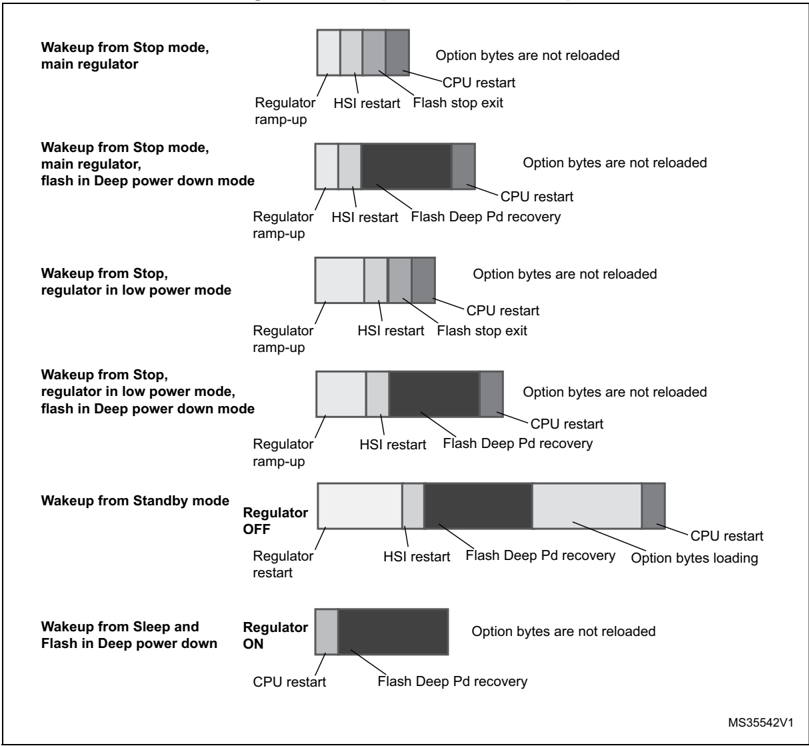

All timings are derived from tests performed under ambient temperature and V DD =3.3 V.

Table 34. Low-power mode wakeup timings (1)

| Symbol           | Parameter                                                                                | Min (1)   | Typ (1)   |   Max (1) | Unit            |
|------------------|------------------------------------------------------------------------------------------|-----------|-----------|-----------|-----------------|
| t WUSLEEP (2)    | Wakeup from Sleep mode                                                                   | -         | 4         |         6 | CPU clock cycle |
| t WUSTOP (2)     | Wakeup from Stop mode, usage of main regulator                                           | -         | 13.5      |      14.5 | µs              |
| t WUSTOP (2)     | Wakeup from Stop mode, usage of main regulator, flash memory in Deep power down mode     | -         | 105       |       111 | µs              |
| t WUSTOP (2)     | Wakeup from Stop mode, regulator in low power mode                                       | -         | 21        |        33 | µs              |
| t WUSTOP (2)     | Wakeup from Stop mode, regulator in low power mode, flash memory in Deep power down mode | -         | 113       |       130 | µs              |
| t WUSTDBY (2)(3) | Wakeup from Standby mode                                                                 | -         | 314       |       407 | µs              |
| t WUFLASH        | Wakeup of Flash from Flash_Stop mode                                                     | -         | -         |         8 | µs              |
| t WUFLASH        | Wakeup of Flash from Flash Deep power down mode                                          | -         | -         |       100 | µs              |

1. Evaluated by characterization - Not tested in production.

2. The wakeup times are measured from the wakeup event to the point in which the application code reads the first instruction.

3. t WUSTDBY  maximum value is given at -40 °C.

## 6.3.8 External clock source characteristics

## High-speed external user clock generated from an external source

In bypass mode the HSE oscillator is switched off and the input pin is a standard I/O. The external clock signal has to respect the Table 53 . However, the recommended clock input waveform is shown in Figure 22 .

The characteristics given in Table 35 result from tests performed using an high-speed external clock source, and under ambient temperature and supply voltage conditions summarized in Table 14 .

Table 35. High-speed external user clock characteristics

| Symbol              | Parameter                                | Conditions         | Min     | Typ   | Max     | Unit   |
|---------------------|------------------------------------------|--------------------|---------|-------|---------|--------|
| f HSE_ext           | External user clock source frequency (1) | -                  | 1       | -     | 50      | MHz    |
| V HSEH              | OSC_IN input pin high level voltage      | -                  | 0.7V DD | -     | V DD    | V      |
| V HSEL              | OSC_IN input pin low level voltage       | -                  | V SS    | -     | 0.3V DD | V      |
| t w(HSEH) t w(HSEL) | OSC_IN high or low time (1)              | -                  | 5       | -     | -       | ns     |
| t r(HSE) t f(HSE)   | OSC_IN rise or fall time (1)             | -                  | -       | -     | 10      | ns     |
| C in(HSE)           | OSC_IN input capacitance (1)             | -                  | -       | 5     | -       | pF     |
| DuCy (HSE)          | Duty cycle                               | -                  | 45      | -     | 55      | %      |
| I L                 | OSC_IN Input leakage current             | V SS ≤ V IN ≤ V DD | -       | -     | ±1      | µA     |

1. Guaranteed by design - Not tested in production.

124

Figure 22. High-speed external clock source AC timing diagram

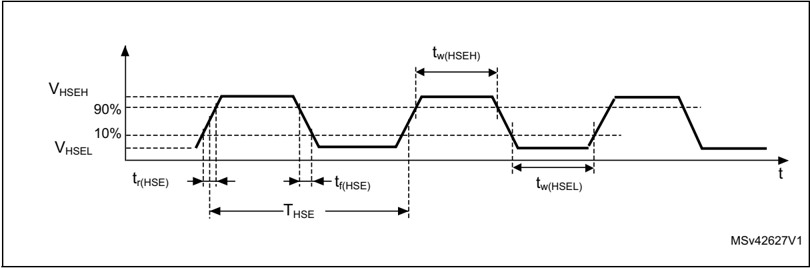

## Low-speed external user clock generated from an external source

In bypass mode the LSE oscillator is switched off and the input pin is a standard I/O. The external clock signal has to respect the Table 53 . However, the recommended clock input waveform is shown in Figure 23 .

The characteristics given in Table 36 result from tests performed using an low-speed external clock source, and under ambient temperature and supply voltage conditions summarized in Table 14 .

Table 36. Low-speed external user clock characteristics

| Symbol              | Parameter                                | Conditions         | Min     | Typ    | Max     | Unit   |
|---------------------|------------------------------------------|--------------------|---------|--------|---------|--------|
| f LSE_ext           | User External clock source frequency (1) | -                  | -       | 32.768 | 1000    | kHz    |
| V LSEH              | OSC32_IN input pin high level voltage    | -                  | 0.7V DD | -      | V DD    | V      |
| V LSEL              | OSC32_IN input pin low level voltage     | -                  | V SS    | -      | 0.3V DD | V      |
| t w(LSEH) t w(LSEL) | OSC32_IN high or low time (1)            | -                  | 450     | -      | -       | ns     |
| t r(LSE) t f(LSE)   | OSC32_IN rise or fall time (1)           | -                  | -       | -      | 50      | ns     |
| C in(LSE)           | OSC32_IN input capacitance (1)           | -                  | -       | 5      | -       | pF     |
| DuCy (LSE)          | Duty cycle                               | -                  | 30      | -      | 70      | %      |
| I L                 | OSC32_IN Input leakage current           | V SS ≤ V IN ≤ V DD | -       | -      | ±1      | µA     |

1. Guaranteed by design - Not tested in production.

Note:

Figure 23. Low-speed external clock source AC timing diagram

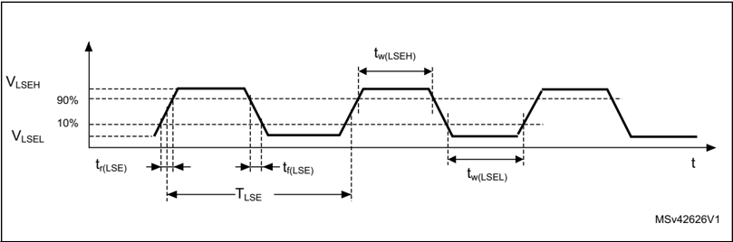

## High-speed external clock generated from a crystal/ceramic resonator

The high-speed external (HSE) clock can be supplied with a 4 to 26 MHz crystal/ceramic resonator oscillator. All the information given in this paragraph are based on characterization results obtained with typical external components specified in Table 37 . In the application, the resonator and the load capacitors have to be placed as close as possible to the oscillator pins in order to minimize output distortion and startup stabilization time. Refer to the crystal resonator manufacturer for more details on the resonator characteristics (frequency, package, accuracy).

Table 37. HSE 4-26 MHz oscillator characteristics (1)

| Symbol        | Parameter                    | Conditions                                  | Min   | Typ   | Max   | Unit   |
|---------------|------------------------------|---------------------------------------------|-------|-------|-------|--------|
| f OSC_IN      | Oscillator frequency         |                                             | 4     | -     | 26    | MHz    |
| R F           | Feedback resistor            |                                             | -     | 200   | -     | k Ω    |
| I DD          | HSE current consumption      | V DD =3.3 V, ESR= 30 Ω , C L =5 pF @25 MHz  | -     | 450   | -     | µA     |
| I DD          | HSE current consumption      | V DD =3.3 V, ESR= 30 Ω , C L =10 pF @25 MHz | -     | 530   | -     | µA     |
| G m_crit_max  | Maximum critical crystal g m | Startup                                     | -     | -     | 1     | mA/V   |
| t SU(HSE) (2) | Startup time                 | V DD is stabilized                          | -     | 2     | -     | ms     |

For C L1 and C L2 , it is recommended to use high-quality external ceramic capacitors in the 5 pF to 25 pF range (Typ.), designed for high-frequency applications, and selected to match the requirements of the crystal or resonator (see Figure 24 ). C L1  and C L2 are usually the same size. The crystal manufacturer typically specifies a load capacitance which is the series combination of C L1  and C L2 . PCB and MCU pin capacitance must be included (10 pF can be used as a rough estimate of the combined pin and board capacitance) when sizing CL1  and C L2 .

For information on selecting the crystal, refer to the application note AN2867 'Oscillator design guide for ST microcontrollers' available from the ST website www.st.com.

124

Figure 24. Typical application with an 8 MHz crystal

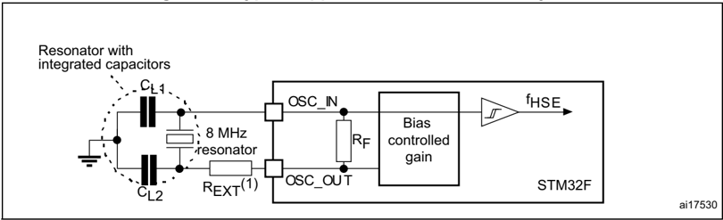

## Low-speed external clock generated from a crystal/ceramic resonator

The low-speed external (LSE) clock can be supplied with a 32.768 kHz crystal/ceramic resonator oscillator. All the information given in this paragraph are based on characterization results obtained with typical external components specified in Table 38 . In the application, the resonator and the load capacitors have to be placed as close as possible to the oscillator pins in order to minimize output distortion and startup stabilization time. Refer to the crystal resonator manufacturer for more details on the resonator characteristics (frequency, package, accuracy).

The LSE high-power mode allows to cover a wider range of possible crystals but with a cost of higher power consumption.

Table 38. LSE oscillator characteristics (f LSE = 32.768 kHz)  (1)

| Symbol        | Parameter                    | Conditions               | Min   | Typ   | Max   | Unit   |
|---------------|------------------------------|--------------------------|-------|-------|-------|--------|
| R F           | Feedback resistor            | -                        | -     | 18.4  | -     | M Ω    |
| I DD          | LSE current consumption      | Low-power mode (default) | -     | -     | 1     | µA     |
| I DD          | LSE current consumption      | High-drive mode          | -     | -     | 3     | µA     |
| G m _crit_max | Maximum critical crystal g m | Startup, low-power mode  | -     | -     | 0.56  | µA/V   |
| G m _crit_max | Maximum critical crystal g m | Startup, high-drive mode | -     | -     | 1.50  | µA/V   |
| t SU(LSE) (2) | startup time                 | V DD is stabilized       | -     | 2     | -     | s      |

Note: For information on selecting the crystal, refer to the application note AN2867 'Oscillator

design guide for ST microcontrollers' available from the ST website www.st.com.

For information about the LSE high-power mode, refer to the reference manual RM0383.

Figure 25. Typical application with a 32.768 kHz crystal

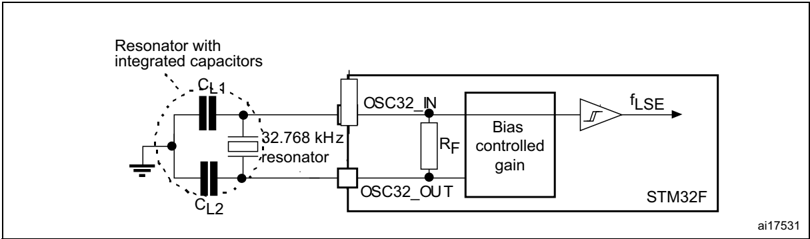

## 6.3.9 Internal clock source characteristics

The parameters given in Table 39 and Table 40 are derived from tests performed under ambient temperature and V DD  supply voltage conditions summarized in Table 14 .

## High-speed internal (HSI) RC oscillator

Table 39. HSI oscillator characteristics  (1)

| Symbol        | Parameter                        | Conditions                                |                                           | Min   | Typ   | Max   | Unit   |
|---------------|----------------------------------|-------------------------------------------|-------------------------------------------|-------|-------|-------|--------|
| f HSI         | Frequency                        | -                                         | -                                         | -     | 16    | -     | MHz    |
| ACC HSI       | Accuracy of the HSI oscillator   | User-trimmed with the RCC_CR register (2) | User-trimmed with the RCC_CR register (2) | -     | -     | 1     | %      |
| ACC HSI       | Accuracy of the HSI oscillator   | Factory- calibrated                       | T A = - 40 to 125 °C (3)                  | - 8   | -     | 5.5   |        |
| ACC HSI       | Accuracy of the HSI oscillator   | Factory- calibrated                       | T A = - 40 to 105 °C (3)                  | - 8   | -     | 4.5   | %      |
| ACC HSI       | Accuracy of the HSI oscillator   | Factory- calibrated                       | T A = - 10 to 85 °C (3)                   | - 4   | -     | 4     | %      |
| ACC HSI       | Accuracy of the HSI oscillator   | Factory- calibrated                       | T A = 25 °C (4)                           | - 1   | -     | 1     | %      |
| t su(HSI) (2) | HSI oscillator startup time      |                                           |                                           | -     | 2.2   | 4     | µs     |
| I DD(HSI) (2) | HSI oscillator power consumption |                                           |                                           | -     | 60    | 80    | µA     |

1. VDD  = 3.3 V, T A  = - 40 to 125 °C unless otherwise specified.
2. Guaranteed by design - Not tested in production.
3. Evaluated by characterization - Not tested in production.
4. Factory calibrated non-soldered parts.

L

124

Figure 26. ACC HSI  versus temperature

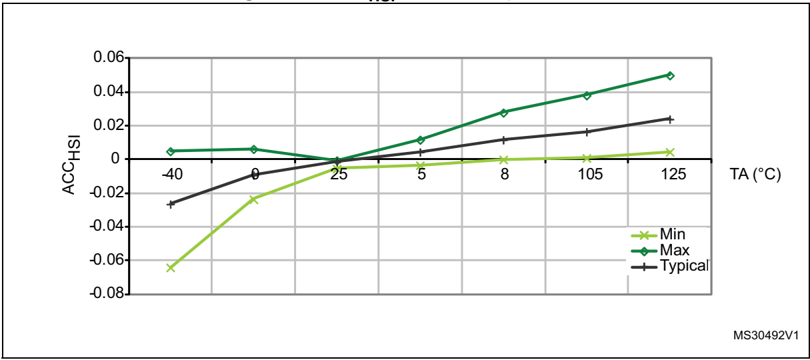

1. Evaluated by characterization - Not tested in production.

## Low-speed internal (LSI) RC oscillator

Table 40. LSI oscillator characteristics  (1)

| Symbol        | Parameter                        | Min   |   Typ |   Max | Unit   |
|---------------|----------------------------------|-------|-------|-------|--------|
| f LSI (2)     | Frequency                        | 17    |    32 |    47 | kHz    |
| t su(LSI) (3) | LSI oscillator startup time      | -     |    15 |    40 | µs     |
| I DD(LSI) (3) | LSI oscillator power consumption | -     |   0.4 |   0.6 | µA     |

1. VDD  = 3 V, T A  = -40 to 125 °C unless otherwise specified.
2. Evaluated by characterization - Not tested in production.
3. Guaranteed by design - Not tested in production.

Figure 27. ACC LSI  versus temperature

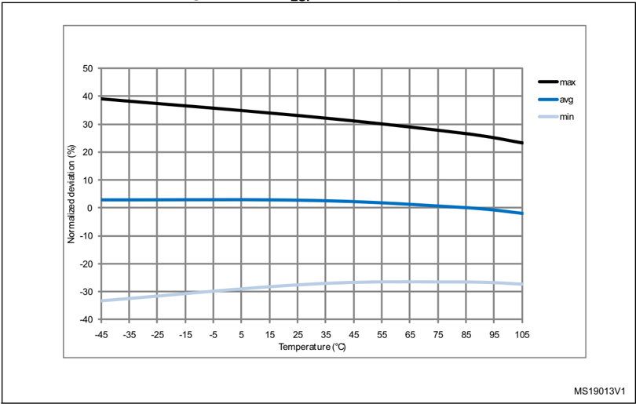

## 6.3.10 PLL characteristics

The parameters given in Table 41 and Table 42 are derived from tests performed under temperature and V DD  supply voltage conditions summarized in Table 14 .

Table 41. Main PLL characteristics

| Symbol      | Parameter                          | Conditions           | Conditions         | Min      | Typ   | Max   | Unit   |
|-------------|------------------------------------|----------------------|--------------------|----------|-------|-------|--------|
| f PLL_IN    | PLL input clock (1)                |                      |                    | 0.95 (2) | 1     | 2.10  | MHz    |
| f PLL_OUT   | PLL multiplier output clock        |                      |                    | 24       | -     | 100   | MHz    |
| f PLL48_OUT | 48 MHz PLL multiplier output clock |                      |                    | -        | 48    | 75    | MHz    |
| f VCO_OUT   | PLL VCO output                     |                      |                    | 100      | -     | 432   | MHz    |
| t LOCK      | PLL lock time                      | VCO freq = 100 MHz   | VCO freq = 100 MHz | 75       | -     | 200   | µs     |
| t LOCK      | PLL lock time                      | VCO freq = 432 MHz   | VCO freq = 432 MHz | 100      | -     | 300   | µs     |
| Jitter (3)  |                                    | System clock 100 MHz | RMS                | -        | 25    | -     | ps     |
| Jitter (3)  | Cycle-to-cycle jitter              | System clock 100 MHz | peak to peak       | -        | ± 150 | -     | ps     |
| Jitter (3)  | Period Jitter                      | System clock 100 MHz | RMS                | -        | 15    | -     | ps     |
| Jitter (3)  | Period Jitter                      | System clock 100 MHz | peak to peak       | -        | ± 200 | -     | ps     |

124

Table 41. Main PLL characteristics (continued)

| Symbol         | Parameter                     | Conditions                            | Min       | Typ   | Max       | Unit   |
|----------------|-------------------------------|---------------------------------------|-----------|-------|-----------|--------|
| I DD(PLL) (4)  | PLL power consumption on VDD  | VCO freq = 100 MHz VCO freq = 432 MHz | 0.15 0.45 | -     | 0.40 0.75 | mA     |
| I DDA(PLL) (4) | PLL power consumption on VDDA | VCO freq = 100 MHz VCO freq = 432 MHz | 0.30 0.55 | -     | 0.40 0.85 | mA     |

2. Guaranteed by design - Not tested in production.
3. The use of two PLLs in parallel could degraded the Jitter up to +30%.
4. Evaluated by characterization - Not tested in production.
1. Take care of using the appropriate division factor M to have the specified PLL input clock values.
2. Guaranteed by design - Not tested in production.
3. Value given with main PLL running.
4. Evaluated by characterization - Not tested in production.

Table 42. PLLI2S (audio PLL) characteristics

| Symbol            | Parameter                            | Conditions                                                             | Conditions                                                             | Min            | Typ   | Max            | Unit   |
|-------------------|--------------------------------------|------------------------------------------------------------------------|------------------------------------------------------------------------|----------------|-------|----------------|--------|
| f PLLI2S_IN       | PLLI2S input clock (1)               | -                                                                      | -                                                                      | 0.95 (2)       | 1     | 2.10           | MHz    |
| f PLLI2S_OUT      | PLLI2S multiplier output clock       | -                                                                      | -                                                                      | -              | -     | 216            | MHz    |
| f VCO_OUT         | PLLI2S VCO output                    | -                                                                      | -                                                                      | 100            | -     | 432            | MHz    |
| t LOCK            | PLLI2S lock time                     | VCO freq = 100 MHz                                                     | VCO freq = 100 MHz                                                     | 75             | -     | 200            | µs     |
| t LOCK            | PLLI2S lock time                     | VCO freq = 432 MHz                                                     | VCO freq = 432 MHz                                                     | 100            | -     | 300            | µs     |
| Jitter (3)        | Master I2S clock jitter              | Cycle to cycle at 12.288 MHz on                                        | RMS                                                                    | -              | 90    | -              | ps     |
| Jitter (3)        | Master I2S clock jitter              | 48 kHz period, N=432, R=5 peak to peak Average frequency of 12.288 MHz | 48 kHz period, N=432, R=5 peak to peak Average frequency of 12.288 MHz |                |       |                | ps     |
| Jitter (3)        | WS I2S clock jitter                  | N = 432, R = 5 on 1000 samples Cycle to cycle at 48 KHz                | N = 432, R = 5 on 1000 samples Cycle to cycle at 48 KHz                | -              | 90    | - -            | ps     |
| I DD(PLLI2S) (4)  | PLLI2S power consumption on V        | on 1000 samples VCO freq = 100 MHz                                     | on 1000 samples VCO freq = 100 MHz                                     | - 0.15         | 400 - | 0.40           | mA     |
| I DDA(PLLI2S) (4) | DD PLLI2S power consumption on V DDA | VCO freq = 432 MHz VCO freq = 100 MHz VCO freq = 432 MHz               | VCO freq = 432 MHz VCO freq = 100 MHz VCO freq = 432 MHz               | 0.45 0.30 0.55 | -     | 0.75 0.40 0.85 | mA     |

## 6.3.11 PLL spread spectrum clock generation (SSCG) characteristics

The spread spectrum clock generation (SSCG) feature allows to reduce electromagnetic interferences (see Table 49: EMI characteristics for LQFP100 ). It is available only on the main PLL.

Table 43. SSCG parameter constraints

| Symbol            | Parameter                              | Min   | Typ   | Max (1)   | Unit   |
|-------------------|----------------------------------------|-------|-------|-----------|--------|
| f Mod             | Modulation frequency                   | -     | -     | 10        | kHz    |
| md                | Peak modulation depth                  | 0.25  | -     | 2         | %      |
| MODEPER * INCSTEP | (Modulation period) * (Increment Step) | -     | -     | 2 15 -1   | -      |

## Equation 1

The frequency modulation period (MODEPER) is given by the equation below:

<!-- formula-not-decoded -->

f PLL\_IN and f Mod  must be expressed in Hz.

As an example:

If f PLL\_IN = 1 MHz, and f MOD = 1 kHz, the modulation depth (MODEPER) is given by equation 1:

<!-- formula-not-decoded -->

## Equation 2

Equation 2 allows to calculate the increment step (INCSTEP):

<!-- formula-not-decoded -->

f VCO\_OUT  must be expressed in MHz.

With a modulation depth (md) = ± 2 % (4 % peak to peak), and PLLN = 240 (in MHz):

<!-- formula-not-decoded -->

An amplitude quantization error may be generated because the linear modulation profile is obtained by taking the quantized values (rounded to the nearest integer) of MODPER and INCSTEP. As a result, the achieved modulation depth is quantized. The percentage quantized modulation depth is given by the following formula:

<!-- formula-not-decoded -->

As a result:

<!-- formula-not-decoded -->

124

Figure 28 and Figure 29 show the main PLL output clock waveforms in center spread and down spread modes, where:

F0 is f PLL\_OUT  nominal.

T mode  is the modulation period.

md is the modulation depth.

Figure 28. PLL output clock waveforms in center spread mode

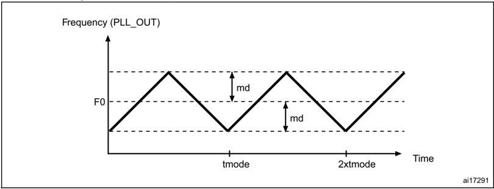

Figure 29. PLL output clock waveforms in down spread mode

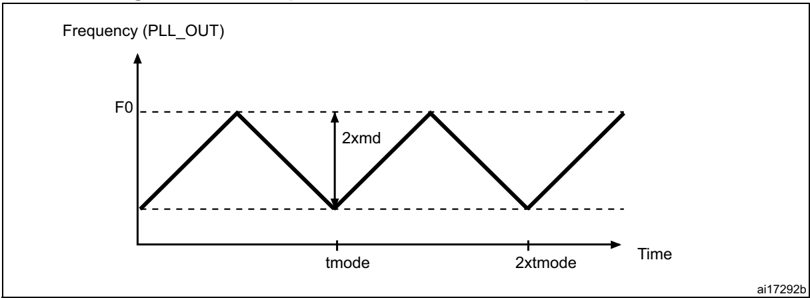

## 6.3.12 Memory characteristics

## Flash memory

The characteristics are given at T A  = - 40 to 125 °C unless otherwise specified.

The devices are shipped to customers with the flash memory erased.

Table 44. Flash memory characteristics

| Symbol   | Parameter      | Conditions                              | Min   |   Typ | Max   | Unit   |
|----------|----------------|-----------------------------------------|-------|-------|-------|--------|
| I DD     | Supply current | Write / Erase 8-bit mode, V DD = 1.7 V  | -     |     5 | -     | mA     |
| I DD     | Supply current | Write / Erase 16-bit mode, V DD = 2.1 V | -     |     8 | -     | mA     |
| I DD     | Supply current | Write / Erase 32-bit mode, V DD = 3.3 V | -     |    12 | -     | mA     |

Table 45. Flash memory programming

| Symbol       | Parameter                  | Conditions                                    | Min (1)   | Typ   | Max (1)   | Unit   |
|--------------|----------------------------|-----------------------------------------------|-----------|-------|-----------|--------|
| t prog       | Word programming time      | Program/erase parallelism (PSIZE) = x 8/16/32 | -         | 16    | 100 (2)   | µs     |
| t ERASE16KB  | Sector (16 KB) erase time  | Program/erase parallelism (PSIZE) = x 8       | -         | 400   | 800       | ms     |
| t ERASE16KB  | Sector (16 KB) erase time  | Program/erase parallelism (PSIZE) = x 16      | -         | 300   | 600       | ms     |
| t ERASE16KB  | Sector (16 KB) erase time  | Program/erase parallelism (PSIZE) = x 32      | -         | 250   | 500       | ms     |
| t ERASE64KB  | Sector (64 KB) erase time  | Program/erase parallelism (PSIZE) = x 8       | -         | 1200  | 2400      | ms     |
| t ERASE64KB  | Sector (64 KB) erase time  | Program/erase parallelism (PSIZE) = x 16      | -         | 700   | 1400      | ms     |
| t ERASE64KB  | Sector (64 KB) erase time  | Program/erase parallelism (PSIZE) = x 32      | -         | 550   | 1100      | ms     |
| t ERASE128KB | Sector (128 KB) erase time | Program/erase parallelism (PSIZE) = x 8       | -         | 2     | 4         | s      |
| t ERASE128KB | Sector (128 KB) erase time | Program/erase parallelism (PSIZE) = x 16      | -         | 1.3   | 2.6       | s      |
| t ERASE128KB | Sector (128 KB) erase time | Program/erase parallelism (PSIZE) = x 32      | -         | 1     | 2         | s      |
| t ME         | Mass erase time            | Program/erase parallelism (PSIZE) = x 8       | -         | 8     | 16        | s      |
| t ME         | Mass erase time            | Program/erase parallelism (PSIZE) = x 16      | -         | 5.5   | 11        | s      |
| t ME         | Mass erase time            | Program/erase parallelism (PSIZE) = x 32      | -         | 4     | 8         | s      |
| V prog       | Programming voltage        | 32-bit program operation                      | 2.7       | -     | 3.6       | V      |
| V prog       | Programming voltage        | 16-bit program operation                      | 2.1       | -     | 3.6       | V      |
| V prog       | Programming voltage        | 8-bit program operation                       | 1.7       | -     | 3.6       | V      |

Table 46. Flash memory programming with V PP  voltage

| Symbol       | Parameter                  | Conditions                                  | Min (1)   |   Typ | Max (1)   | Unit   |
|--------------|----------------------------|---------------------------------------------|-----------|-------|-----------|--------|
| t prog       | Double word programming    | T A = 0 to +40 °C V DD = 3.3 V V PP = 8.5 V | -         |    16 | 100 (2)   | µs     |
| t ERASE16KB  | Sector (16 KB) erase time  | T A = 0 to +40 °C V DD = 3.3 V V PP = 8.5 V | -         |   230 | -         | ms     |
| t ERASE64KB  | Sector (64 KB) erase time  | T A = 0 to +40 °C V DD = 3.3 V V PP = 8.5 V | -         |   490 | -         | ms     |
| t ERASE128KB | Sector (128 KB) erase time | T A = 0 to +40 °C V DD = 3.3 V V PP = 8.5 V | -         |   875 | -         | ms     |
| t ME         | Mass erase time            | T A = 0 to +40 °C V DD = 3.3 V V PP = 8.5 V | -         |  3.50 | -         | s      |

124

Table 46. Flash memory programming with V PP  voltage  (continued)

| Symbol    | Parameter                                    | Conditions   | Min (1)   | Typ   | Max (1)   | Unit   |
|-----------|----------------------------------------------|--------------|-----------|-------|-----------|--------|
| V prog    | Programming voltage                          |              | 2.7       | -     | 3.6       | V      |
| V PP      | V PP voltage range                           |              | 7         | -     | 9         | V      |
| I PP      | Minimum current sunk on the V PP pin         |              | 10        | -     | -         | mA     |
| t VPP (3) | Cumulative time during which V PP is applied |              | -         | -     | 1         | hour   |

Table 47. Flash memory endurance and data retention

| Symbol   | Parameter      | Conditions                                                                                                          |   Value Min (1) | Unit    |
|----------|----------------|---------------------------------------------------------------------------------------------------------------------|-----------------|---------|
| N END    | Endurance      | T A = - 40 to + 85 °C (temp. range 6) T A = - 40 to + 105 °C (temp. range 7) T A = - 40 to + 125 °C (temp. range 3) |              10 | kcycles |
| t RET    | Data retention | 1 kcycle (2) at T A = 85 °C                                                                                         |              30 | Years   |
| t RET    | Data retention | 1 kcycle (2) at T A = 105 °C                                                                                        |              10 | Years   |
| t RET    | Data retention | 1 kcycle (2) at T A = 125 °C                                                                                        |               3 | Years   |
| t RET    | Data retention | 10 kcycle (2) at T A = 55 °C                                                                                        |              20 | Years   |

## 6.3.13 EMC characteristics

Susceptibility tests are performed on a sample basis during device characterization.

## Functional EMS (electromagnetic susceptibility)

While a simple application is executed on the device (toggling 2 LEDs through I/O ports). the device is stressed by two electromagnetic events until a failure occurs. The failure is indicated by the LEDs:

- Electrostatic discharge (ESD) (positive and negative) is applied to all device pins until a functional disturbance occurs. This test is compliant with the IEC 61000-4-2 standard.
- FTB : A burst of fast transient voltage (positive and negative) is applied to V DD  and V SS through a 100 pF capacitor, until a functional disturbance occurs. This test is compliant with the IEC 61000-4-4 standard.

A device reset allows normal operations to be resumed.

The test results are given in Table 49 . They are based on the EMS levels and classes defined in application note AN1709.

Table 48. EMS characteristics for LQFP100 package

| Symbol   | Parameter                                                                                                                 | Conditions                                                                                | Level/ Class   |
|----------|---------------------------------------------------------------------------------------------------------------------------|-------------------------------------------------------------------------------------------|----------------|
| V FESD   | Voltage limits to be applied on any I/O pin to induce a functional disturbance                                            | V DD = 3.3 V, LQFP100, WLCSP49, T A = +25 °C, f HCLK = 100 MHz, conforms to IEC 61000-4-2 | 2B             |
| V EFTB   | Fast transient voltage burst limits to be applied through 100 pF on V DD and V SS pins to induce a functional disturbance | V DD = 3.3 V, LQFP100, WLCSP49, T A = +25 °C, f HCLK = 100 MHz, conforms to IEC 61000-4-4 | 4A             |

When the application is exposed to a noisy environment, it is recommended to avoid pin exposition to disturbances. The pins showing a middle range robustness are: PA0, PA1, PA2, on LQFP100 packages and PDR\_ON on WLCSP49.

As a consequence, it is recommended to add a serial resistor (1 k Ω maximum) located as close as possible to the MCU to the pins exposed to noise (connected to tracks longer than 50 mm on PCB).

## Designing hardened software to avoid noise problems

EMC characterization and optimization are performed at component level with a typical application environment and simplified MCU software. It should be noted that good EMC performance is highly dependent on the user application and the software in particular.

Therefore it is recommended that the user applies EMC software optimization and prequalification tests in relation with the EMC level requested for his application.

## Software recommendations

The software flowchart must include the management of runaway conditions such as:

- Corrupted program counter
- Unexpected reset
- Critical Data corruption (control registers...)

## Prequalification trials

Most of the common failures (unexpected reset and program counter corruption) can be reproduced by manually forcing a low state on the NRST pin or the Oscillator pins for 1 second.

To complete these trials, ESD stress can be applied directly on the device, over the range of specification values. When unexpected behavior is detected, the software can be hardened to prevent unrecoverable errors occurring (see application note AN1015).

124

## Electromagnetic Interference (EMI)

The electromagnetic field emitted by the device are monitored while a simple application, executing EEMBC code, is running. This emission test is compliant with SAE IEC61967-2 standard which specifies the test board and the pin loading.

Table 49. EMI characteristics for LQFP100

| Symbol   | Parameter   | Conditions                                          | Monitored frequency band   |   Max vs. [f HSE /f CPU ] 8/84 MHz | Unit   |
|----------|-------------|-----------------------------------------------------|----------------------------|------------------------------------|--------|
| S EMI    | Peak level  | V DD = 3.6 V, T A = 25 °C, conforming to IEC61967-2 | 0.1 to 30 MHz              |                                 19 | dBµV   |
| S EMI    | Peak level  | V DD = 3.6 V, T A = 25 °C, conforming to IEC61967-2 | 30 to 130 MHz              |                                 17 | dBµV   |
| S EMI    | Peak level  | V DD = 3.6 V, T A = 25 °C, conforming to IEC61967-2 | 130 MHz to 1 GHz           |                                 12 | dBµV   |
| S EMI    | Peak level  | V DD = 3.6 V, T A = 25 °C, conforming to IEC61967-2 | SAE EMI Level              |                                3.5 | -      |

## 6.3.14 Absolute maximum ratings (electrical sensitivity)

Based on three different tests (ESD, LU) using specific measurement methods, the device is stressed in order to determine its performance in terms of electrical sensitivity.

## Electrostatic discharge (ESD)

Electrostatic discharges (a positive then a negative pulse separated by 1 second) are applied to the pins of each sample according to each pin combination. The sample size depends on the number of supply pins in the device (3 parts × (n+1) supply pins). This test conforms to the JESD22-A114/C101 standard.

Table 50. ESD absolute maximum ratings

| Symbol     | Ratings                                               | Conditions                                   |                                        |   Class |   Maximum value (1) | Unit   |
|------------|-------------------------------------------------------|----------------------------------------------|----------------------------------------|---------|---------------------|--------|
| V ESD(HBM) | Electrostatic discharge voltage (human body model)    | T A = +25 °C conforming to JESD22-A114       | T A = +25 °C conforming to JESD22-A114 |       2 |                2000 | V      |
| V ESD(CDM) | Electrostatic discharge voltage (charge device model) | T A = +25 °C conforming to ANSI/ESD STM5.3.1 | UFBGA100, UFQFPN48                     |       4 |                 500 | V      |
| V ESD(CDM) | Electrostatic discharge voltage (charge device model) | T A = +25 °C conforming to ANSI/ESD STM5.3.1 | WLCSP49                                |       3 |                 400 | V      |
| V ESD(CDM) | Electrostatic discharge voltage (charge device model) | T A = +25 °C conforming to ANSI/ESD STM5.3.1 | LQPF64, LQFP100                        |       3 |                 250 | V      |

## Static latchup

Two complementary static tests are required on six parts to assess the latchup performance:

- A supply overvoltage is applied to each power supply pin
- A current injection is applied to each input, output and configurable I/O pin

These tests are compliant with EIA/JESD 78A IC latchup standard.

Table 51. Electrical sensitivities

| Symbol   | Parameter             | Conditions                           | Class      |
|----------|-----------------------|--------------------------------------|------------|
| LU       | Static latch-up class | T A = + 125 °C conforming to JESD78A | II level A |

## 6.3.15 I/O current injection characteristics

As a general rule, current injection to the I/O pins, due to external voltage below V SS  or above V DD  (for standard, 3 V-capable I/O pins) should be avoided during normal product operation. However, in order to give an indication of the robustness of the microcontroller in cases when abnormal injection accidentally happens, susceptibility tests are performed on a sample basis during device characterization.

## Functional susceptibility to I/O current injection

While a simple application is executed on the device, the device is stressed by injecting current into the I/O pins programmed in floating input mode. While current is injected into the I/O pin, one at a time, the device is checked for functional failures.

The failure is indicated by an out of range parameter: ADC error above a certain limit (&gt;5 LSB TUE), out of conventional limits of induced leakage current on adjacent pins (out of -5 µA/+0 µA range), or other functional failure (for example reset, oscillator frequency deviation).

Negative induced leakage current is caused by negative injection and positive induced leakage current by positive injection.

The test results are given in Table 52 .

Table 52. I/O current injection susceptibility (1)

|        |                                                                                                                                                           | Functional susceptibility   | Functional susceptibility   |      |
|--------|-----------------------------------------------------------------------------------------------------------------------------------------------------------|-----------------------------|-----------------------------|------|
| Symbol | Description                                                                                                                                               | Negative injection          | Positive injection          | Unit |
| I INJ  | Injected current on BOOT0 pin                                                                                                                             | -0                          | NA                          | mA   |
| I INJ  | Injected current on NRST pin                                                                                                                              | -0                          | NA                          | mA   |
| I INJ  | Injected current on PB3, PB4, PB5, PB6, PB7, PB8, PB9, PC13, PC14, PC15, PH1, PDR_ON, PC0, PC1,PC2, PC3, PD1, PD5, PD6, PD7, PE0, PE2, PE3, PE4, PE5, PE6 | -0                          | NA                          | mA   |
| I INJ  | Injected current on any other FT pin                                                                                                                      | -5                          | NA                          | mA   |
| I INJ  | Injected current on any other pins                                                                                                                        | -5                          | +5                          | mA   |

124

Note:

It is recommended to add a Schottky diode (pin to ground) to analog pins which may potentially inject negative currents.

## 6.3.16 I/O port characteristics

## General input/output characteristics

Unless otherwise specified, the parameters given in Table 53 are derived from tests performed under the conditions summarized in Table 14 . All I/Os are CMOS and TTL compliant.

Table 53. I/O static characteristics

| Symbol   | Parameter                                        | Conditions                                   | Min               | Typ          | Max              | Unit   |
|----------|--------------------------------------------------|----------------------------------------------|-------------------|--------------|------------------|--------|
| V IL     | FT, TC and NRST I/O input low level voltage      | 1.7 V ≤ V DD ≤ 3.6 V                         | -                 | -            | 0.3V DD (1)      | V      |
| V IL     | BOOT0 I/O input low level voltage                | 1.75 V ≤ V DD ≤ 3.6 V, -40 °C ≤ T A ≤ 125 °C | -                 | -            | 0.1V DD +0.1 (2) | V      |
| V IL     | BOOT0 I/O input low level voltage                | 1.7 V ≤ V DD ≤ 3.6 V, 0 °C ≤ T A ≤ 125 °C    | -                 | -            | 0.1V DD +0.1 (2) | V      |
| V IH     | FT, TC and NRST I/O input high level voltage (5) | 1.7 V ≤ V DD ≤ 3.6 V                         | 0.7V DD (1 )      | -            | -                | V      |
| V IH     | BOOT0 I/O input high level voltage               | 1.75 V ≤ V DD ≤ 3.6 V, -40 °C ≤ T A ≤ 125 °C | 0.17V DD +0.7 (2) | -            | -                | V      |
| V IH     | BOOT0 I/O input high level voltage               | 1.7 V ≤ V DD ≤ 3.6 V, 0 °C ≤ T A ≤ 125 °C    | 0.17V DD +0.7 (2) | -            | -                | V      |
| V HYS    | FT, TC and NRST I/O input hysteresis             | 1.7 V ≤ V DD ≤ 3.6 V                         | -                 | 10% V DD (3) | -                | V      |
| V HYS    | BOOT0 I/O input hysteresis                       | 1.75 V ≤ V DD ≤ 3.6 V, -40 °C ≤ T A ≤ 125 °C | -                 | 100          | -                | mV     |
| V HYS    | BOOT0 I/O input hysteresis                       | 1.7 V ≤ V DD ≤ 3.6 V, 0 °C ≤ T A ≤ 125 °C    | -                 | 100          | -                | mV     |
| I lkg    | I/O input leakage current (4)                    | V SS ≤ V IN ≤ V DD                           | -                 | -            | ± 1              | µA     |
| I lkg    | I/O FT/TC input leakage current (5)              | V IN = 5 V                                   | -                 | -            | 3                | µA     |

Table 53. I/O static characteristics (continued)

| Symbol   | Parameter                              | Parameter                            | Conditions   | Min   |   Typ | Max   | Unit   |
|----------|----------------------------------------|--------------------------------------|--------------|-------|-------|-------|--------|
| R PU     | Weak pull-up equivalent resistor (6)   | All pins except for PA10 (OTG_FS_ID) | V IN = V SS  | 30    |    40 | 50    | k Ω    |
| R PU     | Weak pull-up equivalent resistor (6)   | PA10 (OTG_FS_ID)                     | -            | 7     |    10 | 14    | k Ω    |
| R PD     | Weak pull-down equivalent resistor (7) | All pins except for PA10 (OTG_FS_ID) | V IN = V DD  | 30    |    40 | 50    | k Ω    |
| R PD     | Weak pull-down equivalent resistor (7) | PA10 (OTG_FS_ID)                     | -            | 7     |    10 | 14    | k Ω    |
| C IO (8) | I/O pin capacitance                    | I/O pin capacitance                  | -            | -     |     5 | -     | pF     |

1. Guaranteed by test in production.
2. Guaranteed by design - Not tested in production.
3. With a minimum of 200 mV.
4. Leakage could be higher than the maximum value, if negative current is injected on adjacent pins, Refer to Table 52: I/O current injection susceptibility
5. To sustain a voltage higher than VDD +0.3 V, the internal pull-up/pull-down resistors must be disabled. Leakage could be higher than the maximum value, if negative current is injected on adjacent pins.Refer to Table 52: I/O current injection susceptibility
6. Pull-up resistors are designed with a true resistance in series with a switchable PMOS. This PMOS contribution to the series resistance is minimum (~10% order).
7. Pull-down resistors are designed with a true resistance in series with a switchable NMOS. This NMOS contribution to the series resistance is minimum (~10% order).
8. Hysteresis voltage between Schmitt trigger switching levels. Evaluated by characterization - Not tested in production.

All I/Os are CMOS and TTL compliant (no software configuration required). Their characteristics cover more than the strict CMOS-technology or TTL parameters. The coverage of these requirements for FT and TC I/Os is shown in Figure 30 .

124

Figure 30. FT/TC I/O input characteristics

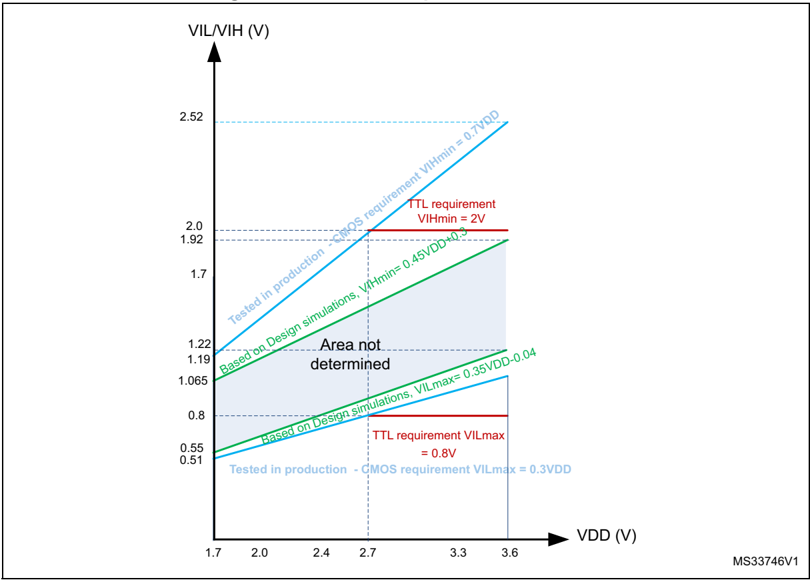

## Output driving current

The GPIOs (general purpose input/outputs) can sink or source up to ± 8 mA, and sink or source up to ± 20 mA (with a relaxed V OL /V OH ) except PC13, PC14 and PC15 which can sink or source up to ± 3mA. When using the PC13 to PC15 GPIOs in output mode, the speed should not exceed 2 MHz with a maximum load of 30 pF.

In the user application, the number of I/O pins which can drive current must be limited to respect the absolute maximum rating specified in Section 6.2 . In particular:

- The sum of the currents sourced by all the I/Os on V DD,  plus the maximum Run consumption of the MCU sourced on V DD,  cannot exceed the absolute maximum rating Σ I VDD  (see Table 12 ).
- The sum of the currents sunk by all the I/Os on V SS  plus the maximum Run consumption of the MCU sunk on V SS  cannot exceed the absolute maximum rating Σ I VSS  (see Table 12 ).

## Output voltage levels

Unless otherwise specified, the parameters given in Table 54 are derived from tests performed under ambient temperature and V DD  supply voltage conditions summarized in Table 14 . All I/Os are CMOS and TTL compliant.

Table 54. Output voltage characteristics

| Symbol   | Parameter                                | Conditions                                      | Min           | Max     | Unit   |
|----------|------------------------------------------|-------------------------------------------------|---------------|---------|--------|
| V OL (1) | Output low level voltage for an I/O pin  | CMOS port (2) I IO = +8 mA 2.7 V ≤ V DD ≤ 3.6 V | -             | 0.4     | V      |
| V OH (3) | Output high level voltage for an I/O pin | CMOS port (2) I IO = +8 mA 2.7 V ≤ V DD ≤ 3.6 V | V DD -0.4     | -       | V      |
| V OL (1) | Output low level voltage for an I/O pin  | TTL port (2) I IO =+8 mA 2.7 V ≤ V DD ≤ 3.6 V   | -             | 0.4     | V      |
| V OH (3) | Output high level voltage for an I/O pin | TTL port (2) I IO =+8 mA 2.7 V ≤ V DD ≤ 3.6 V   | 2.4           | -       | V      |
| V OL (1) | Output low level voltage for an I/O pin  | I IO = +20 mA 2.7 V ≤ V DD ≤ 3.6 V              | -             | 1.3 (4) | V      |
| V OH (3) | Output high level voltage for an I/O pin | I IO = +20 mA 2.7 V ≤ V DD ≤ 3.6 V              | V DD -1.3 (4) | -       | V      |
| V OL (1) | Output low level voltage for an I/O pin  | I IO = +6 mA 1.8 V ≤ V DD ≤ 3.6 V               | -             | 0.4 (4) | V      |
| V OH (3) | Output high level voltage for an I/O pin | I IO = +6 mA 1.8 V ≤ V DD ≤ 3.6 V               | V DD -0.4 (4) | -       | V      |
| V OL (1) | Output low level voltage for an I/O pin  | I IO = +4 mA 1.7 V ≤ V DD ≤ 3.6 V               | -             | 0.4 (5) | V      |
| V OH (3) | Output high level voltage for an I/O pin | I IO = +4 mA 1.7 V ≤ V DD ≤ 3.6 V               | V DD -0.4 (5) | -       | V      |

4. Evaluated by characterization - Not tested in production.
5. Guaranteed by design - Not tested in production.

124

## Input/output AC characteristics

The definition and values of input/output AC characteristics are given in Figure 31 and Table 55 , respectively.

Unless otherwise specified, the parameters given in Table 55 are derived from tests performed under the ambient temperature and V DD  supply voltage conditions summarized in Table 14 .

Table 55. I/O AC characteristics (1)(2)

|   OSPEEDRy [1:0] bit value (1) | Symbol                  | Parameter                                                                 | Conditions                         | Min   | Typ   | Max     | Unit   |
|--------------------------------|-------------------------|---------------------------------------------------------------------------|------------------------------------|-------|-------|---------|--------|
|                             00 | f max(IO)out            | Maximum frequency (3)                                                     | C L = 50 pF, V DD ≥ 2.70 V         | -     | -     | 4       | MHz    |
|                             00 | f max(IO)out            | Maximum frequency (3)                                                     | C L = 50 pF, V DD ≥ 1.7 V          | -     | -     | 2       | MHz    |
|                             00 | f max(IO)out            | Maximum frequency (3)                                                     | C L = 10 pF, V DD ≥ 2.70 V         | -     | -     | 8       | MHz    |
|                             00 | f max(IO)out            | Maximum frequency (3)                                                     | C L = 10 pF, V DD ≥ 1.7 V          | -     | -     | 4       | MHz    |
|                             00 | t f(IO)out / t r(IO)out | Output high to low level fall time and output low to high level rise time | C L = 50 pF, V DD = 1.7 V to 3.6 V | -     | -     | 100     | ns     |
|                             01 | f max(IO)out            | Maximum frequency (3)                                                     | C L = 50 pF, V DD ≥ 2.70 V         | -     | -     | 25      | MHz    |
|                             01 | f max(IO)out            | Maximum frequency (3)                                                     | C L = 50 pF, V DD ≥ 1.7 V          | -     | -     | 12.5    | MHz    |
|                             01 | f max(IO)out            | Maximum frequency (3)                                                     | C L = 10 pF, V DD ≥ 2.70 V         | -     | -     | 50      | MHz    |
|                             01 | f max(IO)out            | Maximum frequency (3)                                                     | C L = 10 pF, V DD ≥ 1.7 V          | -     | -     | 20      | MHz    |
|                             01 | t f(IO)out / t r(IO)out | Output high to low level fall time and output low to high level rise time | C L = 50 pF, V DD ≥ 2.7 V          | -     | -     | 10      | ns     |
|                             01 | t f(IO)out / t r(IO)out | Output high to low level fall time and output low to high level rise time | C L = 50 pF, V DD ≥ 1.7 V          | -     | -     | 20      | ns     |
|                             01 | t f(IO)out / t r(IO)out | Output high to low level fall time and output low to high level rise time | C L = 10 pF, V DD ≥ 2.70 V         | -     | -     | 6       | ns     |
|                             01 | t f(IO)out / t r(IO)out | Output high to low level fall time and output low to high level rise time | C L = 10 pF, V DD ≥ 1.7 V          | -     | -     | 10      | ns     |
|                             10 | f max(IO)out            | Maximum frequency (3)                                                     | C L = 40 pF, V DD ≥ 2.70 V         | -     | -     | 50 (4)  | MHz    |
|                             10 | f max(IO)out            | Maximum frequency (3)                                                     | C L = 40 pF, V DD ≥ 1.7 V          | -     | -     | 25      | MHz    |
|                             10 | f max(IO)out            | Maximum frequency (3)                                                     | C L = 10 pF, V DD ≥ 2.70 V         | -     | -     | 100 (4) | MHz    |
|                             10 | f max(IO)out            | Maximum frequency (3)                                                     | C L = 10 pF, V DD ≥ 1.7 V          | -     | -     | 50 (4)  | MHz    |
|                             10 | t f(IO)out / t r(IO)out | Output high to low level fall time and output low to high level rise time | C L = 40 pF, V DD ≥ 2.70 V         | -     | -     | 6       | ns     |
|                             10 | t f(IO)out / t r(IO)out | Output high to low level fall time and output low to high level rise time | C L = 40 pF, V DD ≥ 1.7 V          | -     | -     | 10      | ns     |
|                             10 | t f(IO)out / t r(IO)out | Output high to low level fall time and output low to high level rise time | C L = 10 pF, V DD ≥ 2.70 V         | -     | -     | 4       | ns     |
|                             10 | t f(IO)out / t r(IO)out | Output high to low level fall time and output low to high level rise time | C L = 10 pF, V DD ≥ 1.7 V          | -     | -     | 6       | ns     |

Table 55. I/O AC characteristics (1)(2)  (continued)

| OSPEEDRy [1:0] bit value (1)   | Symbol                  | Parameter                                                                 | Conditions                 | Min   | Typ   | Max     | Unit   |
|--------------------------------|-------------------------|---------------------------------------------------------------------------|----------------------------|-------|-------|---------|--------|
| 11                             | F max(IO)out            | Maximum frequency (3)                                                     | C L = 30 pF, V DD ≥ 2.70 V | -     | -     | 100 (4) |        |
| 11                             | F max(IO)out            | Maximum frequency (3)                                                     | C L = 30 pF, V DD ≥ 1.7 V  | -     | -     | 50 (4)  | MHz    |
| 11                             | t f(IO)out / t r(IO)out | Output high to low level fall time and output low to high level rise time | C L = 30 pF, V DD ≥ 2.70 V | -     | -     | 4       | ns     |
| 11                             | t f(IO)out / t r(IO)out | Output high to low level fall time and output low to high level rise time | C L = 30 pF, V DD ≥ 1.7 V  | -     | -     | 6       | ns     |
| 11                             | t f(IO)out / t r(IO)out | Output high to low level fall time and output low to high level rise time | C L = 10 pF, V DD ≥ 2.70 V | -     | -     | 2.5     | ns     |
| 11                             | t f(IO)out / t r(IO)out | Output high to low level fall time and output low to high level rise time | C L = 10 pF, V DD ≥ 1.7 V  | -     | -     | 4       | ns     |
| -                              | t EXTIpw                | Pulse width of external signals detected by the EXTI controller           |                            | 10    | -     | -       | ns     |

1. Evaluated by characterization - Not tested in production.
2. The I/O speed is configured using the OSPEEDRy[1:0] bits. Refer to the STM32F4xx reference manual for a description of the GPIOx\_SPEEDR GPIO port output speed register.
3. The maximum frequency is defined in Figure 31 .
4. For maximum frequencies above 50 MHz and V DD  &gt; 2.4 V, the compensation cell should be used.

Figure 31. I/O AC characteristics definition

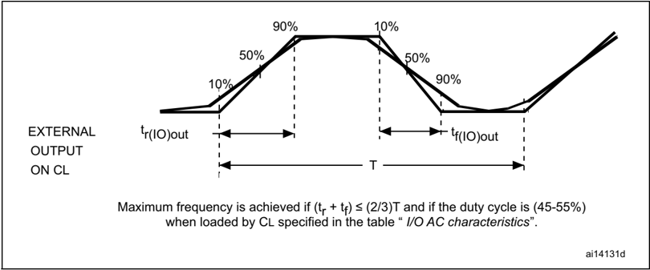

124

## 6.3.17 NRST pin characteristics

The NRST pin input driver uses CMOS technology. It is connected to a permanent pull-up resistor, R PU  (see Table 53 ).

Unless otherwise specified, the parameters given in Table 56 are derived from tests performed under the ambient temperature and V DD  supply voltage conditions summarized in Table 14 . Refer to Table 53: I/O static characteristics for the values of VIH and VIL for NRST pin.

Table 56. NRST pin characteristics

| Symbol         | Parameter                            | Conditions            | Min   | Typ   | Max   | Unit   |
|----------------|--------------------------------------|-----------------------|-------|-------|-------|--------|
| R PU           | Weak pull-up equivalent resistor (1) | V IN = V SS           | 30    | 40    | 50    | k Ω    |
| V F(NRST) (2)  | NRST Input filtered pulse            |                       | -     | -     | 100   | ns     |
| V NF(NRST) (2) | NRST Input not filtered pulse        | V DD > 2.7 V          | 300   | -     | -     | ns     |
| T NRST_OUT     | Generated reset pulse duration       | Internal Reset source | 20    | -     | -     | µs     |

2. Guaranteed by design - Not tested in production.
1. The reset network protects the device against parasitic resets.
2. The user must ensure that the level on the NRST pin can go below the V IL(NRST)  max level specified in Table 56 . Otherwise the reset is not taken into account by the device.

Figure 32. Recommended NRST pin protection

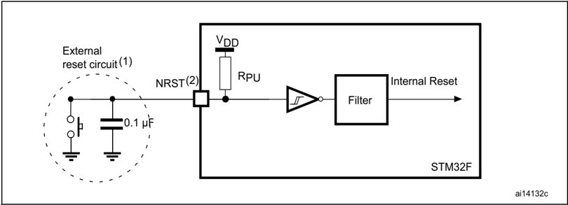

## 6.3.18 TIM timer characteristics

The parameters given in Table 57 are guaranteed by design.

Refer to Section 6.3.16: I/O port characteristics for details on the input/output alternate function characteristics (output compare, input capture, external clock, PWM output).

Table 57. TIMx characteristics (1)(2)

| Symbol      | Parameter                                                   | Conditions (3)                                      | Min    | Max           | Unit      |
|-------------|-------------------------------------------------------------|-----------------------------------------------------|--------|---------------|-----------|
| t res(TIM)  | Timer resolution time                                       | AHB/APBx prescaler=1 or 2 or 4, f TIMxCLK = 100 MHz | 1      | -             | t TIMxCLK |
| t res(TIM)  |                                                             | AHB/APBx prescaler=1 or 2 or 4, f TIMxCLK = 100 MHz | 11.9   | -             | ns        |
| t res(TIM)  |                                                             | AHB/APBx prescaler>4, f TIMxCLK = 100 MHz           | 1      | -             | t TIMxCLK |
| t res(TIM)  |                                                             | AHB/APBx prescaler>4, f TIMxCLK = 100 MHz           | 11.9   | -             | ns        |
| f EXT       | Timer external clock frequency on CH1 to CH4                | f TIMxCLK = 100 MHz                                 | 0      | f TIMxCLK /2  | MHz       |
| f EXT       |                                                             | f TIMxCLK = 100 MHz                                 | 0      | 50            | MHz       |
| Res TIM     | Timer resolution                                            | f TIMxCLK = 100 MHz                                 | -      | 16/32         | bit       |
| t COUNTER   | 16-bit counter clock period when internal clock is selected | f TIMxCLK = 100 MHz                                 | 0.0119 | 780           | µs        |
| t MAX_COUNT | Maximum possible count with 32-bit counter                  |                                                     | -      | 65536 × 65536 | t TIMxCLK |
| t MAX_COUNT |                                                             | f TIMxCLK = 100 MHz                                 | -      | 51.1          | S         |

## 6.3.19 Communications interfaces

## I 2 C interface characteristics

The I 2 C interface meets the requirements of the standard I 2 C communication protocol with the following restrictions: the I/O pins SDA and SCL are mapped to are not 'true' opendrain. When configured as open-drain, the PMOS connected between the I/O pin and V DD  is disabled, but is still present.

The I 2 C characteristics are described in Table 58 . Refer also to Section 6.3.16: I/O port characteristics for more details on the input/output alternate function characteristics (SDA and SCL).

The I 2 C bus interface supports standard mode (up to 100 kHz) and fast mode (up to 400 kHz). The I 2 C bus frequency can be increased up to 1 MHz. For more details about the complete solution, please contact your local ST sales representative.

124

## Table 58. I 2 C characteristics

| Symbol            | Parameter                                                                                 | Standard mode I 2 C (1)(2)   | Standard mode I 2 C (1)(2)   | Fast mode I 2 C (1)(2)   | Fast mode I 2 C (1)(2)   | Unit   |
|-------------------|-------------------------------------------------------------------------------------------|------------------------------|------------------------------|--------------------------|--------------------------|--------|
| Symbol            | Parameter                                                                                 | Min                          | Max                          | Min                      | Max                      | Unit   |
| t w(SCLL)         | SCL clock low time                                                                        | 4.7                          | -                            | 1.3                      | -                        | µs     |
| t w(SCLH)         | SCL clock high time                                                                       | 4.0                          | -                            | 0.6                      | -                        | µs     |
| t su(SDA)         | SDA setup time                                                                            | 250                          | -                            | 100                      | -                        | ns     |
| t h(SDA)          | SDA data hold time                                                                        | 0                            | 3450 (3)                     | 0                        | 900 (4)                  | ns     |
| t r(SDA) t r(SCL) | SDA and SCL rise time                                                                     | -                            | 1000                         | -                        | 300                      | ns     |
| t f(SDA) t f(SCL) | SDA and SCL fall time                                                                     | -                            | 300                          | -                        | 300                      | ns     |
| t h(STA)          | Start condition hold time                                                                 | 4.0                          | -                            | 0.6                      | -                        | µs     |
| t su(STA)         | Repeated Start condition setup time                                                       | 4.7                          | -                            | 0.6                      | -                        | µs     |
| t su(STO)         | Stop condition setup time                                                                 | 4.0                          | -                            | 0.6                      | -                        | µs     |
| t w(STO:STA)      | Stop to Start condition time (bus free)                                                   | 4.7                          | -                            | 1.3                      | -                        | µs     |
| t SP              | Pulse width of the spikes that are suppressed by the analog filter for standard fast mode | 0                            | 50 (5)                       | 0                        | 50 (5)                   | ns     |
| C b               | Capacitive load for each bus line                                                         | -                            | 400                          | -                        | 400                      | pF     |

2. f PCLK1  must be at least 2 MHz to achieve standard mode I 2 C frequencies. It must be at least 4 MHz to achieve fast mode I 2 C frequencies, and a multiple of 10 MHz to reach the 400 kHz maximum I 2 C fast mode clock.
3. The device must internally provide a hold time of at least 300 ns for the SDA signal in order to bridge the undefined region of the falling edge of SCL.
4. The maximum data hold time has only to be met if the interface does not stretch the low period of SCL signal.
5. The minimum width of the spikes filtered by the analog filter is above t SP  (max)

Figure 33. I 2 C bus AC waveforms and measurement circuit

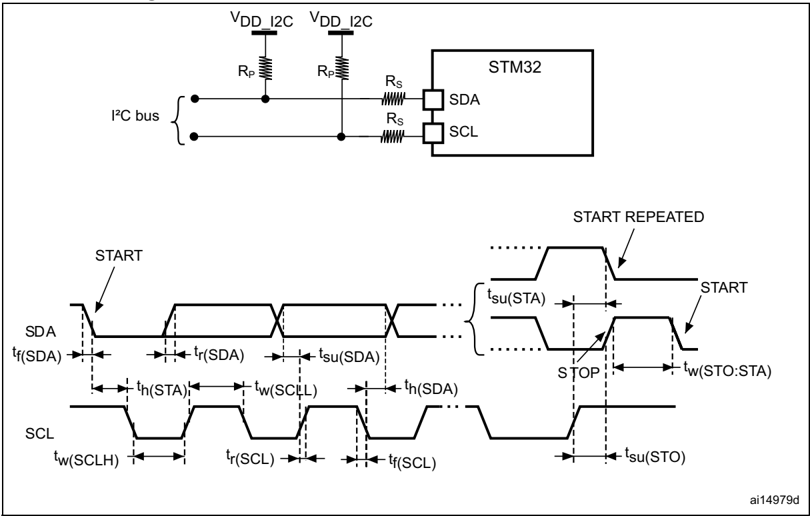

1. RS = series protection resistor.
2. RP  = external pull-up resistor.
3. VDD\_I2C  is the I2C bus power supply.
1. RP  = External pull-up resistance, f SCL  = I 2 C speed
2. For speeds around 200 kHz, the tolerance on the achieved speed is of ± 5%. For other speed ranges, the tolerance on the achieved speed is ± 2%. These variations depend on the accuracy of the external components used to design the application.

Table 59. SCL frequency (f PCLK1 = 50 MHz, V DD  = V DD\_I2C  = 3.3 V) (1)(2)

|   f SCL (kHz) | I2C_CCR value   |
|---------------|-----------------|
|               | R P = 4.7 k Ω   |
|           400 | 0x8019          |
|           300 | 0x8021          |
|           200 | 0x8032          |
|           100 | 0x0096          |
|            50 | 0x012C          |
|            20 | 0x02EE          |

124

## SPI interface characteristics

Unless otherwise specified, the parameters given in Table 60 for the SPI interface are derived from tests performed under the ambient temperature, f PCLKx  frequency and V DD supply voltage conditions summarized in Table 14 , with the following configuration:

- Output speed is set to OSPEEDRy[1:0] = 10
- Capacitive load C = 30 pF
- Measurement points are done at CMOS levels: 0.5V DD

Refer to Section 6.3.16: I/O port characteristics for more details on the input/output alternate function characteristics (NSS, SCK, MOSI, MISO for SPI).

Table 60. SPI dynamic characteristics (1)

| Symbol              | Parameter                         | Conditions                                                       | Min          | Typ    | Max         | Unit   |
|---------------------|-----------------------------------|------------------------------------------------------------------|--------------|--------|-------------|--------|
| f SCK 1/t c(SCK)    | SPI clock frequency               | Master full duplex/receiver mode, 2.7 V < V DD < 3.6 V SPI1/4/5  | -            | -      | 42          | MHz    |
| f SCK 1/t c(SCK)    | SPI clock frequency               | Master full duplex/receiver mode, 3.0 V < V DD < 3.6 V SPI1/4/5  | -            | -      | 50          | MHz    |
| f SCK 1/t c(SCK)    | SPI clock frequency               | Master transmitter mode 1.7 V < V DD < 3.6 V SPI1/4/5            | -            | -      | 50          | MHz    |
| f SCK 1/t c(SCK)    | SPI clock frequency               | Master mode 1.7 V < V DD < 3.6 V SPI1/2/3/4/5                    | -            | -      | 25          | MHz    |
| f SCK 1/t c(SCK)    | SPI clock frequency               | Slave transmitter/full duplex mode 2.7 V < V DD < 3.6 V SPI1/4/5 | -            | -      | 38 (2)      | MHz    |
| f SCK 1/t c(SCK)    | SPI clock frequency               | Slave receiver mode, 1.8 V < V DD < 3.6 V SPI1/4/5               | -            | -      | 50          | MHz    |
| f SCK 1/t c(SCK)    | SPI clock frequency               | Slave mode, 1.8 V < V DD < 3.6 V SPI1/2/3/4/5                    | -            | -      | 25          | MHz    |
| Duty(SCK)           | Duty cycle of SPI clock frequency | Slave mode                                                       | 30           | 50     | 70          | %      |
| t w(SCKH) t w(SCKL) | SCK high and low time             | Master mode, SPI presc = 2                                       | T PCLK - 1.5 | T PCLK | T PCLK +1.5 | ns     |
| t su(NSS)           | NSS setup time                    | Slave mode, SPI presc = 2                                        | 3T PCLK      | -      | -           | ns     |
| t h(NSS)            | NSS hold time                     | Slave mode, SPI presc = 2                                        | 2T PCLK      | -      | -           | ns     |
| t su(MI)            | Data input setup time             | Master mode                                                      | 4            | -      | -           | ns     |
| t su(SI)            | Data input setup time             | Slave mode                                                       | 2.5          | -      | -           | ns     |
| t h(MI)             | Data input hold time              | Master mode                                                      | 7.5          | -      | -           | ns     |
| t h(SI)             | Data input hold time              | Slave mode                                                       | 3.5          | -      | -           | ns     |

Table 60. SPI dynamic characteristics (1)  (continued)

| Symbol    | Parameter                | Conditions                                           | Min   | Typ   | Max   | Unit   |
|-----------|--------------------------|------------------------------------------------------|-------|-------|-------|--------|
| t a(SO )  | Data output access time  | Slave mode                                           | 7     | -     | 21    | ns     |
| t dis(SO) | Data output disable time | Slave mode                                           | 5     | -     | 12    | ns     |
| t v(SO)   | Data output valid time   | Slave mode (after enable edge), 2.7 V < V DD < 3.6 V | -     | 11    | 13    | ns     |
| t v(SO)   | Data output valid time   | Slave mode (after enable edge), 1.7 V < V DD < 3.6 V | -     | 11    | 18.5  | ns     |
| t h(SO)   | Data output hold time    | Slave mode (after enable edge), 1.7 V < V DD < 3.6 V | 8     | -     | -     | ns     |
| t v(MO)   | Data output valid time   | Master mode (after enable edge)                      | -     | 4     | 6     | ns     |
| t h(MO)   | Data output hold time    | Master mode (after enable edge)                      | 0     | -     | -     | ns     |

Figure 34. SPI timing diagram - slave mode and CPHA = 0

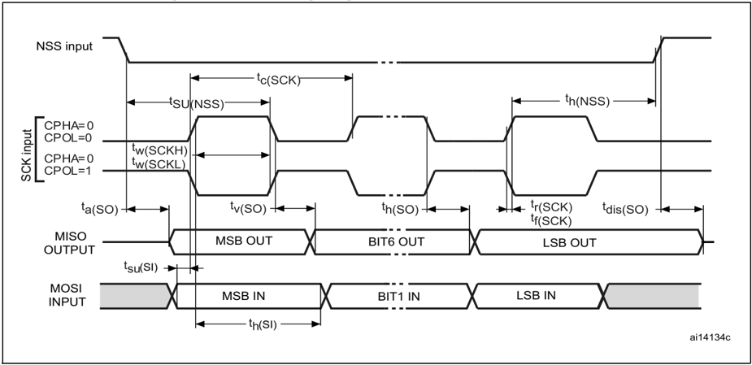

124

Figure 35. SPI timing diagram - slave mode and CPHA = 1 (1)

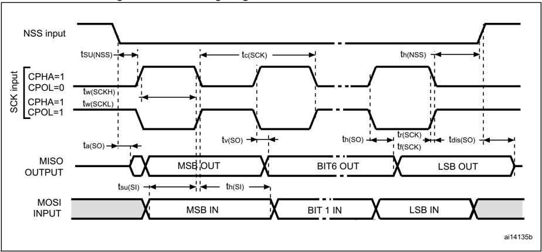

Figure 36. SPI timing diagram - master mode (1)

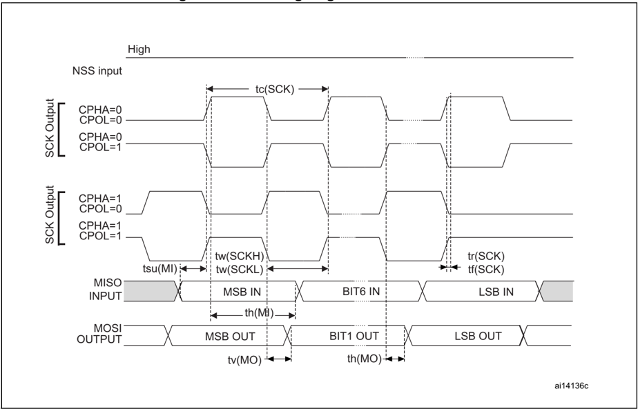

## I 2 S interface characteristics

Unless otherwise specified, the parameters given in Table 61 for the I 2 S interface are derived from tests performed under the ambient temperature, f PCLKx  frequency and V DD supply voltage conditions summarized in Table 14 , with the following configuration:

- Output speed is set to OSPEEDRy[1:0] = 10
- Capacitive load C = 30 pF
- Measurement points are done at CMOS levels: 0.5V DD

Refer to Section 6.3.16: I/O port characteristics for more details on the input/output alternate function characteristics (CK, SD, WS).

Table 61. I 2 S dynamic characteristics (1)

| Symbol      | Parameter                      | Conditions                             | Min    | Max        | Unit   |
|-------------|--------------------------------|----------------------------------------|--------|------------|--------|
| f MCK       | I2S Main clock output          | -                                      | 256x8K | 256xFs (2) | MHz    |
| f CK        | I2S clock frequency            | Master data: 32 bits                   | -      | 64xFs      | MHz    |
| f CK        | I2S clock frequency            | Slave data: 32 bits                    | -      | 64xFs      | MHz    |
| D CK        | I2S clock frequency duty cycle | Slave receiver                         | 30     | 70         | %      |
| t v(WS)     | WS valid time                  | Master mode                            | 0      | 7          |        |
| t h(WS)     | WS hold time                   | Master mode                            | 1.5    | -          |        |
| t su(WS)    | WS setup time                  | Slave mode                             | 1.5    | -          |        |
| t h(WS)     | WS hold time                   | Slave mode                             | 3      | -          |        |
| t su(SD_MR) | Data input setup time          | Master receiver                        | 1      | -          |        |
| t su(SD_SR) | Data input setup time          | Slave receiver                         | 2.5    | -          | ns     |
| t h(SD_MR)  | Data input hold time           | Master receiver                        | 7      | -          |        |
| t h(SD_SR)  | Data input hold time           | Slave receiver                         | 2.5    | -          |        |
| t v(SD_ST)  | Data output valid time         | Slave transmitter (after enable edge)  | -      | 20         |        |
| t v(SD_MT)  | Data output valid time         | Master transmitter (after enable edge) | -      | 6          |        |
| t h(SD_ST)  | Data output hold time          | Slave transmitter (after enable edge)  | 8      | -          |        |
| t h(SD_MT)  | Data output hold time          | Master transmitter (after enable edge) | 2      | -          |        |

## Note:

Refer to the I2S section of RM0383 reference manual for more details on the sampling frequency (F S ).

f MCK , f CK , and D CK values reflect only the digital peripheral behavior. The values of these parameters might be slightly impacted by the source clock precision. D CK  depends mainly on the value of ODD bit. The digital contribution leads to a minimum value of (I2SDIV/(2*I2SDIV+ODD) and a maximum value of (I2SDIV+ODD)/(2*I2SDIV+ODD). F S maximum value is supported for each mode/condition.

124

## Figure 37. I 2 S slave timing diagram (Philips protocol) (1)

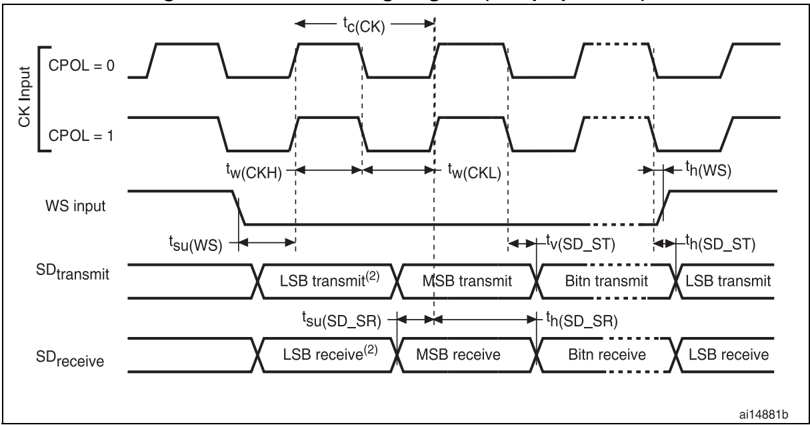

1. LSB transmit/receive of the previously transmitted byte. No LSB transmit/receive is sent before the first byte.

## Figure 38. I 2 S master timing diagram (Philips protocol) (1)

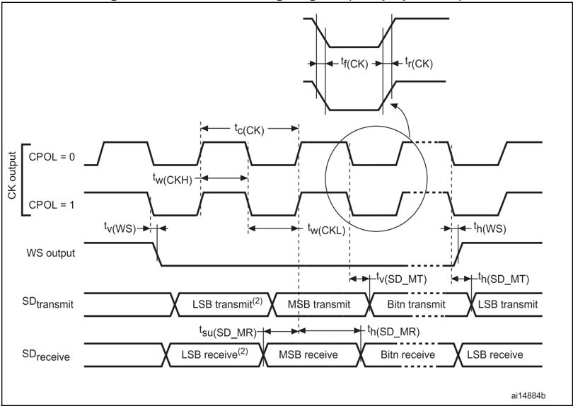

1. LSB transmit/receive of the previously transmitted byte. No LSB transmit/receive is sent before the first byte.

## USB OTG full speed (FS) characteristics

This interface is present in USB OTG FS controller.

Table 62. USB OTG FS startup time

| Symbol        | Parameter                           |   Max | Unit   |
|---------------|-------------------------------------|-------|--------|
| t STARTUP (1) | USB OTG FS transceiver startup time |     1 | µs     |

Table 63. USB OTG FS DC electrical characteristics

| Symbol        | Symbol   | Parameter                       | Conditions                  | Min. (1)   | Typ.   | Max. (1)   | Unit   |
|---------------|----------|---------------------------------|-----------------------------|------------|--------|------------|--------|
|               | V DD     | USB OTG FS operating voltage    |                             | 3.0 (2)    | -      | 3.6        | V      |
|               | V DI (3) | Differential input sensitivity  | I(USB_FS_DP/DM)             | 0.2        | -      | -          | V      |
|               | V CM (3) | Differential common mode range  | Includes V DI range         | 0.8        | -      | 2.5        | V      |
|               | V SE (3) | Single ended receiver threshold |                             | 1.3        | -      | 2.0        | V      |
| Output levels | V OL     | Static output level low         | R L of 1.5 k Ω to 3.6 V (4) | -          | -      | 0.3        | V      |
| Output levels | V OH     | Static output level high        | R L of 15 k Ω to V SS (4)   | 2.8        | -      | 3.6        | V      |
|               | PD       | PA11, PA12 (USB_FS_DM/DP)       | V IN = V DD                 | 17         | 21     | 24         | k Ω    |
|               |          | PA9 (OTG_FS_VBUS)               | V IN = V DD                 | 0.65       | 1.1    | 2.0        | k Ω    |
| R PU          | R PU     | PA11, PA12 (USB_FS_DM/DP)       | V IN = V SS                 | 1.5        | 1.8    | 2.1        | k Ω    |
|               |          | PA9 (OTG_FS_VBUS)               | V IN = V SS                 | 0.25       | 0.37   | 0.55       | k Ω    |

2. The USB OTG FS functionality is ensured down to 2.7 V but not the full USB full speed electrical characteristics which are degraded in the 2.7-to-3.0 V V DD  voltage range.
3. Guaranteed by design - Not tested in production.
4. RL  is the load connected on the USB OTG FS drivers.

Note: When VBUS sensing feature is enabled, PA9 should be left at their default state (floating input), not as alternate function. A typical 200 µA current consumption of the embedded sensing block (current to voltage conversion to determine the different sessions) can be observed on PA9 when the feature is enabled.

124

Figure 39. USB OTG FS timings: definition of data signal rise and fall time

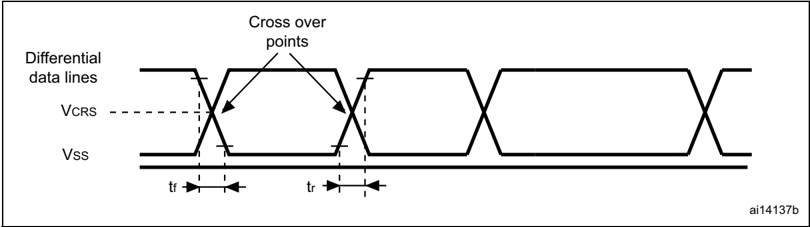

Table 64. USB OTG FS electrical characteristics (1)

| Driver characteristics   | Driver characteristics          | Driver characteristics   | Driver characteristics   | Driver characteristics   | Driver characteristics   |
|--------------------------|---------------------------------|--------------------------|--------------------------|--------------------------|--------------------------|
| Symbol                   | Parameter                       | Conditions               | Min                      | Max                      | Unit                     |
| t r                      | Rise time (2)                   | C L = 50 pF              | 4                        | 20                       | ns                       |
| t f                      | Fall time (2)                   | C L = 50 pF              | 4                        | 20                       | ns                       |
| t rfm                    | Rise/ fall time matching        | t r /t f                 | 90                       | 110                      | %                        |
| V CRS                    | Output signal crossover voltage |                          | 1.3                      | 2.0                      | V                        |

## 6.3.20 12-bit ADC characteristics

Unless otherwise specified, the parameters given in Table 65 are derived from tests performed under the ambient temperature, f PCLK2  frequency and V DDA  supply voltage conditions summarized in Table 14 .

Table 65. ADC characteristics

| Symbol       | Parameter                          | Conditions                        | Min                                | Typ   | Max    | Unit    |
|--------------|------------------------------------|-----------------------------------|------------------------------------|-------|--------|---------|
| V DDA        | Power supply                       | V DDA - V REF+ < 1.2 V            | 1.7 (1)                            | -     | 3.6    | V       |
| V REF+       | Positive reference voltage         | V DDA - V REF+ < 1.2 V            | 1.7 (1)                            | -     | V DDA  | V       |
| f ADC        | ADC clock frequency                | V DDA = 1.7 (1) to 2.4 V          | 0.6                                | 15    | 18     | MHz     |
| f ADC        | ADC clock frequency                | V DDA = 2.4 to 3.6 V              | 0.6                                | 30    | 36     | MHz     |
| f TRIG (2)   | External trigger frequency         | f ADC = 30 MHz, 12-bit resolution | -                                  | -     | 1764   | kHz     |
| f TRIG (2)   | External trigger frequency         |                                   | -                                  | -     | 17     | 1/f ADC |
| V AIN        | Conversion voltage range (3)       |                                   | 0 (V SSA or V REF- tied to ground) | -     | V REF+ | V       |
| R AIN (2)    | External input impedance           | See Equation 1 for details        | -                                  | -     | 50     | k Ω     |
| R ADC (2)(4) | Sampling switch resistance         |                                   | -                                  | -     | 6      | k Ω     |
| C ADC (2)    | Internal sample and hold capacitor |                                   | -                                  | 4     | 7      | pF      |

## Table 65. ADC characteristics (continued)

| Symbol      | Parameter                                              | Conditions                                                                 | Min                                                                        | Typ                                                                        | Max                                                                        | Unit    |
|-------------|--------------------------------------------------------|----------------------------------------------------------------------------|----------------------------------------------------------------------------|----------------------------------------------------------------------------|----------------------------------------------------------------------------|---------|
| t lat (2)   | Injection trigger conversion latency                   | f ADC = 30 MHz                                                             | -                                                                          | -                                                                          | 0.100                                                                      | µs      |
| t lat (2)   | Injection trigger conversion latency                   |                                                                            | -                                                                          | -                                                                          | 3 (5)                                                                      | 1/f ADC |
| t latr (2)  | Regular trigger conversion latency                     | f ADC = 30 MHz                                                             | -                                                                          | -                                                                          | 0.067                                                                      | µs      |
| t latr (2)  | Regular trigger conversion latency                     |                                                                            | -                                                                          | -                                                                          | 2 (5)                                                                      | 1/f ADC |
| t S (2)     | Sampling time                                          | f ADC = 30 MHz                                                             | 0.100                                                                      | -                                                                          | 16                                                                         | µs      |
| t S (2)     | Sampling time                                          |                                                                            | 3                                                                          | -                                                                          | 480                                                                        | 1/f ADC |
| t STAB (2)  | Power-up time                                          |                                                                            | -                                                                          | 2                                                                          | 3                                                                          | µs      |
| t CONV (2)  | Total conversion time (including sampling time)        | f ADC = 30 MHz 12-bit resolution                                           | 0.50                                                                       | -                                                                          | 16.40                                                                      | µs      |
| t CONV (2)  | Total conversion time (including sampling time)        | f ADC = 30 MHz 10-bit resolution                                           | 0.43                                                                       | -                                                                          | 16.34                                                                      | µs      |
| t CONV (2)  | Total conversion time (including sampling time)        | f ADC = 30 MHz 8-bit resolution                                            | 0.37                                                                       | -                                                                          | 16.27                                                                      | µs      |
| t CONV (2)  | Total conversion time (including sampling time)        | f ADC = 30 MHz 6-bit resolution                                            | 0.30                                                                       | -                                                                          | 16.20                                                                      | µs      |
| t CONV (2)  | Total conversion time (including sampling time)        | 9 to 492 (t S for sampling +n-bit resolution for successive approximation) | 9 to 492 (t S for sampling +n-bit resolution for successive approximation) | 9 to 492 (t S for sampling +n-bit resolution for successive approximation) | 9 to 492 (t S for sampling +n-bit resolution for successive approximation) | 1/f ADC |
| f S (2)     | Sampling rate (f ADC = 30 MHz, and t S = 3 ADC cycles) | 12-bit resolution Single ADC                                               | -                                                                          | -                                                                          | 2                                                                          | Msps    |
| f S (2)     | Sampling rate (f ADC = 30 MHz, and t S = 3 ADC cycles) | 12-bit resolution Interleave Dual ADC mode                                 | -                                                                          | -                                                                          | 3.75                                                                       | Msps    |
| f S (2)     | Sampling rate (f ADC = 30 MHz, and t S = 3 ADC cycles) | 12-bit resolution Interleave Triple ADC mode                               | -                                                                          | -                                                                          | 6                                                                          | Msps    |
| I VREF+ (2) | ADC V REF DC current consumption in conversion mode    |                                                                            | -                                                                          | 300                                                                        | 500                                                                        | µA      |
| I VDDA (2)  | ADC V DDA DC current consumption in conversion mode    |                                                                            | -                                                                          | 1.6                                                                        | 1.8                                                                        | mA      |

1. VDDA  minimum value of 1.7 V is possible with the use of an external power supply supervisor (refer to Section 3.15.2: Internal reset OFF ).
2. Evaluated by characterization - Not tested in production.
3. VREF+  is internally connected to V DDA  and V REFis internally connected to V SSA .
4. RADC  maximum value is given for V DD =1.7 V, and minimum value for V DD =3.3 V.
5. For external triggers, a delay of 1/f PCLK2  must be added to the latency specified in Table 65 .

124

## Equation 1: R AIN  max formula

<!-- formula-not-decoded -->

The formula above ( Equation 1 ) is used to determine the maximum external impedance allowed for an error below 1/4 of LSB. N = 12 (from 12-bit resolution) and k is the number of sampling periods defined in the ADC\_SMPR1 register.

Table 66. ADC accuracy at f ADC  = 18 MHz (1)

| Symbol   | Parameter                    | Test conditions                                                               | Typ   | Max (2)   | Unit   |
|----------|------------------------------|-------------------------------------------------------------------------------|-------|-----------|--------|
| ET       | Total unadjusted error       | f ADC =18 MHz V DDA = 1.7 to 3.6 V V REF = 1.7 to 3.6 V V DDA - V REF < 1.2 V | ±3    | ±4        | LSB    |
| EO       | Offset error                 | f ADC =18 MHz V DDA = 1.7 to 3.6 V V REF = 1.7 to 3.6 V V DDA - V REF < 1.2 V | ±2    | ±3        | LSB    |
| EG       | Gain error                   | f ADC =18 MHz V DDA = 1.7 to 3.6 V V REF = 1.7 to 3.6 V V DDA - V REF < 1.2 V | ±1    | ±3        | LSB    |
| ED       | Differential linearity error | f ADC =18 MHz V DDA = 1.7 to 3.6 V V REF = 1.7 to 3.6 V V DDA - V REF < 1.2 V | ±1    | ±2        | LSB    |
| EL       | Integral linearity error     | f ADC =18 MHz V DDA = 1.7 to 3.6 V V REF = 1.7 to 3.6 V V DDA - V REF < 1.2 V | ±2    | ±3        | LSB    |

Table 67. ADC accuracy at f ADC  = 30 MHz (1)

| Symbol   | Parameter                    | Test conditions                                                                                    | Typ   | Max (2)   | Unit   |
|----------|------------------------------|----------------------------------------------------------------------------------------------------|-------|-----------|--------|
| ET       | Total unadjusted error       | f ADC = 30 MHz, R AIN < 10 k Ω , V DDA = 2.4 to 3.6 V, V REF = 1.7 to 3.6 V, V DDA - V REF < 1.2 V | ±2    | ±5        | LSB    |
| EO       | Offset error                 | f ADC = 30 MHz, R AIN < 10 k Ω , V DDA = 2.4 to 3.6 V, V REF = 1.7 to 3.6 V, V DDA - V REF < 1.2 V | ±1.5  | ±2.5      | LSB    |
| EG       | Gain error                   | f ADC = 30 MHz, R AIN < 10 k Ω , V DDA = 2.4 to 3.6 V, V REF = 1.7 to 3.6 V, V DDA - V REF < 1.2 V | ±1.5  | ±4        | LSB    |
| ED       | Differential linearity error | f ADC = 30 MHz, R AIN < 10 k Ω , V DDA = 2.4 to 3.6 V, V REF = 1.7 to 3.6 V, V DDA - V REF < 1.2 V | ±1    | ±2        | LSB    |
| EL       | Integral linearity error     | f ADC = 30 MHz, R AIN < 10 k Ω , V DDA = 2.4 to 3.6 V, V REF = 1.7 to 3.6 V, V DDA - V REF < 1.2 V | ±1.5  | ±3        | LSB    |

2. Evaluated by characterization - Not tested in production.

Table 68. ADC accuracy at f ADC  = 36 MHz (1)

| Symbol   | Parameter                    | Test conditions                                                                 | Typ   | Max (2)   | Unit   |
|----------|------------------------------|---------------------------------------------------------------------------------|-------|-----------|--------|
| ET       | Total unadjusted error       | f ADC =36 MHz, V DDA = 2.4 to 3.6 V, V REF = 1.7 to 3.6 V V DDA - V REF < 1.2 V | ±4    | ±7        | LSB    |
| EO       | Offset error                 | f ADC =36 MHz, V DDA = 2.4 to 3.6 V, V REF = 1.7 to 3.6 V V DDA - V REF < 1.2 V | ±2    | ±3        | LSB    |
| EG       | Gain error                   | f ADC =36 MHz, V DDA = 2.4 to 3.6 V, V REF = 1.7 to 3.6 V V DDA - V REF < 1.2 V | ±3    | ±6        | LSB    |
| ED       | Differential linearity error | f ADC =36 MHz, V DDA = 2.4 to 3.6 V, V REF = 1.7 to 3.6 V V DDA - V REF < 1.2 V | ±2    | ±3        | LSB    |
| EL       | Integral linearity error     | f ADC =36 MHz, V DDA = 2.4 to 3.6 V, V REF = 1.7 to 3.6 V V DDA - V REF < 1.2 V | ±3    | ±6        | LSB    |

Table 69. ADC dynamic accuracy at f ADC  = 18 MHz - limited test conditions (1)

| Symbol   | Parameter                            | Test conditions                                                                   | Min   |   Typ | Max   | Unit   |
|----------|--------------------------------------|-----------------------------------------------------------------------------------|-------|-------|-------|--------|
| ENOB     | Effective number of bits             | f ADC =18 MHz V DDA = V REF+ = 1.7 V Input Frequency = 20 KHz Temperature = 25 °C | 10.3  |  10.4 | -     | bits   |
| SINAD    | Signal-to-noise and distortion ratio | f ADC =18 MHz V DDA = V REF+ = 1.7 V Input Frequency = 20 KHz Temperature = 25 °C | 64    |  64.2 | -     | dB     |
| SNR      | Signal-to-noise ratio                | f ADC =18 MHz V DDA = V REF+ = 1.7 V Input Frequency = 20 KHz Temperature = 25 °C | 64    |    65 | -     | dB     |
| THD      | Total harmonic distortion            | f ADC =18 MHz V DDA = V REF+ = 1.7 V Input Frequency = 20 KHz Temperature = 25 °C | -     |   -72 | -67   | dB     |

Table 70. ADC dynamic accuracy at f ADC  = 36 MHz - limited test conditions (1)

| Symbol   | Parameter                            | Test conditions                                                                    | Min   |   Typ | Max   | Unit   |
|----------|--------------------------------------|------------------------------------------------------------------------------------|-------|-------|-------|--------|
| ENOB     | Effective number of bits             | f ADC = 36 MHz V DDA = V REF+ = 3.3 V Input Frequency = 20 KHz Temperature = 25 °C | 10.6  |  10.8 | -     | bits   |
| SINAD    | Signal-to noise and distortion ratio | f ADC = 36 MHz V DDA = V REF+ = 3.3 V Input Frequency = 20 KHz Temperature = 25 °C | 66    |    67 | -     | dB     |
| SNR      | Signal-to noise ratio                | f ADC = 36 MHz V DDA = V REF+ = 3.3 V Input Frequency = 20 KHz Temperature = 25 °C | 64    |    68 | -     | dB     |
| THD      | Total harmonic distortion            | f ADC = 36 MHz V DDA = V REF+ = 3.3 V Input Frequency = 20 KHz Temperature = 25 °C | -     |   -72 | -70   | dB     |

## Note:

ADC accuracy vs. negative injection current: injecting a negative current on any analog input pins should be avoided as this significantly reduces the accuracy of the conversion being performed on another analog input. It is recommended to add a Schottky diode (pin to ground) to analog pins which may potentially inject negative currents.

Any positive injection current within the limits specified for I INJ(PIN)  and Σ I INJ(PIN) in Section 6.3.16 does not affect the ADC accuracy.

124

Figure 40. ADC accuracy characteristics

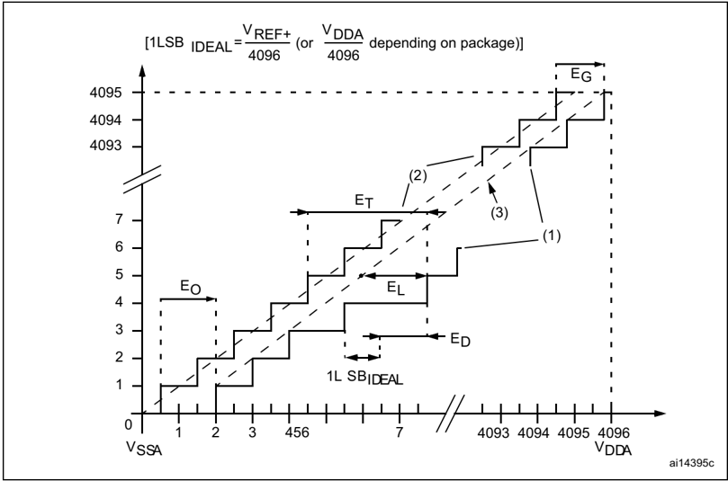

1. See also Table 67 .
2. Example of an actual transfer curve.
3. Ideal transfer curve.
4. End point correlation line.
5. ET  = Total Unadjusted Error: maximum deviation between the actual and the ideal transfer curves.
6. EG = Gain Error: deviation between the last ideal transition and the last actual one.
7. EO = Offset Error: deviation between the first actual transition and the first ideal one.
8. ED = Differential Linearity Error: maximum deviation between actual steps and the ideal one.
9. EL = Integral Linearity Error: maximum deviation between any actual transition and the end point correlation line.
1. Refer to Table 65 for the values of R AIN , R ADC  and C ADC .
2. Cparasitic  represents the capacitance of the PCB (dependent on soldering and PCB layout quality) plus the pad capacitance (roughly 5 pF). A high C parasitic  value downgrades conversion accuracy. To remedy this, f ADC  should be reduced.

Figure 41. Typical connection diagram using the ADC

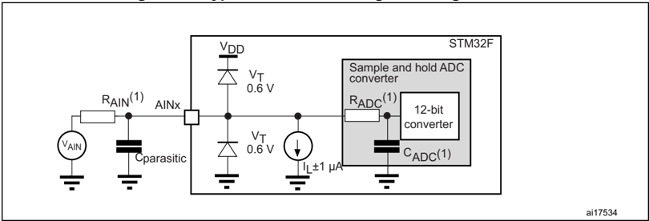

## General PCB design guidelines

Power supply decoupling should be performed as shown in Figure 42 or Figure 43 , depending on whether V REF+  is connected to V DDA  or not. The 10 nF capacitors should be ceramic (good quality). They should be placed them as close as possible to the chip.

Figure 42. Power supply and reference decoupling (V REF+  not connected to V DDA )

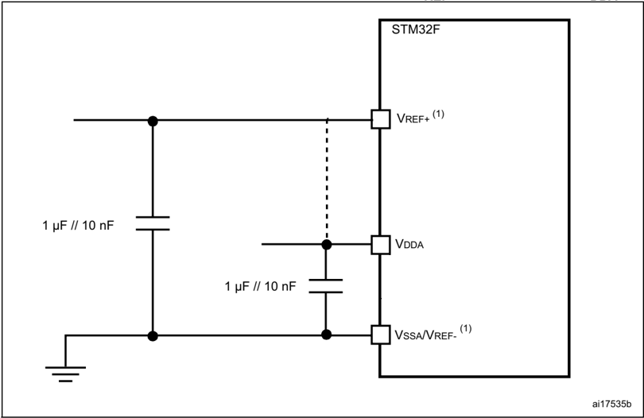

124

Figure 43. Power supply and reference decoupling (V REF+  connected to V DDA )

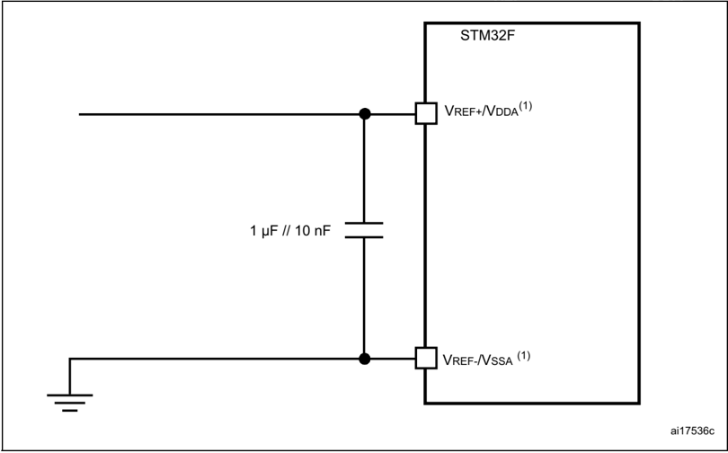

## 6.3.21 Temperature sensor characteristics

Table 71. Temperature sensor characteristics

| Symbol        | Parameter                                                      | Min   | Typ   | Max   | Unit   |
|---------------|----------------------------------------------------------------|-------|-------|-------|--------|
| T L (1)       | V SENSE linearity with temperature                             | -     | ± 1   | ± 2   | °C     |
| Avg_Slope (1) | Average slope                                                  | -     | 2.5   | -     | mV/°C  |
| V 25 (1)      | Voltage at 25 °C                                               | -     | 0.76  | -     | V      |
| t START (2)   | Startup time                                                   | -     | 6     | 10    | µs     |
| T S_temp (2)  | ADC sampling time when reading the temperature (1 °C accuracy) | 10    | -     | -     | µs     |

2. Guaranteed by design - Not tested in production.

Table 72. Temperature sensor calibration values

| Symbol   | Parameter                                                        | Memory address            |
|----------|------------------------------------------------------------------|---------------------------|
| TS_CAL1  | TS ADC raw data acquired at temperature of 30 °C, V DDA = 3.3 V  | 0x1FFF 7A2C - 0x1FFF 7A2D |
| TS_CAL2  | TS ADC raw data acquired at temperature of 110 °C, V DDA = 3.3 V | 0x1FFF 7A2E - 0x1FFF 7A2F |

## 6.3.22 VBAT  monitoring characteristics

Table 73. V BAT  monitoring characteristics

| Symbol          | Parameter                                              | Min   | Typ   | Max   | Unit   |
|-----------------|--------------------------------------------------------|-------|-------|-------|--------|
| R               | Resistor bridge for V BAT                              | -     | 50    | -     | K Ω    |
| Q               | Ratio on V BAT measurement                             | -     | 4     | -     |        |
| Er (1)          | Error on Q                                             | -1    | -     | +1    | %      |
| T S_vbat (2)(2) | ADC sampling time when reading the V BAT 1 mV accuracy | 5     | -     | -     | µs     |

## 6.3.23 Embedded reference voltage

The parameters given in Table 74 are derived from tests performed under ambient temperature and V DD  supply voltage conditions summarized in Table 14 .

Table 74. Embedded internal reference voltage

| Symbol          | Parameter                                                     | Conditions               | Min   | Typ   | Max   | Unit   |
|-----------------|---------------------------------------------------------------|--------------------------|-------|-------|-------|--------|
| V REFINT        | Internal reference voltage                                    | - 40 °C < T A < + 125 °C | 1.18  | 1.21  | 1.24  | V      |
| T S_vrefint (1) | ADC sampling time when reading the internal reference voltage | -                        | 10    | -     | -     | µs     |
| V RERINT_s (2)  | Internal reference voltage spread over the temperature range  | V DD = 3V ± 10mV         | -     | 3     | 5     | mV     |
| T Coeff (2)     | Temperature coefficient                                       | -                        | -     | 30    | 50    | ppm/°C |
| t START (2)     | Startup time                                                  | -                        | -     | 6     | 10    | µs     |

Table 75. Internal reference voltage calibration values

| Symbol      | Parameter                                               | Memory address            |
|-------------|---------------------------------------------------------|---------------------------|
| V REFIN_CAL | Raw data acquired at temperature of 30 °C V DDA = 3.3 V | 0x1FFF 7A2A - 0x1FFF 7A2B |

124

## 6.3.24 SD/SDIO MMC/eMMC card host interface (SDIO) characteristics

Unless otherwise specified, the parameters given in Table 76 for the SDIO/MMC/eMMC interface are derived from tests performed under the ambient temperature, f PCLK2  frequency and V DD  supply voltage conditions summarized in Table 14 , with the following configuration:

- Output speed is set to OSPEEDRy[1:0] = 10
- Capacitive load C = 30 pF (for eMMC C = 20 pF)
- Measurement points are done at CMOS levels: 0.5V DD

Refer to Section 6.3.16: I/O port characteristics for more details on the input/output characteristics.

Figure 44. SDIO high-speed mode

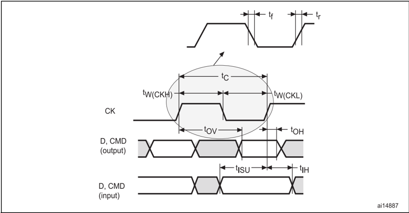

Figure 45. SD default mode

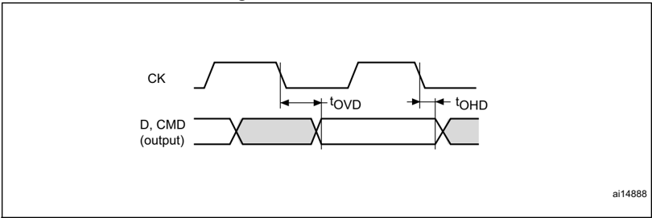

Table 76. Dynamic characteristics: SD / MMC characteristics (1)(2)

| Symbol                                                  | Parameter                                               | Conditions                                              | Min                                                     | Typ                                                     | Max                                                     | Unit                                                    |
|---------------------------------------------------------|---------------------------------------------------------|---------------------------------------------------------|---------------------------------------------------------|---------------------------------------------------------|---------------------------------------------------------|---------------------------------------------------------|
| f PP                                                    | Clock frequency in data transfer mode                   | -                                                       | 0                                                       | -                                                       | 50                                                      | MHz                                                     |
| -                                                       | SDIO_CK/fPCLK2 frequency ratio                          | -                                                       | -                                                       | -                                                       | 8/3                                                     | -                                                       |
| t W(CKL)                                                | Clock low time                                          | fpp = 50 MHz                                            | 10.5                                                    | 11                                                      | -                                                       | ns                                                      |
| t W(CKH)                                                | Clock high time                                         | fpp = 50 MHz                                            | 8.5                                                     | 9                                                       | -                                                       | ns                                                      |
| CMD, D inputs (referenced to CK) in MMC and SD HS mode  | CMD, D inputs (referenced to CK) in MMC and SD HS mode  | CMD, D inputs (referenced to CK) in MMC and SD HS mode  | CMD, D inputs (referenced to CK) in MMC and SD HS mode  | CMD, D inputs (referenced to CK) in MMC and SD HS mode  | CMD, D inputs (referenced to CK) in MMC and SD HS mode  | CMD, D inputs (referenced to CK) in MMC and SD HS mode  |
| t ISU                                                   | Input setup time HS                                     | fpp = 50 MHz                                            | 2.5                                                     | -                                                       | -                                                       | ns                                                      |
| t IH                                                    | Input hold time HS                                      | fpp = 50 MHz -40°C<T A < 125°C                          | 5                                                       | -                                                       | -                                                       | ns                                                      |
| t IH                                                    | Input hold time HS                                      | fpp = 50 MHz -40°C<T A <+85°C                           | 2.5                                                     | -                                                       | -                                                       | ns                                                      |
| CMD, D outputs (referenced to CK) in MMC and SD HS mode | CMD, D outputs (referenced to CK) in MMC and SD HS mode | CMD, D outputs (referenced to CK) in MMC and SD HS mode | CMD, D outputs (referenced to CK) in MMC and SD HS mode | CMD, D outputs (referenced to CK) in MMC and SD HS mode | CMD, D outputs (referenced to CK) in MMC and SD HS mode | CMD, D outputs (referenced to CK) in MMC and SD HS mode |
| t OV                                                    | Output valid time HS                                    | fpp = 50 MHz                                            | -                                                       | 3.5                                                     | 4                                                       | ns                                                      |
| t OH                                                    | Output hold time HS                                     | fpp = 50 MHz                                            | 2                                                       | -                                                       | -                                                       | ns                                                      |
| CMD, D inputs (referenced to CK) in SD default mode     | CMD, D inputs (referenced to CK) in SD default mode     | CMD, D inputs (referenced to CK) in SD default mode     | CMD, D inputs (referenced to CK) in SD default mode     | CMD, D inputs (referenced to CK) in SD default mode     | CMD, D inputs (referenced to CK) in SD default mode     | CMD, D inputs (referenced to CK) in SD default mode     |
| t ISUD                                                  | Input setup time SD                                     | fpp = 25 MHz                                            | 3                                                       | -                                                       | -                                                       | ns                                                      |
| t IHD                                                   | Input hold time SD                                      | fpp = 25 MHz                                            | 4                                                       | -                                                       | -                                                       | ns                                                      |
| CMD, D outputs (referenced to CK) in SD default mode    | CMD, D outputs (referenced to CK) in SD default mode    | CMD, D outputs (referenced to CK) in SD default mode    | CMD, D outputs (referenced to CK) in SD default mode    | CMD, D outputs (referenced to CK) in SD default mode    | CMD, D outputs (referenced to CK) in SD default mode    | CMD, D outputs (referenced to CK) in SD default mode    |
| t OVD                                                   | Output valid default time SD                            | fpp =25 MHz                                             | -                                                       | 5                                                       | 5.5                                                     | ns                                                      |
| t OHD                                                   | Output hold default time SD                             | fpp =25 MHz                                             | 4.5                                                     | -                                                       | -                                                       | ns                                                      |

1. Evaluated by characterization - Not tested in production.

2. VDD  = 2.7 to 3.6 V.

124

## 6.3.25 RTC characteristics

Table 77. Dynamic characteristics: eMMC characteristics V DD  = 1.7 V to 1.9 V (1)(2)

| Symbol                                         | Parameter                                      | Conditions                                     | Min                                            | Typ                                            | Max                                            | Unit                                           |
|------------------------------------------------|------------------------------------------------|------------------------------------------------|------------------------------------------------|------------------------------------------------|------------------------------------------------|------------------------------------------------|
| f PP                                           | Clock frequency in data transfer mode          | -                                              | 0                                              | -                                              | 50                                             | MHz                                            |
| -                                              | SDIO_CK/fPCLK2 frequency ratio                 | -                                              | -                                              | -                                              | 8/3                                            | -                                              |
| t W(CKL)                                       | Clock low time                                 | fpp = 50 MHz                                   | 10                                             | 10.5                                           | -                                              | ns                                             |
| t W(CKH)                                       | Clock high time                                | fpp = 50 MHz                                   | 9                                              | 9.5                                            | -                                              | ns                                             |
| CMD, D inputs (referenced to CK) in eMMC mode  | CMD, D inputs (referenced to CK) in eMMC mode  | CMD, D inputs (referenced to CK) in eMMC mode  | CMD, D inputs (referenced to CK) in eMMC mode  | CMD, D inputs (referenced to CK) in eMMC mode  | CMD, D inputs (referenced to CK) in eMMC mode  | CMD, D inputs (referenced to CK) in eMMC mode  |
| t ISU                                          | Input setup time HS                            | fpp = 50 MHz                                   | 0                                              | -                                              | -                                              | ns                                             |
| t IH                                           | Input hold time HS                             | fpp = 50 MHz                                   | 6                                              | -                                              | -                                              |                                                |
| CMD, D outputs (referenced to CK) in eMMC mode | CMD, D outputs (referenced to CK) in eMMC mode | CMD, D outputs (referenced to CK) in eMMC mode | CMD, D outputs (referenced to CK) in eMMC mode | CMD, D outputs (referenced to CK) in eMMC mode | CMD, D outputs (referenced to CK) in eMMC mode | CMD, D outputs (referenced to CK) in eMMC mode |
| t OV                                           | Output valid time HS                           | fpp = 50 MHz                                   | -                                              | 3.5                                            | 5                                              | ns                                             |
| t OH                                           | Output hold time HS                            | fpp = 50 MHz                                   | 2                                              | -                                              | -                                              | ns                                             |

Table 78. RTC characteristics

| Symbol   | Parameter                       | Conditions                                       |   Min | Max   |
|----------|---------------------------------|--------------------------------------------------|-------|-------|
| -        | f PCLK1 /RTCCLK frequency ratio | Any read/write operation from/to an RTC register |     4 | -     |

## 7 Package information

In order to meet environmental requirements, ST offers these devices in different grades of ECOPACK packages, depending on their level of environmental compliance. ECOPACK specifications, grade definitions and product status are available at: www.st.com . ECOPACK is an ST trademark.

## 7.1 Device marking

Refer to technical note 'Reference device marking schematics for STM32 microcontrollers and microprocessors' (TN1433) available on www.st.com , for the location of pin 1 / ball A1 as well as the location and orientation of the marking areas versus pin 1 / ball A1.

Parts marked as 'ES', 'E' or accompanied by an engineering sample notification letter, are not yet qualified and therefore not approved for use in production. ST is not responsible for any consequences resulting from such use. In no event will ST be liable for the customer using any of these engineering samples in production. ST's Quality department must be contacted prior to any decision to use these engineering samples to run a qualification activity.

141

## 7.2 WLCSP49 package information (A0ZV)

This WLCSP is a 49-ball, 2.999 x 3.185 mm, 0.4 mm pitch wafer level chip scale

Figure 46. WLCSP49 - Outline

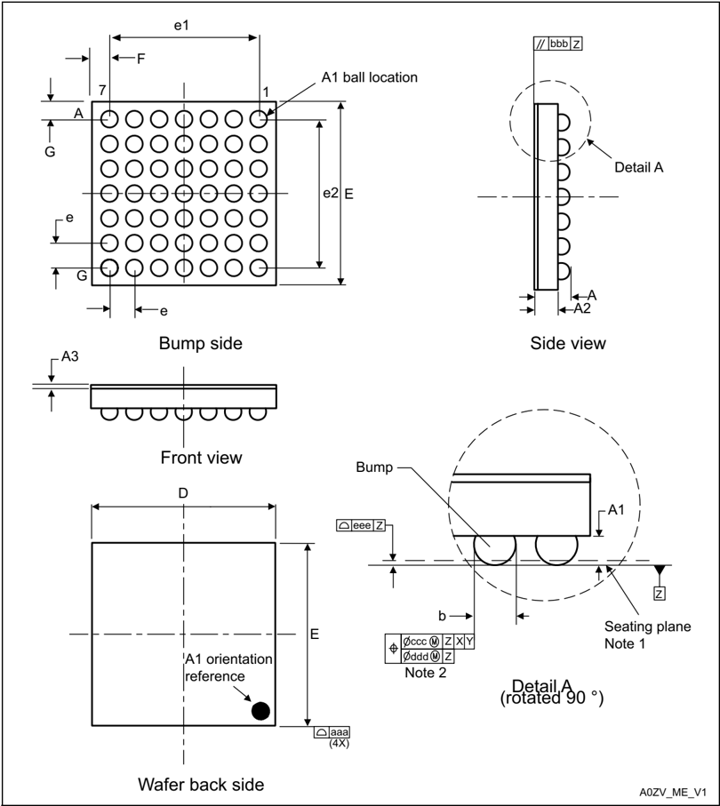

1. Drawing is not to scale.

Table 79. WLCSP49 - Mechanical data

| Symbol   | millimeters   | millimeters   | millimeters   | inches (1)   | inches (1)   | inches (1)   |
|----------|---------------|---------------|---------------|--------------|--------------|--------------|
| Symbol   | Min           | Typ           | Max           | Min          | Typ          | Max          |
| A        | 0.525         | 0.555         | 0.585         | 0.0207       | 0.0219       | 0.0230       |
| A1       | -             | 0.175         | -             | -            | 0.0069       | -            |
| A2       | -             | 0.380         | -             | -            | 0.0150       | -            |
| A3 (2)   | -             | 0.025         | -             | -            | 0.0010       | -            |
| b (3)    | 0.220         | 0.250         | 0.280         | 0.0087       | 0.0098       | 0.0110       |
| D        | 2.964         | 2.999         | 3.034         | 0.1167       | 0.1181       | 0.1194       |
| E        | 3.150         | 3.185         | 3.220         | 0.1240       | 0.1254       | 0.1268       |
| e        | -             | 0.400         | -             | -            | 0.0157       | -            |
| e1       | -             | 2.400         | -             | -            | 0.0945       | -            |
| e2       | -             | 2.400         | -             | -            | 0.0945       | -            |
| F        | -             | 0.2995        | -             | -            | 0.0118       | -            |
| G        | -             | 0.3925        | -             | -            | 0.0155       | -            |
| aaa      | -             | -             | 0.100         | -            | -            | 0.0039       |
| bbb      | -             | -             | 0.100         | -            | -            | 0.0039       |
| ccc      | -             | -             | 0.100         | -            | -            | 0.0039       |
| ddd      | -             | -             | 0.050         | -            | -            | 0.0020       |
| eee      | -             | -             | 0.050         | -            | -            | 0.0020       |

1. Values in inches are converted from mm and rounded to 4 decimal digits.
2. Back side coating
3. Dimension is measured at the maximum bump diameter parallel to primary datum Z.

Figure 47. WLCSP49 - Footprint example

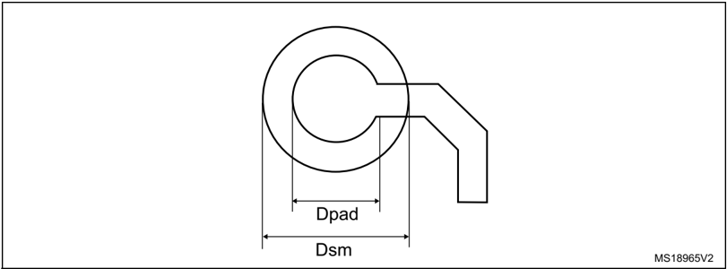

141

Table 80. WLCSP49 - Example of PCB design rules (0.4 mm pitch)

| Dimension      | Recommended values                             |
|----------------|------------------------------------------------|
| Pitch          | 0.4                                            |
| Dpad           | 260 µm max. (circular) 220 µm recommended      |
| Dsm            | 300 µm min. (for 260 µm diameter pad)          |
| PCB pad design | Non-solder mask defined via underbump allowed. |

## Device marking for WLCSP49

The following figure gives an example of topside marking orientation versus ball A1 identifier location. The printed markings may differ depending on the supply chain.

Other optional marking or inset/upset marks, which depend on supply chain operations, are not indicated below.

Figure 48. WLCSP49 marking (package top view)

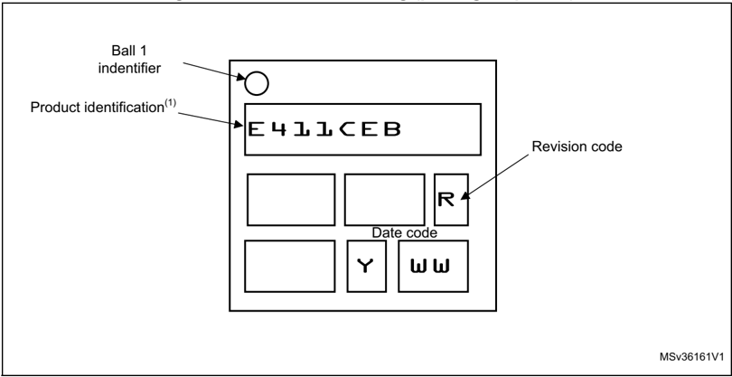

1. Parts marked as ES or E or accompanied by an Engineering Sample notification letter are not yet qualified and therefore not approved for use in production. ST is not responsible for any consequences resulting from such use. In no event will ST be liable for the customer using any of these engineering samples in production. ST's Quality department must be contacted prior to any decision to use these engineering samples to run a qualification activity.

## 7.3 UFQFPN48 package information (A0B9)

This UFQFPN is a 48-lead, 7 x 7 mm, 0.5 mm pitch, ultra thin fine pitch quad flat package.

Figure 49. UFQFPN48 - Outline

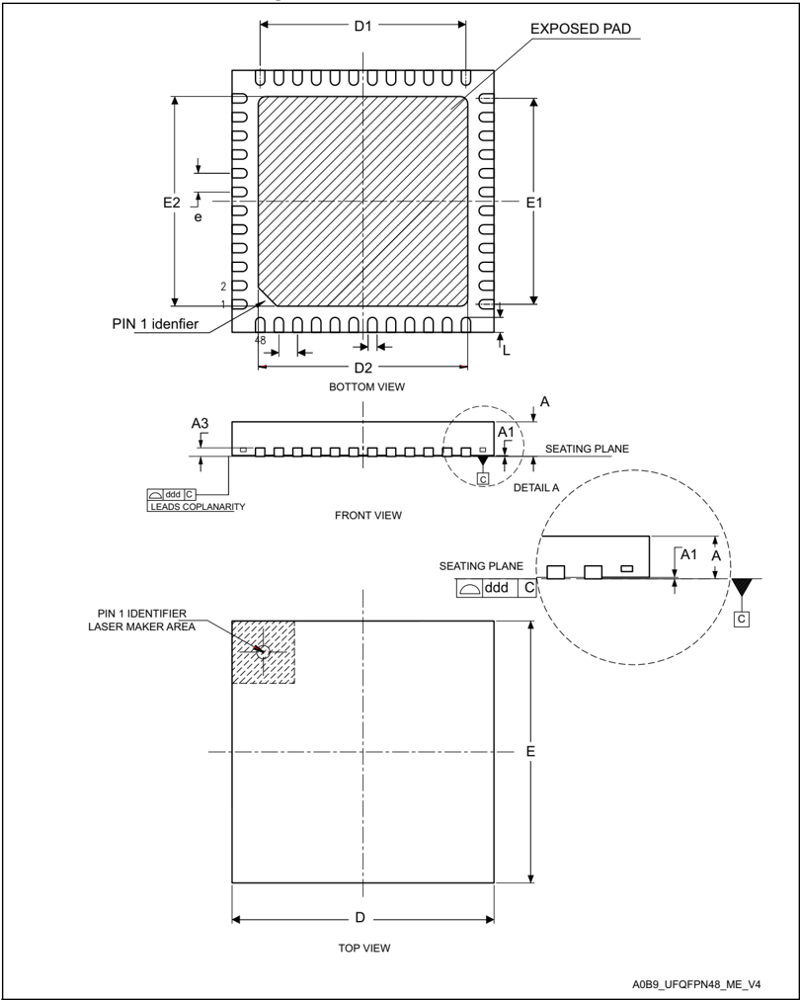

1. Drawing is not to scale.
2. All leads/pads should also be soldered to the PCB to improve the lead/pad solder joint life.
3. There is an exposed die pad on the underside of the UFQFPN48 package. It is recommended to connect and solder this back-side pad to PCB ground.

141

Table 81. UFQFPN48 - Mechanical data

| Symbol   | millimeters   | millimeters   | millimeters   | inches (1)   | inches (1)   | inches (1)   |
|----------|---------------|---------------|---------------|--------------|--------------|--------------|
| Symbol   | Min           | Typ           | Max           | Min          | Typ          | Max          |
| A        | 0.500         | 0.550         | 0.600         | 0.0197       | 0.0217       | 0.0236       |
| A1       | 0.000         | 0.020         | 0.050         | 0.0000       | 0.0008       | 0.0020       |
| A3       | -             | 0.152         | -             | -            | 0.0060       | -            |
| b        | 0.200         | 0.250         | 0.300         | 0.0079       | 0.0098       | 0.0118       |
| D (2)    | 6.900         | 7.000         | 7.100         | 0.2717       | 0.2756       | 0.2795       |
| D1       | 5.400         | 5.500         | 5.600         | 0.2126       | 0.2165       | 0.2205       |
| D2 (3)   | 5.500         | 5.600         | 5.700         | 0.2165       | 0.2205       | 0.2244       |
| E (2)    | 6.900         | 7.000         | 7.100         | 0.2717       | 0.2756       | 0.2795       |
| E1       | 5.400         | 5.500         | 5.600         | 0.2126       | 0.2165       | 0.2205       |
| E2 (3)   | 5.500         | 5.600         | 5.700         | 0.2165       | 0.2205       | 0.2244       |
| e        | -             | 0.500         | -             | -            | 0.0197       | -            |
| L        | 0.300         | 0.400         | 0.500         | 0.0118       | 0.0157       | 0.0197       |
| ddd      | -             | -             | 0.080         | -            | -            | 0.0031       |

1. Values in inches are converted from mm and rounded to four decimal digits.
2. Dimensions D and E do not include mold protrusion, not exceed 0.15 mm.
3. Dimensions D2 and E2 are not in accordance with JEDEC.
1. Dimensions are expressed in millimeters.

Figure 50. UFQFPN48 - Footprint example

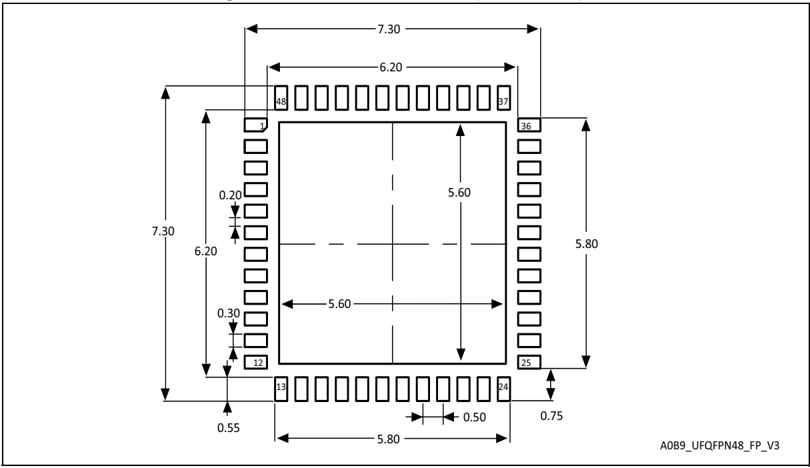

## 7.4 LQFP64 package information (5W)

This LQFP is 64-pin, 10 x 10 mm low-profile quad flat package.

Note: See list of notes in the notes section.

Figure 51. LQFP64 - Outline (15)

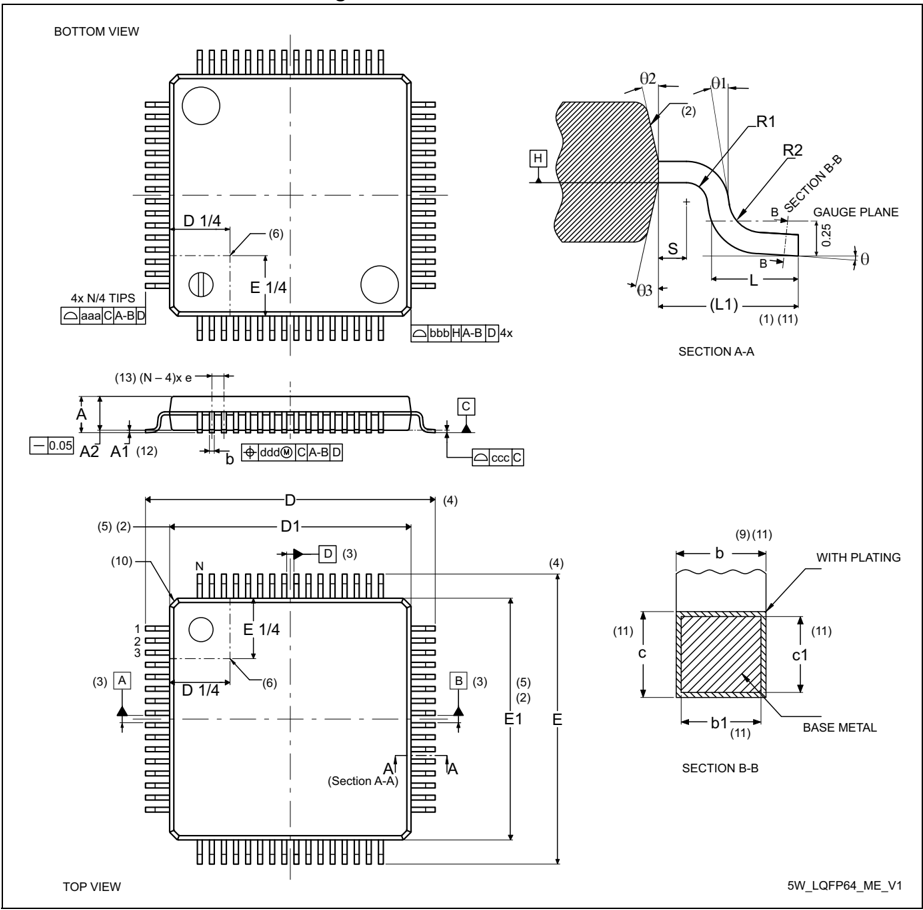

141

Table 82. LQFP64 - Mechanical data

| Symbol    | millimeters   | millimeters   | millimeters   | inches (14)   | inches (14)   | inches (14)   |
|-----------|---------------|---------------|---------------|---------------|---------------|---------------|
| Symbol    | Min           | Typ           | Max           | Min           | Typ           | Max           |
| A         | -             | -             | 1.60          | -             | -             | 0.0630        |
| A1 (12)   | 0.05          | -             | 0.15          | 0.0020        | -             | 0.0059        |
| A2        | 1.35          | 1.40          | 1.45          | 0.0531        | 0.0551        | 0.0570        |
| b (9)(11) | 0.17          | 0.22          | 0.27          | 0.0067        | 0.0087        | 0.0106        |
| b1 (11)   | 0.17          | 0.20          | 0.23          | 0.0067        | 0.0079        | 0.0091        |
| c (11)    | 0.09          | -             | 0.20          | 0.0035        | -             | 0.0079        |
| c1 (11)   | 0.09          | -             | 0.16          | 0.0035        | -             | 0.0063        |
| D (4)     | 12.00 BSC     | 12.00 BSC     | 12.00 BSC     | 0.4724 BSC    | 0.4724 BSC    | 0.4724 BSC    |
| D1 (2)(5) | 10.00 BSC     | 10.00 BSC     | 10.00 BSC     | 0.3937 BSC    | 0.3937 BSC    | 0.3937 BSC    |
| E (4)     | 12.00 BSC     | 12.00 BSC     | 12.00 BSC     | 0.4724 BSC    | 0.4724 BSC    | 0.4724 BSC    |
| E1 (2)(5) | 10.00 BSC     | 10.00 BSC     | 10.00 BSC     | 0.3937 BSC    | 0.3937 BSC    | 0.3937 BSC    |
| e         | 0.50 BSC      | 0.50 BSC      | 0.50 BSC      | 0.1970 BSC    | 0.1970 BSC    | 0.1970 BSC    |
| L         | 0.45          | 0.60          | 0.75          | 0.0177        | 0.0236        | 0.0295        |
| L1        | 1.00 REF      | 1.00 REF      | 1.00 REF      | 0.0394 REF    | 0.0394 REF    | 0.0394 REF    |
| N (13)    | 64            | 64            | 64            | 64            | 64            | 64            |
| θ         | 0°            | 3.5°          | 7°            | 0°            | 3.5°          | 7°            |
| θ1        | 0°            | -             | -             | 0°            | -             | -             |
| θ2        | 10°           | 12°           | 14°           | 10°           | 12°           | 14°           |
| θ3        | 10°           | 12°           | 14°           | 10°           | 12°           | 14°           |
| R1        | 0.08          | -             | -             | 0.0031        | -             | -             |
| R2        | 0.08          | -             | 0.20          | 0.0031        | -             | 0.0079        |
| S         | 0.20          | -             | -             | 0.0079        | -             | -             |
| aaa (1)   | 0.20          | 0.20          | 0.20          | 0.0079        | 0.0079        | 0.0079        |
| bbb (1)   | 0.20          | 0.20          | 0.20          | 0.0079        | 0.0079        | 0.0079        |
| ccc (1)   | 0.08          | 0.08          | 0.08          | 0.0031        | 0.0031        | 0.0031        |
| ddd (1)   | 0.08          | 0.08          | 0.08          | 0.0031        | 0.0031        | 0.0031        |

## Notes:

1. Dimensioning and tolerancing schemes conform to ASME Y14.5M-1994.
2. The Top package body size may be smaller than the bottom package size by as much as 0.15 mm.
3. Datums A-B and D to be determined at datum plane H.
4. To be determined at seating datum plane C.
5. Dimensions D1 and E1 do not include mold flash or protrusions. Allowable mold flash or protrusions is '0.25 mm' per side. D1 and E1 are Maximum plastic body size dimensions including mold mismatch.
6. Details of pin 1 identifier are optional but must be located within the zone indicated.
7. All Dimensions are in millimeters.
8. No intrusion allowed inwards the leads.
9. Dimension 'b' does not include dambar protrusion. Allowable dambar protrusion shall not cause the lead width to exceed the maximum 'b' dimension by more than 0.08 mm. Dambar cannot be located on the lower radius or the foot. Minimum space between protrusion and an adjacent lead is 0.07 mm for 0.4 mm and 0.5 mm pitch packages.
10. Exact shape of each corner is optional.
11. These dimensions apply to the flat section of the lead between 0.10 mm and 0.25 mm from the lead tip.
12. A1 is defined as the distance from the seating plane to the lowest point on the package body.
13. 'N' is the number of terminal positions for the specified body size.
14. Values in inches are converted from mm and rounded to 4 decimal digits.
15. Drawing is not to scale.
1. Dimensions are expressed in millimeters.

Figure 52. LQFP64 - Footprint example

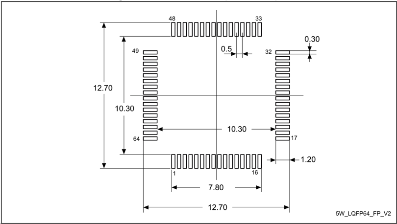

141

## 7.5 LQFP100 package information (1L)

This LQFP is 100 lead, 14 x 14 mm low-profile quad flat package.

Note: See list of notes in the notes section.

Figure 53. LQFP100 - Outline (15)

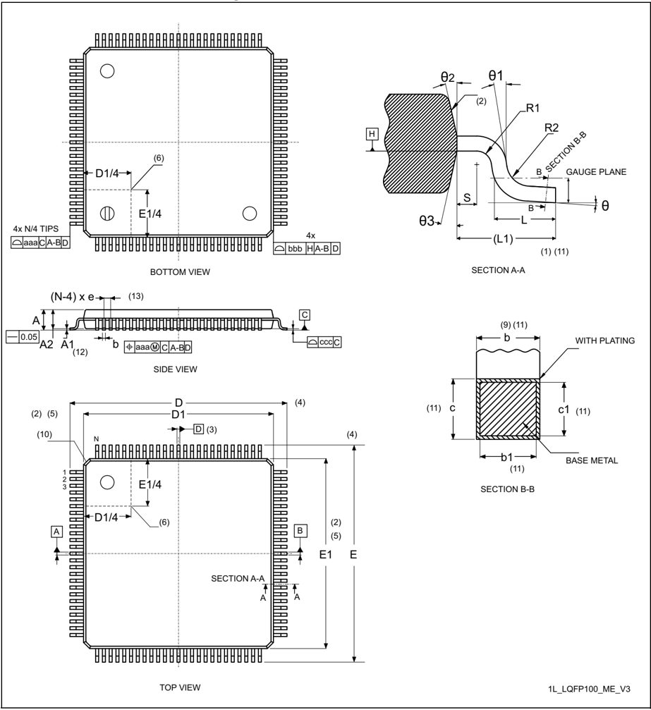

Table 83. LQFP100 - Mechanical data

| Symbol     | millimeters   | millimeters   | millimeters   | inches (14)   | inches (14)   | inches (14)   |
|------------|---------------|---------------|---------------|---------------|---------------|---------------|
| Symbol     | Min           | Typ           | Max           | Min           | Typ           | Max           |
| A          | -             | 1.50          | 1.60          | -             | 0.0590        | 0.0630        |
| A1 (12)    | 0.05          | -             | 0.15          | 0.0019        | -             | 0.0059        |
| A2         | 1.35          | 1.40          | 1.45          | 0.0531        | 0.0551        | 0.0570        |
| b (9)(11)  | 0.17          | 0.22          | 0.27          | 0.0067        | 0.0087        | 0.0106        |
| b1 (11)    | 0.17          | 0.20          | 0.23          | 0.0067        | 0.0079        | 0.0090        |
| c (11)     | 0.09          | -             | 0.20          | 0.0035        | -             | 0.0079        |
| c1 (11)    | 0.09          | -             | 0.16          | 0.0035        | -             | 0.0063        |
| D (4)      | 16.00 BSC     | 16.00 BSC     | 16.00 BSC     | 0.6299 BSC    | 0.6299 BSC    | 0.6299 BSC    |
| D1 (2)(5)  | 14.00 BSC     | 14.00 BSC     | 14.00 BSC     | 0.5512 BSC    | 0.5512 BSC    | 0.5512 BSC    |
| E (4)      | 16.00 BSC     | 16.00 BSC     | 16.00 BSC     | 0.6299 BSC    | 0.6299 BSC    | 0.6299 BSC    |
| E1 (2)(5)  | 14.00 BSC     | 14.00 BSC     | 14.00 BSC     | 0.5512 BSC    | 0.5512 BSC    | 0.5512 BSC    |
| e          | 0.50 BSC      | 0.50 BSC      | 0.50 BSC      | 0.0197 BSC    | 0.0197 BSC    | 0.0197 BSC    |
| L          | 0.45          | 0.60          | 0.75          | 0.177         | 0.0236        | 0.0295        |
| L1 (1)(11) |               | 1.00          |               | -             | 0.0394        | -             |
| N (13)     | 100           | 100           | 100           | 100           | 100           | 100           |
| θ          | 0°            | 3.5°          | 7°            | 0°            | 3.5°          | 7°            |
| θ1         | 0°            | -             | -             | 0°            | -             | -             |
| θ2         | 10°           | 12°           | 14°           | 10°           | 12°           | 14°           |
| θ3         | 10°           | 12°           | 14°           | 10°           | 12°           | 14°           |
| R1         | 0.08          | -             | -             | 0.0031        | -             | -             |
| R2         | 0.08          | -             | 0.20          | 0.0031        | -             | 0.0079        |
| S          | 0.20          | -             | -             | 0.0079        | -             | -             |
| aaa (1)    | 0.20          | 0.20          | 0.20          | 0.0079        | 0.0079        | 0.0079        |
| bbb (1)    | 0.20          | 0.20          | 0.20          | 0.0079        | 0.0079        | 0.0079        |
| ccc (1)    | 0.08          | 0.08          | 0.08          | 0.0031        | 0.0031        | 0.0031        |
| ddd (1)    | 0.08          | 0.08          | 0.08          | 0.0031        | 0.0031        | 0.0031        |

141

## Notes:

1. Dimensioning and tolerancing schemes conform to ASME Y14.5M-1994.
2. The Top package body size may be smaller than the bottom package size by as much as 0.15 mm.
3. Datums A-B and D to be determined at datum plane H.
4. To be determined at seating datum plane C.
5. Dimensions D1 and E1 do not include mold flash or protrusions. Allowable mold flash or protrusions is '0.25 mm' per side. D1 and E1 are Maximum plastic body size dimensions including mold mismatch.
6. Details of pin 1 identifier are optional but must be located within the zone indicated.
7. All Dimensions are in millimeters.
8. No intrusion allowed inwards the leads.
9. Dimension 'b' does not include dambar protrusion. Allowable dambar protrusion shall not cause the lead width to exceed the maximum 'b' dimension by more than 0.08 mm. Dambar cannot be located on the lower radius or the foot. Minimum space between protrusion and an adjacent lead is 0.07 mm for 0.4 mm and 0.5 mm pitch packages.
10. Exact shape of each corner is optional.
11. These dimensions apply to the flat section of the lead between 0.10 mm and 0.25 mm from the lead tip.
12. A1 is defined as the distance from the seating plane to the lowest point on the package body.
13. 'N' is the number of terminal positions for the specified body size.
14. Values in inches are converted from mm and rounded to 4 decimal digits.
15. Drawing is not to scale.
1. Dimensions are expressed in millimeters.

Figure 54. LQFP100 - Footprint example

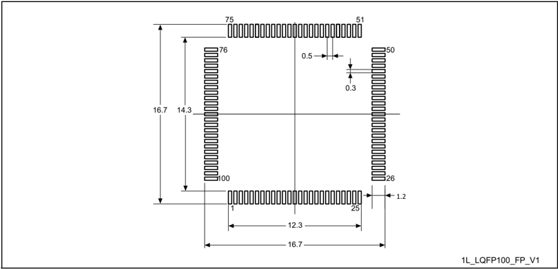

## 7.6 UFBGA100 package information (A0C2)

This UFBGA is a 100-ball, 7 x 7 mm, 0.50 mm pitch, ultra fine pitch ball grid array package.

Note: See list of notes in the notes section.

Figure 55. UFBGA100 - Outline (13)

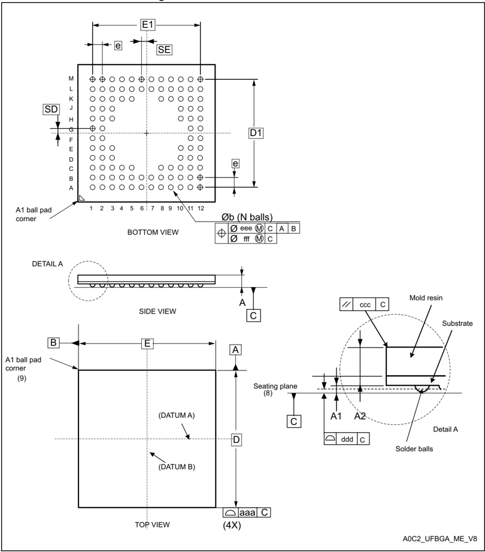

141

Table 84. UFBGA100 - Mechanical data

| Symbol   | millimeters (1)   | millimeters (1)   | millimeters (1)   | inches (12)   | inches (12)   | inches (12)   |
|----------|-------------------|-------------------|-------------------|---------------|---------------|---------------|
| Symbol   | Min.              | Typ.              | Max.              | Min.          | Typ.          | Max.          |
| A (2)(3) | -                 | -                 | 0.60              | -             | -             | 0.0236        |
| A1 (4)   | 0.05              | -                 | -                 | 0.0020        | -             | -             |
| A2       | -                 | 0.43              | -                 | -             | 0.0169        | -             |
| b (5)    | 0.23              | 0.28              | 0.33              | 0.0090        | 0.0110        | 0.0130        |
| D (6)    | 7.00 BSC          | 7.00 BSC          | 7.00 BSC          | 0.2756 BSC    | 0.2756 BSC    | 0.2756 BSC    |
| D1       | 5.50 BSC          | 5.50 BSC          | 5.50 BSC          | 0.2165 BSC    | 0.2165 BSC    | 0.2165 BSC    |
| E        | 7.00 BSC          | 7.00 BSC          | 7.00 BSC          | 0.2756 BSC    | 0.2756 BSC    | 0.2756 BSC    |
| E1       | 5.50 BSC          | 5.50 BSC          | 5.50 BSC          | 0.2165 BSC    | 0.2165 BSC    | 0.2165 BSC    |
| e (9)    | 0.50 BSC          | 0.50 BSC          | 0.50 BSC          | 0.0197 BSC    | 0.0197 BSC    | 0.0197 BSC    |
| N (11)   | 100               | 100               | 100               | 100           | 100           | 100           |
| SD (12)  | 0.25 BSC          | 0.25 BSC          | 0.25 BSC          | 0.0098 BSC    | 0.0098 BSC    | 0.0098 BSC    |
| SE (12)  | 0.25 BSC          | 0.25 BSC          | 0.25 BSC          | 0.0098 BSC    | 0.0098 BSC    | 0.0098 BSC    |
| aaa      | 0.15              | 0.15              | 0.15              | 0.0059        | 0.0059        | 0.0059        |
| ccc      | 0.20              | 0.20              | 0.20              | 0.0079        | 0.0079        | 0.0079        |
| ddd      | 0.08              | 0.08              | 0.08              | 0.0031        | 0.0031        | 0.0031        |
| eee      | 0.15              | 0.15              | 0.15              | 0.0059        | 0.0059        | 0.0059        |
| fff      | 0.05              | 0.05              | 0.05              | 0.0020        | 0.0020        | 0.0020        |

## Notes:

1. Dimensioning and tolerancing schemes conform to ASME Y14.5M-2009 apart European projection.
2. UFBGA stands for ulta profile fine pitch ball grid array: 0.50 mm &lt; A ≤ 0.65 mm / fine pitch e &lt; 1.00 mm.
3. The profile height, A, is the distance from the seating plane to the highest point on the package. It is measured perpendicular to the seating plane.
4. A1 is defined as the distance from the seating plane to the lowest point on the package body.
5. Dimension b is measured at the maximum diameter of the terminal (ball) in a plane parallel to primary datum C.
6. BSC stands for BASIC dimensions. It corresponds to the nominal value and has no tolerance. For tolerances refer to form and position table. On the drawing these dimensions are framed.
7. Primary datum C is defined by the plane established by the contact points of three or more solder balls that support the device when it is placed on top of a planar surface.
8. The terminal (ball) A1 corner must be identified on the top surface of the package by using a corner chamfer, ink or metalized markings, or other feature of package body or

integral heat slug. A distinguish feature is allowable on the bottom surface of the package to identify the terminal A1 corner. Exact shape of each corner is optional.

9. e represents the solder ball grid pitch.
10. N represents the total number of balls on the BGA.
11. Basic dimensions SD and SE are defined with respect to datums A and B. It defines the position of the centre ball(s) in the outer row or column of a fully populated matrix.
12. Values in inches are converted from mm and rounded to 4 decimal digits.
13. Drawing is not to scale.

Figure 56. UFBGA100 - Footprint example

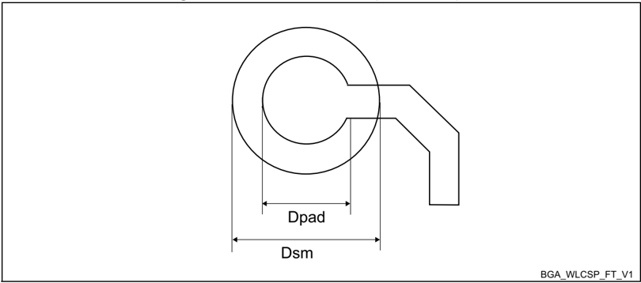

Table 85. UFBGA100 - Example of PCB design rules (0.5 mm pitch BGA)

| Dimension         | Values                                                            |
|-------------------|-------------------------------------------------------------------|
| Pitch             | 0.50 mm                                                           |
| Dpad              | 0.280 mm                                                          |
| Dsm               | 0.370 mm typ. (depends on the solder mask registration tolerance) |
| Stencil opening   | 0.280 mm                                                          |
| Stencil thickness | Between 0.100 mm and 0.125 mm                                     |

141

## 7.7 Thermal characteristics

The maximum chip junction temperature (T J max) must never exceed the values given in Table 14: General operating conditions on page 59 .

The maximum chip-junction temperature, T J  max., in degrees Celsius, may be calculated using the following equation:

T J  max = T A  max + (PD max x Θ JA )

## Where:

- T A  max is the maximum ambient temperature in °C,
- Θ JA  is the package junction-to-ambient thermal resistance, in ° C/W,
- PD max is the sum of P INT  max and P I/O  max (PD max = P INT  max + P I/O max),
- PINT  max is the product of I DD  and   VDD , expressed in Watts. This is the maximum chip internal power.

PI/O  max represents the maximum power dissipation on output pins where:

<!-- formula-not-decoded -->

taking into account the actual V OL / I OL  and V OH / I OH  of the I/Os at low and high level in the application.

Table 86. Package thermal characteristics

| Symbol   | Parameter                                    |   Value | Unit   |
|----------|----------------------------------------------|---------|--------|
| Θ JA     | Thermal resistance junction-ambient UFQFPN48 |      32 | °C/W   |
| Θ JA     | Thermal resistance junction-ambient WLCSP49  |      51 | °C/W   |
| Θ JA     | Thermal resistance junction-ambient LQFP64   |      47 | °C/W   |
| Θ JA     | Thermal resistance junction-ambient LQFP100  |      43 | °C/W   |
| Θ JA     | Thermal resistance junction-ambient UFBGA100 |      62 | °C/W   |

## 7.7.1 Reference document

JESD51-2 Integrated Circuits Thermal Test Method Environment Conditions - Natural Convection (Still Air). Available from www.jedec.org.

## 8 Ordering information

Table 87. Ordering information scheme

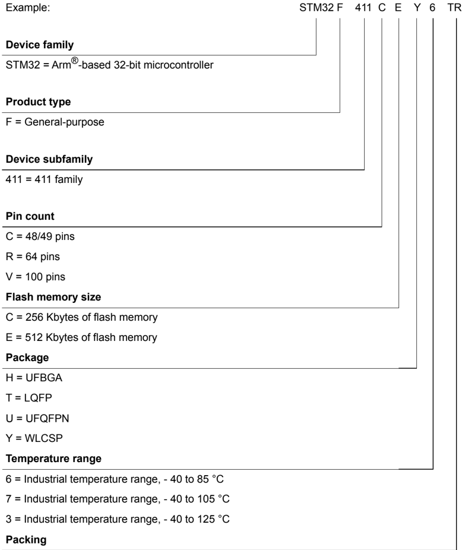

TR = tape and reel

No character = tray or tube

For a list of available options (memory, package, and so on) or for further information on any aspect of this device, contact the nearest ST sales office.

141

## Appendix A Recommendations when using the internal reset OFF

When the internal reset is OFF, the following integrated features are no longer supported:

- The integrated power-on-reset (POR)/power-down reset (PDR) circuitry is disabled.
- The brownout reset (BRO) circuitry must be disabled. By default BOR is OFF.
- The embedded programmable voltage detector (PVD) is disabled.
- VBAT  functionality is no more available and VBAT pin should be connected to V DD .

## A.1 Operating conditions

## Table 88. Limitations depending on the operating power supply range

| Operating power supply range   | ADC operation                  | Maximum flash memory access frequency with no wait state (f Flashmax )   | Maximum flash memory access frequency with no wait states (1) (2)   | I/O operation       | Possible flash memory operations        |
|--------------------------------|--------------------------------|--------------------------------------------------------------------------|---------------------------------------------------------------------|---------------------|-----------------------------------------|
| V DD = 1.7 to 2.1 V (3)        | Conversion time up to 1.2 Msps | 20 MHz (4)                                                               | 100 MHz with 6 wait states                                          | No I/O compensation | 8-bit erase and program operations only |

4. Prefetch is not available. Refer to AN3430 application note for details on how to adjust performance and power.

## Appendix B Application block diagrams

## B.1 USB OTG Full Speed (FS) interface solutions

Figure 57. USB controller configured as peripheral-only and used in Full-Speed mode

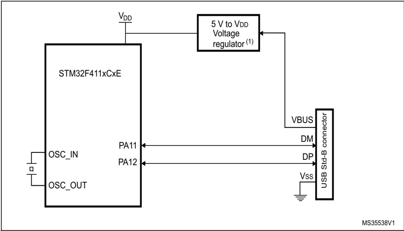

1. The external voltage regulator is only needed when building a V BUS  powered device.
1. The current limiter is required only if the application has to support a V BUS  powered device. A basic power switch can be used if 5V are available on the application board.

Figure 58. USB controller configured as host-only and used in Full-Speed mode

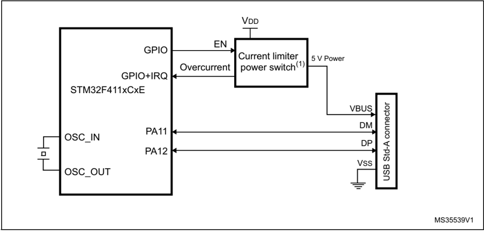

146

Figure 59. USB controller configured in dual mode and used in Full-Speed mode

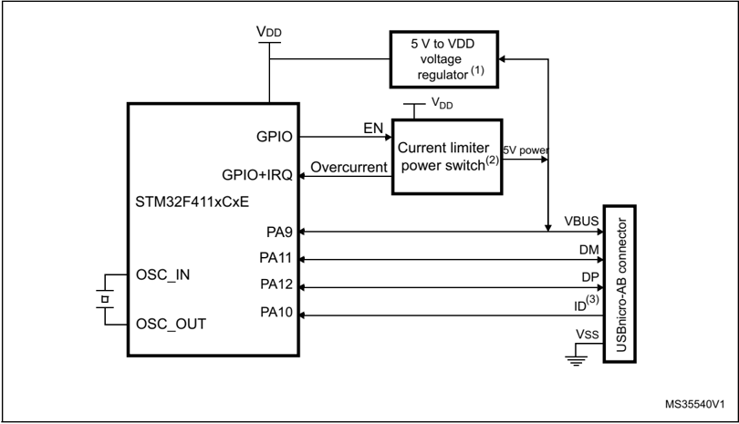

1. The external voltage regulator is only needed when building a V BUS  powered device.
2. The current limiter is required only if the application has to support a V BUS  powered device. A basic power switch can be used if 5 V are available on the application board.
3. The ID pin is required in dual role only.

## B.2 Sensor Hub application example

Figure 60. Sensor Hub application example

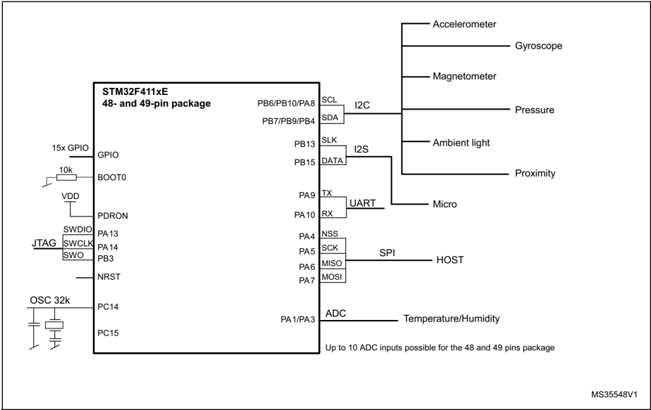

146

## B.3 Batch Acquisition Mode (BAM) example

Data is transferred through the DMA from interfaces into the internal SRAM while the rest of the MCU is set in low power mode.

- Code execution from RAM before switching off the Flash.
- Flash is set in power down and flash interface (ART™ accelerator) clock is stopped.
- The clocks are enabled only for the required interfaces.
- MCU core is set in sleep mode (core clock stopped waiting for interrupt).
- Only the needed DMA channels are enabled and running.

Figure 61. Batch Acquisition Mode (BAM) example

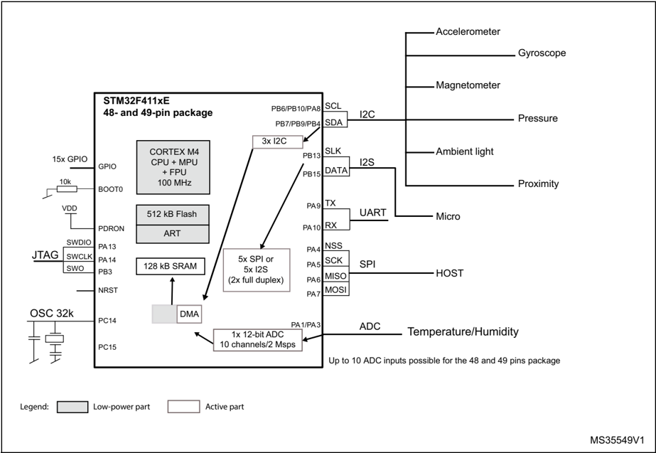

## 9 Important security notice

The STMicroelectronics group of companies (ST) places a high value on product security, which is why the ST product(s) identified in this documentation may be certified by various security certification bodies and/or may implement our own security measures as set forth herein. However, no level of security certification and/or built-in security measures can guarantee that ST products are resistant to all forms of attacks. As such, it is the responsibility of each of ST's customers to determine if the level of security provided in an ST product meets the customer needs both in relation to the ST product alone, as well as when combined with other components and/or software for the customer end product or application. In particular, take note that:

- ST products may have been certified by one or more security certification bodies, such as Platform Security Architecture (www.psacertified.org) and/or Security Evaluation standard for IoT Platforms (www.trustcb.com). For details concerning whether the ST product(s) referenced herein have received security certification along with the level and current status of such certification, either visit the relevant certification standards website or go to the relevant product page on www.st.com for the most up to date information. As the status and/or level of security certification for an ST product can change from time to time, customers should re-check security certification status/level as needed. If an ST product is not shown to be certified under a particular security standard, customers should not assume it is certified.
- Certification bodies have the right to evaluate, grant and revoke security certification in relation to ST products. These certification bodies are therefore independently responsible for granting or revoking security certification for an ST product, and ST does not take any responsibility for mistakes, evaluations, assessments, testing, or other activity carried out by the certification body with respect to any ST product.
- Industry-based cryptographic algorithms (such as AES, DES, or MD5) and other open standard technologies which may be used in conjunction with an ST product are based on standards which were not developed by ST. ST does not take responsibility for any flaws in such cryptographic algorithms or open technologies or for any methods which have been or may be developed to bypass, decrypt or crack such algorithms or technologies.
- While robust security testing may be done, no level of certification can absolutely guarantee protections against all attacks, including, for example, against advanced attacks which have not been tested for, against new or unidentified forms of attack, or against any form of attack when using an ST product outside of its specification or intended use, or in conjunction with other components or software which are used by customer to create their end product or application. ST is not responsible for resistance against such attacks. As such, regardless of the incorporated security features and/or any information or support that may be provided by ST, each customer is solely responsible for determining if the level of attacks tested for meets their needs, both in relation to the ST product alone and when incorporated into a customer end product or application.
- All security features of ST products (inclusive of any hardware, software, documentation, and the like), including but not limited to any enhanced security features added by ST, are provided on an "AS IS" BASIS. AS SUCH, TO THE EXTENT PERMITTED BY APPLICABLE LAW, ST DISCLAIMS ALL WARRANTIES, EXPRESS OR IMPLIED, INCLUDING BUT NOT LIMITED TO THE IMPLIED WARRANTIES OF MERCHANTABILITY OR FITNESS FOR A PARTICULAR PURPOSE, unless the applicable written and signed contract terms specifically provide otherwise.

147

## Revision history

Table 89. Document revision history

| Date        |   Revision | Changes                                                                                                                                                                                                                                                                                                                                                                                                                                                                                                                                                                                                                                                                                                                                                                                                                                                                                                                                                                                                                                                                                                                                                                                                                                                                                                                                                               |
|-------------|------------|-----------------------------------------------------------------------------------------------------------------------------------------------------------------------------------------------------------------------------------------------------------------------------------------------------------------------------------------------------------------------------------------------------------------------------------------------------------------------------------------------------------------------------------------------------------------------------------------------------------------------------------------------------------------------------------------------------------------------------------------------------------------------------------------------------------------------------------------------------------------------------------------------------------------------------------------------------------------------------------------------------------------------------------------------------------------------------------------------------------------------------------------------------------------------------------------------------------------------------------------------------------------------------------------------------------------------------------------------------------------------|
| 19-Jun-2014 |          1 | Initial release.                                                                                                                                                                                                                                                                                                                                                                                                                                                                                                                                                                                                                                                                                                                                                                                                                                                                                                                                                                                                                                                                                                                                                                                                                                                                                                                                                      |
| 10-Sep-2014 |          2 | Introduced the BAM feature in Features , Section 2: Description ., and Section 3.3: Batch Acquisition mode (BAM) . Updated Section 3.5: Embedded flash memory , Section 3.14: Power supply schemes and Section 3.18: Low-power modes , Section 3.20.2: General-purpose timers (TIMx) and Section 3.30: Temperature sensor . Modified Table 8: STM32F411xC/xE pin definitions , Table 9: Alternate function mapping and APB2 in Table 10: STM32F411xC/xE register boundary addresses . Modified Table 34: Low-power mode wakeup timings (1) , Table 20: Typical and maximum current consumption, code with data processing (ART accelerator disabled) running from SRAM - V DD = 1.7 V , Table 21: Typical and maximum current consumption, code with data processing (ART accelerator disabled) running from SRAM - V DD = 3.6 V , Table 25: Typical and maximum current consumption in run mode, code with data processing (ART accelerator enabled with prefetch) running from flash memory - V DD = 3.6 V , Table 26: Typical and maximum current consumption in Sleep mode - V DD = 3.6 V and Table 58: I 2 C characteristics and Figure 33: I 2 C bus AC waveforms and measurement circuit . Added Figure 21: Low-power mode wakeup , Section Appendix A: Recommendations when using the internal reset OFF and Section Appendix B: Application block diagrams . |
| 27-Nov-2014 |          3 | Changed datasheet status to Production Data. Updated Table 31: Typical and maximum current consumptions in V BAT mode . Section : On-chip peripheral current consumption : changed HCLK frequency and updated DMA1 and DMA2 current consumption in Table 33: Peripheral current consumption . Updated Table 55: I/O AC characteristics . Updated THD in Table 69: ADC dynamic accuracy at f ADC = 18 MHz - limited test conditions and Table 70: ADC dynamic accuracy at f ADC = 36 MHz - limited test conditions . Updated Table 55: I/O AC characteristics . Updated Figure 48: WLCSP49 - 49-ball, 2.999 x 3.185 mm, 0.4 mm pitch wafer level chip scale package outline and Figure 48: WLCSP49 marking (package top view) . Added Figure 49: WLCSP49 - 49-ball, 2.999 x 3.185 mm, 0.4 mm pitch wafer level chip scale recommended footprint and Table 82: WLCSP49 recommended PCB design rules (0.4 mm pitch) . Updated Figure 7.4: LQFP64 package information (5W) , Figure 57: LQFP64 marking example (package top view) , Figure 61: LQPF100 marking example (package top view) , and Figure 91: UFBGA100 - 100-ball, 7 x 7 mm, 0.50 mm pitch, ultra fine pitch ball grid array package mechanical data .                                                                                                                                                       |
| 04-Feb-2015 |          4 | Added VPP alternate function for BOOT0 in Table 8: STM32F411xC/xE pin definitions . Added TC inputs in Table 11: Voltage characteristics , Table 12: Current characteristics , Table 14: General operating conditions , Table 53: I/O static characteristics and Figure 30: FT/TC I/O input characteristics . Updated V ESD(CDM) in Table 50: ESD absolute maximum ratings . A3 minimum and maximum values removed in Table 83: UFBGA100 - 100-ball, 7 x 7 mm, 0.50 mm pitch, ultra fine pitch ball grid array package mechanical data .                                                                                                                                                                                                                                                                                                                                                                                                                                                                                                                                                                                                                                                                                                                                                                                                                              |

Table 89. Document revision history

| Date        |   Revision | Changes                                                                                                                                                                                                                                                                                                                                                                                                                                                                                                                                                                                                                                                                                                                                                                                                                                                                                                                                                                                                                                                                                                                                                                                                                                                                                                                                                                                                                                                                                                                                                                                                                                                                                                                                                                            |
|-------------|------------|------------------------------------------------------------------------------------------------------------------------------------------------------------------------------------------------------------------------------------------------------------------------------------------------------------------------------------------------------------------------------------------------------------------------------------------------------------------------------------------------------------------------------------------------------------------------------------------------------------------------------------------------------------------------------------------------------------------------------------------------------------------------------------------------------------------------------------------------------------------------------------------------------------------------------------------------------------------------------------------------------------------------------------------------------------------------------------------------------------------------------------------------------------------------------------------------------------------------------------------------------------------------------------------------------------------------------------------------------------------------------------------------------------------------------------------------------------------------------------------------------------------------------------------------------------------------------------------------------------------------------------------------------------------------------------------------------------------------------------------------------------------------------------|
| 21-Nov-2016 |          5 | Updated: - Features - Figure 1: Compatible board design for LQFP100 package - Figure 2: Compatible board design for LQFP64 package - Figure 3: STM32F411xC/xE block diagram - Figure 22: High-speed external clock source AC timing diagram - Figure 23: Low-speed external clock source AC timing diagram - Figure 33: I 2 C bus AC waveforms and measurement circuit - Figure 64: UFBGA100 - 100-ball, 7 x 7 mm, 0.50 mm pitch, ultra fine pitch ball grid array package outline - Table 2: STM32F411xC/xE features and peripheral counts - Table 8: STM32F411xC/xE pin definitions - Table 13: Thermal characteristics - Table 14: General operating conditions - From Table 20: Typical and maximum current consumption, code with data processing (ART accelerator disabled) running from SRAM - V DD = 1.7 V to Table 31: Typical and maximum current consumptions in V BAT mode - Table 35: High-speed external user clock characteristics - Table 36: Low-speed external user clock characteristics - Table 39: HSI oscillator characteristics - Table 47: Flash memory endurance and data retention - Table 51: Electrical sensitivities - Table 53: I/O static characteristics - Table 76: Dynamic characteristics: SD / MMC characteristics - Table 87: Ordering information scheme Added: - To optimize the power consumption the flash memory can also be switched off in Run or in Sleep mode (see Section 3.18: Low-power modes). Two modes are available: Flash in Stop mode or in DeepSleep mode (trade off between power saving and startup time, see Table 34: Low-power mode wakeup timings (1) ). Before disabling the flash memory, the code must be executed from the internal RAM. One-time programmable bytes - Table 86: Package thermal characteristics |
| 05-Dec-2016 |          6 | Updated: - Table 27: Typical and maximum current consumptions in Stop mode - V DD = 1.7 V - Table 28: Typical and maximum current consumption in Stop mode - V DD =3.6 V - Table 29: Typical and maximum current consumption in Standby mode - V DD = 1.7 V - Table 30: Typical and maximum current consumption in Standby mode - V DD = 3.6 V                                                                                                                                                                                                                                                                                                                                                                                                                                                                                                                                                                                                                                                                                                                                                                                                                                                                                                                                                                                                                                                                                                                                                                                                                                                                                                                                                                                                                                     |

150

Table 89. Document revision history

| Date        |   Revision | Changes                                                                                                                                                                                                                                                                                                                                                                                                                                                                                            |
|-------------|------------|----------------------------------------------------------------------------------------------------------------------------------------------------------------------------------------------------------------------------------------------------------------------------------------------------------------------------------------------------------------------------------------------------------------------------------------------------------------------------------------------------|
| 14-Dec-2017 |          7 | Updated: - Table 27: Typical and maximum current consumptions in Stop mode - V DD = 1.7 V - Table 28: Typical and maximum current consumption in Stop mode - V DD =3.6 V - Table 29: Typical and maximum current consumption in Standby mode - V DD = 1.7 V - Table 30: Typical and maximum current consumption in Standby mode - V DD = 3.6 V                                                                                                                                                     |
| 29-Jan-2024 |          8 | Updated: - Features - Description - Table 9: Alternate function mapping - Table 9: STM32F411xC/xE WLCSP49 pinout - Section 7: Package information - Section 7.2: WLCSP49 package information (A0ZV) - Section 7.3: UFQFPN48 package information (A0B9) - Section 7.5: LQFP100 package information (1L) - Section 7.6: UFBGA100 package information (A0C2) Added: - Application - Section 7.1: Device marking - Section 9: Important security notice Removed all markings except the WLCSP marking. |

## IMPORTANT NOTICE - READ CAREFULLY

STMicroelectronics NV and its subsidiaries ('ST') reserve the right to make changes, corrections, enhancements, modifications, and improvements to ST products and/or to this document at any time without notice. Purchasers should obtain the latest relevant information on ST products before placing orders. ST products are sold pursuant to ST's terms and conditions of sale in place at the time of order acknowledgment.

Purchasers are solely responsible for the choice, selection, and use of ST products and ST assumes no liability for application assistance or the design of purchasers' products.

No license, express or implied, to any intellectual property right is granted by ST herein.

Resale of ST products with provisions different from the information set forth herein shall void any warranty granted by ST for such product.

ST and the ST logo are trademarks of ST. For additional information about ST trademarks, refer to www.st.com/trademarks. All other product or service names are the property of their respective owners.

Information in this document supersedes and replaces information previously supplied in any prior versions of this document.

© 2024 STMicroelectronics - All rights reserved

151