TLV3201, TLV3202

SBOS561C - MARCH 2012 - REVISED MAY 2024

## TLV320x 40ns, microPOWER, Push-Pull Output Comparators

## 1 Features

- Low Propagation Delay: 40ns
- Low Quiescent Current: 40µA per Channel
- Input Common-Mode Range Extends 200mV Beyond Either Rail
- Low Input Offset Voltage: 1mV
- Push-Pull Outputs
- Supply Range: 2.7V to 5.5V
- Industrial Temperature Range: -40°C to 125°C
- Small Packages: 5-Pin SC70, 5-Pin SOT-23, 8-Pin SOIC, 8-Pin VSSOP

## 2 Applications

- Inspection Equipment
- Test and Measurement
- High-Speed Sampling Systems
- Telecom
- Portable Communications

## 3 Description

The TLV3201 and TLV3202 are singleand dual-channel comparators that offer the ultimate combination  of  high  speed  (40ns)  and  low-power consumption (40µA), all in extremely small packages with  features  such  as  rail-to-rail  inputs,  low  offset voltage  (1mV  ),  and  large  output  drive  current.  The devices  are  also  very  easy  to  implement  in  a  wide variety of applications where response time is critical.

The TLV320x family is  available  in  single  (TLV3201) and dual (TLV3202)  channel versions, both with push-pull  outputs.  The  TLV3201  is  available  in  5-pin SOT-23  and  5-pin  SC70  packages.  The  TLV3202  is available in 8-pin SOIC and 8-pin VSSOP packages. All  devices  are  specified  for  operation  across  the expanded  industrial  temperature  range  of  -40°C  to 125°C.

## Device Information

| PART NUMBER   | PACKAGE (1)   | BODY SIZE (NOM) (2)   |
|---------------|---------------|-----------------------|
| TLV3201       | SOT-23 (5)    | 2.90mm × 1.60mm       |
| TLV3201       | SC70 (5)      | 2.00mm × 1.25mm       |
| TLV3202       | VSSOP (8)     | 3.00mm × 3.00mm       |
| TLV3202       | SOIC (8)      | 4.90mm × 3.91mm       |

- (1) For all available packages, see the orderable addendum at the end of the data sheet.
- (2) The package size (length × width) is a nominal value and includes pins, where applicable

Copyright © 2016, Texas Instruments Incorporated

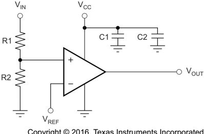

Threshold Detector

## Table of Contents

| 1 Features ............................................................................1   | 7.2 Functional Block Diagram......................................... 11            |
|--------------------------------------------------------------------------------------------|-------------------------------------------------------------------------------------|
| 2 Applications .....................................................................1      | 7.3 Feature Description...................................................11        |
| 3 Description .......................................................................1     | 7.4 Device Functional Modes..........................................11             |
| 4 Device Comparison Table ...............................................3                 | 8 Application and Implementation ..................................12               |
| 5 Pin Configuration and Functions ...................................3                     | 8.1 Application Information............................................. 12         |
| Pin Functions: TLV3201....................................................3                | 8.2 Typical Applications.................................................. 16       |
| Pin Functions: TLV3202....................................................3                | 8.3 Power Supply Recommendations.............................18                     |
| 6 Specifications ..................................................................4       | 8.4 Layout.......................................................................18 |
| 6.1 Absolute Maximum Ratings........................................ 4                     | 9 Device and Documentation Support ............................20                   |
| 6.2 ESD Ratings............................................................... 4           | 9.1 Device Support......................................................... 20      |
| 6.3 Recommended Operating Conditions.........................4                             | 9.2 Documentation Support............................................20             |
| 6.4 Thermal Information....................................................4               | 9.3 Receiving Notification of Documentation Updates....21                           |
| 6.5 Electrical Characteristics: V CC = 5V............................5                     | 9.4 Support Resources...................................................21          |
| 6.6 Switching Characteristics: V CC = 5V...........................5                       | 9.5 Trademarks...............................................................21     |
| 6.7 Electrical Characteristics: V CC = 2.7V.........................6                      | 9.6 Electrostatic Discharge Caution................................21               |
| 6.8 Switching Characteristics: V CC = 2.7V........................6                        | 9.7 Glossary....................................................................21  |
| 6.9 Typical Characteristics................................................7               | 10 Revision History ..........................................................22    |
| 7 Detailed Description ......................................................11            | 11 Mechanical, Packaging, and Orderable                                             |
| 7.1 Overview................................................................... 11         | Information .................................................................... 22 |

## 4 Device Comparison Table

| DEVICE   | DESCRIPTION                                                                                                    |
|----------|----------------------------------------------------------------------------------------------------------------|
| TLV3011  | 5µA (maximum) open-drain, 1.8V to 5.5V with integrated voltage reference in 1.5mm × 1.5mm micro-sized packages |
| TLV3012  | 5µA (maximum) push-pull, 1.8V to 5.5V with integrated voltage reference in micro-sized packages                |
| TLV3501  | 4.5ns, rail-to-rail, push-pull comparator in micro-sized packages                                              |
| LMV7235  | 75ns, 65µA, 2.7V to 5.5V, rail-to-rail input comparator with open-drain output                                 |
| REF3333  | 30ppm/°C drift, 3.9µA, SOT23-3, SC70-3 voltage reference                                                       |

## 5 Pin Configuration and Functions

Figure 5-1. TLV3201 DCK and DBV Packages 5-Pin SC70-5 and SOT-23 Top View

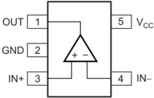

Pin Functions: TLV3201

Figure 5-2. TLV3202 D and DGK Packages 8-Pin SOIC and VSSOP Top View

| PIN   | PIN   | I/O   |                         |
|-------|-------|-------|-------------------------|
| NAME  | NO.   |       | DESCRIPTION             |
| GND   | 2     | -     | Negative supply, ground |
| IN-   | 4     | I     | Negative input          |
| IN+   | 3     | I     | Positive input          |
| OUT   | 1     | O     | Output                  |
| V CC  | 5     | -     | Positive supply         |

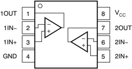

## Pin Functions: TLV3202

| PIN   | PIN   | I/O   |                              |
|-------|-------|-------|------------------------------|
| NAME  | NO.   | I/O   |                              |
| 1IN-  | 2     | I     | Negative input, comparator 1 |
| 1IN+  | 3     | I     | Positive input, comparator 1 |
| 1OUT  | 1     | O     | Output, comparator 1         |
| 2IN-  | 6     | I     | Negative input, comparator 2 |
| 2IN+  | 5     | I     | Positive input, comparator 2 |
| 2OUT  | 7     | O     | Output, comparator 2         |
| GND   | 4     | -     | Negative supply, ground      |
| V CC  | 8     | -     | Positive supply              |

## 6 Specifications

## 6.1 Absolute Maximum Ratings

over operating free-air temperature range (unless otherwise noted) (1)

|             |                          |   MIN | MAX           | UNIT   |
|-------------|--------------------------|-------|---------------|--------|
| Voltage     | Supply voltage           |       | 7             | V      |
| Voltage     | Signal input pins (2)    |  -0.5 | (V CC ) + 0.5 | V      |
|             | Signal input pins (2)    |   -10 | 10            | mA     |
|             | Output short circuit (3) |       | 100           | mA     |
| Temperature | Operating                |   -55 | 125           | °C     |
| Temperature | Junction, T J            |       | 150           | °C     |
| Temperature | Storage, T stg           |   -65 | 150           | °C     |

## 6.2 ESD Ratings

|         |                         |                                                        |                                                        | VALUE   | UNIT   |
|---------|-------------------------|--------------------------------------------------------|--------------------------------------------------------|---------|--------|
| V (ESD) |                         | Human-body model (HBM), per ANSI/ESDA/JEDEC JS-001 (1) | Human-body model (HBM), per ANSI/ESDA/JEDEC JS-001 (1) | ±2000   | V      |
|         | Electrostatic discharge | Charged-device model (CDM),                            | TLV3201                                                | ±2000   | V      |
|         |                         | per JEDEC specification JESD22-C101 (2)                | TLV3202                                                | ±1000   | V      |

## 6.3 Recommended Operating Conditions

over operating free-air temperature range (unless otherwise noted)

|     |                                         | MIN         | MAX         | UNIT   |
|-----|-----------------------------------------|-------------|-------------|--------|
| V S | Supply voltage, V S = (V S+ ) - (V S- ) | 2.7 (±1.35) | 5.5 (±2.75) | V      |
|     | Specified temperature                   | -40         | 125         | °C     |

## 6.4 Thermal Information

|                    |                                              | TLV3201      | TLV3201    | TLV3202   | TLV3202     |      |
|--------------------|----------------------------------------------|--------------|------------|-----------|-------------|------|
| THERMAL METRIC (1) | THERMAL METRIC (1)                           | DBV (SOT-23) | DCK (SC70) | D (SOIC)  | DGK (VSSOP) | UNIT |
|                    |                                              | 5 PINS       | 5 PINS     | 8 PINS    | 8 PINS      |      |
| R θJA              | Junction-to-ambient thermal resistance       | 237.8        | 281.9      | 143.6     | 201.9       | °C/W |
| R θJC(top)         | Junction-to-case (top) thermal resistance    | 108.7        | 97.6       | 97.2      | 92.5        | °C/W |
| R θJB              | Junction-to-board thermal resistance         | 64.1         | 68.3       | 84.2      | 123.3       | °C/W |
| ψ JT               | Junction-to-top characterization parameter   | 12.1         | 2.6        | 45.5      | 23.0        | °C/W |
| ψ JB               | Junction-to-board characterization parameter | 63.3         | 67.3       | 83.7      | 212.6       | °C/W |

## 6.5 Electrical Characteristics: VCC = 5V

at T A = 25°C and VCC = 5V (unless otherwise noted)

| PARAMETER           | PARAMETER                              | TEST CONDITIONS                      | MIN                 | TYP                  | MAX                 | UNIT                |
|---------------------|----------------------------------------|--------------------------------------|---------------------|----------------------|---------------------|---------------------|
| OFFSET VOLTAGE      | OFFSET VOLTAGE                         | OFFSET VOLTAGE                       | OFFSET VOLTAGE      | OFFSET VOLTAGE       | OFFSET VOLTAGE      | OFFSET VOLTAGE      |
| V IO-TLV3201        | Input offset voltage TLV3201           | V CM = V CC / 2                      |                     | 1                    | 3                   | mV                  |
| V IO-TLV3201        |                                        | T A = -40°C to 125°C                 |                     |                      | 4                   | mV                  |
| V IO-TLV3202        | Input offset voltage TLV3202           | V CM = V CC / 2                      |                     | 1                    | 5                   | mV                  |
| V IO-TLV3202        |                                        | T A = -40°C to 125°C                 |                     |                      | 6                   | mV                  |
| dV OS /dT           | Input offset voltage drift             | T A = -40°C to 125°C                 |                     | 1                    | 10                  | µV/°C               |
| PSRR                | Power-supply rejection ratio           | V CM = V CC / 2, V CC = 2.5V to 5.5V | 65                  | 85                   |                     | dB                  |
| PSRR                | Input hysteresis                       |                                      |                     | 1.2                  |                     | mV                  |
| INPUT BIAS CURRENT  | INPUT BIAS CURRENT                     | INPUT BIAS CURRENT                   | INPUT BIAS CURRENT  | INPUT BIAS CURRENT   | INPUT BIAS CURRENT  | INPUT BIAS CURRENT  |
| I IB                | Input bias current                     | V CM = V CC / 2                      |                     | 1                    | 50                  | pA                  |
| I IB                |                                        | T A = -40°C to 125°C                 |                     |                      | 5                   | nA                  |
| I IO                | Input offset current                   | V CM = V CC / 2                      |                     | 1                    | 50                  | pA                  |
| I IO                |                                        | T A = -40°C to 125°C                 |                     |                      | 2.5                 | nA                  |
| INPUT VOLTAGE RANGE | INPUT VOLTAGE RANGE                    | INPUT VOLTAGE RANGE                  | INPUT VOLTAGE RANGE | INPUT VOLTAGE RANGE  | INPUT VOLTAGE RANGE | INPUT VOLTAGE RANGE |
| V CM                | Common-mode voltage                    | T A = -40°C to 125°C                 | (V EE ) - 0.2       |                      | CC ) + 0.2          | V                   |
| CMRR                | Common-mode rejection ratio            | -0.2V < V CM < 5.2V                  | 60                  | 70                   |                     | dB                  |
| INPUT IMPEDANCE     | INPUT IMPEDANCE                        | INPUT IMPEDANCE                      | INPUT IMPEDANCE     | INPUT IMPEDANCE      | INPUT IMPEDANCE     | INPUT IMPEDANCE     |
|                     | Common mode                            |                                      |                     | 10 13 &#124;&#124; 2 |                     | Ω &#124;&#124;pF    |
|                     | Differential                           |                                      | 10 13               | &#124;&#124; 4       |                     | Ω &#124;&#124;pF    |
| OUTPUT              | OUTPUT                                 | OUTPUT                               | OUTPUT              | OUTPUT               | OUTPUT              | OUTPUT              |
| V OL                | Voltage output swing from lower rail   | I SINK = 4mA                         |                     | 175                  | 190                 | mV                  |
| V OL                |                                        | T A = -40°C to 125°C                 |                     |                      | 225                 | mV                  |
| V OH                | Voltage output swing from upper rail   | I SOURCE = 4mA                       |                     | 120                  | 140                 | mV                  |
| V OH                | Voltage output swing from upper rail   | T A = -40°C to 125°C                 |                     |                      | 170                 | mV                  |
| I SC                | Short-circuit current (per comparator) | I SC sinking                         | 40                  | 48                   |                     | mA                  |
| I SC                | Short-circuit current (per comparator) | T A = -40°C to 125°C                 | See Figure 6-14     |                      |                     | mA                  |
| I SC                |                                        | I SC sourcing                        | 52                  | 60                   |                     | mA                  |
| I SC                |                                        | T A = -40°C to 125°C                 | See Figure 6-14     |                      |                     | mA                  |
| POWER SUPPLY        | POWER SUPPLY                           | POWER SUPPLY                         | POWER SUPPLY        | POWER SUPPLY         | POWER SUPPLY        | POWER SUPPLY        |
| V CC                | Specified voltage                      |                                      | 2.7                 |                      | 5.5                 | V                   |
|                     |                                        | T A = 25°C                           |                     | 40                   | 50                  | µA                  |
| I Q                 | Quiescent current                      | T A = -40°C to 125°C                 |                     |                      | 65                  |                     |

## 6.6 Switching Characteristics: VCC = 5V

over operating free-air temperature range (unless otherwise noted)

| PARAMETER   | PARAMETER              | TEST CONDITIONS                     | TEST CONDITIONS                      | MIN   |   TYP |   MAX | UNIT   |
|-------------|------------------------|-------------------------------------|--------------------------------------|-------|-------|-------|--------|
| t PD        | Propagation delay time | Low to high                         | Input overdrive = 20mV , C L = 15pF  |       |    47 |    50 |        |
| t PD        |                        | Low to high                         | Input overdrive = 100mV , C L = 15pF |       |    43 |    50 |        |
| t PD        |                        | Low to high                         | T A = -40°C to 125°C                 |       |       |    55 | ns     |
| t PD        |                        |                                     | Input overdrive = 20mV , C L = 15pF  |       |    45 |    50 |        |
| t PD        |                        | High to low                         | Input overdrive = 100mV , C L = 15pF |       |    42 |    50 |        |
| t PD        |                        |                                     | T A = -40°C to 125°C                 |       |       |    55 |        |
|             | Propagation delay skew | Input overdrive = 20mV , C L = 15pF | Input overdrive = 20mV , C L = 15pF  |       |     2 |       | ns     |
| t R         | Rise time              | 10% to 90%                          | 10% to 90%                           |       |   2.9 |       | ns     |
| t F         | Fall time              | 10% to 90%                          | 10% to 90%                           |       |   3.7 |       | ns     |

## 6.7 Electrical Characteristics: VCC = 2.7V

at T A = 25°C and VCC = 2.7V (unless otherwise noted)

| PARAMETER           | PARAMETER                              | TEST CONDITIONS                      | MIN                 | TYP                  | MAX                 | UNIT                |
|---------------------|----------------------------------------|--------------------------------------|---------------------|----------------------|---------------------|---------------------|
| OFFSET VOLTAGE      | OFFSET VOLTAGE                         | OFFSET VOLTAGE                       | OFFSET VOLTAGE      | OFFSET VOLTAGE       | OFFSET VOLTAGE      | OFFSET VOLTAGE      |
| V IO-TLV3201        | Input offset voltage TLV3201           | V CM = V CC / 2                      |                     | 1                    | 3                   | mV                  |
| V IO-TLV3201        | Input offset voltage TLV3201           | T A = -40°C to 125°C                 |                     |                      | 4                   | mV                  |
| V IO-TLV3202        | Input offset voltage TLV3202           | V CM = V CC / 2                      |                     | 1                    | 5                   | mV                  |
| V IO-TLV3202        | Input offset voltage TLV3202           | T A = -40°C to 125°C                 |                     |                      | 6                   | mV                  |
| dV OS /dT           | Input offset voltage drift             | T A = -40°C to 125°C                 |                     | 1                    | 10                  | µV/°C               |
| PSRR                | Power-supply rejection ratio           | V CM = V CC / 2, V CC = 2.5V to 5.5V | 65                  | 85                   |                     | dB                  |
| PSRR                | Input hysteresis                       |                                      |                     | 1.2                  |                     | mV                  |
| INPUT BIAS CURRENT  | INPUT BIAS CURRENT                     | INPUT BIAS CURRENT                   | INPUT BIAS CURRENT  | INPUT BIAS CURRENT   | INPUT BIAS CURRENT  | INPUT BIAS CURRENT  |
| I IB                | Input bias current                     | V CM = V CC / 2                      |                     | 1                    | 50                  | pA                  |
| I IB                | Input bias current                     | T A = -40°C to 125°C                 |                     |                      | 5                   | nA                  |
| I IO                | Input offset current                   | V CM = V CC / 2                      |                     | 1                    | 50                  | pA                  |
| I IO                | Input offset current                   | T A = -40°C to 125°C                 |                     |                      | 2.5                 | nA                  |
| INPUT VOLTAGE RANGE | INPUT VOLTAGE RANGE                    | INPUT VOLTAGE RANGE                  | INPUT VOLTAGE RANGE | INPUT VOLTAGE RANGE  | INPUT VOLTAGE RANGE | INPUT VOLTAGE RANGE |
| V CM                | Common-mode voltage                    | T A = -40°C to 125°C                 | (V EE ) - 0.2       |                      | CC ) + 0.2          | V                   |
| CMRR                | Common-mode rejection ratio            | -0.2V < V CM < 2.9V                  | 56                  | 68                   |                     | dB                  |
| INPUT IMPEDANCE     | INPUT IMPEDANCE                        | INPUT IMPEDANCE                      | INPUT IMPEDANCE     | INPUT IMPEDANCE      | INPUT IMPEDANCE     | INPUT IMPEDANCE     |
|                     | Common mode                            |                                      |                     | 10 13 &#124;&#124; 2 |                     | Ω &#124;&#124;pF    |
|                     | Differential                           |                                      | 10 13               | &#124;&#124; 4       |                     | Ω &#124;&#124;pF    |
| OUTPUT              | OUTPUT                                 | OUTPUT                               | OUTPUT              | OUTPUT               | OUTPUT              | OUTPUT              |
| V OL                | Voltage output swing from lower rail   | I SINK = 4mA                         |                     | 230                  | 260                 | mV                  |
| V OL                | Voltage output swing from lower rail   | T A = -40°C to 125°C                 |                     |                      | 325                 | mV                  |
| V OH                | Voltage output swing from upper rail   | I SOURCE = 4mA                       |                     | 210                  | 250                 | mV                  |
| V OH                | Voltage output swing from upper rail   | T A = -40°C to 125°C                 |                     |                      | 350                 | mV                  |
| I SC                | Short-circuit current (per comparator) | I SC sinking                         | 13                  | 19                   |                     | mA                  |
| I SC                | Short-circuit current (per comparator) | T A = -40°C to 125°C                 | See Figure          | 6-14                 |                     | mA                  |
| I SC                | Short-circuit current (per comparator) | I SC sourcing                        | 15                  | 21                   |                     | mA                  |
| I SC                | Short-circuit current (per comparator) | T A = -40°C to 125°C                 | See Figure 6-14     |                      |                     | mA                  |
| POWER SUPPLY        | POWER SUPPLY                           | POWER SUPPLY                         | POWER SUPPLY        | POWER SUPPLY         | POWER SUPPLY        | POWER SUPPLY        |
| V CC                | Specified voltage                      |                                      | 2.7                 |                      | 5.5                 | V                   |
| I Q                 | Quiescent current                      | T A = 25°C                           |                     | 36                   | 46                  | µA                  |
| I Q                 | Quiescent current                      | T A = -40°C to 125°C                 |                     |                      | 60                  |                     |

## 6.8 Switching Characteristics: VCC = 2.7V

over operating free-air temperature range (unless otherwise noted)

| PARAMETER   | PARAMETER              | TEST CONDITIONS                     | TEST CONDITIONS                      | MIN   |   TYP |   MAX | UNIT   |
|-------------|------------------------|-------------------------------------|--------------------------------------|-------|-------|-------|--------|
| t PD        |                        | Low to high                         | Input overdrive = 20mV , C L = 15pF  |       |    47 |    50 |        |
| t PD        |                        | Low to high                         | Input overdrive = 100mV , C L = 15pF |       |    42 |    50 |        |
| t PD        | Propagation delay time | Low to high                         | T A = -40°C to 125°C                 |       |       |    55 | ns     |
| t PD        |                        |                                     | Input overdrive = 20mV , C L = 15pF  |       |    40 |    50 |        |
| t PD        |                        | High to low                         | Input overdrive = 100mV , C L = 15pF |       |    38 |    50 |        |
| t PD        |                        |                                     | T A = -40°C to 125°C                 |       |       |    55 |        |
|             | Propagation delay skew | Input overdrive = 20mV , C L = 15pF | Input overdrive = 20mV , C L = 15pF  |       |     2 |       | ns     |
| t R         | Rise time              | 10% to 90%                          | 10% to 90%                           |       |   4.8 |       | ns     |
| t F         | Fall time              | 10% to 90%                          | 10% to 90%                           |       |   5.2 |       | ns     |

## 6.9 Typical Characteristics

at T A  = 25°C, VCC = 5V, and input overdrive (V OD ) = 20mV (unless otherwise noted)

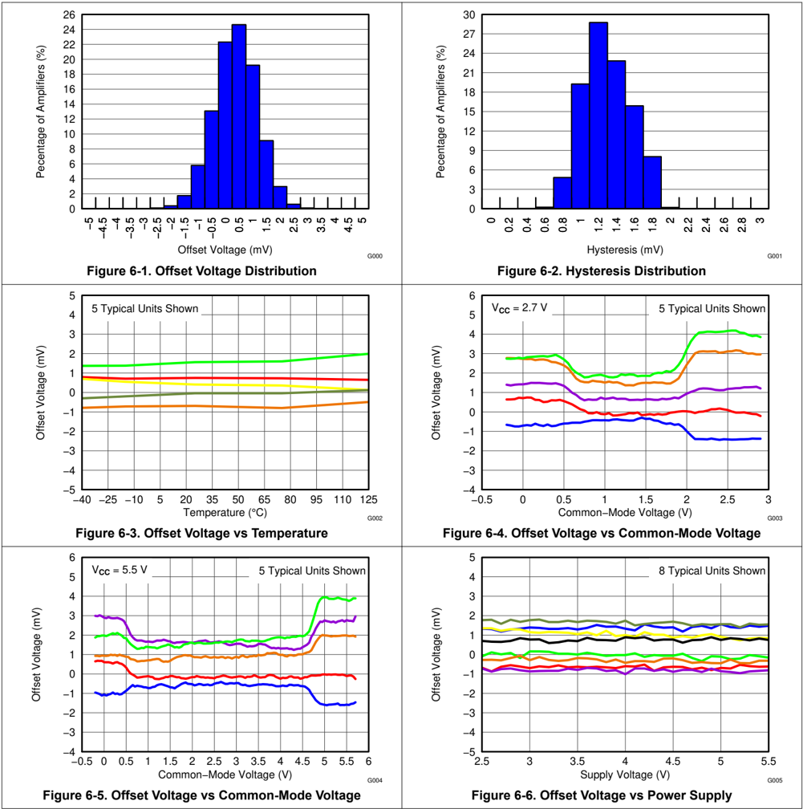

## 6.9 Typical Characteristics (continued)

at T A  = 25°C, VCC = 5V, and input overdrive (V OD ) = 20mV (unless otherwise noted)

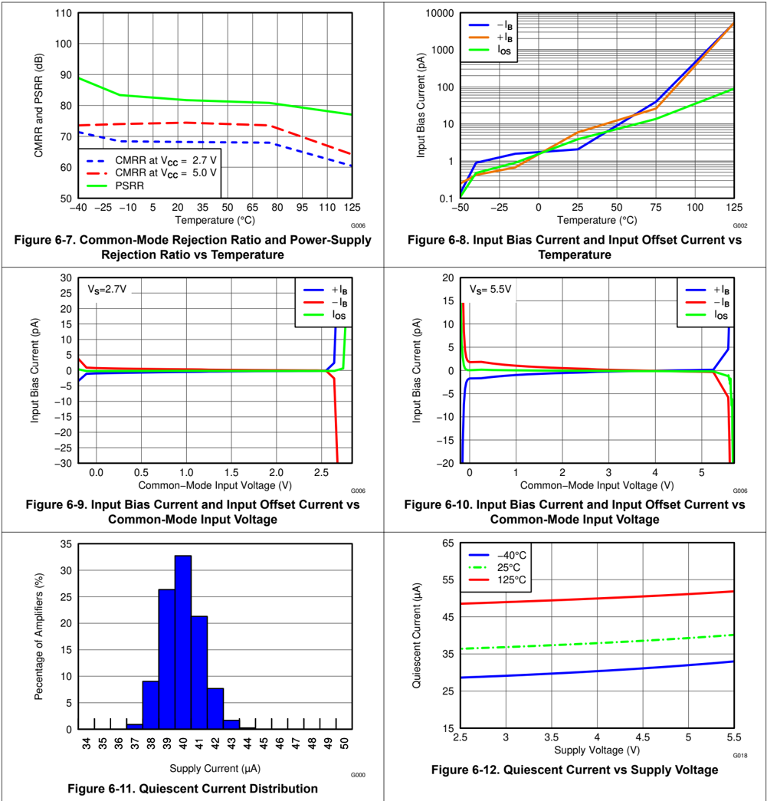

## 6.9 Typical Characteristics (continued)

at T A  = 25°C, VCC = 5V, and input overdrive (V OD ) = 20mV (unless otherwise noted)

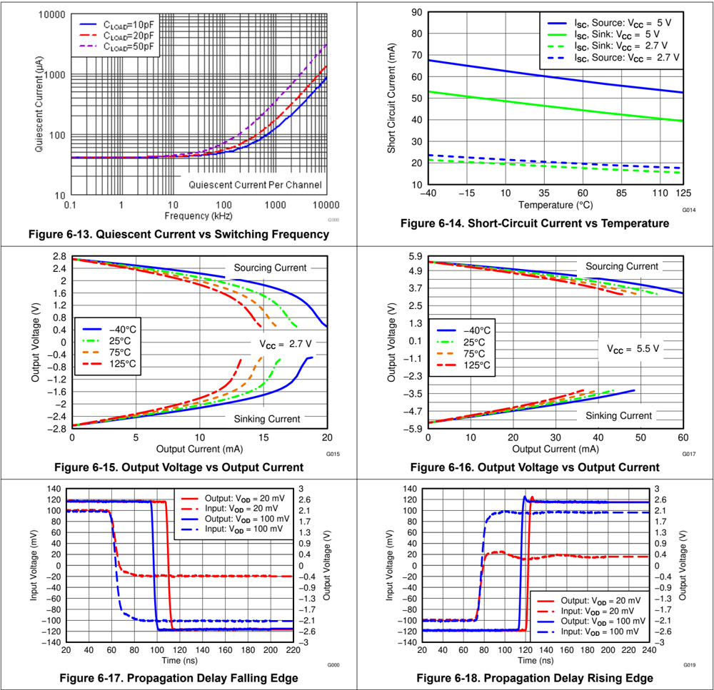

## 6.9 Typical Characteristics (continued)

at T A  = 25°C, VCC = 5V, and input overdrive (V OD ) = 20mV (unless otherwise noted)

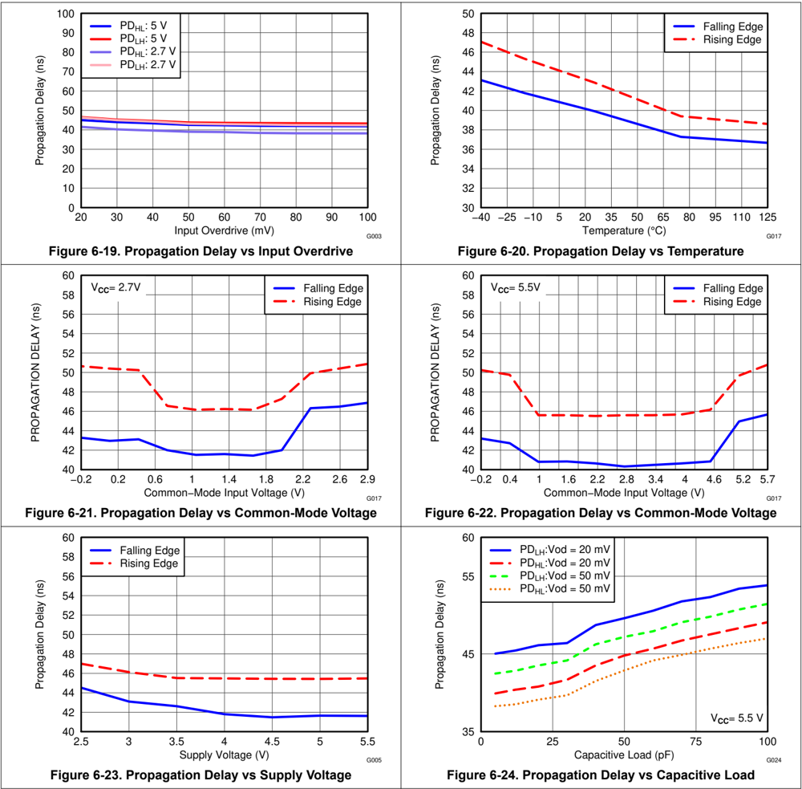

[www.ti.com](https://www.ti.com/)

## 7 Detailed Description

## 7.1 Overview

The TLV3201 and TLV3202 devices feature 40ns response time, and include 1.2mV of internal hysteresis for improved noise immunity with an input common-mode range that extends 0.2V beyond the power-supply rails.

## 7.2 Functional Block Diagram

## 7.3 Feature Description

## 7.3.1 Operating Voltage

The TLV3201 and TLV3202 comparators are specified for use on a single supply from 2.7V to 5.5V (or a dual supply from ±1.35V to ±2.75V) over a temperature range of -40°C to 125°C. The device continues to function below this range, but performance is not specified.

## 7.3.2 Input Overvoltage Protection

The  device  inputs  are  protected  by  electrostatic  discharge  (ESD)  diodes  that  conduct  if  the  input  voltages exceed  the  power  supplies  by  more  than  approximately  300mV  .  Momentary  voltages  greater  than  300mV beyond  the  power  supply  can  be  tolerated  if  the  input  current  is  limited  to  10mA.  This  limiting  is  easily accomplished with a small input resistor in series with the input to the comparator.

## 7.4 Device Functional Modes

The device is fully functional when powered by rail-to-rail supply voltage greater than 2.7V. The device is off at any voltages below 2.7V.

Copyright © 2016, Texas Instruments Incorporated

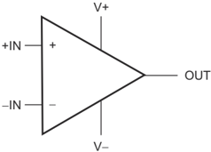

## 8 Application and Implementation

## Note

Information  in  the  following  applications  sections  is  not  part  of  the  TI  component  specification, and  TI does  not  warrant its accuracy  or completeness.  TI's customers  are  responsible  for determining suitability of components for their purposes, as well as validating and testing their design implementation to confirm system functionality.

## 8.1 Application Information

The TLV3201 and TLV3202 are single- and dual-supply (respectively), push-pull comparators featuring 40ns of propagation delay on only 40µA of supply current. This combination of fast response time and minimal power consumption make the TLV3201 and TLV3202 excellent comparators for portable, battery-powered applications as well as fast-switching threshold detection such as pulse-width modulation (PWM) output monitors and zerocross detection.

## 8.1.1 Comparator Inputs

The TLV3201 and TLV3202 are rail-to-rail input comparators, with an input common-mode range that exceeds the supply rails by 200mV for both positive and negative supplies. The devices are specified from 2.7V to 5.5V, with room temperature operation from 2.5V to 5.5V. The TLV3201 and TLV3202 are designed to prevent phase inversion when the input pins exceed the supply voltage. Figure 8-1 shows the TLV320x response when input voltages exceed the supply, resulting in no phase inversion.

Figure 8-1. No Phase Inversion: Comparator Response to Input Voltage (Propagation Delay Included)

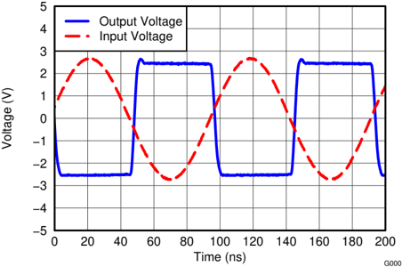

The electrostatic discharge (ESD) protection input structure of two back-to-back diodes and 1kΩ series resistors are  used  to  limit  the  differential  input  voltage  applied  to  the  precision  input  of  the  comparator  by  clamping input  voltages  that  exceed  V CC  beyond  the  specified  operating  conditions.  If  potential  overvoltage  conditions that  exceed  absolute  maximum  ratings  are  present,  the  addition  of  external  bypass  diodes  and  resistors  is recommended,  as  shown  in  Figure  8-2.  Large  differential  voltages  greater  than  the  supply  voltage  must  be avoided to prevent damage to the input stage.

Figure 8-2. TLV3201 Equivalent Input structure

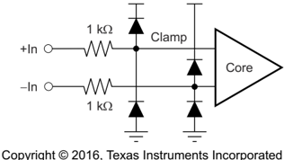

## 8.1.2 External Hysteresis

The TLV3201 and TLV3202 have a hysteresis transfer curve (shown in Figure 8-3) that is a function of three components: VTH, VOS, and VHYST.

- VTH: the actual set voltage or threshold trip voltage
- VOS: the internal offset voltage between V IN+  and V IN. This voltage is added to V TH to form the actual trip point at which the comparator must respond to change output states.
- VHYST: internal hysteresis (or trip window) that is designed to reduce comparator sensitivity to noise.

Figure 8-3. TLV320x Hysteresis Transfer Curve

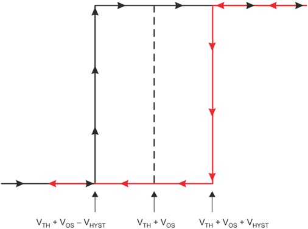

## 8.1.2.1 Inverting Comparator with Hysteresis

The inverting comparator with hysteresis requires a three-resistor network that is referenced to the comparator supply voltage (VCC), as shown in Figure 8-4. When VIN at the inverting input is less than V A , the output voltage is high (for simplicity, assume V O switches as high as VCC). The three network resistors can be represented as R1 || R3 in series with R2. The lower input trip voltage (V A1) is defined by Equation 1.

<!-- formula-not-decoded -->

When VIN is greater than [VA × (VIN &gt; V A )], the output voltage is low, very close to ground. In this case, the three network resistors can be presented as R2 || R3 in series with R1. The upper trip voltage (VA2) is defined by Equation 2.

<!-- formula-not-decoded -->

The total hysteresis provided by the network is defined by Equation 3.

<!-- formula-not-decoded -->

Figure 8-4. TLV3201 in Inverting Configuration With Hysteresis

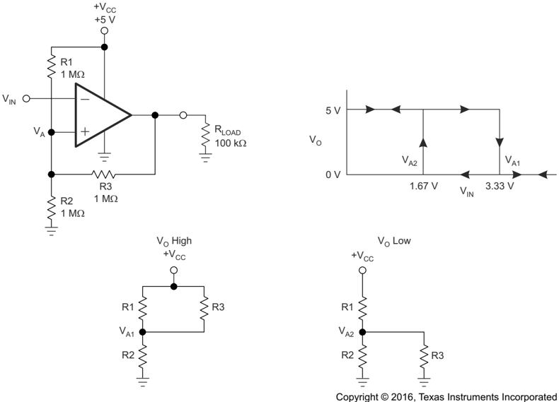

## 8.1.2.2 Noninverting Comparator With Hysteresis

A noninverting comparator with hysteresis requires a two-resistor network, as shown in Figure 8-5, and a voltage reference (VREF) at the inverting input. When VIN  is low, the output is also low. For the output to switch from low to high, V IN must rise up to V IN1 . V IN1  is calculated by Equation 4.

<!-- formula-not-decoded -->

When VIN is high, the output is also high. In order for the comparator to switch back to a low state, VIN must equal VREF before VA is again equal to VREF. VIN can be calculated by Equation 5.

<!-- formula-not-decoded -->

The hysteresis of this circuit is the difference between V IN1  and VIN2, as defined by Equation 6.

<!-- formula-not-decoded -->

Figure 8-5. TLV3201 in Noninverting Configuration With Hysteresis

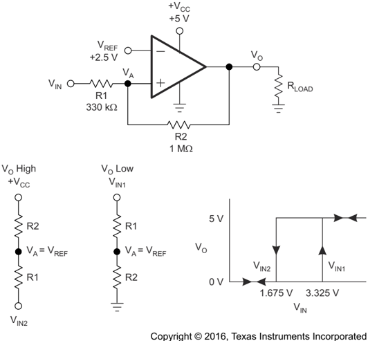

## 8.1.3 Capacitive Loads

The  TLV3201  and  TLV3202  feature  a  push-pull  output.  When  the  output  switches,  there  is  a  direct  path between VCC and ground, causing increased output sinking or sourcing current during the transition. Following the  transition  the  output  current  decreases  and  supply  current  returns  to  40µA,  thus  maintaining  low  power consumption.  Under  reasonable  capacitive  loads,  the  TLV3201  and  TLV3202  maintain  specified  propagation delay (see Section 6.9 ), but excessive capacitive loading under high switching frequencies may increase supply current, propagation delay, or induce decreased slew rate.

## 8.2 Typical Applications

## 8.2.1 TLV3201 Configured as an AC-Coupled Comparator

One of the benefits of AC coupling a single-supply comparator circuit is that it can block dc offsets induced by ground-loop offsets that could potentially produce either a false trip or a common-mode input violation. Figure 8-6 shows the TLV3201 configured as an ac-coupled comparator.

Figure 8-6. TLV3201 Configured as an AC-Coupled Comparator (Schematic)

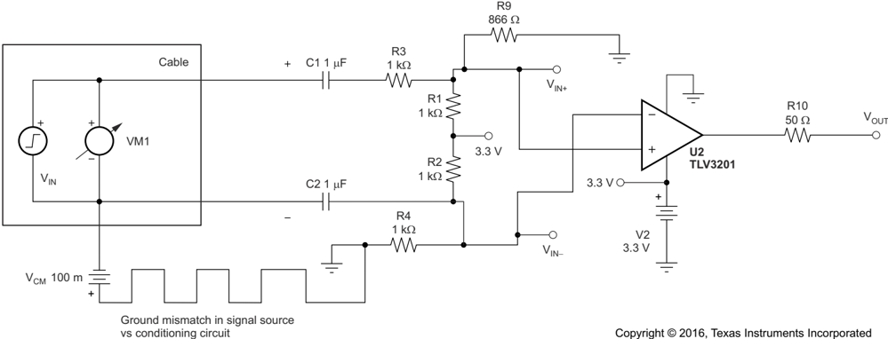

## 8.2.1.1 Design Requirements

## Design requirements include:

- Ability to tolerate up to ±100mV of common-mode signal.
- Trigger only on AC signals (such as zero-cross detection).

## 8.2.1.2 Detailed Design Procedure

## Design analysis:

- AC-coupled, high-pass frequency
- Large capacitors require longer start-up time from device power on
- Use 1µF capacitor to achieve high-pass frequency of approximately 159Hz
- For high-pass equivalent, use CIN = 0.5µF, RIN  = 2kΩ
1. Set up input dividers initially for one-half supply (to be in center of acceptable common-mode range).
2. Adjust either divider slightly upwards or downwards as desired to establish quiescent output condition.
3. Select coupling capacitors based on lowest expected frequency.

## 8.2.1.3 Application Curve

Figure 8-7. AC-Coupled Comparator Results

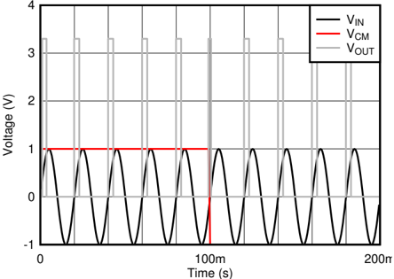

## 8.2.2 TLV3201 and OPA320 Configured as a Fast-Response Output Current Monitor

Figure  8-8  shows  a  single-supply  current  monitor  configured  as  a  difference  amplifier  with  a  gain  of  50.  The OPA320  was  chosen  for  this  circuit  because  of  its  gain  bandwidth  (20  MHz),  which  allows  higher  speed triggering and monitoring of the current across the shunt resistor followed by the fast response of the TLV3201.

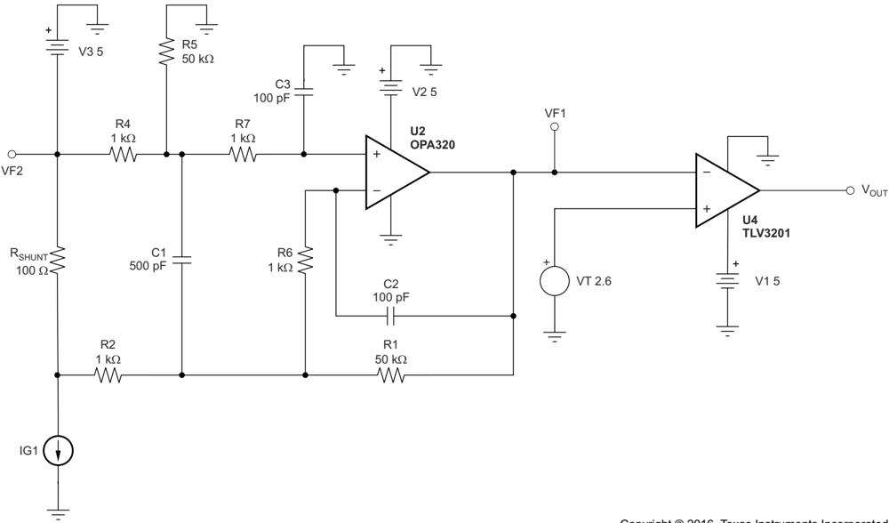

Copyright © 2016, Texas Instruments Incorporated

Figure 8-8. TLV3201 and OPA320 Configured as a Fast-Response Output Current Monitor

## 8.2.3 TLV3201 and TMP20 Configured as a Precision Analog Temperature Switch

Figure 8-9 shows the TMP20 and TLV3201 designed as a high-speed temperature switch. The TMP20 is an analog output temperature sensor where output voltage decreases with temperature. The comparator output is tripped when the output reaches a critical trip threshold.

Figure 8-9. TLV3201 and TMP20 Configured as a Precision Analog Temperature Switch

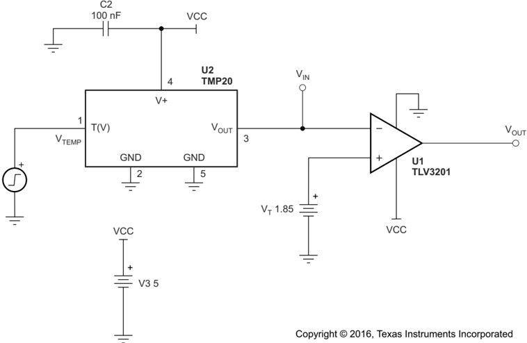

## 8.3 Power Supply Recommendations

The TLV3201 and TLV3202 comparators are specified for use on a single supply from 2.7V to 5.5V (or a dual supply from ±1.35V to ±2.75V) over a temperature range of -40°C to 125°C. The device continues to function below this range, but performance is not specified. Place bypass capacitors close to the power-supply pins to reduce noise coupling in from noisy or high-impedance power supplies. For more detailed information on bypass capacitor placement, see Section 8.4.1 .

## 8.4 Layout

## 8.4.1 Layout Guidelines

The  TLV3201  and  TLV3202  are  fast-switching,  high-speed  comparators  and  require  high-speed  layout considerations. For best results, maintain the following layout guidelines.

- Use a printed-circuit board (PCB) with a good, unbroken low-inductance ground plane.
- Place a decoupling capacitor (0.1µF ceramic, surface-mount capacitor) as close as possible to VCC.
- On the inputs and the output, keep lead lengths as short as possible to avoid unwanted parasitic feedback around the comparator. Keep inputs away from the output.
- Solder the device directly to the PCB rather than using a socket.
- For slow-moving input signals, take care to prevent parasitic feedback. A small capacitor (1000pF or less) placed between the inputs can help eliminate oscillations in the transition region. This capacitor causes some degradation to propagation delay when the impedance is low. The topside ground plane runs between the output and inputs.
- The ground pin ground trace runs under the device up to the bypass capacitor, shielding the inputs from the outputs.

## 8.4.2 Layout Example

Figure 8-10. TLV320x Board Layout Example

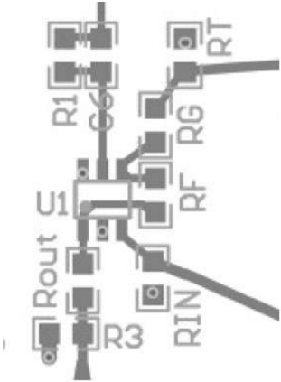

## 9 Device and Documentation Support

## 9.1 Device Support

## 9.1.1 Development Support

## 9.1.1.1 TINA-TI™ (Free Software Download)

TINA-TI ™  is a simple, powerful, and easy-to-use circuit simulation program based on a SPICE engine. TINA-TI is a free, fully-functional version of the TINA software, preloaded with a library of macro models in addition to a range of both passive and active models. TINA-TI provides all the conventional dc, transient, and frequency domain analysis of SPICE, as well as additional design capabilities.

Available as a free download from the Analog eLab Design Center, TINA-TI offers extensive post-processing capability that allows users to format results in a variety of ways. Virtual instruments offer the ability to select input waveforms and probe circuit nodes, voltages, and waveforms, creating a dynamic quick-start tool.

## Note

These files require that either the TINA software (from DesignSoft ™ ) or TINA-TI software be installed. Download the free TINA-TI software from the TINA-TI folder.

## 9.1.1.2 Universal Op Amp EVM

The Universal Op Amp EVM is a series of general-purpose, blank circuit boards that simplify prototyping circuits for  a  variety  of  IC  package  types.  The  evaluation  module  board  design  allows  many  different  circuits  to  be constructed easily and quickly. Five models are offered, with each model intended for a specific package type. PDIP, SOIC, MSOP, TSSOP and SOT23 packages are all supported.

## Note

These  boards  are  unpopulated,  so  users  must  provide  their  own  ICs.  TI  recommends  requesting several op amp device samples when ordering the Universal Op Amp EVM.

## 9.1.1.3 TI Precision Designs

TI  Precision  Designs  are  analog  solutions  created  by  TI's  precision  analog  applications  experts  and  offer  the theory  of  operation,  component  selection,  simulation,  complete  PCB  schematic  and  layout,  bill  of  materials, and  measured  performance  of  many  useful  circuits.  TI  Precision  Designs  are  available  online  at  http:// www.ti.com/ww/en/analog/precision-designs/.

## 9.1.1.4 WEBENCH ®  Filter Designer

WEBENCH® Filter Designer is a simple, powerful, and easy-to-use active filter design program. The WEBENCH Filter Designer lets you create optimized filter designs using a selection of TI operational amplifiers and passive components from TI's vendor partners.

Available as a web-based tool from the WEBENCH® Design Center, WEBENCH® Filter Designer allows you to design, optimize, and simulate complete multistage active filter solutions within minutes.

## 9.2 Documentation Support

## 9.2.1 Related Documentation

The following documents are relevant to using the TLV320x, and recommended for reference. All are available for download at www.ti.com unless otherwise noted.

- [Frequency Dithering With the UCC28950 and TLV3201 (SLUA646)](https://www.ti.com/lit/pdf/slua646)
- [Frequency Dithering with the UCC28180 and TLV3201 (SLUA704)](https://www.ti.com/lit/pdf/SLUA704)
- [Comparator with Hysteresis Reference Design (TIDU020)](https://www.ti.com/lit/pdf/tidu020)

## 9.3 Receiving Notification of Documentation Updates

To receive notification of documentation updates, navigate to the device product folder on ti.com. In the upper right  corner,  click  on Alert  me to  register  and  receive  a  weekly  digest  of  any  product  information  that  has changed. For change details, review the revision history included in any revised document.

## 9.4 Support Resources

TI E2E ™  support forums are an engineer's go-to source for fast, verified answers and design help - straight from the experts. Search existing answers or ask your own question to get the quick design help you need.

Linked content is provided "AS IS" by the respective contributors. They do not constitute TI specifications and do not necessarily reflect TI's views; see TI's Terms of Use.

## 9.5 Trademarks

TINA-TI ™  is a trademark of Texas Insturments and DesignSoft, Inc..

DesignSoft ™  is a trademark of DesignSoft, Inc.

TI E2E ™  is a trademark of Texas Instruments.

WEBENCH ®  is a registered trademark of Texas Instruments.

All trademarks are the property of their respective owners.

## 9.6 Electrostatic Discharge Caution

This integrated circuit can be damaged by ESD. Texas Instruments recommends that all integrated circuits be handled with appropriate precautions. Failure to observe proper handling and installation procedures can cause damage.

ESD damage can range from subtle performance degradation to complete device failure. Precision integrated circuits may be more susceptible to damage because very small parametric changes could cause the device not to meet its published specifications.

## 9.7 Glossary

TI Glossary This glossary lists and explains terms, acronyms, and definitions.

## 10 Revision History

NOTE: Page numbers for previous revisions may differ from page numbers in the current version.

| Changes from Revision B (December 2016) to Revision C (June 2022)                                                                                                                                                                                                                                                                                                                                                                                                                            | Page   |
|----------------------------------------------------------------------------------------------------------------------------------------------------------------------------------------------------------------------------------------------------------------------------------------------------------------------------------------------------------------------------------------------------------------------------------------------------------------------------------------------|--------|
| • Corrected transposed TLV3202 D and DGK columns in Thermal Metric table..................................................                                                                                                                                                                                                                                                                                                                                                                   | 4      |
| • Corrected typo in DGK Tja from 146.3 to 143.6 for DGK in Thermal Metric table.............................................                                                                                                                                                                                                                                                                                                                                                                 | 4      |
| • Added Input Offset Voltage for TLV3201 for 5V.................................................................................................                                                                                                                                                                                                                                                                                                                                             | 5      |
| • Added 5V Switching Specifications table...........................................................................................................                                                                                                                                                                                                                                                                                                                                         | 5      |
| • Added Input Offset Voltage for TLV3201 for 2.7V..............................................................................................                                                                                                                                                                                                                                                                                                                                              | 6      |
| Changes from Revision A (June 2012) to Revision B (December 2016)                                                                                                                                                                                                                                                                                                                                                                                                                            | Page   |
| • Added ESD Ratings table, Feature Description section, Device Functional Modes , Application and Implementation section, Power Supply Recommendations section, Layout section, Device and Documentation Support section, and Mechanical, Packaging, and Orderable Information section ..................1 • Deleted Ordering Information table; see Package Option Addendum at the end of the data sheet...................1 Changes from Revision * (March 2012) to Revision A (June 2012) | Page   |
| • Changed product status from Production Data to Mixed                                                                                                                                                                                                                                                                                                                                                                                                                                       |        |
| Status.........................................................................1 • Added dual channel device................................................................................................................................                                                                                                                                                                                                                                                 | 1      |

## 11 Mechanical, Packaging, and Orderable Information

The  following  pages  include  mechanical,  packaging,  and  orderable  information.  This  information  is  the  most current data available for the designated devices. This data is subject to change without notice and revision of this document. For browser-based versions of this data sheet, refer to the left-hand navigation.

www.ti.com

## PACKAGING INFORMATION

| Orderable part number   | Status (1)   | Material type (2)   | Package &#124; Pins   | Package qty &#124; Carrier   | RoHS (3)   | Lead finish/ Ball material (4)             | MSL rating/ Peak reflow (5)   | Op temp (°C)   | Part marking (6)   |
|-------------------------|--------------|---------------------|-----------------------|------------------------------|------------|--------------------------------------------|-------------------------------|----------------|--------------------|
| TLV3201AIDBVR           | Active       | Production          | SOT-23 (DBV) &#124; 5 | 3000 &#124; LARGE T&R        | Yes        | SN                                         | Level-1-260C-UNLIM            | -40 to 125     | RAI                |
| TLV3201AIDBVR.B         | Active       | Production          | SOT-23 (DBV) &#124; 5 | 3000 &#124; LARGE T&R        | Yes        | SN                                         | Level-1-260C-UNLIM            | -40 to 125     | RAI                |
| TLV3201AIDBVT           | Active       | Production          | SOT-23 (DBV) &#124; 5 | 250 &#124; SMALL T&R         | Yes        | SN                                         | Level-1-260C-UNLIM            | -40 to 125     | RAI                |
| TLV3201AIDBVT.B         | Active       | Production          | SOT-23 (DBV) &#124; 5 | 250 &#124; SMALL T&R         | Yes        | SN                                         | Level-1-260C-UNLIM            | -40 to 125     | RAI                |
| TLV3201AIDCKR           | Active       | Production          | SC70 (DCK) &#124; 5   | 3000 &#124; LARGE T&R        | Yes        | NIPDAU &#124; SPOT AG (TOP SIDE) &#124; SN | Level-2-260C-1 YEAR           | -40 to 125     | SDP                |
| TLV3201AIDCKR.B         | Active       | Production          | SC70 (DCK) &#124; 5   | 3000 &#124; LARGE T&R        | Yes        | NIPDAU                                     | Level-2-260C-1 YEAR           | -40 to 125     | SDP                |
| TLV3201AIDCKRG4         | Active       | Production          | SC70 (DCK) &#124; 5   | 3000 &#124; LARGE T&R        | Yes        | NIPDAU                                     | Level-2-260C-1 YEAR           | -40 to 125     | SDP                |
| TLV3201AIDCKRG4.B       | Active       | Production          | SC70 (DCK) &#124; 5   | 3000 &#124; LARGE T&R        | Yes        | NIPDAU                                     | Level-2-260C-1 YEAR           | -40 to 125     | SDP                |
| TLV3201AIDCKT           | Active       | Production          | SC70 (DCK) &#124; 5   | 250 &#124; SMALL T&R         | Yes        | NIPDAU &#124; SPOT AG (TOP SIDE)           | Level-2-260C-1 YEAR           | -40 to 125     | SDP                |
| TLV3201AIDCKT.B         | Active       | Production          | SC70 (DCK) &#124; 5   | 250 &#124; SMALL T&R         | Yes        | NIPDAU                                     | Level-2-260C-1 YEAR           | -40 to 125     | SDP                |
| TLV3202AID              | Active       | Production          | SOIC (D) &#124; 8     | 50 &#124; TUBE               | Yes        | NIPDAU                                     | Level-2-260C-1 YEAR           | -40 to 125     | TL3202             |
| TLV3202AID.B            | Active       | Production          | SOIC (D) &#124; 8     | 50 &#124; TUBE               | Yes        | NIPDAU                                     | Level-2-260C-1 YEAR           | -40 to 125     | TL3202             |
| TLV3202AIDGK            | Active       | Production          | VSSOP (DGK) &#124; 8  | 80 &#124; TUBE               | Yes        | NIPDAUAG                                   | Level-1-260C-UNLIM            | -40 to 125     | VUDC               |
| TLV3202AIDGK.B          | Active       | Production          | VSSOP (DGK) &#124; 8  | 80 &#124; TUBE               | Yes        | NIPDAUAG                                   | Level-1-260C-UNLIM            | -40 to 125     | VUDC               |
| TLV3202AIDGKR           | Active       | Production          | VSSOP (DGK) &#124; 8  | 2500 &#124; LARGE T&R        | Yes        | NIPDAUAG                                   | Level-1-260C-UNLIM            | -40 to 125     | VUDC               |
| TLV3202AIDGKR.B         | Active       | Production          | VSSOP (DGK) &#124; 8  | 2500 &#124; LARGE T&R        | Yes        | NIPDAUAG                                   | Level-1-260C-UNLIM            | -40 to 125     | VUDC               |
| TLV3202AIDR             | Active       | Production          | SOIC (D) &#124; 8     | 2500 &#124; LARGE T&R        | Yes        | NIPDAU                                     | Level-2-260C-1 YEAR           | -40 to 125     | TL3202             |
| TLV3202AIDR.B           | Active       | Production          | SOIC (D) &#124; 8     | 2500 &#124; LARGE T&R        | Yes        | NIPDAU                                     | Level-2-260C-1 YEAR           | -40 to 125     | TL3202             |
| TLV3202AIDRG4           | Active       | Production          | SOIC (D) &#124; 8     | 2500 &#124; LARGE T&R        | Yes        | NIPDAU                                     | Level-2-260C-1 YEAR           | -40 to 125     | TL3202             |
| TLV3202AIDRG4.B         | Active       | Production          | SOIC (D) &#124; 8     | 2500 &#124; LARGE T&R        | Yes        | NIPDAU                                     | Level-2-260C-1 YEAR           | -40 to 125     | TL3202             |

www.ti.com

## PACKAGE OPTION ADDENDUM

22-Jul-2026

- (4) Lead finish/Ball material: Parts may have multiple material finish options. Finish options are separated by a vertical ruled line. Lead finish/Ball material values may wrap to two lines if the finish value exceeds the maximum column width.
- (5) MSL rating/Peak reflow: The moisture sensitivity level ratings and peak solder (reflow) temperatures. In the event that a part has multiple moisture sensitivity ratings, only the lowest level per JEDEC standards is shown. Refer to the shipping label for the actual reflow temperature that will be used to mount the part to the printed circuit board.

(6) Part marking: There may be an additional marking, which relates to the logo, the lot trace code information, or the environmental category of the part.

Multiple part markings will be inside parentheses. Only one part marking contained in parentheses and separated by a "~" will appear on a part. If a line is indented then it is a continuation of the previous line and the two combined represent the entire part marking for that device.

Important Information and Disclaimer: The information provided on this page represents TI's knowledge and belief as of the date that it is provided. TI bases its knowledge and belief on information provided by third parties, and makes no representation or warranty as to the accuracy of such information. Efforts are underway to better integrate information from third parties. TI has taken and continues to take reasonable steps to provide representative and accurate information but may not have conducted destructive testing or chemical analysis on incoming materials and chemicals. TI and TI suppliers consider certain information to be proprietary, and thus CAS numbers and other limited information may not be available for release.

In no event shall TI's liability arising out of such information exceed the total purchase price of the TI part(s) at issue in this document sold by TI to Customer on an annual basis.

## OTHER QUALIFIED VERSIONS OF TLV3201, TLV3202 :

- ·

- Automotive : TLV3201-Q1, TLV3202-Q1

## NOTE: Qualified Version Definitions:

- Automotive - Q100 devices qualified for high-reliability automotive applications targeting zero defects

www.ti.com

## TAPE AND REEL INFORMATION

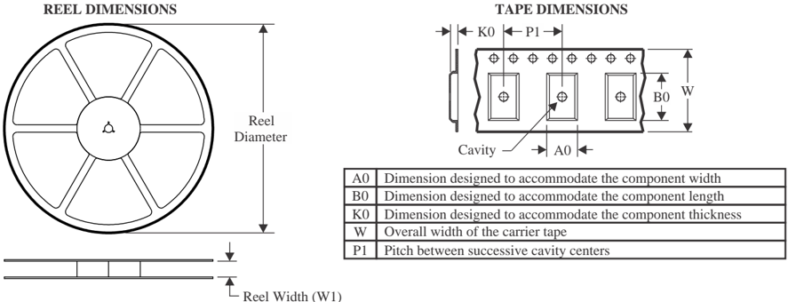

## QUADRANT ASSIGNMENTS FOR PIN 1 ORIENTATION IN TAPE

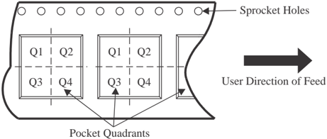

| Device          | Package Type   | Package Drawing   |   Pins |   SPQ |   Reel Diameter (mm) |   Reel Width W1 (mm) |   A0 (mm) |   B0 (mm) |   K0 (mm) |   P1 (mm) |   W (mm) | Pin1 Quadrant   |
|-----------------|----------------|-------------------|--------|-------|----------------------|----------------------|-----------|-----------|-----------|-----------|----------|-----------------|
| TLV3201AIDBVR   | SOT-23         | DBV               |      5 |  3000 |                178.0 |                  8.4 |       3.2 |       3.2 |       1.4 |       4.0 |      8.0 | Q3              |
| TLV3201AIDBVT   | SOT-23         | DBV               |      5 |   250 |                180.0 |                  8.4 |       3.2 |       3.2 |       1.4 |       4.0 |      8.0 | Q3              |
| TLV3201AIDCKR   | SC70           | DCK               |      5 |  3000 |                178.0 |                  9.0 |       2.4 |       2.5 |       1.2 |       4.0 |      8.0 | Q3              |
| TLV3201AIDCKR   | SC70           | DCK               |      5 |  3000 |                178.0 |                  8.4 |      2.25 |      2.45 |       1.2 |       4.0 |      8.0 | Q3              |
| TLV3201AIDCKRG4 | SC70           | DCK               |      5 |  3000 |                178.0 |                  9.0 |       2.4 |       2.5 |       1.2 |       4.0 |      8.0 | Q3              |
| TLV3201AIDCKT   | SC70           | DCK               |      5 |   250 |                178.0 |                  8.4 |       2.4 |       2.5 |       1.2 |       4.0 |      8.0 | Q3              |
| TLV3201AIDCKT   | SC70           | DCK               |      5 |   250 |                180.0 |                  8.4 |       2.3 |      2.55 |       1.2 |       4.0 |      8.0 | Q3              |
| TLV3202AIDGKR   | VSSOP          | DGK               |      8 |  2500 |                330.0 |                 12.4 |       5.3 |       3.4 |       1.4 |       8.0 |     12.0 | Q1              |
| TLV3202AIDRG4   | SOIC           | D                 |      8 |  2500 |                330.0 |                 12.4 |       6.4 |       5.2 |       2.1 |       8.0 |     12.0 | Q1              |

## *All dimensions are nominal

## PACKAGE MATERIALS INFORMATION

3-Jul-2026

www.ti.com

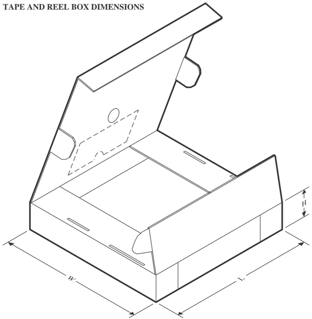

*All dimensions are nominal

| Device          | Package Type   | Package Drawing   |   Pins |   SPQ |   Length (mm) |   Width (mm) |   Height (mm) |
|-----------------|----------------|-------------------|--------|-------|---------------|--------------|---------------|
| TLV3201AIDBVR   | SOT-23         | DBV               |      5 |  3000 |         208.0 |        191.0 |          35.0 |
| TLV3201AIDBVT   | SOT-23         | DBV               |      5 |   250 |         210.0 |        185.0 |          35.0 |
| TLV3201AIDCKR   | SC70           | DCK               |      5 |  3000 |         190.0 |        190.0 |          30.0 |
| TLV3201AIDCKR   | SC70           | DCK               |      5 |  3000 |         208.0 |        191.0 |          35.0 |
| TLV3201AIDCKRG4 | SC70           | DCK               |      5 |  3000 |         190.0 |        190.0 |          30.0 |
| TLV3201AIDCKT   | SC70           | DCK               |      5 |   250 |         190.0 |        190.0 |          30.0 |
| TLV3201AIDCKT   | SC70           | DCK               |      5 |   250 |         210.0 |        185.0 |          35.0 |
| TLV3202AIDGKR   | VSSOP          | DGK               |      8 |  2500 |         364.0 |        364.0 |          27.0 |
| TLV3202AIDRG4   | SOIC           | D                 |      8 |  2500 |         353.0 |        353.0 |          32.0 |

## PACKAGE MATERIALS INFORMATION

3-Jul-2026

www.ti.com

## TUBE

B - Alignment groove width

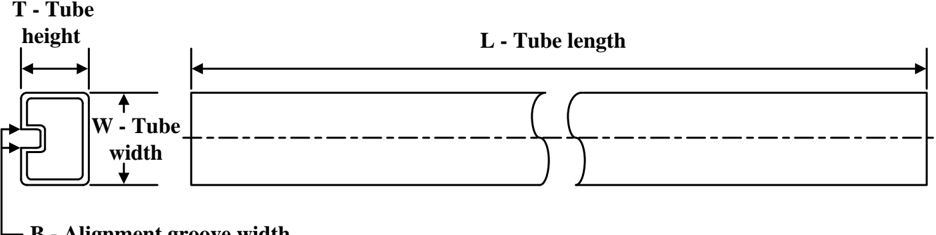

## *All dimensions are nominal

| Device         | Package Name   | Package Type   |   Pins |   SPQ |   L (mm) |   W (mm) |   T (µm) |   B (mm) |
|----------------|----------------|----------------|--------|-------|----------|----------|----------|----------|
| TLV3202AID     | D              | SOIC           |      8 |    50 |      507 |        8 |     3940 |     4.32 |
| TLV3202AID     | D              | SOIC           |      8 |    50 |    506.6 |        8 |     3940 |     4.32 |
| TLV3202AID.B   | D              | SOIC           |      8 |    50 |      507 |        8 |     3940 |     4.32 |
| TLV3202AID.B   | D              | SOIC           |      8 |    50 |    506.6 |        8 |     3940 |     4.32 |
| TLV3202AIDGK   | DGK            | VSSOP          |      8 |    80 |      330 |     6.55 |      500 |     2.88 |
| TLV3202AIDGK.B | DGK            | VSSOP          |      8 |    80 |      330 |     6.55 |      500 |     2.88 |

## PACKAGE MATERIALS INFORMATION

3-Jul-2026

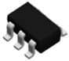

SCALE  4.0

0

## SOT-23 - 1.45 mm max height

## SMALL OUTLINE TRANSISTOR

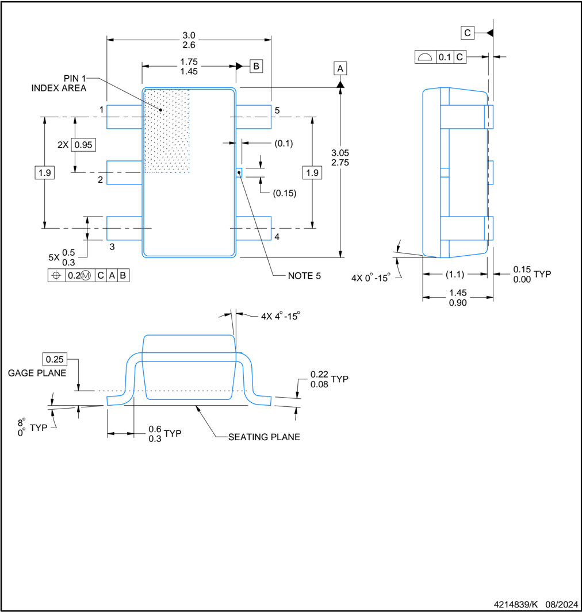

## NOTES:

1. All linear dimensions are in millimeters. Any dimensions in parenthesis are for reference only. Dimensioning and tolerancing per ASME Y14.5M.
2. This drawing is subject to change without notice.
3. Refernce JEDEC MO-178.
4. Body dimensions do not include mold flash, protrusions, or gate burrs. Mold flash, protrusions, or gate burrs shall not exceed 0.25 mm per side.
5. Support pin may differ or may not be present.

SMALL OUTLINE TRANSISTOR

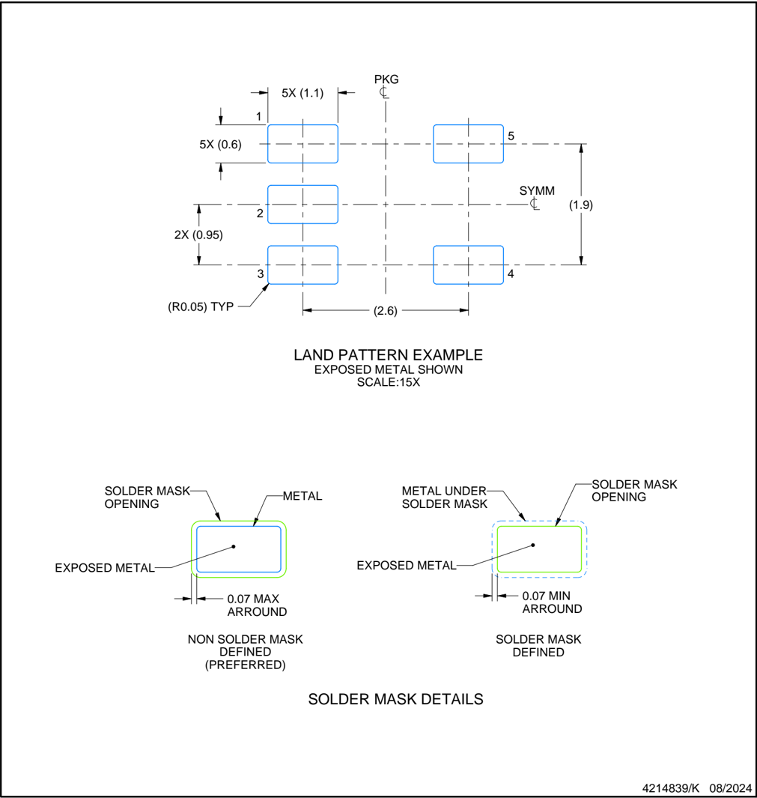

NOTES: (continued)

6. Publication IPC-7351 may have alternate designs.
7. Solder mask tolerances between and around signal pads can vary based on board fabrication site.

NOTES: (continued)

8. Laser cutting apertures with trapezoidal walls and rounded corners may offer better paste release. IPC-7525 may have alternate design recommendations.
9. Board assembly site may have different recommendations for stencil design.

## EXAMPLE STENCIL DESIGN

## SOT-23 - 1.45 mm max height

SMALL OUTLINE TRANSISTOR

SOLDER PASTE EXAMPLE BASED ON 0.125 mm THICK STENCIL SCALE:15X

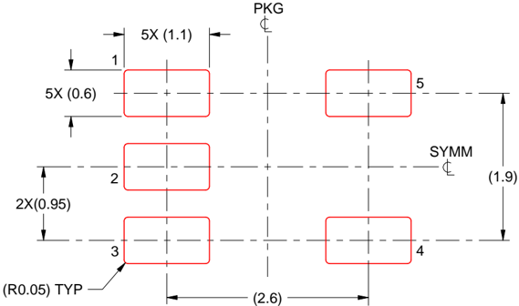

4214839/K   08/2024

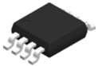

SCALE  4.0

## PACKAGE OUTLINE

## VSSOP - 1.1 mm max height

SMALL OUTLINE PACKAGE

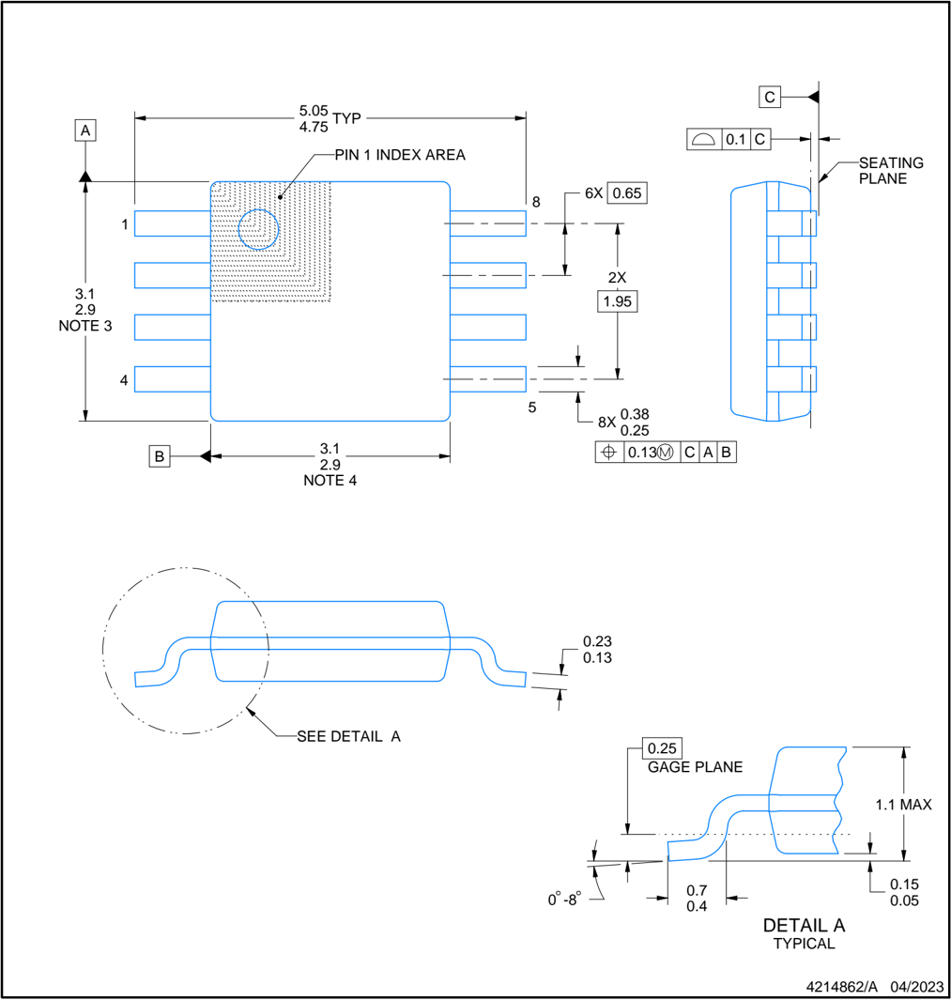

## NOTES:

PowerPAD is a trademark of Texas Instruments.

1. All linear dimensions are in millimeters. Any dimensions in parenthesis are for reference only. Dimensioning and tolerancing per ASME Y14.5M.
2. This drawing is subject to change without notice.
3. This dimension does not include mold flash, protrusions, or gate burrs. Mold flash, protrusions, or gate burrs shall not exceed 0.15 mm per side.
4. This dimension does not include interlead flash. Interlead flash shall not exceed 0.25 mm per side.
5. Reference JEDEC registration MO-187.

## EXAMPLE BOARD LAYOUT

## VSSOP - 1.1 mm max height TM

SMALL OUTLINE PACKAGE

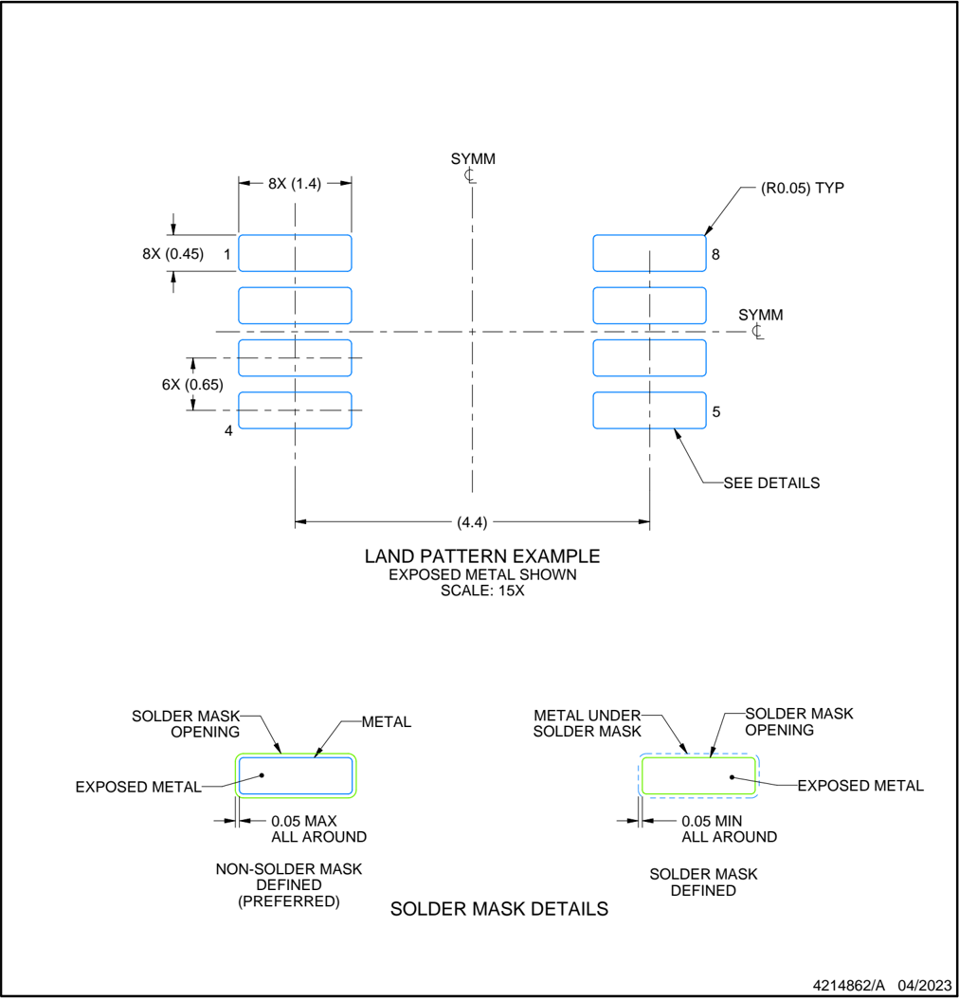

## NOTES: (continued)

6. Publication IPC-7351 may have alternate designs.
7. Solder mask tolerances between and around signal pads can vary based on board fabrication site.
8. Vias are optional depending on application, refer to device data sheet. If any vias are implemented, refer to their locations shown on this view. It is recommended that vias under paste be filled, plugged or tented.
9. Size of metal pad may vary due to creepage requirement.

## EXAMPLE STENCIL DESIGN

VSSOP - 1.1 mm max height TM

SMALL OUTLINE PACKAGE

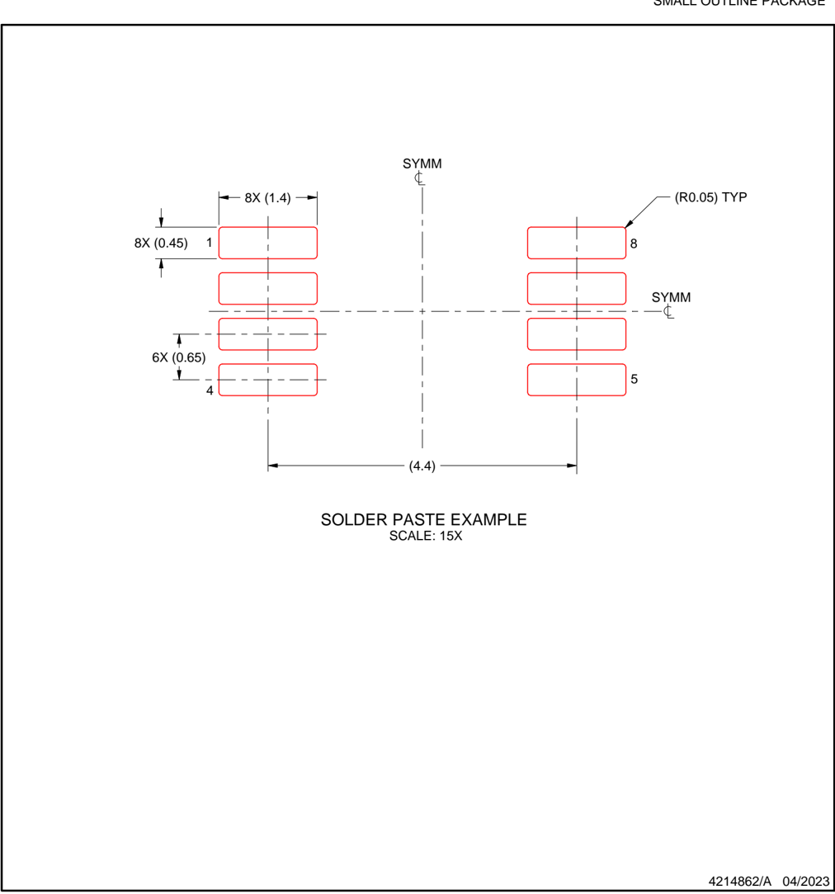

## NOTES: (continued)

11. Laser cutting apertures with trapezoidal walls and rounded corners may offer better paste release. IPC-7525 may have alternate design recommendations.
12. Board assembly site may have different recommendations for stencil design.

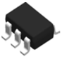

SCALE  5.60

SMALL OUTLINE TRANSISTOR

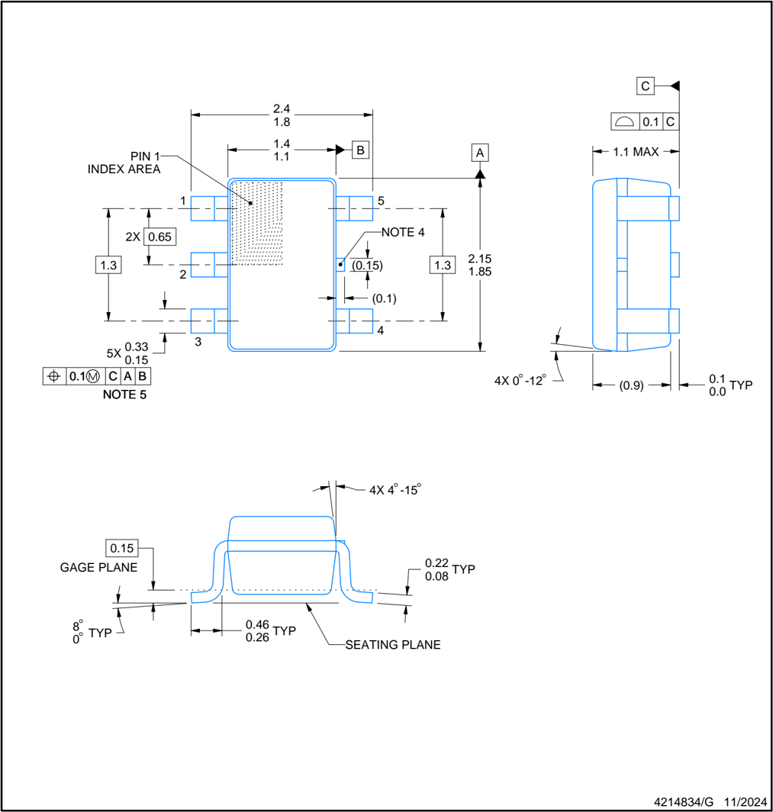

## NOTES:

1. All linear dimensions are in millimeters. Any dimensions in parenthesis are for reference only. Dimensioning and tolerancing per ASME Y14.5M.
2. This drawing is subject to change without notice.
3. Refernce JEDEC MO-203.
4. Support pin may differ or may not be present.
5. Lead width does not comply with JEDEC.
6. Body dimensions do not include mold flash, protrusions, or gate burrs. Mold flash, protrusions, or gate burrs shall not exceed 0.25mm per side

SMALL OUTLINE TRANSISTOR

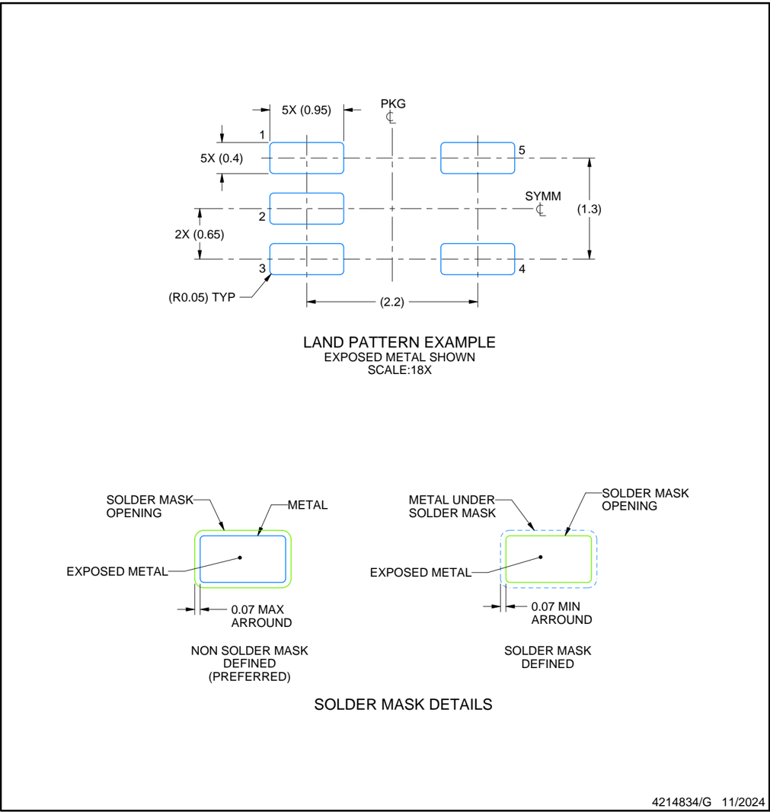

NOTES: (continued)

7. Publication IPC-7351 may have alternate designs.
8. Solder mask tolerances between and around signal pads can vary based on board fabrication site.

NOTES: (continued)

9. Laser cutting apertures with trapezoidal walls and rounded corners may offer better paste release. IPC-7525 may have alternate design recommendations.

10. Board assembly site may have different recommendations for stencil design.

## EXAMPLE STENCIL DESIGN

## SOT - 1.1 max height

SMALL OUTLINE TRANSISTOR

SOLDER PASTE EXAMPLE BASED ON 0.125 THICK STENCIL SCALE:18X

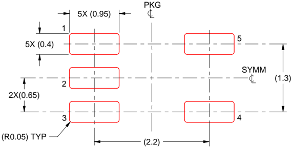

4214834/G   11/2024

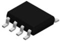

SCALE  2.800

## PACKAGE OUTLINE

## SOIC - 1.75 mm max height

## SMALL OUTLINE INTEGRATED CIRCUIT

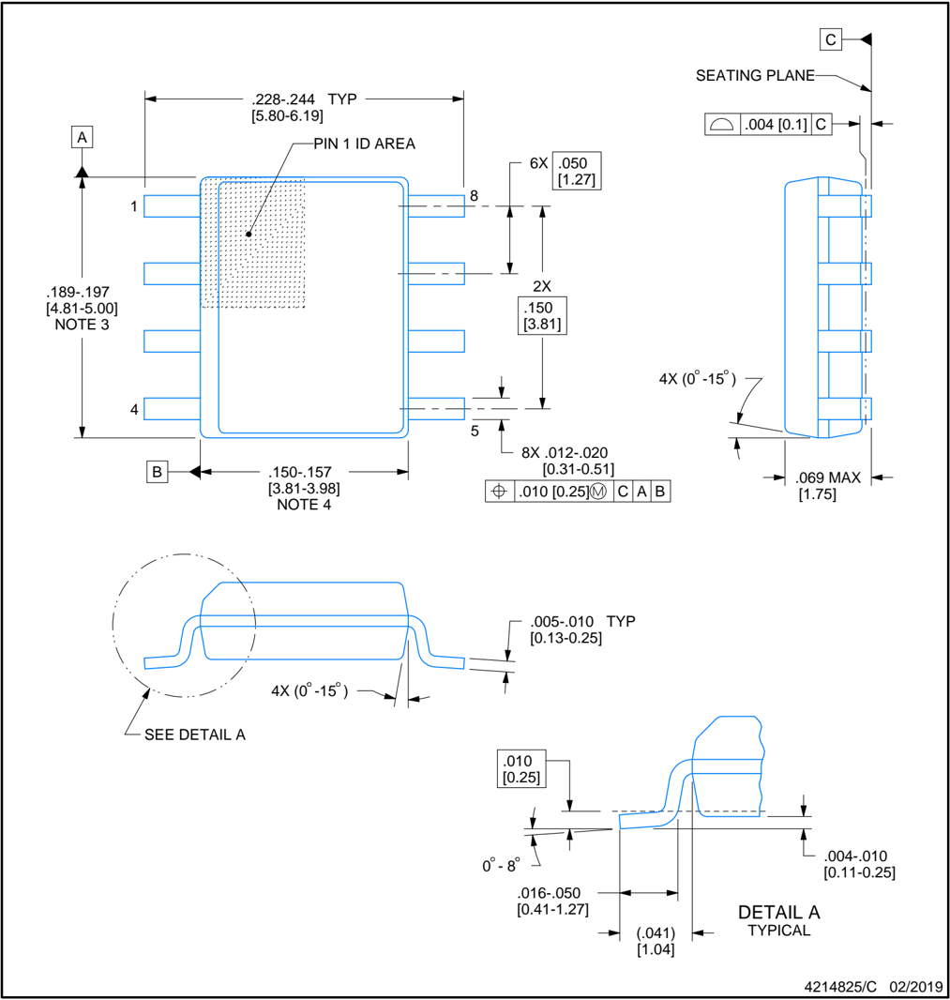

## NOTES:

1. Linear dimensions are in inches [millimeters]. Dimensions in parenthesis are for reference only. Controlling dimensions are in inches. Dimensioning and tolerancing per ASME Y14.5M.
2. This drawing is subject to change without notice.
3. This dimension does not include mold flash, protrusions, or gate burrs. Mold flash, protrusions, or gate burrs shall not exceed .006 [0.15] per side.
4. This dimension does not include interlead flash.
5. Reference JEDEC registration MS-012, variation AA.

SMALL OUTLINE INTEGRATED CIRCUIT

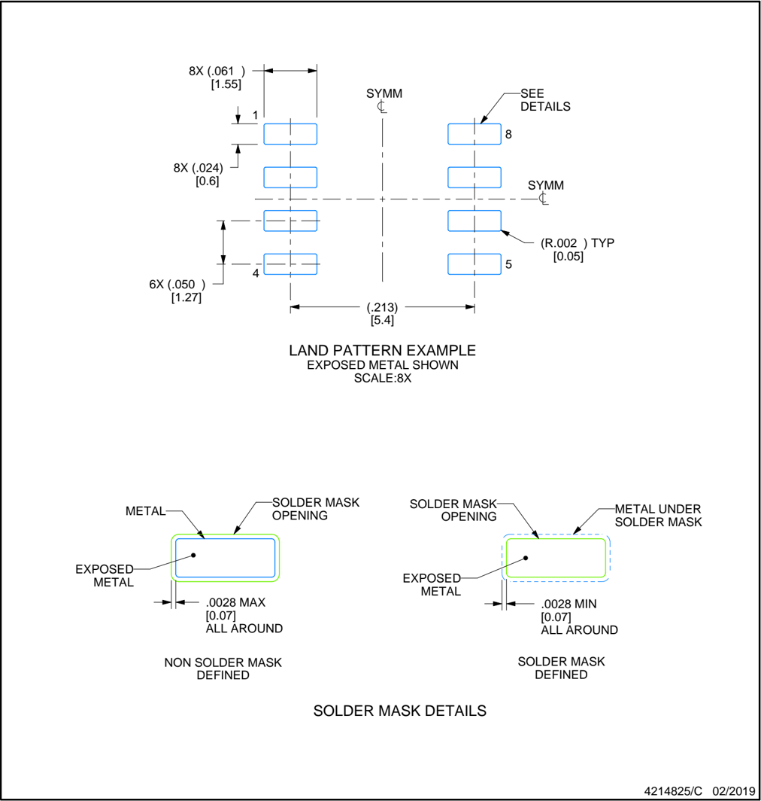

NOTES: (continued)

6. Publication IPC-7351 may have alternate designs.
7. Solder mask tolerances between and around signal pads can vary based on board fabrication site.

## NOTES: (continued)

8. Laser cutting apertures with trapezoidal walls and rounded corners may offer better paste release. IPC-7525 may have alternate design recommendations.
9. Board assembly site may have different recommendations for stencil design.

## SOIC - 1.75 mm max height

SMALL OUTLINE INTEGRATED CIRCUIT

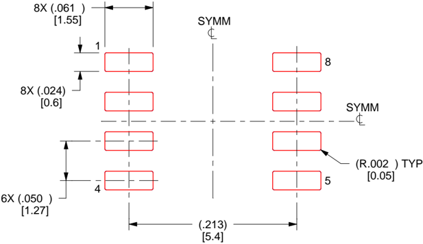

## SOLDER PASTE EXAMPLE

BASED ON .005 INCH [0.125 MM] THICK STENCIL SCALE:8X

4214825/C   02/2019

## IMPORTANT NOTICE AND DISCLAIMER

TI PROVIDES TECHNICAL AND RELIABILITY DATA (INCLUDING DATASHEETS), DESIGN RESOURCES (INCLUDING REFERENCE DESIGNS), APPLICATION OR OTHER DESIGN ADVICE, WEB TOOLS, SAFETY INFORMATION, AND OTHER RESOURCES 'AS IS' AND WITH ALL FAULTS, AND DISCLAIMS ALL WARRANTIES, EXPRESS AND IMPLIED, INCLUDING WITHOUT LIMITATION ANY IMPLIED WARRANTIES OF MERCHANTABILITY, FITNESS FOR A PARTICULAR PURPOSE OR NON-INFRINGEMENT OF THIRD PARTY INTELLECTUAL PROPERTY RIGHTS.

These resources are intended for skilled developers designing with TI products. You are solely responsible for (1) selecting the appropriate TI products for your application, (2) designing, validating and testing your application, and (3) ensuring your application meets applicable standards, and any other safety, security, regulatory or other requirements.

These resources are subject to change without notice. TI grants you permission to use these resources only for development of an application that uses the TI products described in the resource. Other reproduction and display of these resources is prohibited. No license is granted to any other TI intellectual property right or to any third party intellectual property right. TI disclaims responsibility for, and you fully indemnify TI and its representatives against any claims, damages, costs, losses, and liabilities arising out of your use of these resources.

TI's products are provided subject to TI's Terms of Sale, TI's General Quality Guidelines, or other applicable terms available either on ti.com or provided in conjunction with such TI products. TI's provision of these resources does not expand or otherwise alter TI's applicable warranties or warranty disclaimers for TI products. Unless TI explicitly designates a product as custom or customer-specified, TI products are standard, catalog, general purpose devices.

TI objects to and rejects any additional or different terms you may propose.

IMPORTANT NOTICE

Copyright © 202 6 , Texas Instruments Incorporated Last updated 10/2025