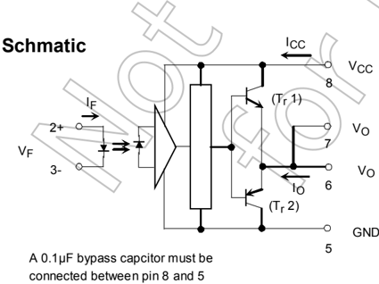
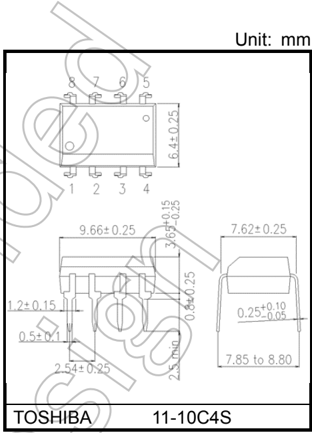
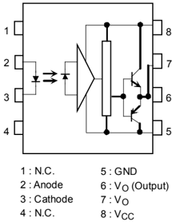
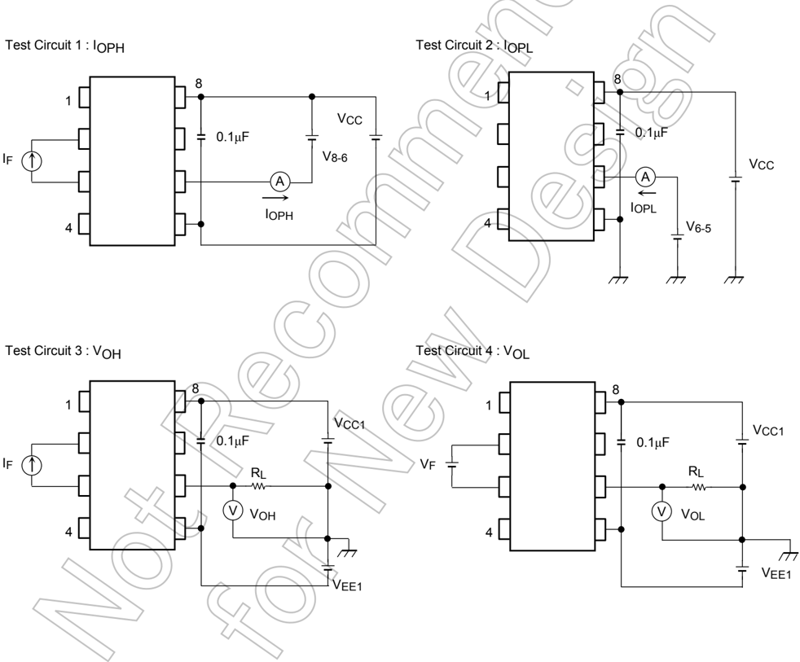
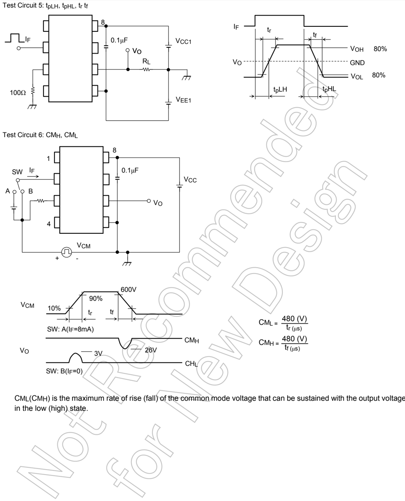
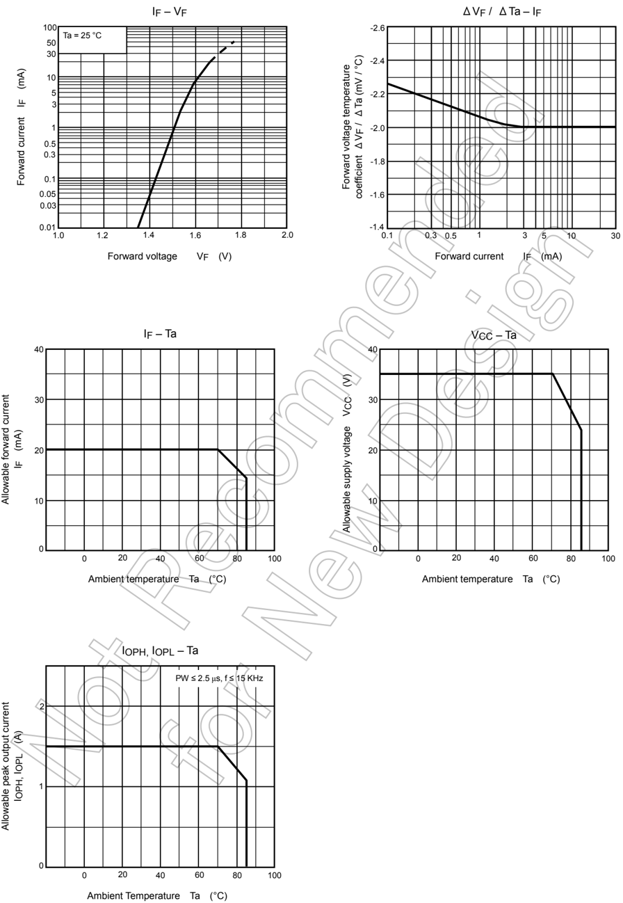

TOSHIBA Photocoupler    IRED &amp; Photo-IC

## TLP250

Industrial Inverter Inverter For Air Conditioner IGBT Gate Drive Power MOS FET Gate Drive

The TOSHIBA TLP250 consists of an infrared emitting diode and a integrated photodetector.

This unit is 8-lead DIP package.

TLP250 is suitable for gate driving circuit of IGBT or power MOS FET.

- Input threshold current: 5mA(max)
- Supply current : 11mA(max)
- Supply voltage : 10-35V
- Output current : ±1.5A (max)
- Switching time tpLH/tpHL): 0.5 μ s(max)
- Isolation voltage: 2500Vrms(min)
- UL-recognized: UL 1577, File No.E67349
- cUL-recognized: CSA Component Acceptance Service No.5A

File No.E67349

- VDE-Approved: EN 60747-5- 5 (Note 1)

Note 1: When a VDE approved type is needed, please designate the Option(D4) .

## Truth Table

Weight: 0.54 g (typ.)

|       |     | Tr1   | Tr2   |
|-------|-----|-------|-------|
| Input | On  | On    | Off   |
| LED   | Off | Off   | On    |

## Pin Configuration (top view)

8

7

6

5

Start of commercial production 1990-11

## Absolute Maximum Ratings (Ta = 25°C)

| Characteristic                                        | Characteristic                                           | Symbol      | Rating     | Unit    |
|-------------------------------------------------------|----------------------------------------------------------|-------------|------------|---------|
|                                                       | Forward current                                          | I F         | 20         | mA      |
|                                                       | Forward current derating (Ta ≥ 70°C)                     | ΔI F / ΔTa  | -0.36      | mA / °C |
|                                                       | Peak transient forward curent (Note 1)                   | I FPT       | 1          | A       |
|                                                       | LED Reverse voltage                                      | VR          | 5          | V       |
|                                                       | Diode power dissipation                                  | PD          | 40         | mW      |
|                                                       | Diode power dissipation derating (Ta ≥ 70°C)             | △ PD /°C    | -0.72      | mW / °C |
|                                                       | Junction temperature                                     | Tj          | 125        | °C      |
|                                                       | 'H'peak output current (PW ≤ 2.5 μ s,f ≤ 15kHz) (Note 2) | I OPH       | -1.5       | A       |
|                                                       | 'L'peak output current (PW ≤ 2.5 μ s,f ≤ 15kHz) (Note 2) | I OPL       | +1.5       | A       |
|                                                       | (Ta ≤ 70°C)                                              | VO          | 35         | V       |
|                                                       | Output voltage (Ta ≤ 85°C)                               |             | 24         | V       |
|                                                       | Supply voltage (Ta ≤ 70°C)                               | VCC         | 35         |         |
|                                                       | Detector (Ta ≤ 85°C)                                     |             | 24         |         |
|                                                       | Output voltage derating (Ta ≥ 70°C)                      | ΔV O / ΔTa  | -0.73      | V / °C  |
|                                                       | Supply voltage derating (Ta ≥ 70°C)                      | ΔV CC / ΔTa | -0.73      | V / °C  |
|                                                       | Power dissipation                                        | PC          | 800        | mW      |
|                                                       | Power dissipation derating (Ta ≥ 70°C)                   | ΔP C / °C   | -14.5      | mW / °C |
|                                                       | Junction temperature                                     | Tj          | 125        | °C      |
|                                                       | Operating frequency (Note 3)                             | f           | 25         | kHz     |
|                                                       |                                                          | T opr       | -20 to 85  | °C      |
| Operating temperature range Storage temperature range | Operating temperature range Storage temperature range    | T stg       | -55 to 125 | °C      |
| Lead soldering temperature (10 s)                     | Lead soldering temperature (10 s)                        | T sol       | 260        | °C      |
| Isolation voltage (AC, 60 s., R.H. ≤ 60 %) (Note 4)   | Isolation voltage (AC, 60 s., R.H. ≤ 60 %) (Note 4)      | BVS         | 2500       | Vrms    |

Note: Using continuously under heavy loads (e.g. the application of high temperature/current/voltage and the significant change in temperature, etc.) may cause this product to decrease in the reliability significantly even if the operating conditions (i.e. operating temperature/current/voltage, etc.) are within the absolute maximum ratings.

Please design the appropriate reliability upon reviewing the Toshiba Semiconductor Reliability Handbook ('Handling Precautions'/'Derating Concept and Methods') and individual reliability data (i.e. reliability test report and estimated failure rate, etc).

Note 1:

Pulse width PW ≤ 1 μ s, 300 pps

Note 2: Exporenential wavefom

Note 3: Exporenential wavefom, IOPH ≤ -1.0 A( ≤ 2.5 μ s), IOPL ≤ +1.0 A( ≤ 2.5 μ s)

Note 4: Device considerd a two terminal device: Pins 1, 2, 3 and 4 shorted together, and pins 5, 6, 7 and 8 shorted together.

## Recommended Operating Conditions

| Characteristic        |              | Symbol Min   | Typ.   | Max   | Unit   |
|-----------------------|--------------|--------------|--------|-------|--------|
| Input current, on     | I F(ON)      | 7            | 8 10   |       | mA     |
| Input voltage, off    | VF(OFF)      | 0            | -      | 0.8   | V      |
| Supply voltage        | VCC          | 15           | -      | 30    | V      |
| Peak output current   | I OPH /I OPL | -            | -      | ±0.5  | A      |
| Operating temperature | T opr        | -20          | 25     | 85    | °C     |

Note:  Recommended operating conditions are given as a design guideline to obtain expected performance of the device. Additionally, each item is an independent guideline respectively. In developing designs using this product, please confirm specified characteristics shown in this document.

Note : A ceramic capacitor(0.1 μ F) should be connected from pin 8 to pin 5 to stabilize the operation of the high gain linear amplifier. Failure to provide the bypassing may impair the switching proparty. The total lead length between capacitor and coupler should not exceed 1 cm.

Note : Input signal rise time(fall time)&lt;0.5 μ s.

## Electrical Characteristics (Ta = -20 to 70°C, unless otherwise specified)

| Characteristic                             | Characteristic                             | Symbol     | Test Cir- cuit   | Test Condition                                     |                                                    | Min     | Typ.*   | Max   | Unit    |
|--------------------------------------------|--------------------------------------------|------------|------------------|----------------------------------------------------|----------------------------------------------------|---------|---------|-------|---------|
| Input forward voltage                      | Input forward voltage                      | VF         | -                | I F = 10 mA, Ta = 25 °C                            | I F = 10 mA, Ta = 25 °C                            | -       | 1.6     | 1.8   | V       |
| Temperature coefficient of forward voltage | Temperature coefficient of forward voltage | ΔV F / ΔTa | -                | F = 10 mA                                          | F = 10 mA                                          | -       | -2.0    | -     | mV / °C |
| Input reverse current                      | Input reverse current                      | I R        | -                | VR = 5 V, Ta = 25 °C                               | VR = 5 V, Ta = 25 °C                               | -       | -       | 10    | μ A     |
| Input capacitance                          | Input capacitance                          | CT         | -                | V = 0 V, f = 1 MHz , Ta = 25 °C                    | V = 0 V, f = 1 MHz , Ta = 25 °C                    | -       | 45      | 250   | pF      |
| Output current                             | 'H' level                                  | I OPH      | 1                | VCC = 30 V (Note 1)                                | I F = 10 mA V8-6 = 4 V                             | -0.5    | -1.5    | -     | A       |
| Output current                             | 'L' level                                  | I OPL      | 2                | VCC = 30 V (Note 1)                                | I F = 0 mA V6-5 = 2.5 V                            | 0.5     | 2       | -     | A       |
| Output voltage                             | 'H' level                                  | VOH        | 3                | VCC1 = +15 V, VEE1 = -15 V RL = 200 Ω , I F = 5 mA | VCC1 = +15 V, VEE1 = -15 V RL = 200 Ω , I F = 5 mA | 11      | 12.8    | -     | V       |
| Output voltage                             | 'L' level                                  | VOL        | 4                | VCC1 = +15 V, VEE1 = -15 V RL = 200 Ω , VF = 0.8 V | VCC1 = +15 V, VEE1 = -15 V RL = 200 Ω , VF = 0.8 V | -       | -14.2   | -12.5 | V       |
| Supply current                             | 'H' level                                  | I CCH      | -                | VCC = 30 V, I F = 10mA Ta = 25 °C                  | VCC = 30 V, I F = 10mA Ta = 25 °C                  | -       | 7       | -     | mA      |
| Supply current                             |                                            | I CCH      | -                | VCC = 30 V, I F = 10 mA                            | VCC = 30 V, I F = 10 mA                            | -       | -       | 11    | mA      |
| Supply current                             | 'L' level                                  | I CCL      | -                | VCC = 30 V, I F = 0 mA Ta = 25 °C                  | VCC = 30 V, I F = 0 mA Ta = 25 °C                  | -       | 7.5     | -     | mA      |
| Supply current                             |                                            | I CCL      | -                | VCC = 30 V, I F = 0 mA                             | VCC = 30 V, I F = 0 mA                             | -       | -       | 11    | mA      |
| Threshold input current                    | 'Output L → H'                             | I FLH      | -                | VCC1 = +15 V, VEE1 = -15 V RL = 200 Ω , VO > 0 V   | VCC1 = +15 V, VEE1 = -15 V RL = 200 Ω , VO > 0 V   | -       | 1.2     | 5     | mA      |
| Threshold input voltage                    | 'Output H → L'                             | VFHL       | -                | VCC1 = +15 V, VEE1 = -15 V RL = 200 Ω , VO < 0 V   | VCC1 = +15 V, VEE1 = -15 V RL = 200 Ω , VO < 0 V   | 0.8     | -       | -     | V       |
| Supply voltage                             | Supply voltage                             | VCC        | -                | －                                                  | －                                                  | 10      | -       | 35    | V       |
| Capacitance (input-output)                 | Capacitance (input-output)                 | CS         | -                | VS = 0 V, f = 1 MHz Ta = 25 °C                     | VS = 0 V, f = 1 MHz Ta = 25 °C                     | -       | 1.0     | 2.0   | pF      |
| Resistance(input-output)                   | Resistance(input-output)                   | RS         | -                | VS = 500 V , Ta = 25 °C R.H. ≤ 60 %                | VS = 500 V , Ta = 25 °C R.H. ≤ 60 %                | 1×10 12 | 10 14   | -     | Ω       |

* All typical values are at Ta = 25°C

Note 1: Duration of IO time ≤ 50 μ s

## Switching Characteristics (Ta = -20 to 70°C, unless otherwise specified)

| Characteristic                                      | Characteristic                                      | Symbol   |   Test Cir- cuit | Test Condition                                   | Min   | Typ.   | Max   | Unit    |
|-----------------------------------------------------|-----------------------------------------------------|----------|------------------|--------------------------------------------------|-------|--------|-------|---------|
| Propagation delay time                              | L → H                                               | t pLH    |                5 | I F = 8 mA VCC1 = +15 V, VEE1 = -15 V RL = 200 Ω | -     | 0.15   | 0.5   | μ s     |
| Propagation delay time                              | H → L                                               | t pHL    |                5 | I F = 8 mA VCC1 = +15 V, VEE1 = -15 V RL = 200 Ω | -     | 0.15   | 0.5   | μ s     |
| Common mode transient immunity at high level output | Common mode transient immunity at high level output | CMH      |                6 | VCM = 600 V, I F = 8 mA VCC = 30 V, Ta = 25 °C   | -5000 | -      | -     | V / μ s |
| Common mode transient immunity at low level output  | Common mode transient immunity at low level output  | CML      |                6 | VCM = 600 V, I F = 0 mA VCC = 30 V, Ta = 25 °C   | 5000  | -      | -     | V / μ s |

Note: All typical values are at Ta = 25°C

NOTE:  The above characteristics curves are presented for reference only and not guaranteed by production test, unless otherwise noted.

## RESTRICTIONS ON PRODUCT USE

Toshiba Corporation and its subsidiaries and affiliates are collectively referred to as 'TOSHIBA'.

Hardware, software and systems described in this document are collectively referred to as 'Product'.

- TOSHIBA reserves the right to make changes to the information in this document and related Product without notice.
- This document and any information herein may not be reproduced without prior written permission from TOSHIBA. Even with TOSHIBA's written permission, reproduction is permissible only if reproduction is without alteration/omission.
- Though TOSHIBA works continually to improve Product's quality and reliability, Product can malfunction or fail. Customers are responsible for complying with safety standards and for providing adequate designs and safeguards for their hardware, software and systems which minimize risk and avoid situations in which a malfunction or failure of Product could cause loss of human life, bodily injury or damage to property, including data loss or corruption. Before customers use the Product, create designs including the Product, or incorporate the Product into their own applications, customers must also refer to and comply with (a) the latest versions of all relevant TOSHIBA information, including without limitation, this document, the specifications, the data sheets and application notes for Product and the precautions and conditions set forth in the "TOSHIBA Semiconductor Reliability Handbook" and (b) the instructions for the application with which the Product will be used with or for. Customers are solely responsible for all aspects of their own product design or applications, including but not limited to (a) determining the appropriateness of the use of this Product in such design or applications; (b) evaluating and determining the applicability of any information contained in this document, or in charts, diagrams, programs, algorithms, sample application circuits, or any other referenced documents; and (c) validating all operating parameters for such designs and applications. TOSHIBA ASSUMES NO LIABILITY FOR CUSTOMERS' PRODUCT DESIGN OR APPLICATIONS.
- PRODUCT IS NEITHER INTENDED NOR WARRANTED FOR USE IN EQUIPMENTS OR SYSTEMS THAT REQUIRE EXTRAORDINARILY HIGH LEVELS OF QUALITY AND/OR RELIABILITY, AND/OR A MALFUNCTION OR FAILURE OF WHICH MAY CAUSE LOSS OF HUMAN LIFE, BODILY INJURY, SERIOUS PROPERTY DAMAGE AND/OR SERIOUS PUBLIC IMPACT ( " UNINTENDED USE " ). Except for specific applications as expressly stated in this document, Unintended Use includes, without limitation, equipment used in nuclear facilities, equipment used in the aerospace industry, lifesaving and/or life supporting medical equipment, equipment used for automobiles, trains, ships and other transportation, traffic signaling equipment, equipment used to control combustions or explosions, safety devices, elevators and escalators, and devices related to power plant. IF YOU USE PRODUCT FOR UNINTENDED USE, TOSHIBA ASSUMES NO LIABILITY FOR PRODUCT. For details, please contact your TOSHIBA sales representative or contact us via our website.
- Do not disassemble, analyze, reverse-engineer, alter, modify, translate or copy Product, whether in whole or in part.
- Product shall not be used for or incorporated into any products or systems whose manufacture, use, or sale is prohibited under any applicable laws or regulations.
- The information contained herein is presented only as guidance for Product use. No responsibility is assumed by TOSHIBA for any infringement of patents or any other intellectual property rights of third parties that may result from the use of Product. No license to any intellectual property right is granted by this document, whether express or implied, by estoppel or otherwise.
- ABSENT A WRITTEN SIGNED AGREEMENT, EXCEPT AS PROVIDED IN THE RELEVANT TERMS AND CONDITIONS OF SALE FOR PRODUCT, AND TO THE MAXIMUM EXTENT ALLOWABLE BY LAW, TOSHIBA (1) ASSUMES NO LIABILITY WHATSOEVER, INCLUDING WITHOUT LIMITATION, INDIRECT, CONSEQUENTIAL, SPECIAL, OR INCIDENTAL DAMAGES OR LOSS, INCLUDING WITHOUT LIMITATION, LOSS OF PROFITS, LOSS OF OPPORTUNITIES, BUSINESS INTERRUPTION AND LOSS OF DATA, AND (2) DISCLAIMS ANY AND ALL EXPRESS OR IMPLIED WARRANTIES AND CONDITIONS RELATED TO SALE, USE OF PRODUCT, OR INFORMATION, INCLUDING WARRANTIES OR CONDITIONS OF MERCHANTABILITY, FITNESS FOR A PARTICULAR PURPOSE, ACCURACY OF INFORMATION, OR NONINFRINGEMENT.
- GaAs (Gallium Arsenide) is used in Product. GaAs is harmful to humans if consumed or absorbed, whether in the form of dust or vapor. Handle with care and do not break, cut, crush, grind, dissolve chemically or otherwise expose GaAs in Product.
- Do not use or otherwise make available Product or related software or technology for any military purposes, including without limitation, for the design, development, use, stockpiling or manufacturing of nuclear, chemical, or biological weapons or missile technology products (mass destruction weapons). Product and related software and technology may be controlled under the applicable export laws and regulations including, without limitation, the Japanese Foreign Exchange and Foreign Trade Law and the U.S. Export Administration Regulations. Export and re-export of Product or related software or technology are strictly prohibited except in compliance with all applicable export laws and regulations.
- Please contact your TOSHIBA sales representative for details as to environmental matters such as the RoHS compatibility of Product. Please use Product in compliance with all applicable laws and regulations that regulate the inclusion or use of controlled substances, including without limitation, the EU RoHS Directive. TOSHIBA ASSUMES NO LIABILITY FOR DAMAGES OR LOSSES OCCURRING AS A RESULT OF NONCOMPLIANCE WITH APPLICABLE LAWS AND REGULATIONS.

[https://toshiba.semicon-storage.com/](https://toshiba.semicon-storage.com/)

© 2019