www.vishay.com

## N-Channel 100 V (D-S) MOSFET

| PRODUCT SUMMARY   | PRODUCT SUMMARY        |           |            |
|-------------------|------------------------|-----------|------------|
| V DS (V)          | R DS(on) (  ) MAX.    | I D (A) d | Q g (TYP.) |
| 100               | 0.0040 at V GS = 10 V  | 120       | 76         |
| 100               | 0.0046 at V GS = 7.5 V | 120       | 76         |

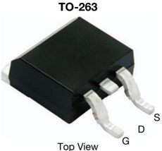

## Ordering Information:



SUM70040E-GE3 (Lead (Pb)-free and halogen-free)

## FEATURES

- ThunderFET ®  power MOSFET
- Maximum 175 °C junction temperature
- 100 % Rg and UIS tested
- Material categorization:  for definitions of compliance please see www.vishay.com/doc?99912

## APPLICATIONS

- Power supply



- Secondary synchronous rectification
- DC/DC converter
- Power tools
- Motor drive switch
- DC/AC inverter
- Battery management
- OR-ing

N-Channel MOSFET

Vishay Siliconix

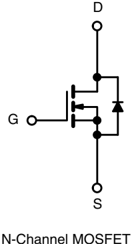

| ABSOLUTE MAXIMUM RATINGS (T C = 25 °C, unless otherwise noted)   | ABSOLUTE MAXIMUM RATINGS (T C = 25 °C, unless otherwise noted)   | ABSOLUTE MAXIMUM RATINGS (T C = 25 °C, unless otherwise noted)   | ABSOLUTE MAXIMUM RATINGS (T C = 25 °C, unless otherwise noted)   | ABSOLUTE MAXIMUM RATINGS (T C = 25 °C, unless otherwise noted)   |
|------------------------------------------------------------------|------------------------------------------------------------------|------------------------------------------------------------------|------------------------------------------------------------------|------------------------------------------------------------------|
| PARAMETER                                                        | PARAMETER                                                        | SYMBOL                                                           | LIMIT                                                            | UNIT                                                             |
| Drain-Source Voltage                                             | Drain-Source Voltage                                             | V DS                                                             | 100                                                              | V                                                                |
| Gate-Source Voltage                                              | Gate-Source Voltage                                              | V GS                                                             | ± 20                                                             | V                                                                |
| Continuous Drain Current (T J = 150 °C)                          | T C = 25 °C                                                      | I D                                                              | 120 d                                                            | A                                                                |
| Continuous Drain Current (T J = 150 °C)                          | T C = 70 °C                                                      | I D                                                              | 120 d                                                            | A                                                                |
| Pulsed Drain Current (t = 100 μs)                                | Pulsed Drain Current (t = 100 μs)                                | I DM                                                             | 480                                                              | A                                                                |
| Avalanche Current                                                | Avalanche Current                                                | I AS                                                             | 73                                                               | A                                                                |
| Single Avalanche Energy a                                        | L = 0.1 mH                                                       | E AS                                                             | 266                                                              | mJ                                                               |
| Maximum Power Dissipation a                                      | T C = 25 °C                                                      | P D                                                              | 375 b                                                            | W                                                                |
| Maximum Power Dissipation a                                      | T C = 125 °C                                                     | P D                                                              | 125 b                                                            | W                                                                |
| Operating Junction and Storage Temperature Range                 | Operating Junction and Storage Temperature Range                 | T J , T stg                                                      | -55 to +175                                                      | °C                                                               |

| THERMAL RESISTANCE RATINGS        |        |     |      |
|-----------------------------------|--------|-----|------|
| Junction-to-Ambient (PCB Mount) c | R thJA |  40 | °C/W |
| Junction-to-Case (Drain)          | R thJC | 0.4 | °C/W |

## Notes

a. Duty cycle  1 %.

- b. See SOA curve for voltage derating.
- c. When mounted on 1" square PCB (FR4 material).
- d. Package limited.

## SUM70040E

## Vishay Siliconix

| SPECIFICATIONS (T J = 25 °C, unless otherwise noted)                | SPECIFICATIONS (T J = 25 °C, unless otherwise noted)                | SPECIFICATIONS (T J = 25 °C, unless otherwise noted)                | SPECIFICATIONS (T J = 25 °C, unless otherwise noted)                | SPECIFICATIONS (T J = 25 °C, unless otherwise noted)                | SPECIFICATIONS (T J = 25 °C, unless otherwise noted)                | SPECIFICATIONS (T J = 25 °C, unless otherwise noted)                |
|---------------------------------------------------------------------|---------------------------------------------------------------------|---------------------------------------------------------------------|---------------------------------------------------------------------|---------------------------------------------------------------------|---------------------------------------------------------------------|---------------------------------------------------------------------|
| PARAMETER                                                           | SYMBOL                                                              | TEST CONDITIONS                                                     | MIN.                                                                | TYP.                                                                | MAX.                                                                | UNIT                                                                |
| Static                                                              |                                                                     |                                                                     |                                                                     |                                                                     |                                                                     |                                                                     |
| Drain-Source Breakdown Voltage                                      | V DS                                                                | V GS = 0 V, I D = 250 μA                                            | 100                                                                 | -                                                                   | -                                                                   | V                                                                   |
| Gate Threshold Voltage                                              | V GS(th)                                                            | V DS = V GS , I D = 250 μA                                          | 2.5                                                                 | -                                                                   | 4                                                                   | V                                                                   |
| Gate-Body Leakage                                                   | I GSS                                                               | V DS = 0 V, V GS = ± 20 V                                           | -                                                                   | -                                                                   | ± 250                                                               | nA                                                                  |
| Zero Gate Voltage Drain Current                                     | I DSS                                                               | V DS = 100 V, V GS = 0 V                                            | -                                                                   | -                                                                   | 1                                                                   | μA                                                                  |
| Zero Gate Voltage Drain Current                                     | I DSS                                                               | V DS = 100 V, V GS = 0 V, T J = 125 °C                              | -                                                                   | -                                                                   | 150                                                                 | μA                                                                  |
| Zero Gate Voltage Drain Current                                     | I DSS                                                               | V DS = 100 V, V GS = 0 V, T J = 175 °C                              | -                                                                   | -                                                                   | 5                                                                   | mA                                                                  |
| On-State Drain Current a                                            | I D(on)                                                             | V DS  10 V, V GS = 10 V                                            | 120                                                                 | -                                                                   | -                                                                   | A                                                                   |
| Drain-Source On-State Resistance a                                  | R DS(on)                                                            | V GS = 10 V, I D = 20 A                                             | -                                                                   | 0.0032                                                              | 0.0040                                                              |                                                                    |
| Forward Transconductance a                                          | g                                                                   | V GS = 7.5 V, I D = 15 A                                            | -                                                                   | 0.0035                                                              | 0.0046                                                              |                                                                    |
|                                                                     | fs                                                                  | V DS = 15 V, I D = 20 A                                             | -                                                                   | 82                                                                  | -                                                                   | S                                                                   |
| Dynamic b                                                           |                                                                     |                                                                     |                                                                     |                                                                     |                                                                     |                                                                     |
| Input Capacitance                                                   | C iss                                                               | V GS = 0 V, V DS = 50 V, f = 1 MHz                                  | -                                                                   | 5100                                                                | -                                                                   | pF                                                                  |
| Output Capacitance                                                  | C oss                                                               | V GS = 0 V, V DS = 50 V, f = 1 MHz                                  | -                                                                   | 2025                                                                | -                                                                   | pF                                                                  |
| Reverse Transfer Capacitance                                        | C rss                                                               | V GS = 0 V, V DS = 50 V, f = 1 MHz                                  | -                                                                   | 165                                                                 | -                                                                   | pF                                                                  |
| Total Gate Charge c                                                 | Q g                                                                 | V DS = 50 V, V GS = 10 V, I D = 20 A                                | -                                                                   | 76                                                                  | 120                                                                 | nC                                                                  |
| Gate-Source Charge c                                                | Q gs                                                                | V DS = 50 V, V GS = 10 V, I D = 20 A                                | -                                                                   | 23                                                                  | -                                                                   | nC                                                                  |
| Gate-Drain Charge c                                                 | Q gd                                                                | V DS = 50 V, V GS = 10 V, I D = 20 A                                | -                                                                   | 17                                                                  | -                                                                   | nC                                                                  |
| Gate Resistance                                                     | R g                                                                 | f = 1 MHz                                                           | 0.6                                                                 | 3.3                                                                 | 6.6                                                                 |                                                                    |
| Turn-On Delay Time c                                                | t d(on)                                                             | V DD = 50 V, R L = 5  I D  10 A, V GEN = 10 V, R g = 1           | -                                                                   | 15                                                                  | 30                                                                  | ns                                                                  |
| Rise Time c                                                         | t r                                                                 | V DD = 50 V, R L = 5  I D  10 A, V GEN = 10 V, R g = 1           | -                                                                   | 22                                                                  | 40                                                                  | ns                                                                  |
| Turn-Off Delay Time c                                               | t d(off)                                                            | V DD = 50 V, R L = 5  I D  10 A, V GEN = 10 V, R g = 1           | -                                                                   | 55                                                                  | 100                                                                 | ns                                                                  |
| Fall Time c                                                         | t f                                                                 | V DD = 50 V, R L = 5  I D  10 A, V GEN = 10 V, R g = 1           | -                                                                   | 15                                                                  | 30                                                                  | ns                                                                  |
| Drain-Source Body Diode Ratings and Characteristics b (T C = 25 °C) | Drain-Source Body Diode Ratings and Characteristics b (T C = 25 °C) | Drain-Source Body Diode Ratings and Characteristics b (T C = 25 °C) | Drain-Source Body Diode Ratings and Characteristics b (T C = 25 °C) | Drain-Source Body Diode Ratings and Characteristics b (T C = 25 °C) | Drain-Source Body Diode Ratings and Characteristics b (T C = 25 °C) | Drain-Source Body Diode Ratings and Characteristics b (T C = 25 °C) |
| Pulsed Current                                                      | I SM                                                                |                                                                     | -                                                                   | -                                                                   | 480                                                                 | A                                                                   |
| Forward Voltage a                                                   | V SD                                                                | I F = 10 A, V GS = 0 V                                              | -                                                                   | 0.8                                                                 | 1.5                                                                 | V                                                                   |

## Notes

a. Pulse test; pulse width  300 μs, duty cycle  2 %.

b. Guaranteed by design, not subject to production testing.

c. Independent of operating temperature.





Stresses beyond those listed under 'Absolute Maximum Ratings' may cause permanent damage to the device. These are stress ratings only, and functional operation of the device at these or any other conditions beyond those indicated in the operational sections of the specifications is not implied. Exposure to absolute maximum rating conditions for extended periods may affect device reliability.

## TYPICAL CHARACTERISTICS (TA = 25 °C, unless otherwise noted)

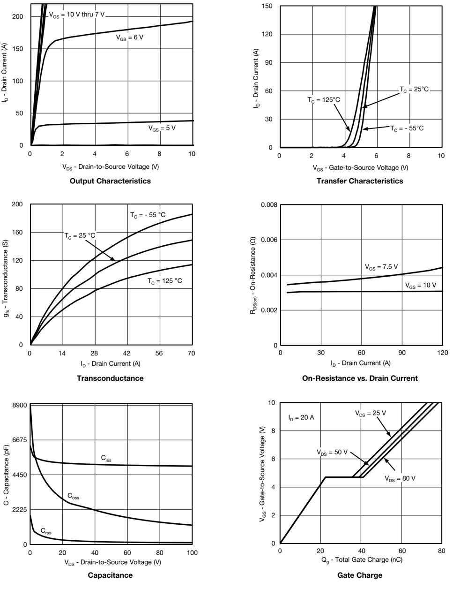

Vishay Siliconix

## TYPICAL CHARACTERISTICS (TA = 25 °C, unless otherwise noted)

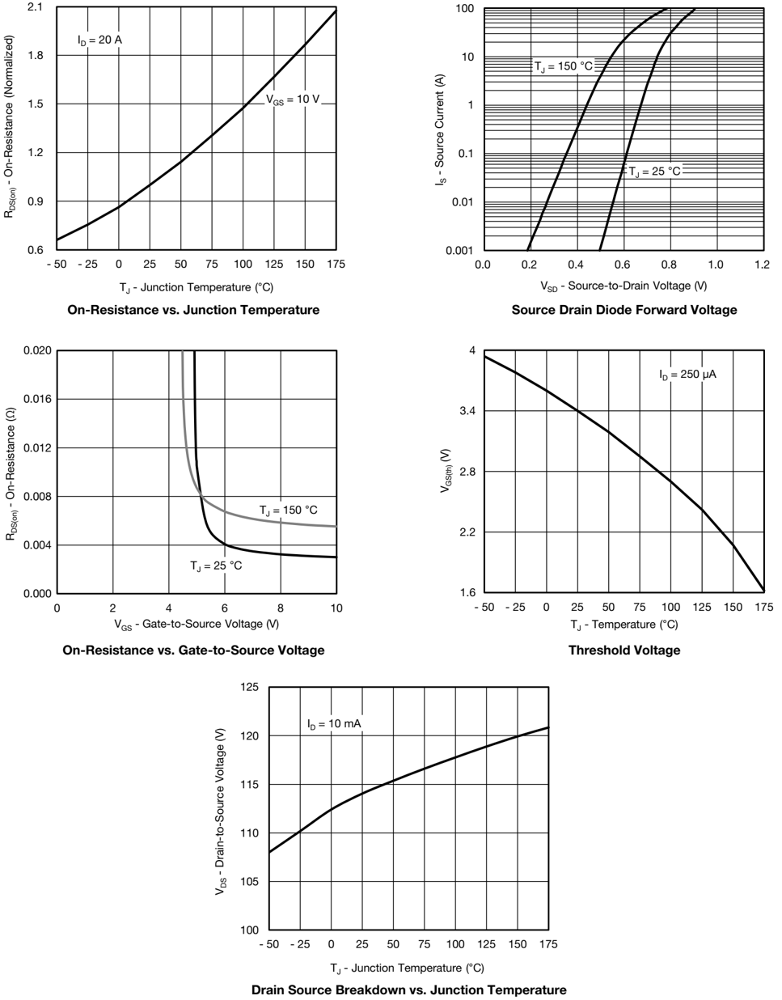

4

Vishay Siliconix www.vishay.com

## THERMAL RATINGS (TA = 25 °C, unless otherwise noted)

Safe Operating Area

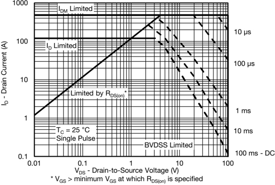

Normalized Thermal Transient Impedance, Junction-to-Ambient

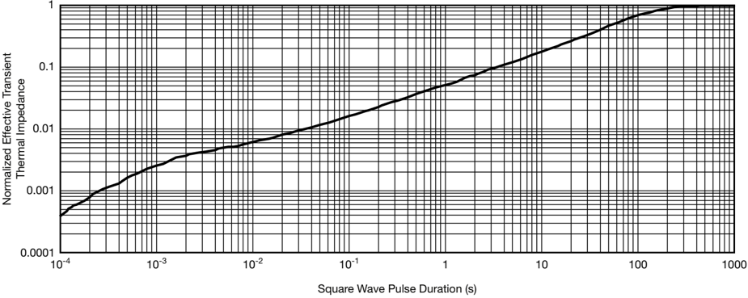

## Vishay Siliconix

www.vishay.com

THERMAL RATINGS (TA = 25 °C, unless otherwise noted)

Normalized Thermal Transient Impedance, Junction-to-Case

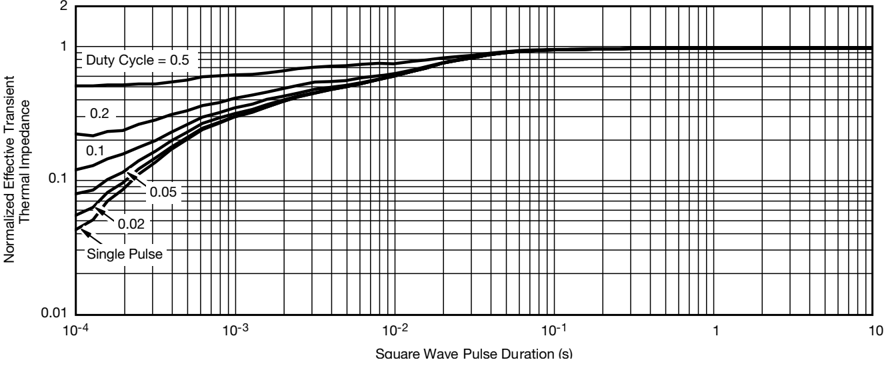



## Note

- The characteristics shown in the two graphs
- Normalized Transient Thermal Impedance Junction to Ambient (25 °C)
- Normalized Transient Thermal Impedance Junction to Case (25 °C)



are given for general guidelines only to enable the user to get a 'ball park' indication of part capabilities. The data are extracted from single pulse  transient  thermal  impedance  characteristics  which  are  developed  from  empirical  measurements.  The  latter  is  valid  for  the  part mounted on printed circuit board - FR4, size 1" x 1" x 0.062", double sided with 2 oz. copper, 100 % on both sides. The part capabilities can widely vary depending on actual application parameters and operating conditions.



[](http://www.vishay.com/ppg?73132)

[](http://www.vishay.com/ppg?73132)

[](http://www.vishay.com/ppg?73132)

[](http://www.vishay.com/ppg?73132)

[](http://www.vishay.com/ppg?73132)

[](http://www.vishay.com/ppg?73132)

[](http://www.vishay.com/ppg?73132)

[](http://www.vishay.com/ppg?73132)

[](http://www.vishay.com/ppg?73132)

[](http://www.vishay.com/ppg?73132)

[](http://www.vishay.com/ppg?73132)

[](http://www.vishay.com/ppg?73132)

[](http://www.vishay.com/ppg?73132)

[](http://www.vishay.com/ppg?73132)

[](http://www.vishay.com/ppg?73132)

[](http://www.vishay.com/ppg?73132)

[](http://www.vishay.com/ppg?73132)

[](http://www.vishay.com/ppg?73132)

[](http://www.vishay.com/ppg?73132)

[](http://www.vishay.com/ppg?73132)

[](http://www.vishay.com/ppg?73132)

[](http://www.vishay.com/ppg?73132)

[](http://www.vishay.com/ppg?73132)

[](http://www.vishay.com/ppg?73132)

[](http://www.vishay.com/ppg?73132)

[](http://www.vishay.com/ppg?73132)

[](http://www.vishay.com/ppg?73132)

[](http://www.vishay.com/ppg?73132)

[](http://www.vishay.com/ppg?73132)

[](http://www.vishay.com/ppg?73132)

[](http://www.vishay.com/ppg?73132)

[](http://www.vishay.com/ppg?73132)

[](http://www.vishay.com/ppg?73132)

[](http://www.vishay.com/ppg?73132)

[](http://www.vishay.com/ppg?73132)

[Vishay Siliconix maintains worldwide manufacturing capability. Products may be manufactured at one of several qualified locations. Reliability data for Silicon Technology and Package Reliability represent a composite of all qualified locations. For related documents such as package/tape drawings, part marking, and reliability data, see www.vishay.com/ppg?62995.](http://www.vishay.com/ppg?73132)

## Vishay Siliconix

## Notes

1. Plane B includes maximum features of heat sink tab and plastic.
2. No  more  than  25  %  of  L1  can  fall  above  seating  plane  by max.  8 mils.
3. Pin-to-pin coplanarity max. 4 mils.
4. *: Thin lead is for SUB, SYB.



Thick lead is for SUM, SYM, SQM.

5. Use inches as the primary measurement.
6. This feature is for thick lead.

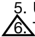

www.vishay.com

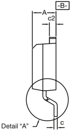

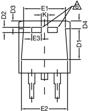

|            | INCHES    | INCHES    | MILLIMETERS   | MILLIMETERS   |
|------------|-----------|-----------|---------------|---------------|
| DIM.       | MIN.      | MAX.      | MIN.          | MAX.          |
| A          | 0.160     | 0.190     | 4.064         | 4.826         |
| b          | 0.020     | 0.039     | 0.508         | 0.990         |
| b1         | 0.020     | 0.035     | 0.508         | 0.889         |
| b2         | 0.045     | 0.055     | 1.143         | 1.397         |
| Thin lead  | 0.013     | 0.018     | 0.330         | 0.457         |
| Thick lead | 0.023     | 0.028     | 0.584         | 0.711         |
| Thin lead  | 0.013     | 0.017     | 0.330         | 0.431         |
| Thick lead | 0.023     | 0.027     | 0.584         | 0.685         |
| c2         | 0.045     | 0.055     | 1.143         | 1.397         |
| D          | 0.340     | 0.380     | 8.636         | 9.652         |
| D1         | 0.220     | 0.240     | 5.588         | 6.096         |
| D2         | 0.038     | 0.042     | 0.965         | 1.067         |
| D3         | 0.045     | 0.055     | 1.143         | 1.397         |
| D4         | 0.044     | 0.052     | 1.118         | 1.321         |
| E          | 0.380     | 0.410     | 9.652         | 10.414        |
| E1         | 0.245     | -         | 6.223         | -             |
| E2         | 0.355     | 0.375     | 9.017         | 9.525         |
| E3         | 0.072     | 0.078     | 1.829         | 1.981         |
| e          | 0.100 BSC | 0.100 BSC | 2.54 BSC      | 2.54 BSC      |
| K          | 0.045     | 0.055     | 1.143         | 1.397         |
| L          | 0.575     | 0.625     | 14.605        | 15.875        |
| L1         | 0.090     | 0.110     | 2.286         | 2.794         |
| L2         | 0.040     | 0.055     | 1.016         | 1.397         |
| L3         | 0.050     | 0.070     | 1.270         | 1.778         |
| L4         | 0.010 BSC | 0.010 BSC | 0.254 BSC     | 0.254 BSC     |
| M          | -         | 0.002     | -             | 0.050         |

## Package Information

Vishay Siliconix

## TO-263 (D 2 PAK): 3-LEAD

## VERSION 1: FACILITY CODE = T

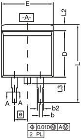

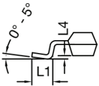

DETAIL A (ROTATED 90°)

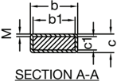

## VERSION 2: FACILITY CODE = N

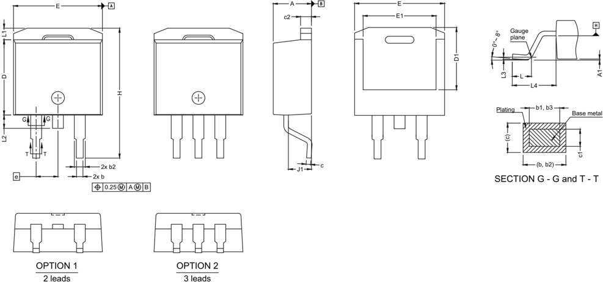

| DIM.                                        | MIN.                                        | MAX.                                        |
|---------------------------------------------|---------------------------------------------|---------------------------------------------|
| A                                           | 4.36                                        | 4.56                                        |
| A1                                          | 0                                           | 0.25                                        |
| b                                           | 0.70                                        | 0.90                                        |
| b1                                          | 0.51                                        | 0.89                                        |
| b2                                          | 1.20                                        | 1.46                                        |
| b3                                          | 1.17                                        | 1.37                                        |
| c                                           | 0.38                                        | 0.694                                       |
| c1                                          | 0.38                                        | 0.534                                       |
| c2                                          | 1.19                                        | 1.34                                        |
| D                                           | 8.60                                        | 9.00                                        |
| D1                                          | 6.9                                         | 7.5                                         |
| E                                           | 10.15                                       | 10.55                                       |
| E1                                          | 8.1                                         | 8.7                                         |
| e                                           | 2.54 BSC                                    | 2.54 BSC                                    |
| H                                           | 15.0                                        | 15.6                                        |
| L                                           | 1.9                                         | 2.5                                         |
| L1                                          | -                                           | 1.65                                        |
| L2                                          | -                                           | 1.78                                        |
| L3                                          | 0.25 typ.                                   | 0.25 typ.                                   |
| L4                                          | 4.78                                        | 5.28                                        |
| J1                                          | 2.56                                        | 2.96                                        |
| ECN: S24-1080-Rev. L, 28-Oct-2024 DWG: 5843 | ECN: S24-1080-Rev. L, 28-Oct-2024 DWG: 5843 | ECN: S24-1080-Rev. L, 28-Oct-2024 DWG: 5843 |

## Vishay Siliconix

## RECOMMENDED MINIMUM PADS FOR D 2 PAK:  3-Lead

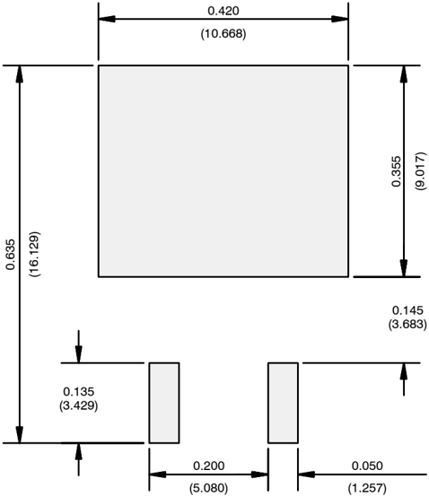

Recommended Minimum Pads Dimensions in Inches/(mm)

Return to Index

## AN826

## Vishay Siliconix

## Disclaimer

ALL  PRODUCT, PRODUCT SPECIFICATIONS AND DATA ARE SUBJECT TO CHANGE WITHOUT NOTICE TO IMPROVE RELIABILITY, FUNCTION OR DESIGN OR OTHERWISE.

Vishay Intertechnology, Inc., its affiliates, agents, and employees, and all persons acting on its or their behalf (collectively, 'Vishay'), disclaim any and all liability for any errors, inaccuracies or incompleteness contained in any datasheet or in any other disclosure relating to any product.

Vishay makes no warranty, representation or guarantee regarding the suitability of the products for any particular purpose or the continuing production of any product. To the maximum extent permitted by applicable law, Vishay disclaims (i) any and all liability  arising  out  of  the  application  or  use  of  any  product,  (ii)  any  and  all  liability,  including  without  limitation  special, consequential  or  incidental  damages,  and  (iii)  any  and  all  implied  warranties,  including  warranties  of  fitness  for  particular purpose, non-infringement and merchantability.

Statements regarding the suitability of products for certain types of applications are based on Vishay's knowledge of typical requirements that are often placed on Vishay products in generic applications. Such statements are not binding statements about the suitability of products for a particular application. It is the customer's responsibility to validate that a particular product with the properties described in the product specification is suitable for use in a particular application. Parameters provided in datasheets  and  /  or  specifications  may  vary  in  different  applications  and  performance  may  vary  over  time.  All  operating parameters, including typical parameters, must be validated for each customer application by the customer's technical experts. Product specifications do not expand or otherwise modify Vishay's terms and conditions of purchase, including but not limited to the warranty expressed therein.

Hyperlinks included in this datasheet may direct users to third-party websites. These links are provided as a convenience and for informational purposes only. Inclusion of these hyperlinks does not constitute an endorsement or an approval by Vishay of any of the products, services or opinions of the corporation, organization or individual associated with the third-party website. Vishay disclaims any and all liability and bears no responsibility for the accuracy, legality or content of the third-party website or for that of subsequent links.

Vishay products are not designed for use in life-saving or life-sustaining applications or any application in which the failure of the Vishay product could result in personal injury or death unless specifically qualified in writing by Vishay. Customers using or selling Vishay products not expressly indicated for use in such applications do so at their own risk. Please contact authorized Vishay personnel to obtain written terms and conditions regarding products designed for such applications.

No license, express or implied, by estoppel or otherwise, to any intellectual property rights is granted by this document or by any conduct of Vishay. Product names and markings noted herein may be trademarks of their respective owners.

## Legal Disclaimer Notice

Vishay