## Features

- Uses CRM(CQ) advanced SkyMOS1 technology
- Extremely low on-resistance RDS(on)
- Excellent Q g xRDS(on) product(FOM)
- Qualified according to JEDEC criteria

## Applications

- Motor control and drive
- Battery management
- UPS (Uninterrupible Power Supplies)

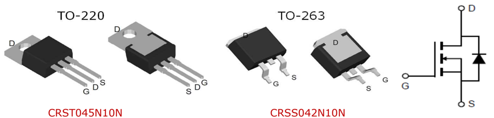

## Package Marking and Ordering Information

| Part #      | Marking   | Package   | Packing   | Reel Size   | Tape Width   | Qty   |
|-------------|-----------|-----------|-----------|-------------|--------------|-------|
| CRST045N10N | -         | TO-220    | Tube      | N/A         | N/A          | 50pcs |
| CRSS042N10N | -         | TO-263    | Tube      | N/A         | N/A          | 50pcs |

## Absolute Maximum Ratings

| Parameter                                                                             | Symbol                  | Value                 | Unit   |
|---------------------------------------------------------------------------------------|-------------------------|-----------------------|--------|
| Drain-source voltage                                                                  | V DS                    | 100                   | V      |
| Continuous drain current                                                              |                         |                       |        |
| T C = 25°C (Silicon limit)                                                            | I D                     | 172                   | A      |
| T C = 25°C (Package limit)                                                            |                         | 120                   |        |
| T C = 100°C (Silicon limit)                                                           |                         | 109                   |        |
| Pulsed drain current (T C = 25°C, t p limited by T jmax )                             | I D pulse               | 480                   | A      |
| Avalanche energy, single pulse (L=0.5mH, Rg=25 Ω )                                    | E AS                    | 256                   | mJ     |
| Gate-Source voltage                                                                   | V GS                    | ±20                   | V      |
| Power dissipation (T C = 25°C)                                                        | P tot                   | 227                   | W      |
| Operating junction and storage temperature Operating junction and storage temperature | T j , T stg T j , T stg | -55...+150 -55...+150 | °C °C  |

M華

## CRST045N10N, CRSS042N10N

SkyMOS1 N-MOSFET 100V, 3.6mΩ, 120A

## Product Summary

100% Avalanche Tested 100% Avalanche Tested 100% Avalanche Tested

| V DS     | 100V   |
|----------|--------|
| R DS(on) | 3.6mΩ  |
| I D      | 120A   |

## Thermal Resistance

| Parameter                                              | Symbol   |   Max | Unit   |
|--------------------------------------------------------|----------|-------|--------|
| Thermal resistance, junction - case.                   | R thJC   |  0.55 | °C/W   |
| Thermal resistance, junction - ambient(min. footprint) | R thJA   |    62 | °C/W   |

## Electrical Characteristic (at Tj = 25 °C, unless otherwise specified)

| Parameter                        | Symbol                 | Value                  | Value                  | Value                  | Unit                   | Test Condition                                      |
|----------------------------------|------------------------|------------------------|------------------------|------------------------|------------------------|-----------------------------------------------------|
|                                  |                        | min.                   | typ.                   | max.                   |                        |                                                     |
| Static Characteristic            | Static Characteristic  | Static Characteristic  | Static Characteristic  | Static Characteristic  | Static Characteristic  | Static Characteristic                               |
| Drain-source breakdown voltage   | BV DSS                 | 100                    | 115                    | -                      | V                      | V GS =0V, I D =250uA                                |
| Gate threshold voltage           | V GS(th )              | 2                      | 3                      | 4                      | V                      | V DS =V GS ,I D =250uA                              |
| Zero gate voltage drain current  | I DSS                  | - - -                  | 0.05 - -               | 1 10 10                | µA                     | V DS =100V,V GS =0V T j =25°C T j =125°C T j =125°C |
| Gate-source leakage current      | I GSS                  | -                      | ±10                    | ±100                   | nA                     | V GS =±20V,V DS =0V                                 |
| Drain-source on-state resistance | R DS(on)               | - -                    | 3.6 3.4                | 4.5 4.2                | mΩ                     | V GS =10V, I D =50A TO-220 TO-263                   |
| Transconductance                 | g fs                   | -                      | 50                     | -                      | S                      | V DS =5V,I D =50A                                   |
| Dynamic Characteristic           | Dynamic Characteristic | Dynamic Characteristic | Dynamic Characteristic | Dynamic Characteristic | Dynamic Characteristic | Dynamic Characteristic                              |
| Input Capacitance                | C iss                  | -                      | 6772                   | -                      | pF                     | V GS =0V, V DS =50V, f=1MHz                         |
| Output Capacitance               | C oss                  | -                      | 952                    | -                      | pF                     | V GS =0V, V DS =50V, f=1MHz                         |
| Reverse Transfer Capacitance     | C rss                  | -                      | 33                     | -                      | pF                     | V GS =0V, V DS =50V, f=1MHz                         |
| Gate Total Charge                | Q G                    | -                      | 90                     | -                      | nC                     | V GS =10V, V DS =50V, I D =20A, f=1MHz              |
| Gate-Source charge               | Q gs                   | -                      | 28                     | -                      | nC                     | V GS =10V, V DS =50V, I D =20A, f=1MHz              |
| Gate-Drain charge                | Q gd                   | -                      | 19                     | -                      | nC                     | V GS =10V, V DS =50V, I D =20A, f=1MHz              |
| Turn-on delay time               | t d(on)                | -                      | 28                     | -                      | ns                     | V GS =10V, V DD =50V, R G_ext =3.0Ω                 |
| Rise time                        | t r                    | -                      | 32                     | -                      | ns                     | V GS =10V, V DD =50V, R G_ext =3.0Ω                 |
| Turn-off delay time              | t d(off)               | -                      | 48                     | -                      | ns                     | V GS =10V, V DD =50V, R G_ext =3.0Ω                 |
| Fall time                        | t f                    | -                      | 27                     | -                      | ns                     | V GS =10V, V DD =50V, R G_ext =3.0Ω                 |
| Gate resistance Gate resistance  | R G R G                | - -                    | 2 2                    | - -                    | Ω Ω                    | V GS =0V, V DS =0V, V GS =0V, V DS =0V, f=1MHz      |

## CRST045N10N, CRSS042N10N

SkyMOS1 N-MOSFET 100V, 3.6mΩ, 120A

## Body Diode Characteristic

|                                    |        | Value   | Value   | Value   | Unit   | Test Condition          |
|------------------------------------|--------|---------|---------|---------|--------|-------------------------|
| Parameter                          | Symbol | min.    | typ.    | max.    |        |                         |
| Body Diode Forward Voltage         | V SD   | -       | 0.89    | 1.3     | V      | V GS =0V,I SD =50A      |
| Body Diode Reverse Recovery Time   | t rr   | -       | 80      | -       | ns     | I F =50A, dI/dt=100A/µs |
| Body Diode Reverse Recovery Charge | Q rr   | -       | 190     | -       | nC     | I F =50A, dI/dt=100A/µs |

## CRST045N10N, CRSS042N10N

SkyMOS1 N-MOSFET 100V, 3.6mΩ, 120A

## Typical Performance Characteristics

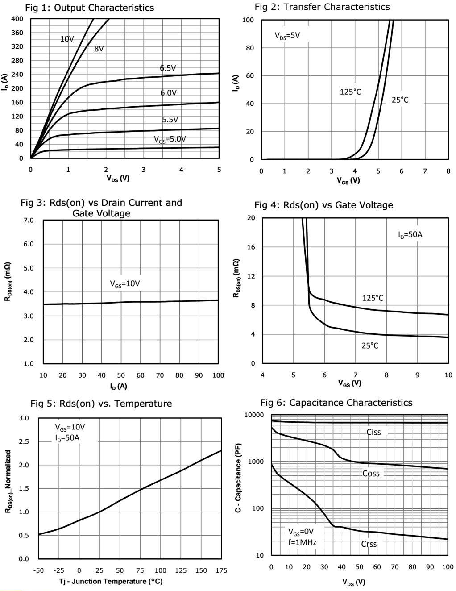

## CRST045N10N, CRSS042N10N

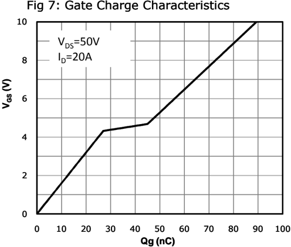

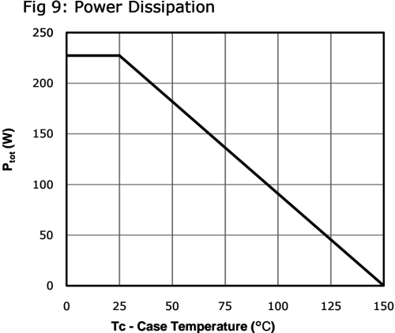

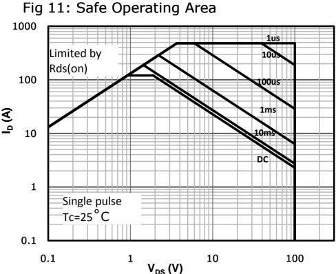

## CRST045N10N, CRSS042N10N

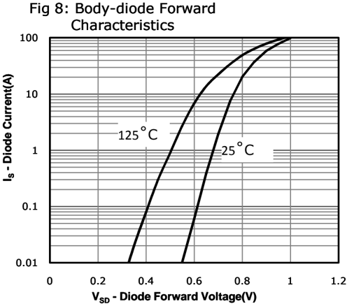

Fig 10: Drain Current Derating Fig 10: Drain Current Derating Fig 10: Drain Current Derating

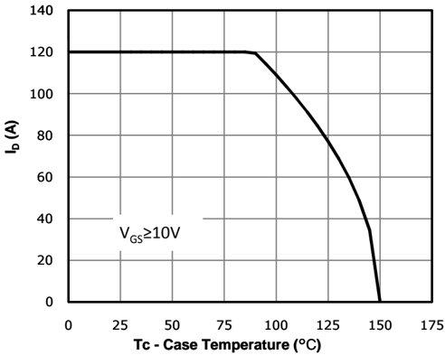

Fig 12: Max. Transient Thermal Impedance Fig 12: Max. Transient Thermal Impedance

1

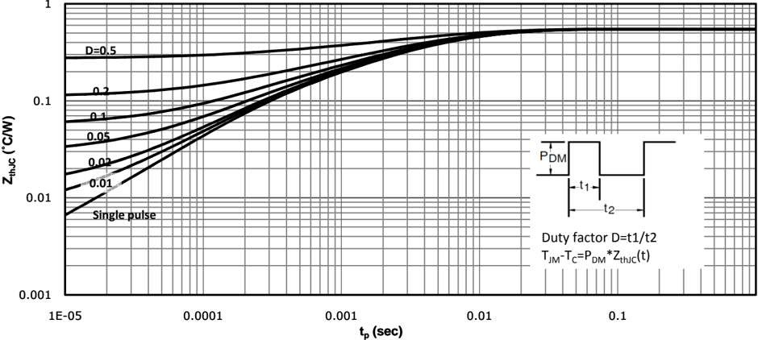

1

## Test Circuit &amp; Waveform

Gate Charge Test Circuit &amp; Waveform

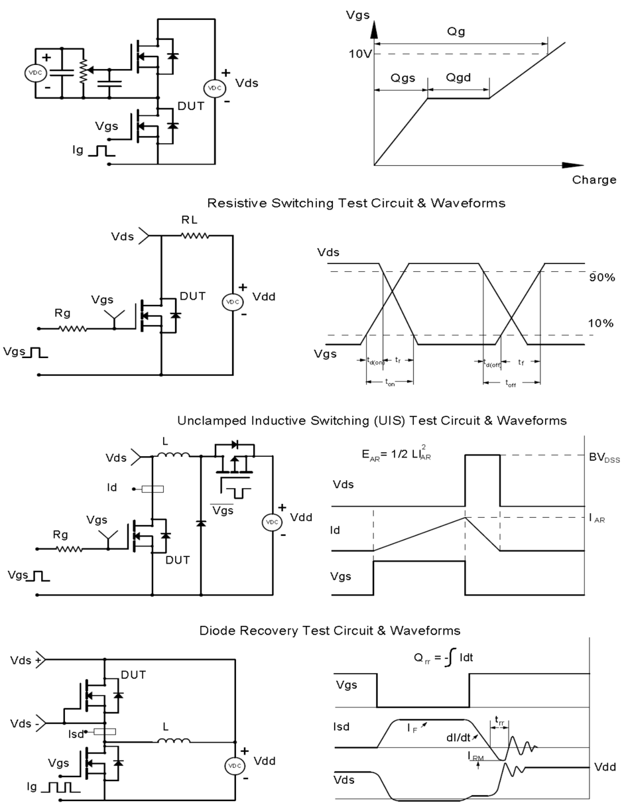

M華

## CRST045N10N, CRSS042N10N

SkyMOS1 N-MOSFET 100V, 3.6mΩ, 120A

## Package Outline: TO-220-3L

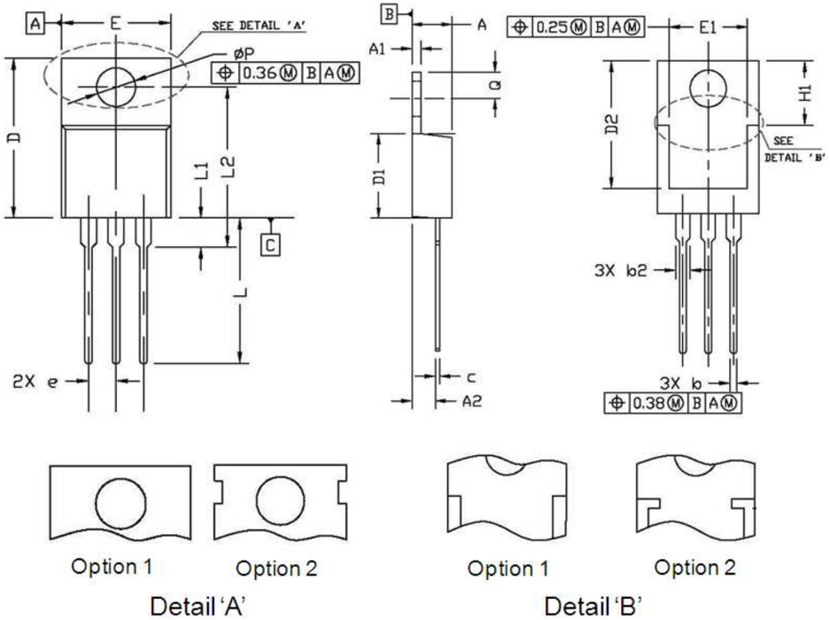

| Symbol   | Dimensions In Millimeters   | Dimensions In Millimeters   | Dimensions In Inches   | Dimensions In Inches   |
|----------|-----------------------------|-----------------------------|------------------------|------------------------|
| Symbol   | Min.                        | Max.                        | Min.                   | Max.                   |
| A        | 4.30                        | 4.80                        | 0.169                  | 0.189                  |
| A1       | 1.20                        | 1.45                        | 0.047                  | 0.057                  |
| A2       | 2.20                        | 2.90                        | 0.087                  | 0.114                  |
| b        | 0.69                        | 0.95                        | 0.027                  | 0.037                  |
| b2       | 1.00                        | 1.60                        | 0.039                  | 0.063                  |
| c        | 0.33                        | 0.65                        | 0.013                  | 0.026                  |
| D        | 14.70                       | 16.20                       | 0.579                  | 0.638                  |
| D1       | 8.59                        | 9.65                        | 0.338                  | 0.380                  |
| D2       | 11.75                       | 13.60                       | 0.463                  | 0.535                  |
| e        | 2.54 BSC.                   | 2.54 BSC.                   | 0.100 BSC.             | 0.100 BSC.             |
| E        | 9.60                        | 10.60                       | 0.378                  | 0.417                  |
| E1       | 7.00                        | 8.46                        | 0.276                  | 0.333                  |
| H1       | 6.20                        | 7.00                        | 0.244                  | 0.276                  |
| L        | 12.60                       | 14.80                       | 0.496                  | 0.583                  |
| L1       | 2.70                        | 3.80                        | 0.106                  | 0.150                  |
| L2       | 12.13                       | 16.50                       | 0.478                  | 0.650                  |
| Q Q      | 2.40 2.40                   | 3.10 3.10                   | 0.094 0.094            | 0.122 0.122            |
| P        | 3.50                        | 3.90                        | 0.138                  | 0.154                  |

M華

## CRST045N10N, CRSS042N10N

SkyMOS1 N-MOSFET 100V, 3.6mΩ, 120A

## Package Outline: TO-263

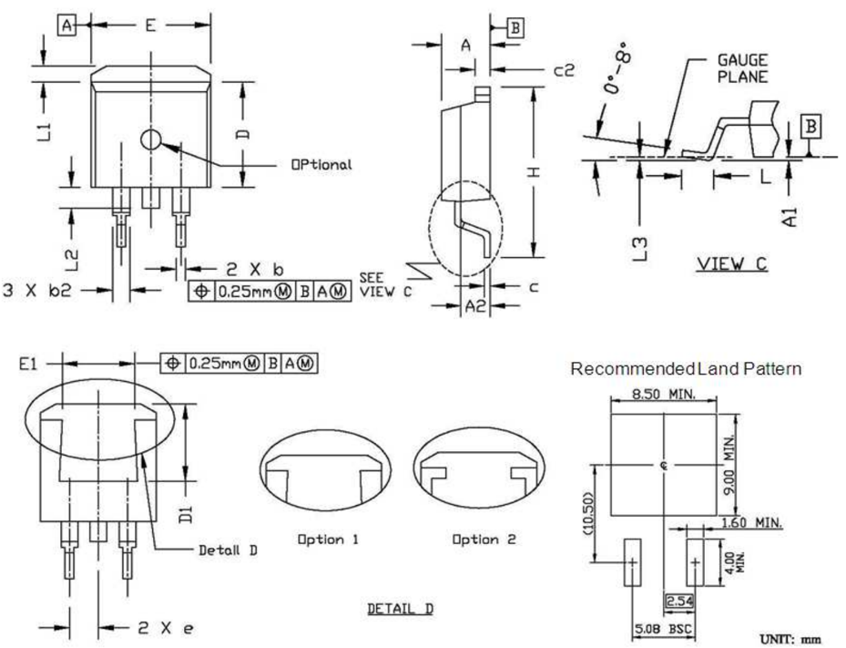

| Symbol   | Dimensions In Millimeters   | Dimensions In Millimeters   | Dimensions In Inches   | Dimensions In Inches   |
|----------|-----------------------------|-----------------------------|------------------------|------------------------|
| Symbol   | Min.                        | Max.                        | Min.                   | Max.                   |
| A        | 4.30                        | 4.86                        | 0.169                  | 0.191                  |
| A1       | 0.00                        | 0.25                        | 0.000                  | 0.010                  |
| A2       | 2.34                        | 2.79                        | 0.092                  | 0.110                  |
| b        | 0.68                        | 0.94                        | 0.027                  | 0.037                  |
| b2       | 1.15                        | 1.35                        | 0.045                  | 0.053                  |
| c        | 0.33                        | 0.65                        | 0.013                  | 0.026                  |
| c2       | 1.17                        | 1.40                        | 0.046                  | 0.055                  |
| D        | 8.38                        | 9.45                        | 0.330                  | 0.372                  |
| D1       | 6.90                        | 8.17                        | 0.272                  | 0.322                  |
| e        | 2.54 BSC.                   | 2.54 BSC.                   | 0.100 BSC.             | 0.100 BSC.             |
| E        | 9.78                        | 10.50                       | 0.385                  | 0.413                  |
| E1       | 6.50                        | 8.60                        | 0.256                  | 0.339                  |
| H        | 14.61                       | 15.88                       | 0.575                  | 0.625                  |
| L        | 2.24                        | 3.00                        | 0.088                  | 0.118                  |
| L1       | 0.70                        | 1.60                        | 0.028                  | 0.063                  |
| L2       | 1.00                        | 1.78                        | 0.039                  | 0.070                  |
| L3       | 0.00                        | 0.25                        | 0.000                  | 0.010                  |

M華

## CRST045N10N, CRSS042N10N

SkyMOS1 N-MOSFET 100V, 3.6mΩ, 120A

## Revision History

|   Revison | Date       | Major changes                    |
|-----------|------------|----------------------------------|
|       1.0 | 2018-02-09 | Release of formal version.       |
|       2.0 | 2019-05-28 | Supplement package outline info. |

## Disclaimer

Unless otherwise specified in the datasheet, the product is designed and qulified as a standard commercial product and is not intended for use in applications that require extraordinary levels of quality and reliability, such as automotive, aviation/aerospace and life-support devices or systems.

Any and all semicondutor products have certain probability to fail or malfunction, which may result in personal injury, death or property damage. Customer are solely responsible for providing adequate safe measures when design their systems.

CRM(CQ) reserves the right to improve product design, function and reliability without notice.

## CRST045N10N, CRSS042N10N

SkyMOS1 N-MOSFET 100V, 3.6mΩ, 120A