## IPB033N10N5LF

## MOSFET

## OptiMOS TM -5-Linear-FET,-100-V

## Features

- ·-Ideal-for-hot-swap-and-e-fuse-applications
- ·-Very-low-on-resistance--RDS(on)
- ·-Wide-safe-operating-area-SOA
- ·-N-channel,-normal-level
- ·-100%-avalanche-tested
- ·-Pb-free-plating;-RoHS-compliant
- ·-Qualified-according-to-JEDEC 1) --for-target-applications
- ·-Halogen-free-according-to-IEC61249-2-21

## Table-1-----Key-Performance-Parameters

| Parameter                           |   Value | Unit   |
|-------------------------------------|---------|--------|
| V DS                                |     100 | V      |
| R DS(on),max                        |     3.3 | m Ω    |
| I D                                 |     159 | A      |
| I pulse ( V DS =56V, t p =10 ms) |       7 | A      |

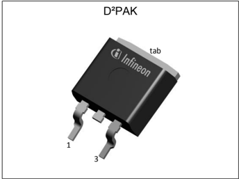

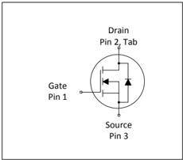

| Type/OrderingCode   | Package    | Marking   | RelatedLinks   |
|------------------------|------------|-----------|-----------------|
| IPB033N10N5LF          | PG-TO263-3 | 033N10LF  | -               |

## Table-of-Contents

| Description . . . . . . . . . . . . . . . . .   | . 1   |
|-------------------------------------------------|-------|
| Maximum ratings . . . . . . . . . . . . .       | . 3   |
| Thermal characteristics . . . . . . . .         | . 3   |
| Electrical characteristics . . . . . . . .      | . 4   |
| Electrical characteristics diagrams             | . 6   |
| Package Outlines . . . . . . . . . . . . .      | 10    |
| Revision History . . . . . . . . . . . . . .    | 11    |
| Trademarks . . . . . . . . . . . . . . . . .    | 11    |
| Disclaimer . . . . . . . . . . . . . . . . . .  | 11    |

## 1-----Maximum-ratings

atT A=25-°C,-unless-otherwise-specified

## Table-2-----Maximum-ratings

|                                   | Symbol       | Values   | Values   | Values     | Unit   | Note/TestCondition                                                                         |
|-----------------------------------|--------------|----------|----------|------------|--------|-----------------------------------------------------------------------------------------------|
| Parameter                         |              | Min.     | Typ.     | Max.       |        |                                                                                               |
| Continuous drain current 1)       | I D          | - - -    | - - -    | 159 108 23 | A      | V GS =10V, T C =25°C V GS =10V, T C =100°C V GS =10V, T C =25°C, R thJA =40K/W 2) |
| Pulsed drain current 3)           | I D,pulse    | -        | -        | 636        | A      | T C =25°C                                                                                    |
| Avalanche energy, single pulse 4) | E AS         | -        | -        | 273        | mJ     | I D =100A, R GS =25 Ω                                                                      |
| Gate source voltage               | V GS         | -20      | -        | 20         | V      | -                                                                                             |
| Power dissipation                 | P tot        | -        | -        | 179        | W      | T C =25°C                                                                                    |
| Operating and storage temperature | T j , T stg | -55      | -        | 150        | °C     | -                                                                                             |

## 2-----Thermal-characteristics

## Table-3-----Thermal-characteristics

|                                      |        | Values   | Values   | Values   | Unit   |                       |
|--------------------------------------|--------|----------|----------|----------|--------|-----------------------|
| Parameter                            | Symbol | Min.     | Typ.     | Max.     |        | Note/TestCondition |
| Thermal resistance, junction - case  | R thJC | -        | 0.45     | 0.7      | K/W    | -                     |
| Device on PCB, minimal footprint     | R thJA | -        | -        | 62       | K/W    | -                     |
| Device on PCB, 6 cm² cooling area 2) | R thJA | -        | -        | 40       | K/W    | -                     |

## 3-----Electrical-characteristics

atT j=25-°C,-unless-otherwise-specified

## Table-4-----Static-characteristics

| Parameter                        | Symbol    | Values   | Values   | Values   | Unit   | Note/TestCondition                                                      |
|----------------------------------|-----------|----------|----------|----------|--------|----------------------------------------------------------------------------|
|                                  |           | Min.     | Typ.     | Max.     |        |                                                                            |
| Drain-source breakdown voltage   | V (BR)DSS | 100      | -        | -        | V      | V GS =0V, I D =1mA                                                      |
| Gate threshold voltage           | V GS(th)  | 2.5      | 3.3      | 4.1      | V      | V DS = V GS , I D =150µA                                                 |
| Zero gate voltage drain current  | I DSS     | - -      | 1.0 10   | 10 100   | µA     | V DS =100V, V GS =0V, T j =25°C V DS =100V, V GS =0V, T j =125°C |
| Gate-source leakage current      | I GSS     | - -      | 2 -2     | 5 -5     | µA     | V GS =20V, V DS =0V V GS =-10V, V DS =0V                             |
| Drain-source on-state resistance | R DS(on)  | -        | 2.7      | 3.3      | m Ω    | V GS =10V, I D =100A                                                    |
| Gate resistance 1)               | R G       | -        | 40       | 60       | Ω      | -                                                                          |
| Transconductance 1)              | g fs      | 23       | 46       | -        | S      | &#124; V DS &#124;>2&#124; I D &#124; R DS(on)max , I D =100A            |

## Table-5-----Dynamic-characteristics

| Parameter                    | Symbol   | Values   | Values   | Values   | Unit   | Note/TestCondition                                |
|------------------------------|----------|----------|----------|----------|--------|------------------------------------------------------|
|                              |          | Min.     | Typ.     | Max.     |        |                                                      |
| Input capacitance 1)         | C iss    | -        | 350      | 460      | pF     | V GS =0V, V DS =50V, f =1MHz                    |
| Output capacitance 1)        | C oss    | -        | 1100     | 1400     | pF     | V GS =0V, V DS =50V, f =1MHz                    |
| Reverse transfer capacitance | C rss    | -        | 13       | -        | pF     | V GS =0V, V DS =50V, f =1MHz                    |
| Turn-on delay time           | t d(on)  | -        | 8        | -        | ns     | V DD =50V, V GS =10V, I D =50A, R G,ext =1.6 Ω |
| Rise time                    | t r      | -        | 32       | -        | ns     | V DD =50V, V GS =10V, I D =50A, R G,ext =1.6 Ω |
| Turn-off delay time          | t d(off) | -        | 64       | -        | ns     | V DD =50V, V GS =10V, I D =50A, R G,ext =1.6 Ω |
| Fall time                    | t f      | -        | 48       | -        | ns     | V DD =50V, V GS =10V, I D =50A, R G,ext =1.6 Ω |

## Table-6-----Gate-charge-characteristics 2)

|                       |           | Values   | Values   | Values   |      |                                           |
|-----------------------|-----------|----------|----------|----------|------|-------------------------------------------|
| Parameter             | Symbol    | Min.     | Typ.     | Max.     | Unit | Note/TestCondition                     |
| Gate to source charge | Q gs      | -        | 3        | -        | nC   | V DD =50V, I D =100A, V GS =0to10V |
| Gate to drain charge  | Q gd      | -        | 72       | -        | nC   | V DD =50V, I D =100A, V GS =0to10V |
| Gate charge total     | Q g       | -        | 102      | -        | nC   | V DD =50V, I D =100A, V GS =0to10V |
| Gate plateau voltage  | V plateau | -        | 6.9      | -        | V    | V DD =50V, I D =100A, V GS =0to10V |
| Output charge 1)      | Q oss     | -        | 116      | 155      | nC   | V DD =50V, V GS =0V                    |

-

2) See ″ Gate charge waveforms ″ for parameter definition

## Table-7-----Reverse-diode

|                                  |           | Values   | Values   | Values   |      |                                            |
|----------------------------------|-----------|----------|----------|----------|------|--------------------------------------------|
| Parameter                        | Symbol    | Min.     | Typ.     | Max.     | Unit | Note/TestCondition                      |
| Diode continuous forward current | I S       | -        | -        | 133      | A    | T C =25°C                                 |
| Diode pulse current              | I S,pulse | -        | -        | 636      | A    | T C =25°C                                 |
| Diode forward voltage            | V SD      | -        | 0.93     | 1.2      | V    | V GS =0V, I F =100A, T j =25°C        |
| Reverse recovery time            | t rr      | -        | 58       | -        | ns   | V R =50V, I F =50A,d i F /d t =100A/µs |
| Reverse recovery charge          | Q rr      | -        | 94       | -        | nC   | V R =50V, I F =50A,d i F /d t =100A/µs |

## 4-----Electrical-characteristics-diagrams

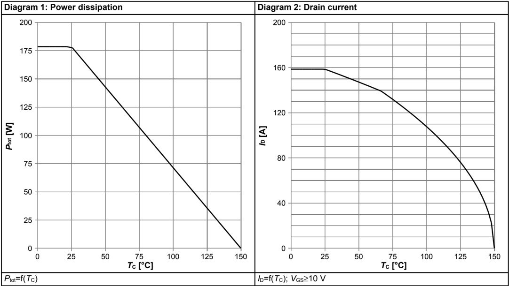

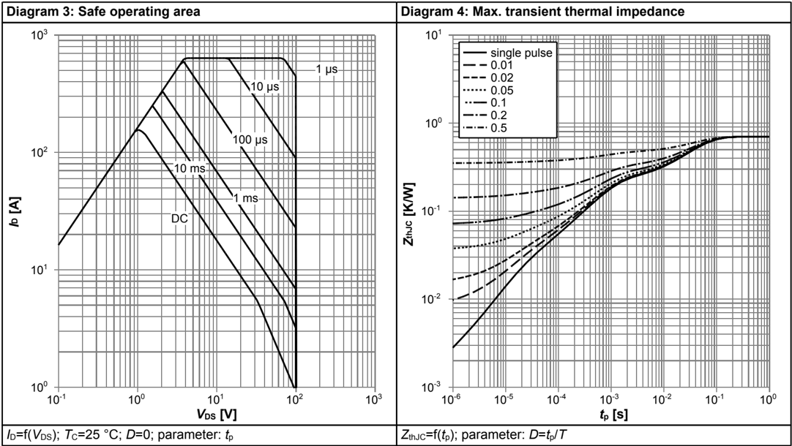

## OptiMOS TM -5-Linear-FET,-100-V IPB033N10N5LF

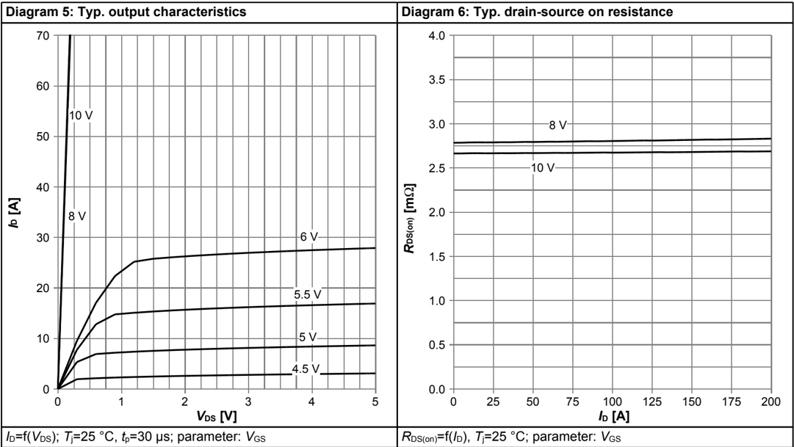

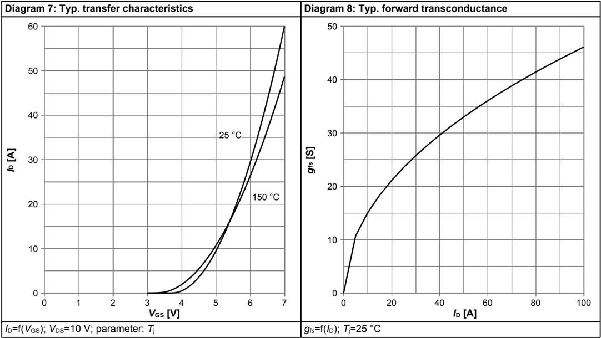

## OptiMOS TM -5-Linear-FET,-100-V IPB033N10N5LF

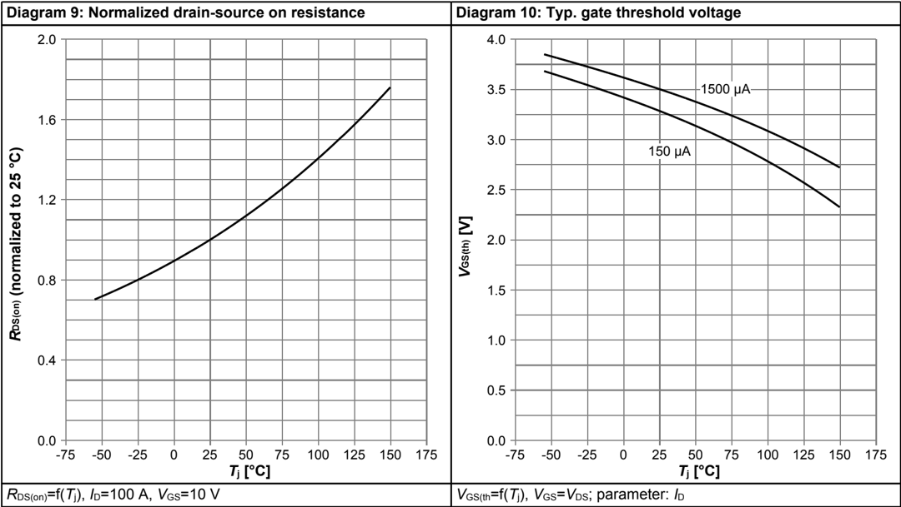

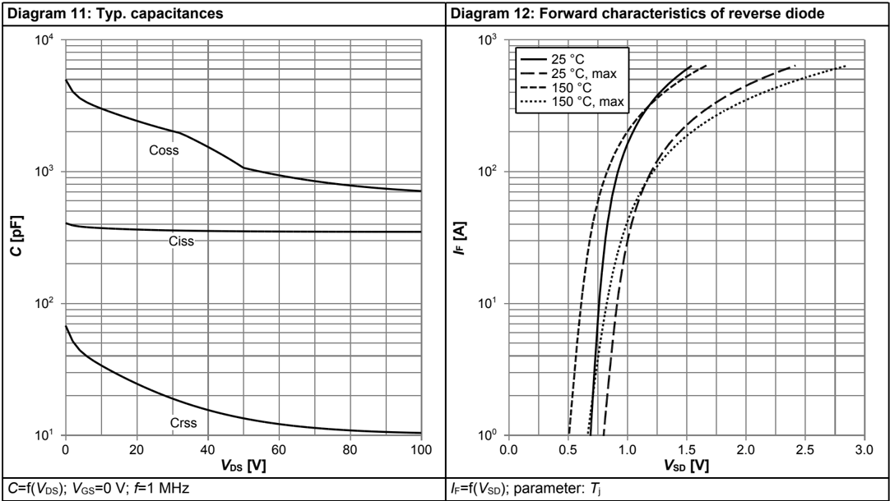

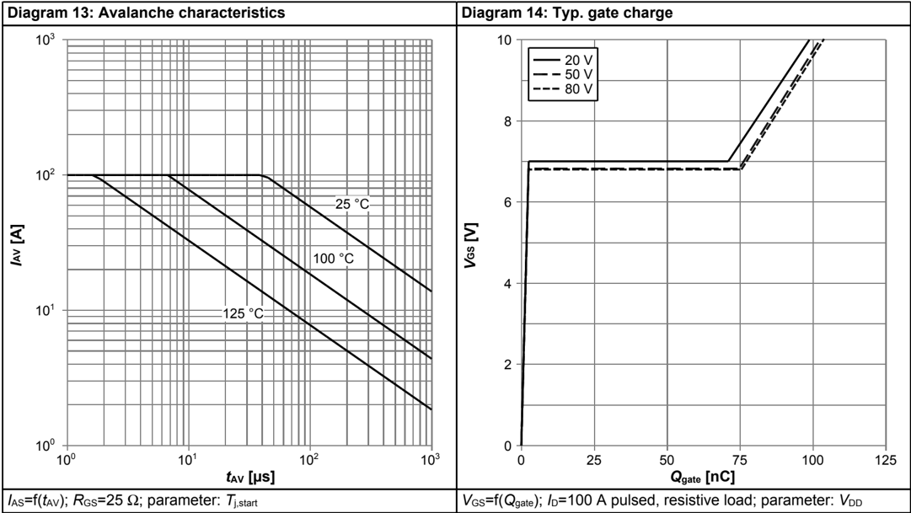

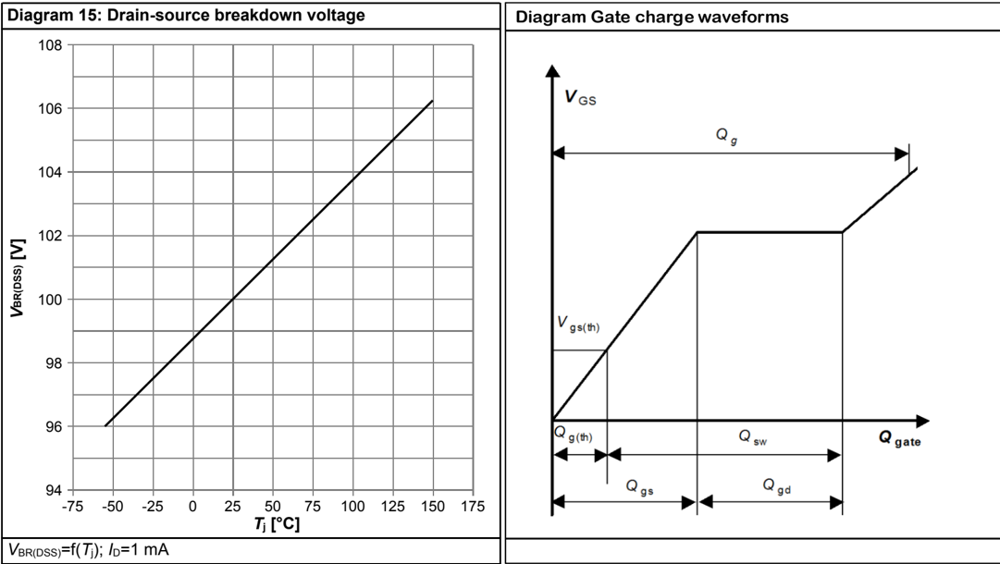

## 5-----Package-Outlines

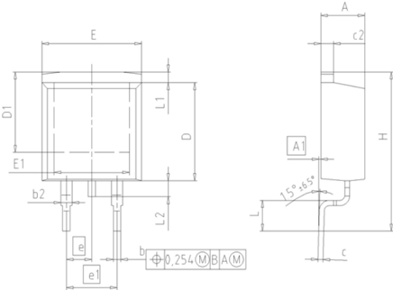

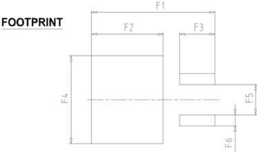

| DIM   | MILLIMETERS   | MILLIMETERS   | INCHES   | INCHES   |
|-------|---------------|---------------|----------|----------|
| DIM   | MIN           | MAX           | MIN      | MAX      |
| A     | 4.30          | 4.57          | 0.169    | 0.180    |
| A1    | 0.00          | 0.25          | 0.000    | 0.010    |
| b     | 0.65          | 0.85          | 0.026    | 0.033    |
| b2    | 0.95          | 1.15          | 0.037    | 0.045    |
| C     | 0.33          | 0.65          | 0.013    | 0.026    |
| c2    | 1.17          | 1.40          | 0.046    | 0.055    |
| D     | 8.51          | 9.45          | 0.335    | 0.372    |
| D1    | 7.10          | 7.90          | 0.280    | 0.311    |
| E     | 9.80          | 10.31         | 0.386    | 0.406    |
| E1    | 6.50          | 8.60          | 0.256    | 0.339    |
| e     | 2.54          | 2.54          | 0.100    | 0.100    |
| e1    | 5.08          | 5.08          | 0.200    | 0.200    |
| N     | 2             | 2             | 2        | 2        |
| H     | 14.61         | 15.88         | 0.575    | 0.625    |
| L     | 2.29          | 3.00          | 0.090    | 0.118    |
| L1    | 0.70          | 1.60          | 0.028    | 0.063    |
| L2    | 1.00          | 1.78          | 0.039    | 0.070    |
| F1    | 16.05         | 16.25         | 0.632    | 0.640    |
| F2    | 9.30          | 9.50          | 0.366    | 0.374    |
| F3    | 4.50          | 4.70          | 0.177    | 0.185    |
| F4    | 10.70         | 10.90         | 0.421    | 0.429    |
| F5    | 3.65          | 3.85          | 0.144    | 0.152    |
| F6    | 1.25          | 1.45          | 0.049    | 0.057    |

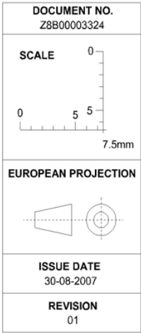

Figure-1-----Outline-PG-TO263-3,-dimensions-in-mm/inches

## OptiMOS TM -5-Linear-FET,-100-V IPB033N10N5LF

## Revision-History

IPB033N10N5LF

Revision:-2022-06-23,-Rev.-2.2

| Previous Revision   | Previous Revision   | Previous Revision                                                                       |
|---------------------|---------------------|-----------------------------------------------------------------------------------------|
| Revision            | Date                | Subjects (major changes since last revision)                                            |
| 2.0                 | 2016-12-15          | Release of final version                                                                |
| 2.1                 | 2017-02-16          | Update technology heading                                                               |
| 2.2                 | 2022-06-23          | Update current rating, footnotes and skip "Operating and storage temperature" condition |

## Trademarks

All-referenced-product-or-service-names-and-trademarks-are-the-property-of-their-respective-owners.

## We-Listen-to-Your-Comments

Any-information-within-this-document-that-you-feel-is-wrong,-unclear-or-missing-at-all?-Your-feedback-will-help-us-to-continuously improve-the-quality-of-this-document.-Please-send-your-proposal-(including-a-reference-to-this-document)-to: erratum@infineon.com

Published-by Infineon-Technologies-AG 81726-München,-Germany ©-2022-Infineon-Technologies-AG All-Rights-Reserved.

## Legal-Disclaimer

The-information-given-in-this-document-shall-in-no-event-be-regarded-as-a-guarantee-of-conditions-or-characteristics('Beschaffenheitsgarantie')-.

With-respect-to-any-examples,-hints-or-any-typical-values-stated-herein-and/or-any-information-regarding-the-application-of-the product,-Infineon-Technologies-hereby-disclaims-any-and-all-warranties-and-liabilities-of-any-kind,-including-without-limitation warranties-of-non-infringement-of-intellectual-property-rights-of-any-third-party.

In-addition,-any-information-given-in-this-document-is-subject-to-customer's-compliance-with-its-obligations-stated-in-this document-and-any-applicable-legal-requirements,-norms-and-standards-concerning-customer's-products-and-any-use-of-the product-of-Infineon-Technologies-in-customer's-applications.

The-data-contained-in-this-document-is-exclusively-intended-for-technically-trained-staff.-It-is-the-responsibility-of-customer's technical-departments-to-evaluate-the-suitability-of-the-product-for-the-intended-application-and-the-completeness-of-the-product information-given-in-this-document-with-respect-to-such-application.

## Information

For-further-information-on-technology,-delivery-terms-and-conditions-and-prices-please-contact-your-nearest-Infineon Technologies-Office-(www.infineon.com).

## Warnings

Due-to-technical-requirements,-components-may-contain-dangerous-substances.-For-information-on-the-types-in-question, please-contact-the-nearest-Infineon-Technologies-Office.

The-Infineon-Technologies-component-described-in-this-Data-Sheet-may-be-used-in-life-support-devices-or-systems-and/or automotive,-aviation-and-aerospace-applications-or-systems-only-with-the-express-written-approval-of-Infineon-Technologies,-if-a failure-of-such-components-can-reasonably-be-expected-to-cause-the-failure-of-that-life-support,-automotive,-aviation-and aerospace-device-or-system-or-to-affect-the-safety-or-effectiveness-of-that-device-or-system.-Life-support-devices-or-systems-are intended-to-be-implanted-in-the-human-body-or-to-support-and/or-maintain-and-sustain-and/or-protect-human-life.-If-they-fail,-it-is reasonable-to-assume-that-the-health-of-the-user-or-other-persons-may-be-endangered.

