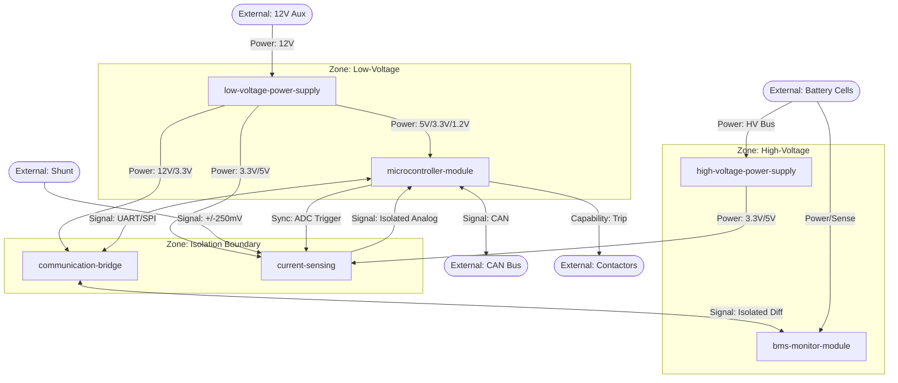

# System Boundary Document: stackable-bms

> **Document Version:** 1.0  
> **Constituent Module Boundary Docs:** 
> - bms-monitor-module-boundary.md (v1.0)
> - communication-bridge-boundary.md (v1.0)
> - current-sensing-boundary.md (v1.0)
> - high-voltage-power-supply-boundary.md (v1.0)
> - low-voltage-power-supply-boundary.md (v1.0)
> - microcontroller-module-boundary.md (v1.0)
> **Last Updated:** 2025-05-24

---

## 1. Module Registry

| Module | Zone / Domain | Role (one line) | Instantiation | Boundary Doc |
|:---|:---|:---|:---|:---|
| bms-monitor-module | HV Domain | Performs cell voltage sensing, balancing, and local temperature sensing. | Stackable | bms-monitor-module-boundary.md |
| communication-bridge | Isolation Boundary | Translates MCU signals to isolated differential daisy chain signals. | Singleton | communication-bridge-boundary.md |
| current-sensing | Spans HV/LV | Measures pack current via isolated shunt for SOC/SOH and protection. | Singleton | current-sensing-boundary.md |
| high-voltage-power-supply| HV Domain | Converts HV traction bus to LV DC for isolated sensing hot-side power. | Singleton | high-voltage-power-supply-boundary.md |
| low-voltage-power-supply | LV Domain | Converts 12V aux or LV pack bus into regulated logic rails (12V/5V/3.3V/1.2V). | Singleton | low-voltage-power-supply-boundary.md |
| microcontroller-module | LV Domain | Executes safety logic, SOC/SOH estimation, and external CAN communication. | Singleton | microcontroller-module-boundary.md |

---

## 2. Internal Dependency Resolution

| Consumer Module | Resource | Class | Resolved To | Resolution Status |
|:---|:---|:---|:---|:---|
| microcontroller-module | 5V, 3.3V, 1.2V Rails | Power | low-voltage-power-supply | Resolved |
| microcontroller-module | Cell Data | Data | communication-bridge | Resolved |
| microcontroller-module | Current Sample | Signal | current-sensing | Resolved |
| bms-monitor-module | Wake-up Ping | Signal | communication-bridge | Resolved |
| bms-monitor-module | Daisy Chain Data | Data | communication-bridge | Resolved |
| bms-monitor-module | Global Cell Sample | Sync | communication-bridge | Resolved |
| communication-bridge | BAT Supply (12V) | Power | low-voltage-power-supply | Resolved |
| communication-bridge | VIO Supply (3.3V/5V) | Power | low-voltage-power-supply | Resolved |
| communication-bridge | Host Comm (UART/SPI)| Signal | microcontroller-module | Resolved |
| current-sensing | VDD1 (HV-side) | Power | high-voltage-power-supply | Resolved (Conditional) |
| current-sensing | VDD2 (LV-side) | Power | low-voltage-power-supply | Resolved |
| current-sensing | Sync Command | Sync | microcontroller-module | Resolved |

---

## 3. External Dependency Surface

| Resource | Class | Consuming Module(s) | Specification | Notes |
|:---|:---|:---|:---|:---|
| 12V Aux Power | Power | microcontroller-module, LVPS | Vehicle Auxiliary Battery | Primary LV source |
| 16-Cell Battery Stack | Power/Sense | bms-monitor-module | Nom ~59V (16S) | Traction pack source |
| Traction Pack HV Bus | Power | HVPS | 85V - 400V DC | High-voltage supply input |
| Low-Voltage Pack Bus | Power | LVPS | 64V DC | Optional LV source |
| Shunt Voltage | Signal | current-sensing | +/- 250mV | From external shunt resistor |
| Thermistors | Signal | bms-monitor-module | NTC Sensors | For cell temp monitoring |
| Vehicle CAN Bus | Data | microcontroller-module | J1939 or custom CAN | External system comms |
| Battery Contactors | Capability | microcontroller-module | High-level disconnect | External safety actuator |

---

## 4. System Interaction Graph



---

## 5. Initialisation Sequence

```
[Precondition: External 12V Aux Power available]
  → low-voltage-power-supply initialises (produces 12V, 5V, 3.3V, 1.2V rails)
      → microcontroller-module boots (consumes logic rails)
          → microcontroller-module sends Wake-up Command to communication-bridge
              → communication-bridge translates Wake-up ping to Daisy Chain
                  → bms-monitor-module(s) wake up sequentially
                      → microcontroller-module performs auto-addressing and node validation
                          → current-sensing performs Zero-Point Calibration
                              → [System ready state]
```

---

## 6. Domain / Isolation Boundary Map

| Boundary | Modules Either Side | Isolation Method | Rating | Crossing Resource(s) |
|:---|:---|:---|:---|:---|
| LV to HV (Comm) | CB / BMM | Capacitor/Transformer | 1000V DC | Isolated Daisy Chain |
| LV to HV (Sense) | CS / MCU | SiO2 Barrier (AMC1301) | 1000V DC | Isolated Analog Current |
| LV to HV (Power) | LVPS (Pri/Sec) | Isolated Flyback | 1000V DC | Logic Power Rails |
| HV to LV (Logic) | HVPS / CS | Non-Isolated Buck | 700V (MOSFET) | Hot-side Bias (VDD1) |

---

## 2. System-Level Constraints

| Constraint | Modules Involved | Description |
|:---|:---|:---|
| Safety Trip Time | MCU, CB, BMM | Max time from OVP/UVP detection to contactor trip (TBD ms). |
| Sampling Jitter | MCU, CS, BMM | Synchronization of V/I samples for accurate Internal Resistance calculation. |
| Creepage/Clearance| All | Mandatory 400V system safety spacing (e.g., 9.1mm for AMC1301). |

---

## 3. Open Items (System-Level)

| Item | Originating Module Doc | Type | Status |
|:---|:---|:---|:---|
| VDD1 Power Source | current-sensing | Decision | Ambiguous: BMM vs HVPS depending on pack voltage. |
| Safety trip response time | microcontroller-module | Constraint | TBD |
| Exact daisy chain connector | bms-monitor-module | Constraint | Unspecified |
| CAN Protocol Specs | microcontroller-module | Decision | Pending vehicle integration requirements. |
