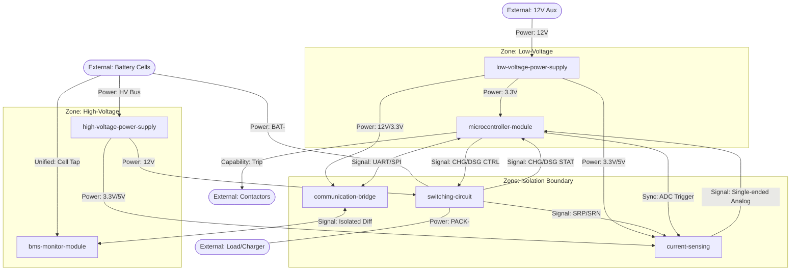

# System Boundary Document: stackable-bms

> **Document Version:** 1.7  
> **Constituent Module Boundary Docs:** 
> - bms-monitor-module-boundary.md (v1.1)
> - communication-bridge-boundary.md (v1.0)
> - current-sensing-boundary.md (v1.1)
> - high-voltage-power-supply-boundary.md (v1.1)
> - low-voltage-power-supply-boundary.md (v1.1)
> - microcontroller-module-boundary.md (v1.1)
> - switching-circuit-boundary.md (v1.0)
> **Last Updated:** 2026-07-20

---

## 1. Module Registry

| Module | Zone / Domain | Role (one line) | Instantiation | Boundary Doc |
|:---|:---|:---|:---|:---|
| bms-monitor-module | HV Domain | Performs cell voltage sensing, balancing, and local temperature sensing. | Stackable | bms-monitor-module-boundary.md |
| communication-bridge | Isolation Boundary | Translates MCU signals to isolated differential daisy chain signals. | Singleton | communication-bridge-boundary.md |
| current-sensing | Spans HV/LV | Measures pack current via isolated shunt for SOC/SOH and protection. | Singleton | current-sensing-boundary.md |
| high-voltage-power-supply| HV Domain | Converts HV traction bus to LV DC for isolated sensing hot-side power. | Singleton | high-voltage-power-supply-boundary.md |
| low-voltage-power-supply | LV Domain | Converts 12V aux or LV pack bus into regulated logic rails (12V/5V/3.3V). | Singleton | low-voltage-power-supply-boundary.md |
| microcontroller-module | LV Domain | Executes safety logic and SOC/SOH estimation. | Singleton | microcontroller-module-boundary.md |
| switching-circuit | Spans HV/LV | Performs low-side power switching (CHG/DSG) and provides integrated shunt current sensing. | Singleton | switching-circuit-boundary.md |

---

## 2. Internal Dependency Resolution

| Consumer Module | Resource | Class | Resolved To | Resolution Status |
|:---|:---|:---|:---|:---|
| microcontroller-module | 3.3V Rail | Power | low-voltage-power-supply | Resolved |
| microcontroller-module | Cell Data | Data | communication-bridge | Resolved |
| microcontroller-module | Current Sample | Signal | current-sensing | Resolved |
| microcontroller-module | FET Status (CHG/DSG) | Signal | switching-circuit | Resolved |
| bms-monitor-module | Wake-up Ping | Signal | communication-bridge | Resolved |
| bms-monitor-module | Daisy Chain Data | Data | communication-bridge | Resolved |
| bms-monitor-module | Global Cell Sample | Sync | communication-bridge | Resolved |
| communication-bridge | BAT Supply (12V) | Power | low-voltage-power-supply | Resolved |
| communication-bridge | VIO Supply (3.3V/5V) | Power | low-voltage-power-supply | Resolved |
| communication-bridge | Host Comm (UART/SPI)| Signal | microcontroller-module | Resolved |
| current-sensing | VDD1 (HV-side) | Power | high-voltage-power-supply | Resolved (Conditional) |
| current-sensing | VDD2 (LV-side) | Power | low-voltage-power-supply | Resolved |
| current-sensing | Sync Command | Sync | microcontroller-module | Resolved |
| current-sensing | Shunt Voltage (SRP/SRN) | Signal | switching-circuit | Resolved |
| switching-circuit | Gate Drive (12V) | Power | high-voltage-power-supply | Resolved |
| switching-circuit | FET Control (CHG/DSG) | Signal | microcontroller-module | Resolved |

---

## 3. External Dependency Surface

| Resource | Class | Consuming Module(s) | Specification | Notes |
|:---|:---|:---|:---|:---|
| 12V Aux Power | Power | LVPS | Vehicle Auxiliary Battery | Primary LV source |
| 16-Cell Battery Stack | Cell Tap | bms-monitor-module | Nom ~59V (16S) | Unified sensing and balancing paths |
| Traction Pack HV Bus | Power | HVPS | 85V - 400V DC | High-voltage supply input |
| Low-Voltage Pack Bus | Power | LVPS | 64V DC | Optional LV source |
| BAT- Terminal | Power | switching-circuit | 0V - 100V DC | Primary battery negative connection |
| PACK- Terminal | Power | switching-circuit | 0V - 100V DC | System return (to Load/Charger) |
| Thermistors | Signal | bms-monitor-module | NTC Sensors | For cell temp monitoring |
| Battery Contactors | Capability | microcontroller-module | High-level disconnect | External safety actuator (optional if SWC used) |

---

## 4. System Interaction Graph


```mermaid
graph TD

  subgraph LV_Zone ["Zone: Low-Voltage"]
    MCU[microcontroller-module]
    LVPS[low-voltage-power-supply]
  end

  subgraph HV_Zone ["Zone: High-Voltage"]
    BMM[bms-monitor-module]
    HVPS[high-voltage-power-supply]
  end

  subgraph ISO_Zone ["Zone: Isolation Boundary"]
    CB[communication-bridge]
    CS[current-sensing]
    SWC[switching-circuit]
  end

  EXT_AUX([External: 12V Aux])
  EXT_CELLS([External: Battery Cells])
  EXT_LOAD([External: Load/Charger])
  EXT_CONT([External: Contactors])

  EXT_AUX -->|Power: 12V| LVPS
  LVPS -->|Power: 3.3V| MCU
  LVPS -->|Power: 12V/3.3V| CB
  LVPS -->|Power: 3.3V/5V| CS

  MCU <-->|Signal: UART/SPI| CB
  CB <-->|Signal: Isolated Diff| BMM
  
  EXT_CELLS -->|Unified: Cell Tap| BMM
  EXT_CELLS -->|Power: HV Bus| HVPS
  EXT_CELLS ---|Power: BAT-| SWC
  SWC ---|Power: PACK-| EXT_LOAD
  HVPS -->|Power: 3.3V/5V| CS
  HVPS -->|Power: 12V| SWC
  
  SWC -->|Signal: SRP/SRN| CS
  CS -->|Signal: Single-ended Analog| MCU
  
  MCU -->|Sync: ADC Trigger| CS
  MCU -->|Signal: CHG/DSG CTRL| SWC
  SWC -->|Signal: CHG/DSG STAT| MCU
  MCU -->|Capability: Trip| EXT_CONT
```

---

## 5. Initialisation Sequence

```
[Precondition: External 12V Aux Power available]
  → low-voltage-power-supply initialises (produces 12V, 5V, 3.3V rails)
      → microcontroller-module boots (consumes 3.3V rail)
          → microcontroller-module sends Wake-up Command to communication-bridge
              → communication-bridge translates Wake-up ping to Daisy Chain
                  → bms-monitor-module(s) wake up sequentially
                      → microcontroller-module performs auto-addressing and node validation
                          → current-sensing performs Zero-Point Calibration
                              → microcontroller-module enables switching-circuit (DSG/CHG FETs)
                                  → [System ready state]
```

---

## 6. Domain / Isolation Boundary Map

| Boundary | Modules Either Side | Isolation Method | Rating | Crossing Resource(s) |
|:---|:---|:---|:---|:---|
| LV to HV (Comm) | CB / BMM | Capacitor/Transformer | 1000V DC | Isolated Daisy Chain |
| LV to HV (Sense) | CS / MCU | SiO2 Barrier (AMC1301) | 1000V DC | Single-ended Analog Current |
| LV to HV (Power) | LVPS (Pri/Sec) | Isolated Flyback | 1000V DC | Logic Power Rails |
| HV to LV (Logic) | HVPS / CS | Non-Isolated Buck | 700V (MOSFET) | Hot-side Bias (VDD1) |
| LV to HV (Switching) | MCU / SWC | Optocoupler | 1000V DC | CHG/DSG Control & Status |

---

## 7. System-Level Constraints

| Constraint | Modules Involved | Description |
|:---|:---|:---|
| Safety Trip Time | MCU, CB, BMM, SWC | Max time from OVP/UVP detection to contactor/FET trip (TBD ms). |
| Sampling Jitter | MCU, CS, BMM | Synchronization of V/I samples for accurate Internal Resistance calculation. |
| Creepage/Clearance| All | Mandatory 400V system safety spacing (e.g., 9.1mm for AMC1301). |

---

## 8. Open Items (System-Level)

| Item | Originating Module Doc | Type | Status |
|:---|:---|:---|:---|
| VDD1 Power Source | current-sensing | Decision | Ambiguous: BMM vs HVPS depending on pack voltage. |
| Safety trip response time | microcontroller-module | Constraint | TBD |
| Exact daisy chain connector | bms-monitor-module | Constraint | Unspecified |
| FET Thermal Performance | switching-circuit | Verification | Confirm 50A continuous load thermal stability in enclosure. |
